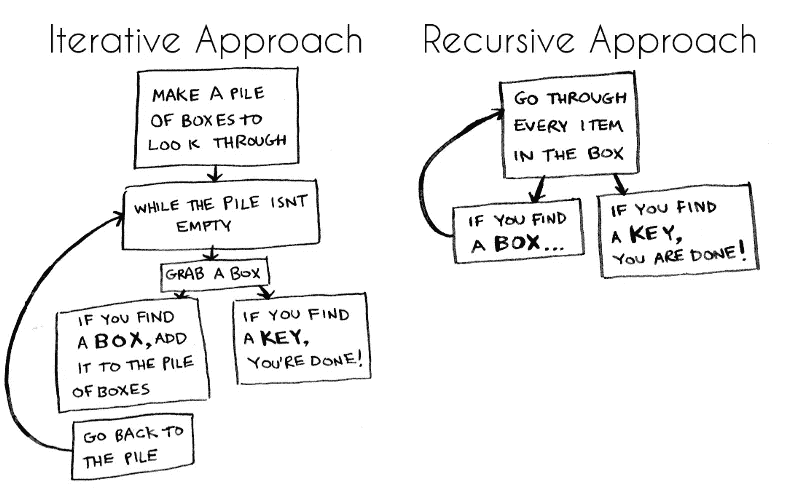
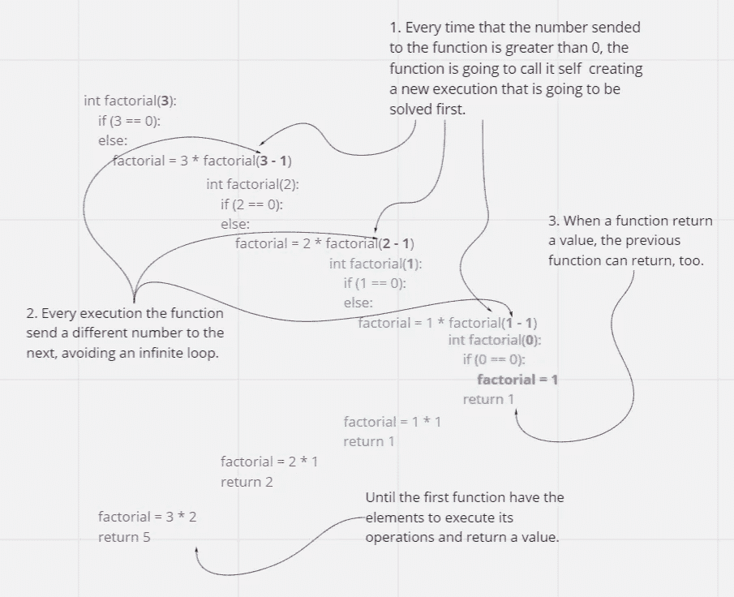

# 假人递归

> 原文：<https://medium.com/nerd-for-tech/recursion-for-dummies-b81d14bbdb2f?source=collection_archive---------15----------------------->


俄罗斯 Matrioska:大包含它自己，但更小。

# 什么是递归？

递归来自拉丁语“re ”,意思是“再次做某事”,而“current”意思是“运行”。

它是再次发生的事情，是重复发生的事情，所以函数值是由应用于较小自变量的相同函数的应用来定义的。

# 为什么要使用递归函数？

*   避免多次编写相同的代码
*   时间复杂度的降低
*   更加清晰，编写代码的时间更少。

# 为什么不用递归函数？

*   它使用更多的内存。
*   可能会很慢，这取决于递归执行的次数。

出于这些原因，最好使用带有 For、while 和 do-while 循环的迭代方法。



[https://www . freecodecamp . org/news/how-recursion-works-explained-with-flow-and-a-video-de 61 f 40 CB 7 f 9/](https://www.freecodecamp.org/news/how-recursion-works-explained-with-flowcharts-and-a-video-de61f40cb7f9/)

# 例子

它可以在数学函数中用作阶乘，其目的是找出所有小于或等于一个数的正整数的乘积。

我们来看看自然语言、python 代码中的操作，以及一步一步的执行情况如何。

**自然语言**

```
5! = 5 x 4 x 3 x 2 x 1
```

**Python 代码:**

```
int factorial(n): # if the number sended to this function is equivalent to zero
    if (n == 0): 
        # the factorial is zero
        factorial = 1 # if not
    else: # execute the function on the number less one
        # and multiply that for the actual number.
        factorial = n * factorial(n - 1) return factorial
```

**逐步全面执行:**

我们用 n 代替数字 0，并开始执行:



阶乘函数每次执行的颜色。

现在让我们通过 python tutor 工具，用用 C 编写的相同代码来看看系统内存中发生了什么:


递归函数的关键是用不同的方式思考来细分一个问题，寻找一个更小的部分具有与原问题相同的一般结构的问题。

最后，我们需要创建一个结束递归函数系列的条件，以避免无限循环。

# 关于我

我是一名来自霍尔伯顿学校的充满激情的软件开发人员，也是一名来自国立大学的心理学家。在我的一生中，我一直在发展有价值的专业技能，成为一个好的倾听者、批判性思考者和团队成员。我一直被认为是一个非常聪明和有同情心的人。无论是在工作还是学术生活中，我都想创造有意义的经历，并激励我的伴侣。我一直很专注，也很好奇。

如果您想与我建立联系，请在 [GitHub](https://github.com/Naveduran) 或 [Twitter](https://twitter.com/NaVeDuran1) 上关注我。

我希望你喜欢这次阅读，感谢你的关注。

娜塔莉亚·维拉·杜兰制作。