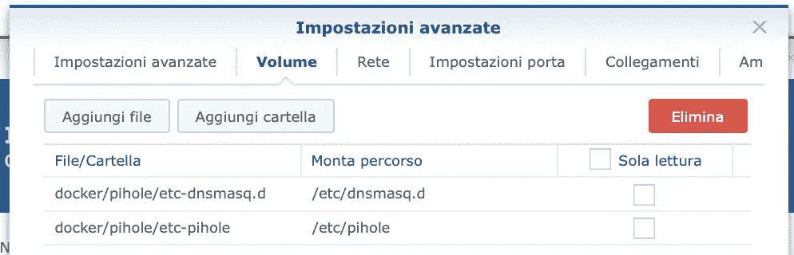
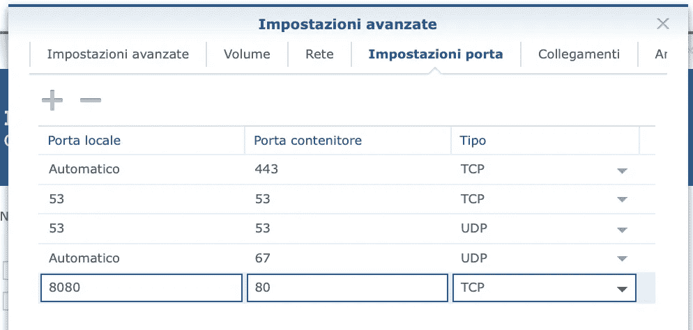
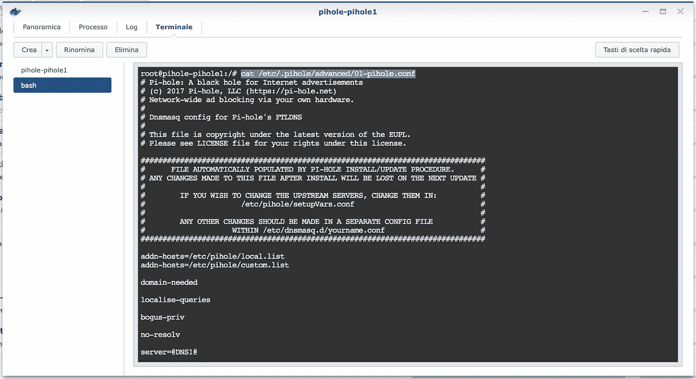
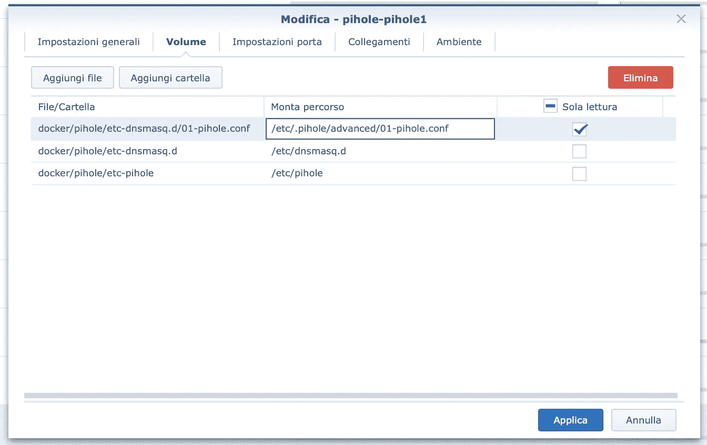
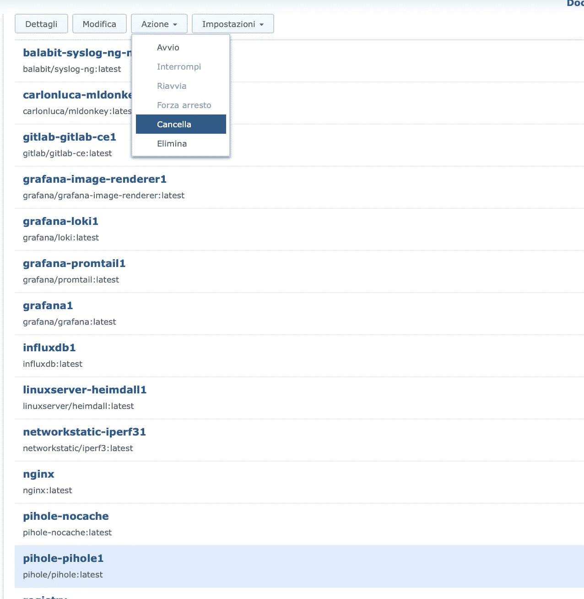
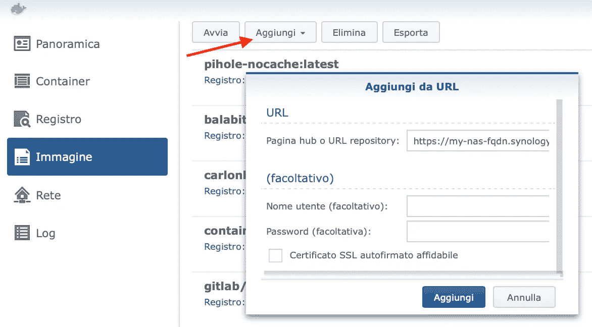
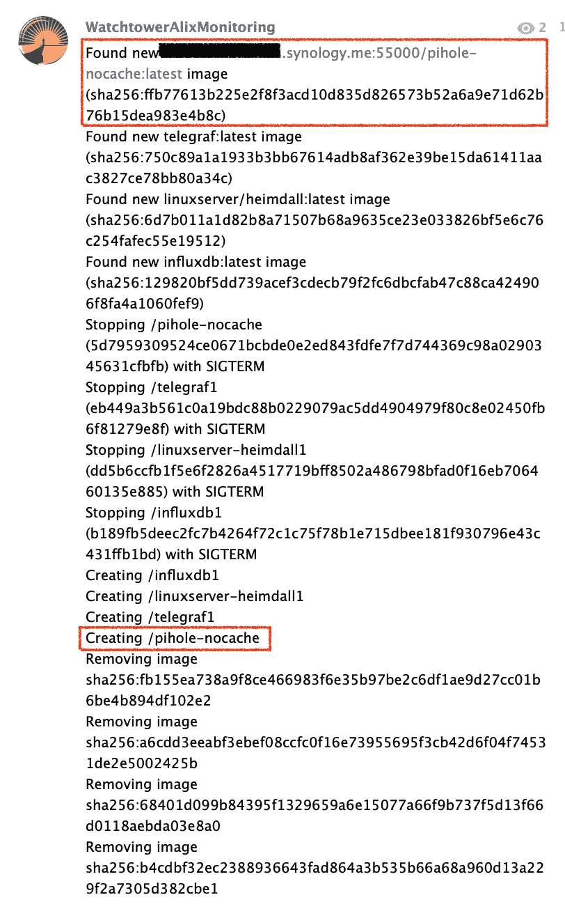

# 递归 DNS+广告拦截器—第 2 部分:使用 Docker 在 Synology NAS 上安装不带缓存的 Pi-hole

> 原文：<https://medium.com/nerd-for-tech/recursive-dns-ad-blocker-part-2-installing-pi-hole-without-caching-on-synology-nas-with-docker-5363bc7258f4?source=collection_archive---------4----------------------->

## 用 Docker 在 Synology NAS 上安装 Pi-hole 很简单，禁用缓存就不简单了，所以让我们看看如何做。您还将学习如何构建自己的 docker 映像来覆盖默认的缓存设置。如果你没有在 Synology box 上运行 Docker，那么 Key info 是通用的，所以它对于其他 Docker 安装也是有价值的。

【2021 年 4 月 18 日更新:在 Docker Hub 上添加了我的公共[*giannicostanzi/pihole-nocache*](https://hub.docker.com/r/giannicostanzi/pihole-nocache)*图片的链接*

【2021 年 5 月 1 日更新:在我的 GitHub 页面[*MightySlaytanic/pihole-nocache*](https://github.com/MightySlaytanic/pihole-nocache)上添加了 Dockerfile 源文件的链接

***更新 2023 年 1 月 26 日*** : *官方 Pi-hole 容器有 CUSTOM_CACHE_SIZE，允许您将 CACHE_SIZE 设置为零，而不需要我的自定义图像*

## **简介**

在上一篇文章 [**具有广告拦截功能的递归 DNS 解析器**](https://giannicostanzi.medium.com/recursive-dns-resolver-with-ad-blocking-features-dea766d4f703) 中，我解释了如何在 Raspberry Pi 设备上实现一个 DNS 解析器，它可以拦截广告和恶意网站(Pi-hole)并递归解析域名(非绑定)，而不依赖于 Google ones 之类的官方 DNS 服务器。正如我在那篇文章中所说的，我已经在我的家庭网络中部署了两个 Pi-hole 和两个非绑定服务器，以便在我进行维护时有一点冗余，并获得一点乐趣:)第一个 Pi-hole+非绑定堆栈部署在 RPi3 上，所以我必须为第二个堆栈选择另一个 24x7x365 活动的家庭设备:我的 Synology DS218+ NAS with Docker 是完美的解决方案。这一次我们将重点放在 Pi-hole 安装上，剩下的将在另一篇文章中讨论。

这篇文章是关于 Synology Docker 的，但是你能找到的信息可以完美地应用到任何你运行 Docker 的设备上。如果你开始在 Synology 上没有 GUI 的设备上使用 docker，看看[**portainer/portainer**](https://registry.hub.docker.com/r/portainer/portainer)容器，它可以提供一个 Web GUI 来管理 Docker 的图像、容器、卷等。

我假设您已经通过包管理器在 Synology 上安装并配置了 Docker。截图是意大利语的，但我认为通过查看界面上元素的定位，会很容易理解您的语言中的等效内容。

## **安装墩孔**

首先打开 Docker app，进入注册表，搜索 pihole。选择 *pihole/pihole* 图像，按下载，选择*最新*标签。


Pi-hole 图像下载

然后，在使用此映像启动新容器之前，准备以下文件夹结构(您可以通过 File Station 应用程序创建):

```
/volume1/docker/pihole/etc-dnsmasq.d
/volume1/docker/pihole/etc-pihole
/volume1/docker/pihole/etc.pihole_advanced
```

**注意:** */volume1* 是一个您可以通过 SSH CLI 看到的文件夹，它包含您的 NAS 上的共享文件夹。我不记得 docker 共享文件夹是否是由 Docker 应用程序安装程序创建的，否则您可以通过 Synology GUI 创建它，然后您可以继续创建 pihole 子文件夹。

正如您在 pihole/pihole 的 [Docker Hub 页面上看到的，当您需要重新创建容器来更新映像时，前两个文件夹需要安装在容器中，以便为您的配置提供数据持久性。第三种方法是将 CACHE_SIZE 设置为零(阅读上一篇文章以理解为什么我们希望它为零)，我将在后面解释这种方法。](https://registry.hub.docker.com/r/pihole/pihole/)

**第一次钻孔运行**

现在，您可以进入 Synology 上 Docker 应用程序的图像部分，选择 *pihole/pihole:最新*并按下 *Launch* 。应用程序会询问您容器的初始配置。根据需要设置名称(默认为*p hole-p hole 1*)并按下 Advanced 以配置高级选项。如果您愿意，启用自动重启，然后转到*卷*选项卡:这里我们将挂载前两个文件夹，忽略第三个，方法是按下 Add Folder，选择您之前创建的文件夹，然后将它们挂载到具有读/写权限的正确路径上(我通常在 synology 上称文件夹为将使用破折号而不是斜线挂载的路径):



卷的绑定装载

然后在端口设置选项卡上移动，将您希望可到达的端口暴露给外部。特别是，我要揭露:

*   53/UDP 和 53/TCP 端口上的 DNS 服务
*   8080/TCP 端口上的 HTTP 服务(GUI)

在将 HTTP 端口迁移到 8080/TCP(Synology 使用 80/TCP)时，我将暴露原始端口上的 DNS 端口(家庭设备不能指向其他非标准端口进行 DNS 解析):



**注意:** Synology GUI 向您展示了 Dockerfile 清单中声明的由容器公开的服务，默认情况下，它在自动分配的端口上公开这些服务。如果您不想公开一些容器的服务，或者您可以在静态已知的端口上公开它们，您可以删除这样的映射。

转到环境选项卡(最后一个),将名为 *WEBPASSWORD* 的变量设置为您将用来访问 HTTP GUI 的管理员密码(如果您不设置它，它将随机生成，您可以通过双击容器然后双击日志选项卡在容器日志中看到它)。

配置完成后，应用设置并让 Synology Docker 启动新创建的容器。

**将 CACHE_SIZE 设置为零**

正如我们在上一篇文章中看到的，我们需要禁用缓存，以便让未绑定预取和缓存按预期工作。我试图通过环境变量或者修改 synology 共享文件夹中的*/etc/pihole/setup vars . conf*来设置 *CACHE_SIZE=0* (就像我在 RPi3 上所做的那样),但是没有成功。经过一点研究，我明白了由容器自动执行的初始化脚本 */root/ph_install.sh* 通过替换包含在 */etc/中的值来配置 dnsmasq(负责整个 dns 解析和缓存的进程)。pi hole/advanced/01-pi hole . conf*与 *setupVars.conf* 中包含的值，然后将该文件复制到*/etc/dnsmasq . d/01-pi hole . conf。*奇怪的是，它没有从 *setupVars.conf* 中获取 *CACHE_SIZE* ，而是在脚本中包含了一个 *CACHE_SIZE=10000* 。

这就是 */etc/的内容。pi hole/advanced/01-pi hole . conf*

```
# Pi-hole: A black hole for Internet advertisements
# (c) 2017 Pi-hole, LLC ([https://pi-hole.net](https://pi-hole.net))
# Network-wide ad blocking via your own hardware.
#
# Dnsmasq config for Pi-hole's FTLDNS
#
# This file is copyright under the latest version of the EUPL.
# Please see LICENSE file for your rights under this license.###############################################################################
#      FILE AUTOMATICALLY POPULATED BY PI-HOLE INSTALL/UPDATE PROCEDURE.      #
# ANY CHANGES MADE TO THIS FILE AFTER INSTALL WILL BE LOST ON THE NEXT UPDATE #
#                                                                             #
#        IF YOU WISH TO CHANGE THE UPSTREAM SERVERS, CHANGE THEM IN:          #
#                      /etc/pihole/setupVars.conf                             #
#                                                                             #
#        ANY OTHER CHANGES SHOULD BE MADE IN A SEPARATE CONFIG FILE           #
#                    WITHIN /etc/dnsmasq.d/yourname.conf                      #
###############################################################################addn-hosts=/etc/pihole/local.list
addn-hosts=/etc/pihole/custom.listdomain-needed
localise-queries
bogus-priv
no-resolv
server=[@DNS1](http://twitter.com/DNS1)@
server=[@DNS2](http://twitter.com/DNS2)@
interface=[@INT](http://twitter.com/INT)@
**cache-size=**[**@CACHE_SIZE**](http://twitter.com/CACHE_SIZE)**@**
log-queries
log-facility=/var/log/pihole.log
local-ttl=2
log-async
```

您可以通过双击正在运行的容器，然后双击 Terminal 选项卡，创建一个新的 bash 会话来查看这个文件，正如您在这个截图中看到的，您可以在这个截图中编写突出显示的 *cat* 命令:



正在执行" *cat /etc/。pihole/advanced/01-pihole.conf "在容器内*

或者，您可以在成为 root 用户后，通过 SSH 连接到 Synology NAS，通过 cli 运行相同的命令:

```
docker exec -it pihole-pihole1 cat /etc/.pihole/advanced/01-pihole.conf
```

您可以将该文件保存在 NAS 上，创建*/volume 1/docker/pi hole/etc _。pi hole _ advanced/01-pi hole . conf*并修改**CACHE-SIZE =**[**@ CACHE _ SIZE**](http://twitter.com/CACHE_SIZE)**@**到 **cache-size=0**

然后，停止 pihole-pihole1 容器，选择它并点击 modify 并添加一个新的只读文件映射(这次不是文件夹映射)以便挂载*/volume 1/docker/pihole/etc _。关于*的 pihole _ advanced/01-pihole . conf*/etc/。容器内的 pi hole/advanced/01-pi hole . conf*:



修改缓存大小后挂载 01-pihole.conf

现在，您可以重新启动容器并连接到运行在[http://your-nas-IP:8080/admin](http://your-nas-ip:8080/admin)GUI 上的 Pi-hole GUI，输入管理员密码并在设置页面上检查 DNS 缓存是否设置为零:


检查 DNS 缓存大小，如果一切正常，它必须为零

现在，您可以像在上一篇文章中看到的那样配置 Pi-hole，并且可以将运行在 Raspberry 上的未绑定服务器作为上游 DNS 指向其他 Pi-hole 设置。通过这种方式，我们将 Pi-hole 服务器增加了一倍，这是冗余的第一步(我们仍然有一个未绑定的服务器，因此如果 RPi 关闭，DNS 解析将不起作用，但现在让我们关注 Pi-hole，在下一篇文章中关注 double Unbound)。

现在，您可以尝试更新 Synology 上的容器的过程，并验证您的设置是否持久，缓存大小是否仍然为零:

1.  关闭容器
2.  点击操作->删除(不是删除)。在意大利语中，我们有 Cancella 和 Elimina，第一个删除容器，但在 Docker GUI 中保留其配置(卷和端口映射等),以便让您再次启动容器，从而从您下载的最新映像重新创建它。相反，Elimina 删除该容器及其所有设置。您必须选择第一个操作，因为我们不想再次重新配置它。我不知道英语中使用的确切单词，但我认为它们可以是 Erase(cancela)和 Delete (Elimina)，所以请尝试理解正确的单词(要避免的单词应该是菜单中最低的一个)。
3.  回到注册表再次搜索 pihole 并重新下载最新版本。
4.  下载完成后，再次启动容器，它将使用新下载的映像和您所有的设置重新启动



擦除容器，以便用更新的图像重新创建它

**注意:**如果你启动 Pi-hole，贵由会通过查看页面的页脚来了解新版本。如果版本号以红色闪烁，这意味着有官方更新可用。顺便说一句，可能需要等待几天才能获得更新的容器映像(您可以访问 pihole/pihole Docker Hub 页面，检查最近是否更新了最新的标签)。自动容器更新可以通过 Synology 上运行的[**container RR/watchtower**](https://registry.hub.docker.com/r/containrrr/watchtower)容器来完成，但这超出了本文的范围。

## **我不喜欢覆盖 01-pihole.conf 的地方**

正如你在上面看到的，我们已经覆盖了 */etc/的内容。pihole/advanced/01-pihole . conf*文件与我们修改过的文件进行比较，以便将*缓存大小*强制为零。如果一个新版本的 *pihole/pihole* 在那个文件中做了一些改变，我们不会使用它，因为我们在容器更新文件上挂载了我们的文件版本。所以，我想修改容器的 *ph_install.sh* 设置脚本中的 *CACHE_SIZE=10000* 设置，以便将 ti 设置为 *CACHE_SIZE=0* 。

## **构建我自己的 pihole-nocache 映像**

你能想到的第一件事是“让我们复制 *ph_install.sh* 脚本，修改变量并在容器基础映像的 ph_install.sh 脚本上挂载该文件”，但这与覆盖 *01-pihole.conf* 文件完全相同。

所以我想我可以简单地替换掉 *ph_install.sh* 中的指令，而不用我自己的副本替换整个文件。

**2021 年 4 月 18 日更新:**我已经上传了我修改过的图像，也在公共[**Docker Hub giannicostanzi/pihole-nocache 页面**](https://hub.docker.com/r/giannicostanzi/pihole-nocache) 上，所以如果你不想自己构建它，你可以直接从那里获取。

**2021 年 05 月 01 日更新:**我已经在我的 [**MightySlaytanic GitHub 页面**](https://github.com/MightySlaytanic/pihole-nocache) 上传了我的 pihole-nocache Docker 映像的 *Dockerfile*

**免责声明:**以下说明要求 SSH 访问 Synology NAS，并且能够成为 root 用户，因此您必须是 NAS 管理员。在生产环境中尝试之前，请理解这些命令。应该没有风险，但我不负责砖你的 Synology Docker 环境。

首先，我创建了以下文件夹:

```
mkdir /volume1/docker/_IMAGES/pihole-nocache
```

然后，我在该文件夹中创建了一个 *Dockerfile* 文件，该文件指示 docker build 基于官方的 *pihole/pihole:latest* 创建一个新的映像，我的修改是通过 sed 命令完成的:

```
# cat /volume1/docker/_IMAGES/pihole-nocache/Dockerfile
FROM pihole/pihole:latest
RUN **sed -i -e "s:CACHE_SIZE=[0-9]\+:CACHE_SIZE=0:g" /root/ph_install.sh**
```

因此，我们用零替换在 *ph_install.sh* 脚本中设置的任何值 *CACHE_SIZE* 。

然后，您可以使用以下命令构建您的映像:

```
# **docker build --pull /volume1/docker/_IMAGES/pihole-nocache/ -t pihole-nocache:latest**
Sending build context to Docker daemon  2.048kB
**Step 1/2 : FROM pihole/pihole:latest**
**latest: Pulling from pihole/pihole**
Digest: sha256:3a39992f3e0879a4705d87d0b059513af0749e6ea2579744653fe54ceae360a0
**Status: Image is up to date for pihole/pihole:latest**
 ---> eb777ee00e0c
**Step 2/2 : RUN sed -i -e "s:CACHE_SIZE=[0-9]\+:CACHE_SIZE=0:g" /root/ph_install.sh**
 ---> Running in 4305759e9f70
Removing intermediate container 4305759e9f70
 ---> ffb77613b225
Successfully built ffb77613b225
**Successfully tagged pihole-nocache:latest**
```

完成此操作后，您将在 Synology 上 Docker 应用程序的 images 部分找到 pihole-nocache 图像，并且您将能够按照之前为 *pihole/pihole* 图像所做的步骤，基于它创建一个新的容器。如果您删除了 *pihole-pihole1* 容器，您可以使用相同的卷和端口映射重新创建一个新容器，除了 */etc/。不再需要的 pi hole/advanced/01-pi hole . conf*文件。让我们启动新的容器，检查缓存是否设置为零，而没有像预期的那样挂载 *01-pihole.conf* 文件。

更新容器需要您重新启动 docker 构建命令(— pull 选项强制构建过程搜索基础映像的更新版本),而不是执行步骤 3 中描述的下载。在之前描述的更新过程中。

## **将图像上传到您的私人容器上**

正如我以前说过的，我有一个在 Synology NAS 上运行的瞭望塔容器，它通过自动提取新图像并重新创建它们来定期更新我的容器。为了允许它更新我的 pihole-nocache 映像，我创建了一个私有注册表，每天晚上我用上面解释的命令重建 pihole-nocache 映像，并将其上传到我的注册表。

首先，我用以下命令创建了一个注册表容器:

创建并启动名为 Registry 的私有注册表容器

**注意:**在我的家庭网络中，我有一个我的 nas 的公共名称 my-*NAS-FQDN . Synology . me*的本地解析，以便在我的 Synology box 的私有 IP 地址上解析它。这样，我在注册表容器中安装的 Synology 证书和密钥将会很好地工作，因为它们与我用来指向容器的 FQDN 名称相匹配。关于在普通 HTTP 中部署私有注册表的更多细节可以在官方文档中找到。

然后，您可以通过以下命令(CTRL^C 终止执行)测试注册表是否正在侦听端口 55000/TCP，该命令将向您显示 NAS 的公共证书:

```
openssl s_client -connect my-nas-fqdn.synology.me:55000
```

您可以在 Docker 应用程序的 Images 部分添加此注册表，并使用 *my-nas-fqdn* 名称激活它，例如，单击添加，然后从 URL 添加，并输入[*https://my-nas-FQDN . synology . me:55000*](https://my-nas-fqdn.synology.me:55000)*作为 URL。*

**

*这允许您在您的私人注册表中搜索图像。当你需要搜索官方图片时，记得重新激活默认的。*

*现在，我们必须构建标记它的映像，以便让 docker 知道这是一个将在我们的私有注册中心而不是 Docker hub 上找到的映像，方法是以如下方式更改-t 选项:*

```
*docker build --pull /volume1/docker/_IMAGES/pihole-nocache/ **-t my-nas-fqdn.synology.me:55000/**pihole-nocache:latest*
```

*如果您转到 Docker Hub 的 Images 部分，您会看到新创建的映像的注册表是 *my-nas-fqdn* 而不是 Docker Hub。*

*然后，我们可以将图像上传到我们的注册中心(这里我的图像在注册中心已经是最新的):*

```
*# docker push my-nas-fqdn.synology.me:55000/pihole-nocache:latest
The push refers to repository [my-nas-fqdn:55000/pihole-nocache]
b6d5ed12d029: Layer already exists
e996f48635d0: Layer already exists
010e0146144d: Layer already exists
ef63252a9627: Layer already exists
8eeede195441: Layer already exists
d3088e548a33: Layer already exists
8ac01c752962: Layer already exists
4e3984d0f56b: Layer already exists
3d64ad524bb4: Layer already exists
56e1f33806ae: Layer already exists
0990c4f0eff1: Layer already exists
b546331c0c35: Layer already exists
ea63252b317e: Layer already exists
9eb82f04c782: Layer already exists
latest: digest: sha256:b36cd790060f9f3fc20a5909b722a2f31a1c9c24ed235f03e533884dda3a244e size: 3244*
```

*现在，如果你从 Synology 上的 Docker 应用程序搜索你的私人注册表，你会找到 *pihole-nocache* 图片，你还可以下载它的最新标签。*

## ***在我的私人注册表上启用 pihole-nocache 的自动重建和上传***

*最后，为了让 Watchtower 在我的私人注册表上找到更新版本的 *pihole-nocache* ，我在我的 NAS 上安排了以下脚本每天运行，该脚本将使用最新标签重新创建并重新上传由 */volume1/docker_IMAGES* 文件夹的每个子文件夹中的 docker 文件描述的所有图像:*

*docker_images_rebuild.sh*

*当您使用最新的标签创建新图像时，前一个图像的标签将变为 *<无>* 。因为仍在使用中，所以在容器更新之前不能移除它。*

*查看悬挂图像*

*当不再使用它时，您可以通过以下命令将其删除:*

```
*docker rmi *IMAGE_ID**
```

*将 *IMAGE_ID* 替换为 *docker image ls 显示的 ID。**

*为了节省空间，我已经安排了一个每周删除悬挂图像的任务(它还向您展示了如何通过 *synodsmnotify* 工具在 Synology web GUI 内向用户发送通知):*

*今天我更新了图像，瞭望塔的日常运行也对其进行了升级，并删除了悬挂的旧图像(我使用[**soulassassin 85/docker-Telegram-notifier**](https://registry.hub.docker.com/r/soulassassin85/docker-telegram-notifier/)容器向私人电报通道发送通知)*

**

*了望塔发出的电报通知*

## ***结论***

*我希望你喜欢读这篇文章，如果你想解决像在 Docker 化的 Pi-hole 上禁用缓存这样的问题，或者如果你正在学习 Docker 并且想像我一样尝试一下，它可能会节省你一点时间。如果您有任何意见，请随时给我写信，我两周前开始学习 docker，所以有些事情可以做得更好或更有效:)*

*现在，让我们继续 Synology NAS 上的 Unbound:[**递归 DNS+广告拦截器—第 3 部分:在 Synology NAS 上安装 Unbound with DNSSEC，Docker**](/nerd-for-tech/recursive-dns-ad-blocker-part-3-installing-unbound-with-dnssec-on-synology-nas-with-docker-d40bb36035dc)*

*[](/nerd-for-tech/recursive-dns-ad-blocker-part-3-installing-unbound-with-dnssec-on-synology-nas-with-docker-d40bb36035dc) [## 递归 DNS+广告拦截器—第 3 部分:用 Docker 在 Synology NAS 上安装未绑定的 DNSSEC

medium.com](/nerd-for-tech/recursive-dns-ad-blocker-part-3-installing-unbound-with-dnssec-on-synology-nas-with-docker-d40bb36035dc) 

【2021 年 5 月 10 日更新:在本系列的第 4 篇文章中，我将向您展示我是如何实现一个监控脚本的，该脚本从 Pi-hole 服务器收集指标并上传到 InfluxDB2 服务器，从而允许我在 Grafana 仪表板上绘制有用的信息:

[](/nerd-for-tech/recursive-dns-ad-blocker-part-4-pihole2influxdb2-how-to-monitor-your-pi-hole-servers-b2f03de2baf2) [## 递归 DNS+广告拦截器—第 4 部分:pihole 2 influxd 2—如何监控您的 pihole 服务器

medium.com](/nerd-for-tech/recursive-dns-ad-blocker-part-4-pihole2influxdb2-how-to-monitor-your-pi-hole-servers-b2f03de2baf2)*