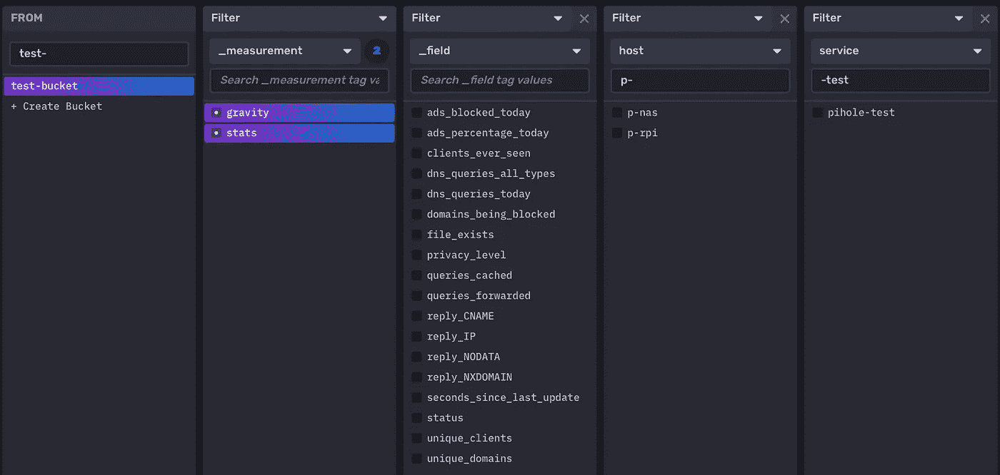
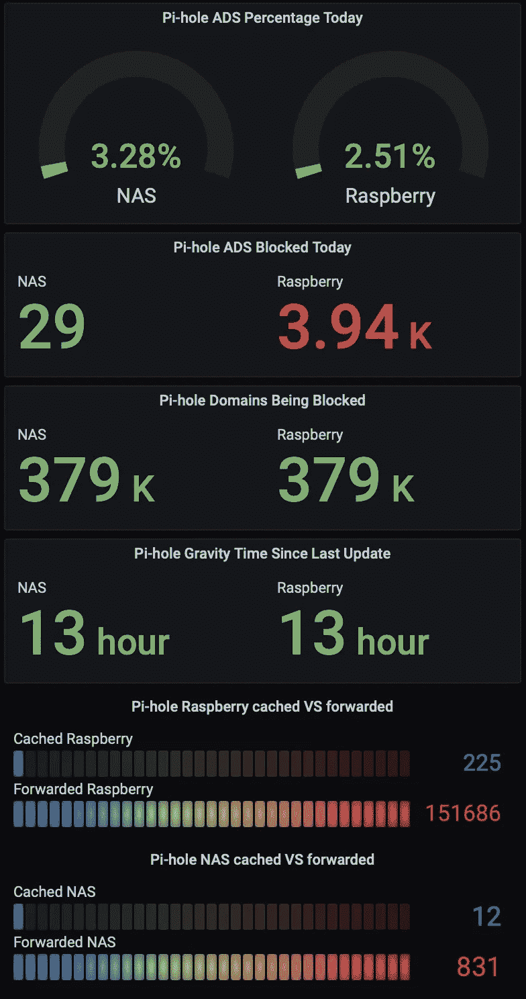
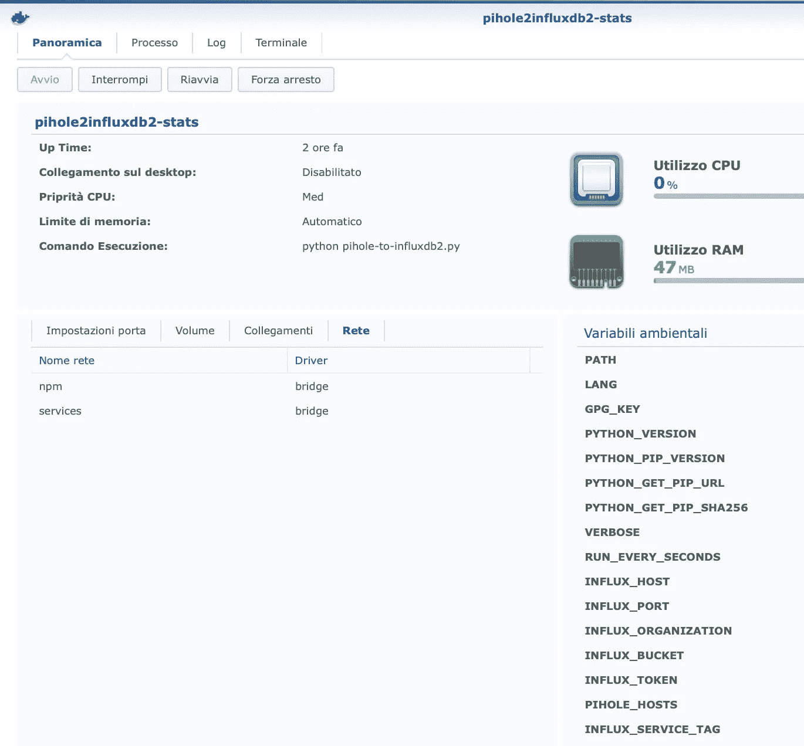

# 递归 DNS+广告拦截器—第 4 部分:pihole 2 influxd 2—如何监控您的 pihole 服务器

> 原文：<https://medium.com/nerd-for-tech/recursive-dns-ad-blocker-part-4-pihole2influxdb2-how-to-monitor-your-pi-hole-servers-b2f03de2baf2?source=collection_archive---------9----------------------->

## 在本文中，我将向您展示如何通过使用一个简单的 Python 脚本[pihole-to-influxd 2 . py](https://github.com/MightySlaytanic/pihole2influxdb2)或我的[giannicostanzi/pihole 2 influxd 2docker image(您可以在 DockerHub 上找到)来收集 Pi-hole 统计数据并将其发送到 influxdb2 bucket](https://hub.docker.com/r/giannicostanzi/pihole2influxdb2)

正如我在我的[带广告拦截功能的递归 DNS 解析器—第 1 部分](/nerd-for-tech/recursive-dns-resolver-with-ad-blocking-features-dea766d4f703)文章的结尾所展示的，我已经实现了一些 Grafana 仪表板来监控在我的家庭网络中运行的 Pi-holes 服务的性能，一个在 Raspberry Pi3 上，一个在 Synology NAS 上。让我们看看如何通过 Pi-hole web API 收集统计数据。

## **Pihole Web API**

Pi-hole 服务公开了一个 GUI，您可以使用它来配置和查看标准 HTTP 端口 80/tcp 上的一些性能数据。同一个端口也用于暴露 JSON 格式的信息，只需访问[http://your _ pihole _ server:port/admin/API . PHP](http://10.0.0.3:50080/admin/api.php)

显然，如果没有更改 HTTP GUI 的默认端口，可以省略 *:port* 。

这里您可以看到通过 *python json.dumps(data，indent=4)格式化的数据:*

通过 Web API 公开的钻孔数据

## Python API 交互和 InfluxDB2 上传

JSON 格式可以很容易地用于 Python，所以我构建了一个脚本，从给定的 Pi-hole 服务器收集数据，然后上传到运行在 Synology NAS 上的 InfluxDB2 容器。你可以在我的 [GitHub](https://github.com/MightySlaytanic/pihole2influxdb2) 上找到整个脚本。

**脚本环境变量**

该脚本依赖于一些环境变量:

```
INFLUX_HOST="my_influx_ip_or_dns_name"
INFLUX_PORT="my_influx_port"
INFLUX_ORGANIZATION="influx_organization_name"
INFLUX_BUCKET="influx_bucket"
INFLUX_TOKEN="influx_token"
INFLUX_SERVICE_TAG="pihole"
PIHOLE_HOSTS="x.x.x.x:80:raspberry,y.y.y.y:50080:nas"
RUN_EVERY_SECONDS=60
VERBOSE="false"
```

流入主机和流出主机可以是 IP 或通过 DNS 解析的名称。

Influx organization、bucket 和 token 都是在您的 InfluxDB2 实例上设置的参数。

顾名思义，流入服务标签是在您的测量中设置给标签*服务*的值，以及一个*主机*标签，该标签将包含我上面的示例中的 raspberry 和 nas，这是我在 PIHOLE_HOSTS 环境变量中指定的名称。

我使用了环境变量，因为这个脚本将被嵌入到 Docker 容器中，我将在下一节解释这一点。

我准备了一个导出环境变量的 shell 启动器，否则您可以直接在 python 脚本中设置它们:

pihole-to-influxdb2.py 启动器

如果您将 *-t* 标志传递给启动器脚本，它将把它传递给*pihole-to-influxd 2 . py .*

您也可以在我的 GitHub 上找到它:

[](https://github.com/MightySlaytanic/pihole2influxdb2/blob/8ffeece673492e1ad4e68dcb15efd8cf57775f2e/pihole-to-influxdb2_launcher_example.sh) [## MightySlaytanic/pihole 2 influxd 2

### Pihole to InfluxDB2 Stats Uploader。通过创建帐户，为 MightySlaytanic/pihole 2 influxd 2 开发做出贡献…

github.com](https://github.com/MightySlaytanic/pihole2influxdb2/blob/8ffeece673492e1ad4e68dcb15efd8cf57775f2e/pihole-to-influxdb2_launcher_example.sh) 

**脚本执行**

该脚本每隔 *RUN_EVERY_SECONDS* 秒在 *PIHOLE_HOSTS* 中查询 Pi-hole 主机。

您可以运行带有 *-t* 标志的脚本，以便从 Pi-hole 中检索数据，并以格式良好的易读形式打印出来，而无需上传到 InfluxDB2。

该脚本连接到 Pi-hole web API 并检索之前显示的 JSON 数据:

从 Pi-hole Web API 检索 JSON 数据

我们不能直接上传用上述命令获得的 stats python 字典，因为有一个嵌套的 *gravity 字典*带有 Python gravity db stats，所以我从 stats 字典中弹出 *gravity_last_updated* 字典，并从检索到的字典中构建我自己的 gravity stats:

准备重力测量

然后我用 *influxdb_client* python 模块提供的 write api 将统计数据和重力测量值上传到 InfluxDB2(用**pip install influx db _ client**安装它):

将统计数据和重力测量值上传到 InfluxDB2

**注:**如果你在 GitHub 上看一下整个脚本(它总是最新的， 关于上述可能过时的代码片段)对于 *ads_percentage_today* 值，有一个到 float 的强制转换，因为它几乎总是一个 float，但是它有时可以是零(如果 Pi-hole 服务器今天没有阻塞任何东西),并且如果我们试图上传一个零(作为整数上传到 bucket)而不是一个 float，Influx Write API 会报错，因为它在目标 bucket 上已经找到的字段几乎总是被初始化为 float。

该脚本在脚本目录中创建一个用于容器健康检查状态管理的*health check*文件。如果与 InfluxDB2 服务器的通信有问题，或者如果无法到达其中一个 Pi-hole 服务器，则设置为 *FAILED* ，否则设置为 true。

## 探索关于 InfluxDB2 的数据 DB2

现在，只要脚本在运行，数据就会被上传到 InfluxDB2 bucket。您将在铲斗上找到以下测量值和字段:



InfluxDB2 上的测试桶

正如你所看到的，我们有*重力*和*统计*测量以及它们相应的字段(*文件 _ 存在*和*秒 _ 自 _ 最后 _ 更新*是*重力*字段，所有其他的是*统计*字段)。每个记录还有一个*主机*和*服务*标签，如前所述。

## 在 Grafana 中可视化数据

现在，您可以轻松使用收集的数据来构建自己的 Grafana 仪表盘:



穿孔仪表板

举个例子，您可以使用下面的 *Flux* 查询来可视化*缓存的 VS 转发的*信息:

为 p_rpi 主机和 p hole-test 服务绘制查询缓存和查询转发的流量查询

我不会深入讨论关于 InfluxDB2 和 Grafana 的更多细节，因为这需要一篇全新的文章，我只想给出一个想法，告诉你可以用收集到的数据做什么，让你自己去试验。

## 让我们将 pihole2influxdb2 标记为 dockerize

几周前我开始使用 docker，因为它得到了我的 Synology NAS 的支持，该 NAS 全天候运行，所以我决定用 *pihole-to-influxdb2.py* 脚本构建我自己的 docker 映像。

您可以使用以下命令下载它:

```
docker pull giannicostanzi/pihole2influxdb2:latest
```

您可以在[pihole 2 info lux db 2 Docker Hub 页面](https://hub.docker.com/r/giannicostanzi/pihole2influxdb2)上找到关于该容器的信息，其中详细介绍了环境变量和使用信息。

如果您愿意，您可以使用以下命令执行一次测试运行，它应该会给出与*pihole 2 influxd 2 . sh-t*相同的输出:

```
docker run -t --rm \
-e INFLUX_HOST="influxdb_server_ip" \
-e INFLUX_PORT="8086" \
-e INFLUX_ORGANIZATION="org-name" \
-e INFLUX_BUCKET="bucket-name" \
-e INFLUX_TOKEN="influx_token" \
-e INFLUX_SERVICE_TAG="pihole-test" \
-e VERBOSE="true" \
-e PIHOLE_HOSTS="ip1:port1:tag_name1,ip2:port2:tag_name2" \
pihole2influxdb2 -t
```

如果流入主机或 Pi-hole 主机运行在同一个 docker 实例上，您可以指定各自的容器名称，但这需要将 *pihole2influxdb2* 容器连接到 influxdb 和 pihole 的同一个*非默认桥接网络*，以便容器到 ip 名称解析按预期工作。例如，我让这个容器在我的 Synology NAS 上运行，连接到 *npm* 网络( *influxdb1* 容器)和*服务*网络( *pihole-nocache* 容器，我修改的容器从 pihole 官方容器中移除了缓存..你可以在这里找到你可以用*docker pull giannicostanzi/pihole-nocache*拉它:



我在 Synology NAS 上运行的 pihole2influxdb2-stats 容器

您可以从 GUI 中创建容器，也可以使用 CLI(这里我使用容器名 *influxdb1* 和 *pihole_nocache* 作为示例)从之前提取的图像*pihole 2 info lux db 2*中创建*pihole 2 info lux db 2-stats*容器:

```
docker run -d  --name="pihole2influxdb2-stats" \
 -e INFLUX_HOST="influxdb1" \
 -e INFLUX_PORT="8086" \
 -e INFLUX_ORGANIZATION="org-name" \
 -e INFLUX_BUCKET="bucket-name" \
 -e INFLUX_TOKEN="XXXXXXXXXX_INFLUX_TOKEN_XXXXXXXXXX" \
 -e PIHOLE_HOSTS="rpi_IP_ADDR:50080:p-rpi,pihole_nocache:80:p-nas" \
 -e RUN_EVERY_SECONDS="60" \
 -e INFLUX_SERVICE_TAG="my_service_tag" \
giannicostanzi/pihole2influxdb2
```

通过单击运行容器，然后单击*日志*选项卡或通过 CLI，您可以从 Synology Docker GUI 查看调试信息(启用时将 VERBOSE 环境变量设置为 true，但它不是很详细，因此您可以安全地启用它)和错误消息。例如，我关闭了我的 *pihole-nocache* 容器，以查看日志中打印的错误消息，该错误消息导致*pihole 2 infoluxd 2-stats*容器变得*不健康*:

```
docker logs pihole2influxdb2-stats -f
<urlopen error [Errno -5] No address associated with hostname>
**Could not connect to pihole-nocache:80**(nas)docker ps
CONTAINER ID   IMAGE                                 COMMAND                  CREATED              STATUS                          PORTS                                            NAMES
 22ff98ab4475   giannicostanzi/pihole2influxdb2:latest   "python pihole-to-in…"   About a minute ago   Up About a minute (**unhealthy**)                                                    pihole2influxdb2-stats
```

## pihole-to-influxdb2.py

您可以在 GitHub 上找到 pihole2influxdb2 Docker 映像的脚本源代码和 Docker 文件:

[](https://github.com/MightySlaytanic/pihole2influxdb2) [## MightySlaytanic/pihole 2 influxd 2

### 您可以在 GitHub 上找到 Dockerfile 和 unbound-to-influxdb2.py 源代码…

github.com](https://github.com/MightySlaytanic/pihole2influxdb2) 

## 结论

我希望你对这篇文章感兴趣，我喜欢从以前开发的脚本构建自己的容器，这个脚本是通过 cron 在我的覆盆子上安排的。如果您有问题，只需添加评论，我会尽力帮助您，如果您也想监控您的未绑定服务器，让我们进入下一篇文章[递归 DNS+广告拦截器—第 5 部分:Unbound 2 influxd 2—如何监控您的未绑定服务器](/nerd-for-tech/recursive-dns-ad-blocker-part-5-unbound2influxdb2-how-to-monitor-your-unbound-servers-977fd59df215)！:)