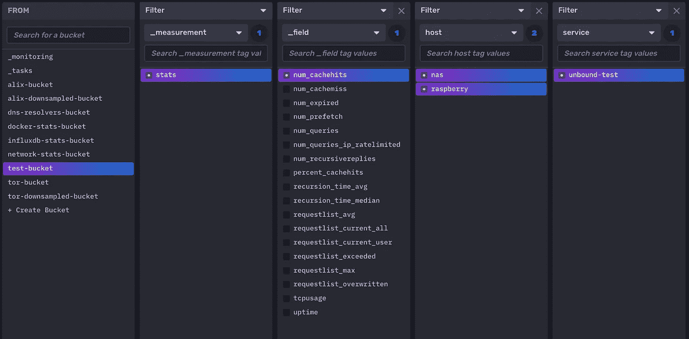
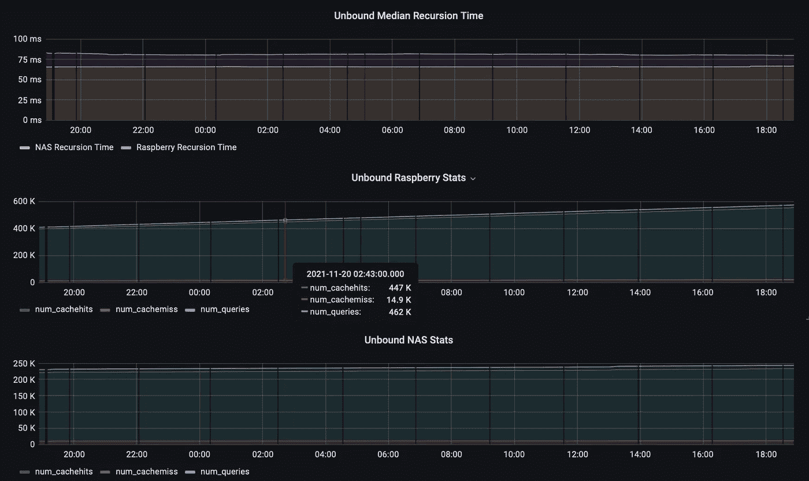
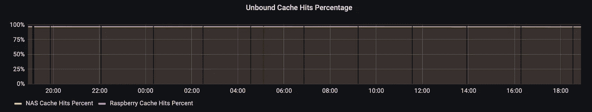
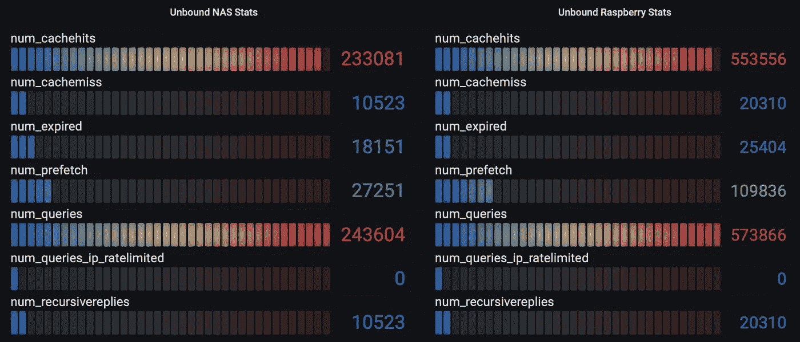

# 递归 DNS+广告拦截器—第 5 部分:Unbound 2 influxd 2—如何监控未绑定的服务器

> 原文：<https://medium.com/nerd-for-tech/recursive-dns-ad-blocker-part-5-unbound2influxdb2-how-to-monitor-your-unbound-servers-977fd59df215?source=collection_archive---------1----------------------->

## 在本文中，我将向您展示如何通过使用一个简单的 Python 脚本[Unbound-to-influxd 2 . py](https://github.com/MightySlaytanic/unbound2influxdb2)或我的[giannicostanzi/Unbound 2 influxd 2](https://hub.docker.com/repository/docker/giannicostanzi/unbound2influxdb2)docker image(您可以在 DockerHub 上找到)来收集未绑定的统计数据并将其发送到 influxdb2 bucket

本文与上一篇文章非常相似，[递归 DNS+广告拦截器—第 4 部分:pihole 2 influxd 2—如何监控您的 Pi-hole 服务器](/nerd-for-tech/recursive-dns-ad-blocker-part-4-pihole2influxdb2-how-to-monitor-your-pi-hole-servers-b2f03de2baf2)，我们将看到如何监控我们的未绑定服务器并收集数据以在 Grafana 仪表板中可视化。

Unbound 允许你通过一个实用程序 *unbound_control* 和通过 *unbound_console* Python 包来查询它的服务器。正如我对 Pihole 所做的那样，我构建了自己的 Python 脚本，因此我选择了 unbound_console 方式。

这是一个由 unbounded 返回的输出示例(它不是由*unbounded _ control*返回的本机信息，稍后您将会看到，我已经重命名了这些键并添加了一个 *percent_cachehits* 键)并用 *json.dumps(data，indent=4)* 格式化:

未绑定状态

## 使用 Python 收集和上传数据

正如我收集和上传 Pihole 统计数据一样，我构建了自己的 Python 脚本来查询未绑定的服务器，并将格式化的数据上传到我的 influxdb 服务器。你可以在 [GitHub](https://github.com/MightySlaytanic/unbound2influxdb2) 上找到整个脚本，在那里你可以找到一个总是最新的版本。

**脚本环境变量**

该脚本依赖于一些环境变量:

```
INFLUX_HOST="INFLUX_IP"
INFLUX_PORT=8086
INFLUX_ORGANIZATION="influx_org"
INFLUX_BUCKET="influx_bucket"
INFLUX_SERVICE_TAG="influx_service_tag"
INFLUX_TOKEN="influx_token"
UNBOUND_HOSTS="ip1:port1:tag1:G,ip2:port2:tag2:S,ip3:port3:tag3:N"
RUN_EVERY_SECONDS=10
VERBOSE="True"
# Create this folder and the required subfolders 
# **(see** [**README.md on GitHub**](https://github.com/MightySlaytanic/unbound2influxdb2) **for more info)**
CONFIG_DIR="./etc/unbound"
```

我不会详细讨论变量，特别是 *CONFIG_DIR* ，它必须包含证书和密钥，这些证书和密钥必须用于连接到未绑定的服务器。你可以直接在[https://github.com/MightySlaytanic/unbound2influxdb2](https://github.com/MightySlaytanic/unbound2influxdb2)上找到 README.md 和脚本源代码中的更多细节

我准备了一个导出环境变量的 shell 启动器，这对于将脚本嵌入 Docker 容器非常有用，就像我对 Pihole stats 所做的那样，它调用 python 脚本:

环境变量

如果将-t 标志传递给启动器脚本，它将把它传递给 unbind-to-influx db 2，并打印收集的数据，而不上传。

## 脚本执行

该脚本将永远运行，每隔*运行 _ 每 _ 秒*秒在*未绑定 _ 主机*中查询未绑定主机。

您可以运行带有 *-t* 标志的脚本，以便从 Unbound 中检索数据，并以格式良好、易于阅读的形式打印出来，而无需上传到 InfluxDB2。您还可以通过将 *VERBOSE* 设置为 *True 来查看调试信息。*

脚本使用了 *unbound_console。RemoteControl* 查询未绑定的服务器:

查询未绑定的服务器

我们处理返回的数据，以便用下划线而不是点来格式化字段，使运行在我们的 Raspberry 和 Docker 容器上的不同版本的 unbound 之间的命名一致(例如，一个版本使用 *zero_ttl* 而不是 *expired* 来计算缓存中过期元素的数量)，并避免在将值上传到 *influxdb2* 时出错(我们强制一些值为浮点型，另一些值为整数型):

正在为 InfluxDB2 上载准备统计字典

最后，已经打包到 *Python 字典*中的解析数据可以上传到 InfluxDB2:

将统计数据上传到 InfluxDB2

## 探索关于 InfluxDB2 的数据 DB2

您将在您的 InfluxDB2 服务器上找到统计数据:



InfluxDB2 上的测试桶

如你所见，我们在脚本中计算的所有未绑定统计数据和 *percent_cachehits* 都可以在*stats*measurement 中找到。您还会发现主机和服务作为附加标记可用于过滤查询的数据。

## 在 Grafana 中可视化数据

现在您已经在 InfluxDB2 上拥有了所有可用的数据，很容易用未绑定的统计数据来丰富您的 Grafana 仪表板:



未绑定仪表板面板

例如，这是我用来在上面的条形标尺面板上绘制最有趣的未绑定数据的 *Flux* 查询:

在之前显示的条形仪表盘上绘制 nas 统计数据的流量查询

## unbound 2 info lux db 2 Docker 映像

如果您已经阅读了我在本系列中的前几篇文章，您肯定期望我构建另一个 Docker 映像来嵌入我的 Python 脚本，您是对的:我已经将*unbound-to-influx db 2 . py*脚本嵌入到我的 [unbound2influxdb2 Docker 映像](https://hub.docker.com/repository/docker/giannicostanzi/unbound2influxdb2)中，您可以使用下面的命令下载它:

```
docker pull giannicostanzi/unbound2influxdb2:latest
```

您可以在[un bound 2 info lux db 2 Docker Hub 页面](https://hub.docker.com/repository/docker/giannicostanzi/unbound2influxdb2)上找到关于如何设置环境变量和运行该映像的更多信息。

如果您愿意，您可以使用下面的命令执行一次测试运行，它应该给出与*un bound 2 influxd 2 . sh-t*相同的输出:

```
docker run -t --rm \
 -e INFLUX_HOST="influxdb_server_ip" \
 -e INFLUX_PORT="8086" \
 -e INFLUX_ORGANIZATION="org-name" \
 -e INFLUX_BUCKET="bucket-name" \
 -e INFLUX_TOKEN="influx_token" \
 -e INFLUX_SERVICE_TAG="unbound-test" \
 -e VERBOSE="true" \
 -e UNBOUND_HOSTS="ip1:port1:tag_name1:enc_flag1,ip2:port2:tag_name2:enc_flag2" \
 -e CONFIG_DIR="/etc/unbound" \
 -v /path_to_local_folder/etc/unbound:/etc/unbound \
giannicostanzi/unbound2influxdb2 -t
```

如果流入主机或未绑定主机运行在同一个 docker 实例上，您可以指定各自的容器名称，但这需要将 *unbound2influxdb2* 容器连接到 influxdb 和 unbound 的同一个*非默认桥接网络*，以便容器到 ip 名称解析按预期工作。例如，我让这个容器在我的 Synology NAS 上运行，连接到 *npm* 网络*(*influxdb 1*容器)和*服务*网络( *unbound-secns1* 容器)。*

您可以从 CLI 或通过使用 Synology Docker 应用程序 GUI 来创建容器，正如我在上一篇文章中所展示的。

如果未能查询一个已定义的未绑定服务器，或者未能将数据上传到 influxdb2 服务器，则该映像实现的 healthcheck 会失败。您可以使用 *docker ps* 查看容器的状态(*健康*或*不健康*，如果不健康，您可以使用*docker logs un bound 2 info luxd 2 _ container _ name*检查日志。

## 结论

我希望你会发现这篇文章很有用，别忘了看看我的[unbound 2 influxd 2 docker 图像](https://hub.docker.com/repository/docker/giannicostanzi/unbound2influxdb2)并访问[我的 Github 页面](https://github.com/MightySlaytanic)获取更新的脚本。如果您有任何问题，请添加评论，我会尽力帮助您！