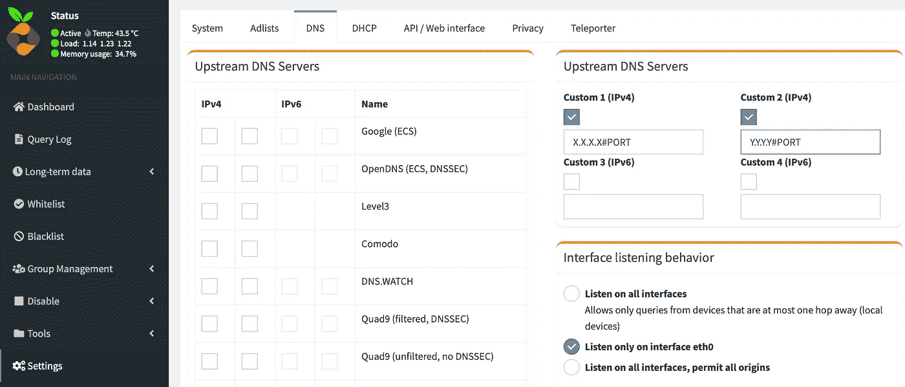
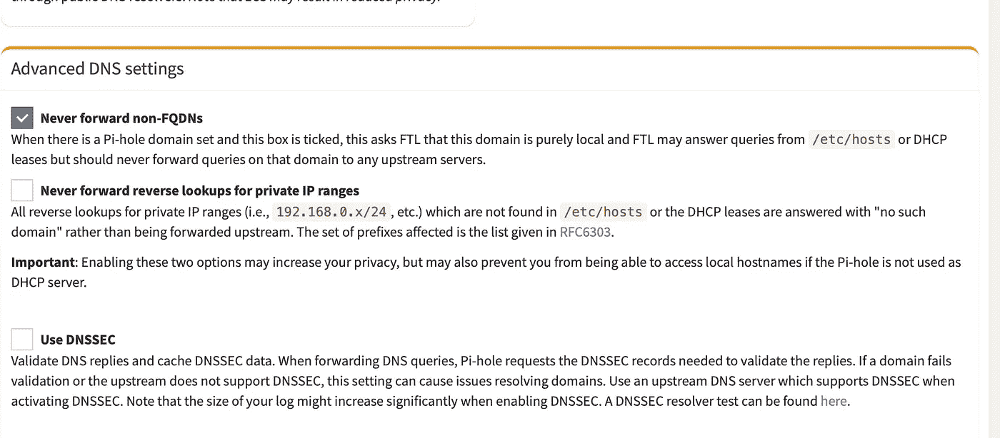
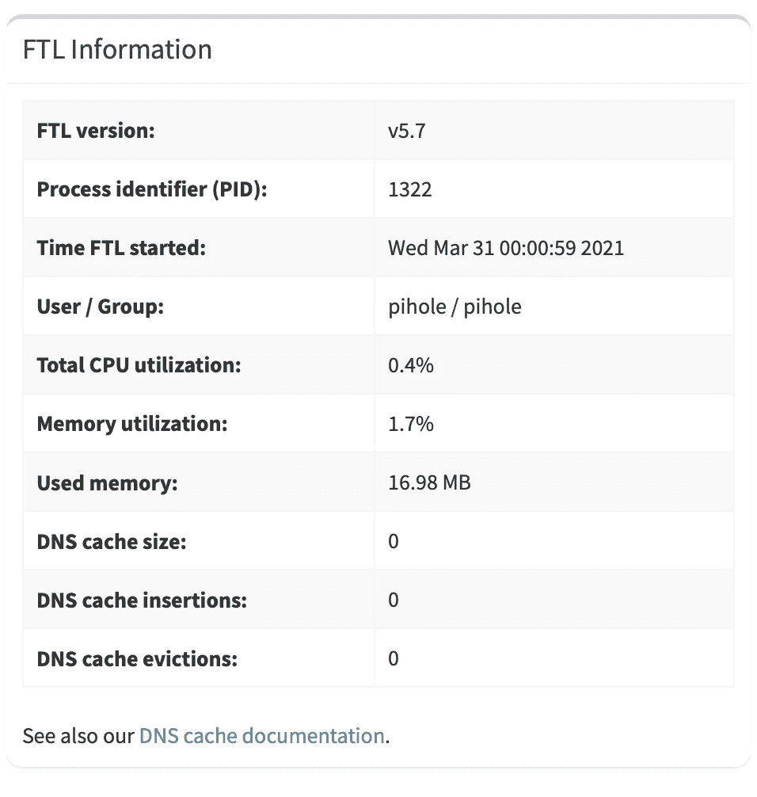
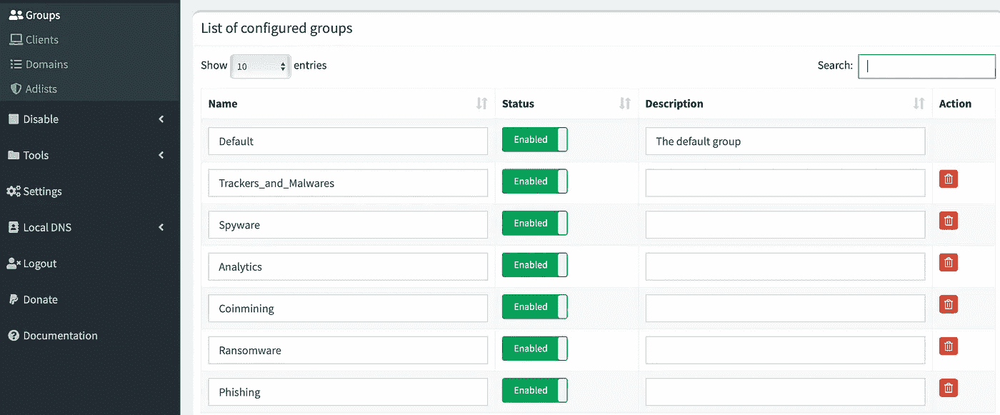
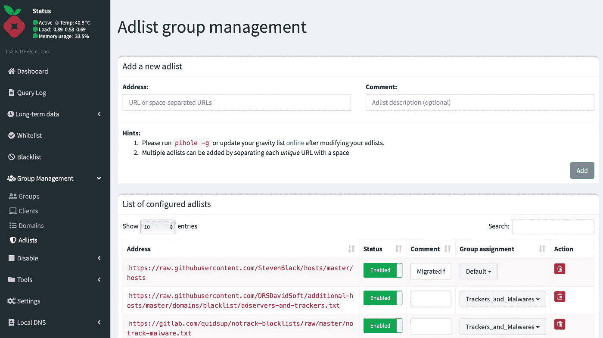
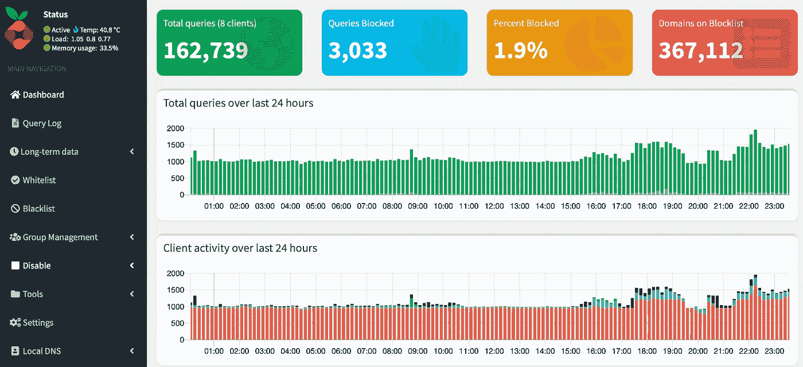
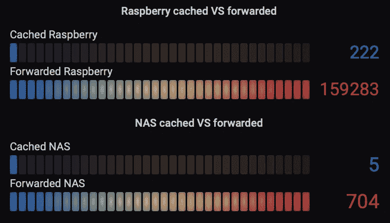
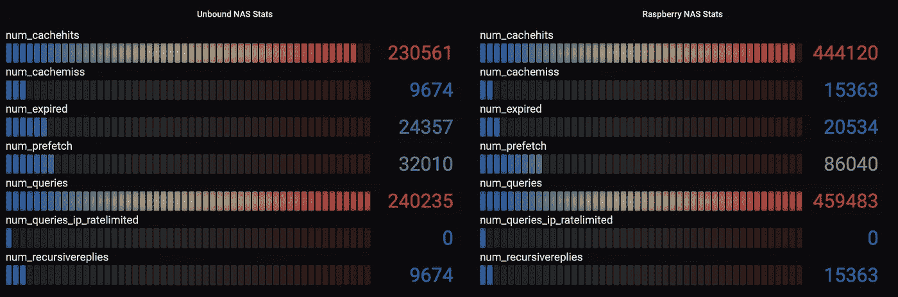
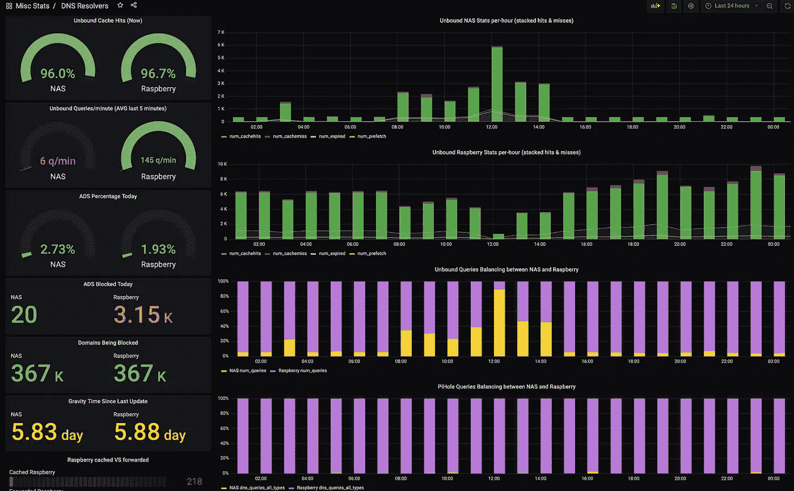
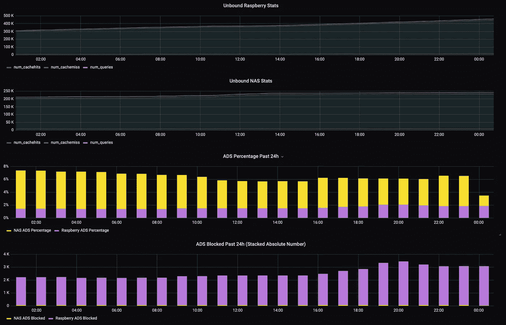

# 具有广告拦截功能的递归 DNS 解析器—第 1 部分

> 原文：<https://medium.com/nerd-for-tech/recursive-dns-resolver-with-ad-blocking-features-dea766d4f703?source=collection_archive---------0----------------------->

## 如果有一个家庭 DNS 服务器，它可以过滤广告、恶意网站或其他不良网站的类别，并递归地解析名称，而不使用官方 DNS 服务器，例如 Google、CloudFlare 或 OpenDNS 提供的服务器，岂不是很棒？

更新:

*   2021 年 4 月 17 日:增加了 DNSSEC 验证部分

**提供商 DNS**

大多数人在家里使用互联网，而不会弄乱电信公司提供的调制解调器/路由器的配置，并且他们使用提供商的 DNS 服务器，当调制解调器在加电时建立 PPPoE 连接时，提供商会自动返回这些服务器。

**免费公共(更快)DNS 服务器**

在家里获得更好的冲浪体验的第一步是连接到路由器，并通过 DHCP 服务器更改本地 LAN 上返回的 DNS 服务器，将它们替换为一些公共 DNS 服务器，如 cloud flare 1.1.1.1，它非常快，或其变种之一，如 1.1.1.2(无恶意软件域)或 1.1.1.3(无恶意软件和无成人内容)。

使用这些 DNS 服务器的优点是，与提供商的服务器相比，它们真的很快。使用像谷歌一样的 DNS 服务器的缺点是，你会给谷歌很多关于你浏览的域名的信息，因为每次你访问 www.mysecretsite.org 时，你都会问谷歌“www . my cretsite . org 的 IP 地址是什么？”，从而提供您访问的所有域名列表。

**递归 DNS 解析器@Home**

下一步是在您的家庭网络中配置递归 DNS 解析器。

递归 DNs 解析器不要求众所周知的公共 DNS 服务器解析完全合格的域名(FQDN ),而是询问根服务器(它必须预先知道),询问它们向哪个 DNS 服务器询问 FQDN 的顶级域。然后，它继续询问一个 DNS 服务器，它已经得到了域的下一部分，等等，所以它递归地行动。

例如，让我们假设我们想要获得 www.medium.com 的 IP 地址并“手动”进行递归解析。我从 wget[https://www.internic.net/domain/named.root](https://www.internic.net/domain/named.root)得到了一份根 DNS 服务器列表

例如，它包含以下服务器:

```
.                        3600000      NS    M.ROOT-SERVERS.NET.
M.ROOT-SERVERS.NET.      3600000      A     202.12.27.33
M.ROOT-SERVERS.NET.      3600000      AAAA  2001:dc3::35
```

下面是我们如何递归地解决 www.medium.com 的 FQDN:

```
# Ask root server M the list of DNS servers that can resolve .COM
# Here I'm using @DNS-FQDN which implies a resolution of DNS-FQDN
# into an IP address# Ask the root server M which Name Server (NS) we should use for
# com TLD
dig com NS [**@M**](http://twitter.com/M)**.ROOT-SERVERS.NET**
[...]
com.   172800 IN **NS** **f.gtld-servers.net.**
[...]# Ask for the NS to use for medium.com 
dig medium.com NS @f.gtld-servers.net
[...]
medium.com.  172800 IN **NS** **kip.ns.cloudflare.com.**
[...]# Finally, ask for the A (IPv4 Address) record of www.medium.com
dig [www.medium.com](http://www.medium.com) **A** [**@kip**](http://twitter.com/kip)**.ns.cloudflare.com**
[...]
[www.medium.com](http://www.medium.com).  300 **IN A 162.159.152.4**
[...]
```

**递归 DNS 解析的问题**

如果您简单地启用递归解析每个 FQDN 的递归 DNS 服务器，您将在 DNS 解析中获得高性能，因为递归需要大量时间(您可以为每个查询花费 20–30 毫秒到 2–300 毫秒，甚至更多)。

**缓存和预取+服务过期的 0-TTL 分辨率才是正道**

如果您启用了主递归 DNS，您肯定希望启用缓存和预取:

*   缓存:解析器递归解析一个 FQDN，然后在 TTL 指定的时间内将其存储到本地缓存中(上面的[www.medium.com](http://www.medium.com)解析为 5 分钟)
*   预取:当您请求时，解析器可以主动预取缓存中的 FQDNs，并且剩余寿命低于返回的 TTL 的特定百分比
*   在解析过期记录的同时提供过期记录:如果您局域网中的设备每 10 分钟请求一次 www.medium.com 请求[，解析器缓存中将不会有解析，因为它的 TTL 为 5 分钟。解析器可以做的是返回 TTL 为零的过期解析(这样设备的操作系统就不会缓存它),同时为该域立即启动递归解析。像](http://www.medium.com)[unbounded](https://www.nlnetlabs.nl/projects/unbound/about/)这样的递归解析器支持提供过期记录，并且您可以指定一个最大时间长度，在此期间，如果它不能递归解析过期记录，它将返回一个过期记录(通常您将它设置为 1 小时，以避免返回已删除域的解析太长时间)

**避开广告..以及数以千计的其他不良网站**

正如我上面已经说过的，有一些公共 DNS 解析器，如 *Cloudflare for Families* 可以删除部分不需要的 DNS 解析，例如，如果您想为您的孩子提供更安全的浏览器体验，可以删除与成人内容相关的解析。

如果你想要一个更大的灵活性，并且你想在家里自己实现一个递归的解决方案，你应该怎么做？在这种情况下， [Pi-hole](https://pi-hole.net) 就是解决方案:它就像一个坏域名的黑洞，因此得名。我认为名字中的 *Pi* 是因为树莓 Pi 是在你的家庭网络中运行它的完美候选，但我只是猜测:)

**在 Raspberry-Pi(或同等产品)上实施解决方案**

**墩孔配置**

你可以花很少的钱买一个 Raspberry-Pi，你不需要一个新的 RPi4，像我现在的 RPi3(可能也是以前的版本之一)就很好了。

您可以按照以下指南进行安装:

[](https://github.com/pi-hole/pi-hole/#one-step-automated-install) [## π孔/π孔

### 通过您自己的 Linux 硬件进行网络范围的广告拦截 Pi-hole 是一个 DNS 陷坑，可以保护您的设备免受…

github.com](https://github.com/pi-hole/pi-hole/#one-step-automated-install) 

我不会关注配置的每个方面，我只关注广告列表、DNS 设置和缓存。

安装后，您可以通过以下命令设置管理员密码:

```
pihole -a -p
```

然后你可以连接到 [http://RPI_ADDRESS/admin](http://RPI_ADDRESS/admin) 上的管理界面，选择左侧菜单中的登录，使用刚刚设置的密码登录。

首先，您可以通过进入**设置- > DNS** 来**更改 PiHole 将查询**转发到的 DNS



Pi-hole DNS 转发器设置

正如你所看到的，你可以很容易地在 Google，OpenDNS 等中选择一个主要的和次要的 IPv4 服务器，或者你可以在右边设置你自己的上游 DNS 服务器。请记住这一点，因为我们将使用自定义设置来将查询转发给未绑定的递归解析器。

**然后就是缓存**:如果你只是想把过滤的 Pi-hole 层加到 Google 和 OpenDNS 的标准分辨率上，就应该让缓存保持原样。如果您要使用具有自己的缓存、DNSSEC 和预取机制(由客户端 DNS 查询触发)的未绑定，您必须在 PiHole 上禁用 DNS Sec 和缓存。

在刚刚设置了上游 DNS 服务器的同一页面中，如果启用了 DNSSEC，则必须将其禁用(因为这可以通过未绑定来完成)。我还启用了反向查找私有 ip 地址的转发，因为它将由 Unbound 完成，否则，如果您使用公共 DNS 作为上游服务器，请启用阻止反向查找私有 ip 地址的选项，因为它可能会向外部泄漏有关您网络的信息。



专用 IP 反向查找和 DNSSEC 设置

缓存不能通过 GUI 禁用，必须通过 CLI 禁用。因此，编辑*/etc/pi hole/setup vars . conf*并设置以下变量:

```
CACHE_SIZE=0
```

然后使用以下命令重新启动 pihole:

```
systemctl restart pihole-FTL
```

重新连接到 GUI，进入设置->系统，在右边看一下，你应该看到 DNS 缓存条目都是零(一些缓存仍然发生，但几乎没有什么，它与本地分辨率有关)



默认情况下，pi-hole 使用配置的 **AD-List** 阻止大约 60k 个域(在编写本文时，将来可能会更改)，但**您可以通过添加其他列表**来增加阻止域的数量。你可以在这篇有用的博客文章中找到更多信息:

[](https://obutterbach.medium.com/unlock-the-full-potential-of-pihole-e795342e0e36) [## 释放 Pihole 的全部潜力

### 前言:我对技术很着迷，我想在和 Pihole 一起探索的时候分享我的发现。我不是…

obutterbach.medium.com](https://obutterbach.medium.com/unlock-the-full-potential-of-pihole-e795342e0e36) 

否则，您可以通过过滤与 Pi-hole 兼容的列表，从[过滤器列表](https://filterlists.com/)中挑选您自己的列表。

**注意:**您不能再通过 cli 编辑 *adlists.list* 文件来添加您在上述博文中找到的列表，现在您必须通过 GUI 在左侧的**群组管理**菜单中进行添加。我想添加上面博文中使用的列表，所以我在群组管理- >群组中创建了一些不同类别的群组:



群组管理

群组很有用，因为只需点击一下就可以启用或禁用一整组广告列表，所以我建议使用它们。

然后转到“群组”->“广告列表”，添加一些您找到的列表:



广告列表管理

正如在*地址*输入框中用灰色书写的那样，你可以一次粘贴多个 URL，他们说是空格分隔的 URL，但也有回车符的 URL，就像你在我链接的博客中发现的那样。导入列表后，您可以通过删除默认组并分配所需的类别来更改组分配。然后进入工具- >更新重力(是的，这是一个黑洞，你要增加它的重力:)，过一会儿(可能需要几秒钟)，你可以在你的仪表板右上角找到的阻止域列表将从最初的 60k 个域增加到几十万个，就像我的情况一样:



**未绑定配置**

最后，我们必须配置递归解析器，以完成我们的 DNS AD-Free &递归堆栈。

我已经将它安装在 Pi-hole 的同一个 RPi3 上，所以我需要更改它侦听 DNS 查询的端口，因为 Pi-hole 使用标准的 53/UDP 端口(我们希望它在标准端口上，因为我们的设备不能配置为使用非标准端口进行 DNS 查询)。所以，我们将使用 **50053/UDP** 。

您可以通过 apt 轻松安装 unbound:

```
apt install unbound
```

然后获取 root.hints 文件:

```
wget https://www.internic.net/domain/named.root -O /etc/unbound/root.hints
```

然后，您可以通过编辑*/etc/unbound/unbound . conf*来自定义配置

我将在这里发布我的配置中未注释行的结果，并添加一些内联注释来更好地解释它:

/etc/unbound/unbound.conf

使用新配置重新启动未绑定:

```
systemctl restart unbound
```

您可以在运行 unbound 的设备上通过以下命令测试它是否正常工作(如果从另一台设备进行测试，您可以将 127.0.0.1 替换为该设备的 IP 地址):

```
$ dig [www.microsoft.com](http://www.microsoft.com) A [@127](http://twitter.com/127).0.0.1 -p 50053; <<>> DiG 9.11.5-P4-5.1+deb10u3-Raspbian <<>> [www.microsoft.com](http://www.microsoft.com) A [@127](http://twitter.com/127).0.0.1 -p 50053
;; global options: +cmd
;; Got answer:
;; ->>HEADER<<- opcode: QUERY, status: NOERROR, id: 21721
;; flags: qr rd ra; QUERY: 1, ANSWER: 4, AUTHORITY: 0, ADDITIONAL: 1;; OPT PSEUDOSECTION:
; EDNS: version: 0, flags:; udp: 4096
;; QUESTION SECTION:
;[www.microsoft.com](http://www.microsoft.com).  IN A;; ANSWER SECTION:
[www.microsoft.com](http://www.microsoft.com). 3600 IN CNAME [www.microsoft.com-c-3.edgekey.net](http://www.microsoft.com-c-3.edgekey.net).
[www.microsoft.com-c-3.edgekey.net](http://www.microsoft.com-c-3.edgekey.net). 900 IN CNAME [www.microsoft.com-c-3.edgekey.net.globalredir.akadns.net](http://www.microsoft.com-c-3.edgekey.net.globalredir.akadns.net).
[www.microsoft.com-c-3.edgekey.net.globalredir.akadns.net](http://www.microsoft.com-c-3.edgekey.net.globalredir.akadns.net). 900 IN CNAME e13678.dscb.akamaiedge.net.
e13678.dscb.akamaiedge.net. 20 IN A 104.113.246.4;; **Query time: 903 msec**
;; SERVER: 127.0.0.1#50053(127.0.0.1)
;; WHEN: Sat Apr 03 00:14:29 CEST 2021
;; MSG SIZE  rcvd: 213
```

如您所见，我的第一个递归查询的性能非常差。让我们再重复一遍:

```
$ dig [www.microsoft.com](http://www.microsoft.com) A [@127](http://twitter.com/127).0.0.1 -p 50053; <<>> DiG 9.11.5-P4–5.1+deb10u3-Raspbian <<>> [www.microsoft.com](http://www.microsoft.com) A [@127](http://twitter.com/127).0.0.1 -p 50053
;; global options: +cmd
;; Got answer:
;; ->>HEADER<<- opcode: QUERY, status: NOERROR, id: 14653
;; flags: qr rd ra; QUERY: 1, ANSWER: 4, AUTHORITY: 0, ADDITIONAL: 1;; OPT PSEUDOSECTION:
; EDNS: version: 0, flags:; udp: 4096
;; QUESTION SECTION:
;[www.microsoft.com](http://www.microsoft.com). IN A;; ANSWER SECTION:
[www.microsoft.com](http://www.microsoft.com). 3527 IN CNAME [www.microsoft.com-c-3.edgekey.net](http://www.microsoft.com-c-3.edgekey.net).
[www.microsoft.com-c-3.edgekey.net](http://www.microsoft.com-c-3.edgekey.net). 827 IN CNAME [www.microsoft.com-c-3.edgekey.net.globalredir.akadns.net](http://www.microsoft.com-c-3.edgekey.net.globalredir.akadns.net).
[www.microsoft.com-c-3.edgekey.net.globalredir.akadns.net](http://www.microsoft.com-c-3.edgekey.net.globalredir.akadns.net). 827 IN CNAME e13678.dscb.akamaiedge.net.
e13678.dscb.akamaiedge.net. 17 IN A 104.113.246.4;; **Query time: 0 msec**
;; SERVER: 127.0.0.1#50053(127.0.0.1)
;; WHEN: Sat Apr 03 00:15:42 CEST 2021
;; MSG SIZE rcvd: 213
```

哇，现在它在缓存中，我们可以立即得到回复。

**将 Pi-孔指向未绑定的**

现在我们有了一个工作的递归 DNS 解析器，回到 Pi-hole GUI，Settings -> DNS，将 Unbound 配置为解析器。在本例中，它运行在同一个系统(127.0.0.1 表示本地系统)上，但在一个非标准端口上，因此我们采用以下方法:

```
127.0.0.1#50053
```

现在，用上面的命令重复 DNS 解析测试(删除- **p 50053** 选项，因为 Pi-hole 运行在标准的 53/UDP 端口上)并测试一切正常。

如果一切正常，回到提供商的路由器 DHCP 配置，用你的 Raspberry 的 IP 地址替换 Google/Cloudflare/OpenDNS 或者其他 DNS。然后，您可以重新启动调制解调器，强制您的设备重新连接到本地局域网，并从 DHCP 获取更新的 DNS。

**验证 DNSSEC 正在工作**

您可以通过连接运行 Pi-hole 和 unbounded(不从外部查询)的设备并执行以下命令来执行一些 DNSSEC 检查:

```
# The first one tests Unbound, the second one Pi-hole 
# (which then relies on Unbound to perform the query)
# delv tool is provided by *dnsutils* package
**delv** [**@127**](http://twitter.com/127)**.0.0.1 -p 50053 internetsociety.org A +rtrace +multiline
delv** [**@127**](http://twitter.com/127)**.0.0.1 internetsociety.org A +rtrace +multiline**# You should obtain the following output
;; fetch: internetsociety.org/A
**;; fetch: internetsociety.org/DNSKEY
;; fetch: internetsociety.org/DS**
;; fetch: org/DNSKEY
;; fetch: org/DS
;; fetch: ./DNSKEY
**; fully validated**
internetsociety.org.    300 IN A 104.18.16.166
internetsociety.org.    300 IN A 104.18.17.166
internetsociety.org.    300 IN **RRSIG** A 13 2 300 (
          20210418094324 20210416074324 34505 internetsociety.org.                
          vSNyWVP0EivHHRAyiqvwJqV+5N2FgUlrBq++xzsmdafn
          4zhz4CGuIBWbljDSxD2bmJYDFxfHOtR9QDX9YEHc2Q== )
```

您也可以使用 *dig* 进行检查。正如您在 DNS Institute 页面上看到的更多详细信息，如果 DNSSEC 正在工作，您应该会看到(以下 3 点直接摘自 DNS Institute 页面):

1.  报头中存在**认证数据** ( `**ad**` ) **标志**
2.  **DNSSEC OK** ( `**do**` ) **标志**表示递归服务器是 DNSSEC 感知的
3.  类型为 **RRSIG** 的附加资源记录，与 A 记录同名。

**注意:**我使用 internetsociety.org 作为测试域，因为按照[DNS 研究所](https://dnsinstitute.com/documentation/dnssec-guide/ch03s02.html)页面上的建议，使用[www.isc.org](http://www.isc.org)，我无法获得 ad 标志，所以该答案的验证有些问题，但我不是专家，所以我搜索了有效的域来测试 DNSSEC，我在*互联网协会网站*的 [DNSSEC 测试网站](https://www.internetsociety.org/resources/deploy360/2013/dnssec-test-sites/)页面上找到了这个域。

```
**dig** [**@127**](http://twitter.com/127)**.0.0.1 -p 50053 internetsociety.org. A +dnssec +multiline**; <<>> DiG 9.11.5-P4–5.1+deb10u3-Raspbian <<>> [@127](http://twitter.com/127).0.0.1 -p 50053 internetsociety.org. A +dnssec +multiline
; (1 server found)
;; global options: +cmd
;; Got answer:
;; ->>HEADER<<- opcode: QUERY, status: NOERROR, id: 38788
;; flags: qr rd ra **ad**; QUERY: 1, ANSWER: 3, AUTHORITY: 0, ADDITIONAL: 1;; OPT PSEUDOSECTION:
; EDNS: version: 0, flags: **do**; udp: 4096
;; QUESTION SECTION:
;internetsociety.org. IN A;; ANSWER SECTION:
internetsociety.org. 11 IN A 104.18.16.166
internetsociety.org. 11 IN A 104.18.17.166
**internetsociety.org. 11 IN RRSIG** A 13 2 300 (
 20210418094324 20210416074324 34505 internetsociety.org.
 vSNyWVP0EivHHRAyiqvwJqV+5N2FgUlrBq++xzsmdafn
 4zhz4CGuIBWbljDSxD2bmJYDFxfHOtR9QDX9YEHc2Q== );; Query time: 1 msec
;; SERVER: 127.0.0.1#50053(127.0.0.1)
;; WHEN: Sat Apr 17 10:48:13 CEST 2021
;; MSG SIZE rcvd: 195
```

上面提到的互联网协会网页也显示了一些带有不良 DNSSEC 签名的网站，你可以检查一下。在这种情况下，使用 *dig* 和*吕德*，您应该在输出中得到一个 SERVFAIL:

```
**delv** [**@127**](http://twitter.com/127)**.0.0.1 -p 50053 dnssec-failed.org A +rtrace +multiline**
;; fetch: dnssec-failed.org/A
;; **resolution failed: SERVFAIL****dig** [**@127**](http://twitter.com/127)**.0.0.1 -p 50053 dnssec-failed.org. A +dnssec +multiline**; <<>> DiG 9.11.5-P4-5.1+deb10u3-Raspbian <<>> [@127](http://twitter.com/127).0.0.1 -p 50053 dnssec-failed.org. A +dnssec +multiline
; (1 server found)
;; global options: +cmd
;; Got answer:
;; ->>HEADER<<- opcode: QUERY, **status: SERVFAIL**, id: 20419
;; flags: qr rd ra; QUERY: 1, ANSWER: 0, AUTHORITY: 0, ADDITIONAL: 1;; OPT PSEUDOSECTION:
; EDNS: version: 0, flags: do; udp: 4096
;; QUESTION SECTION:
;dnssec-failed.org. IN A;; Query time: 108 msec
;; SERVER: 127.0.0.1#50053(127.0.0.1)
;; WHEN: Sat Apr 17 10:56:17 CEST 2021
;; MSG SIZE  rcvd: 46
```

**监控墩孔**

Pi-hole 有其漂亮的 GUI，让您可以监控其性能，因此在仪表盘和顶部栏上，您将看到您的 Pi-hole 今天阻止的广告数量。我们总是谈论广告，但正如你所看到的，它也可以阻止恶意软件和你配置的广告列表中列出的其他不良内容。

您还可以查询下面的链接，获得内部统计信息的 JSON 输出。我用它向我的 InfluxDB2 服务器发送数据，并通过 Grafana 监控 Pi-hole 性能:

```
[http://RASPBERRY_IP/admin/api.php](http://10.0.0.2:50080/admin/api.php)
```

Pi-hole 内部统计(JSON 格式)

**监控未绑定**

你可以通过使用*未绑定-控制*来获得一些关于未绑定是如何执行的信息。只需启动 unbound-control 就能看到你想要的所有信息。我们现在对统计数据感兴趣，所以让我们用*unbound-control stats _ no reset*来运行它(默认情况下，如果您用 *stats* 调用它，统计数据将被重置，除非您指定*statistics-cumulative:yes*，就像我在 *unbound.conf* 中所做的那样)。

您将得到类似这样的结果(我将省略给出每个线程统计数据的 threadX 行，在我的例子中是从 thread0 到 thread3，因为我已经指定用 4 个线程运行):

在用 Python 对这些信息进行解析之后，我也将它们发送到我的 InfluxDB2 服务器。

**可视化电池组的性能**

我不会详细介绍我在 Grafana 中的监控窗格，这可能是未来帖子的一个有趣主题，但我可以向您展示我的 Pi-holes 和未绑定服务器(是的，我有两个 Pi-Holes，每个 Pi-Holes 都指向两个未绑定服务器，一个堆栈运行在 RPi3 上，另一个运行在 Synology NAS 上的 Docker 容器中，这也是另一篇帖子的内容:)。

如您所见，我们在 Pi-hole 上几乎没有缓存:



Pi-holes 上几乎没有缓存

《自由》给了我们很多信息:

*   缓存命中超过两个未绑定服务器接收的查询数的 96%
*   我们有很多预取，这很好，因为它们增加了缓存命中率
*   我们还有大量的过期条目，这是通过过期记录提供的查询数量(被计为缓存命中)
*   缓存无法回答的问题(即使是过期的条目)需要递归查询/回复，这由下面的最后一个条目计算
*   我们没有 IP 速率受限的查询，这对于设备很少的家庭网络来说是正常的



在未绑定上有很多缓存命中和预取，非常好！

**注意:**您可能会问自己，为什么 Pi-hole 上转发的查询数量低于未绑定服务器接收的查询数量，但这仅仅是因为 Pi-hole 编号每天都被重置，并且有时我会重启服务(更新、设备重启等)

因为 Grafana 就像一种药物，当你有了数据，你就开始绘制一切，这里你可以看到我绘制的关于我的冗余 DNS 堆栈的一些其他东西:)

**注意:**Pi-hole 和未绑定服务器的利用率是不平衡的，因为 1)操作系统倾向于使用第一个 DNS，在我的例子中是运行在 Raspberry 上的 Pi-hole，2)我认为(但我不确定)Pi-hole 也倾向于将查询转发到第一个 DNS，或者可能它有某种机制，可以看到响应更快且倾向于使用它最多的 DNS



DNS 解析器仪表板#1



DNS 解析器仪表板#2

**结论**

这是我在 Medium 上的第一篇新文章，我希望有人会觉得它鼓舞人心，也许有用，如果你有问题，可以通过我个人资料中链接的社交页面联系我，或者你可以在这里发表评论:)

更新:增加了一个关于在 Synology NAS 上使用 Docker 安装 Pi-hole 的后续故事，并提供了如何在 Docker 化环境中禁用缓存的技巧(这不像在标准 linux 安装中那样简单)。你可以在 [**递归 DNS+广告拦截器—第 2 部分:用 Docker**](https://giannicostanzi.medium.com/recursive-dns-ad-blocker-part-2-installing-pi-hole-without-caching-on-synology-nas-with-docker-5363bc7258f4) 在 Synology NAS 上安装没有缓存的 Pi-hole