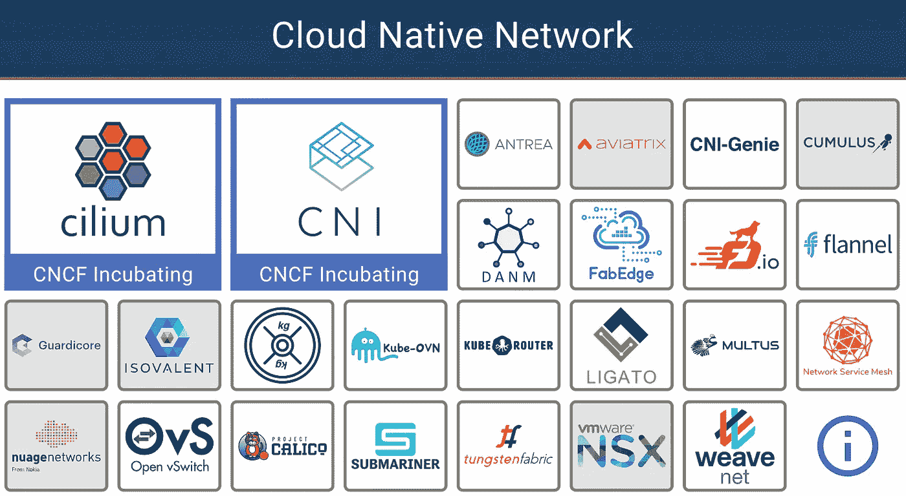
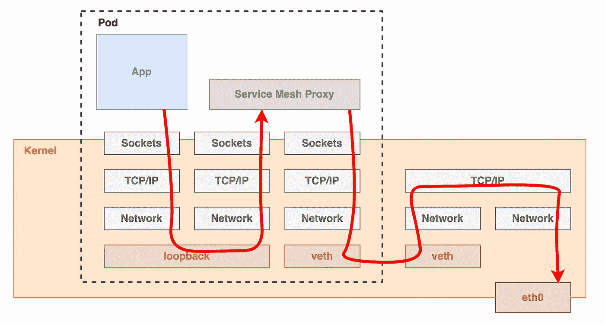
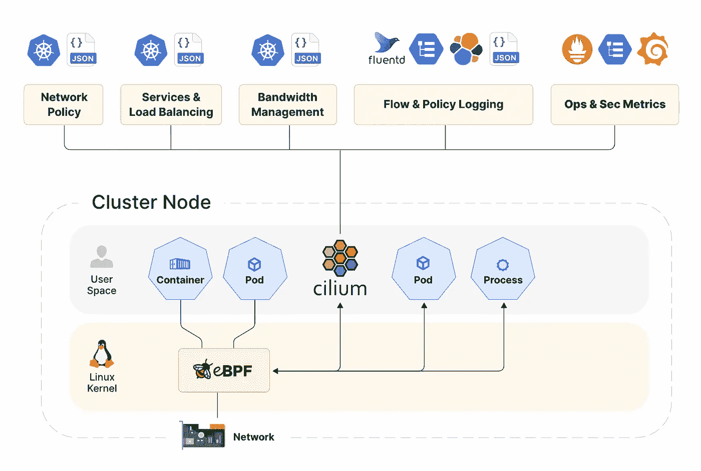
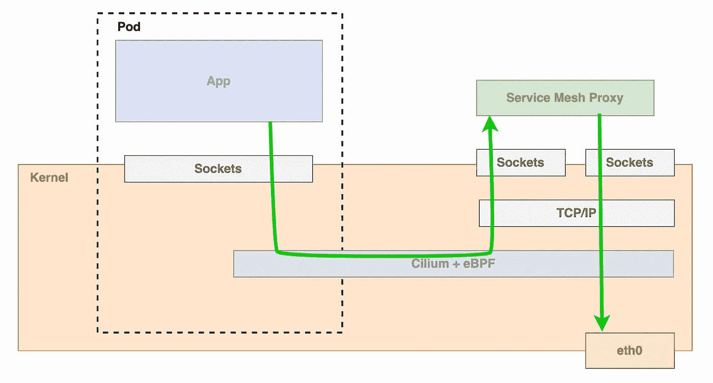
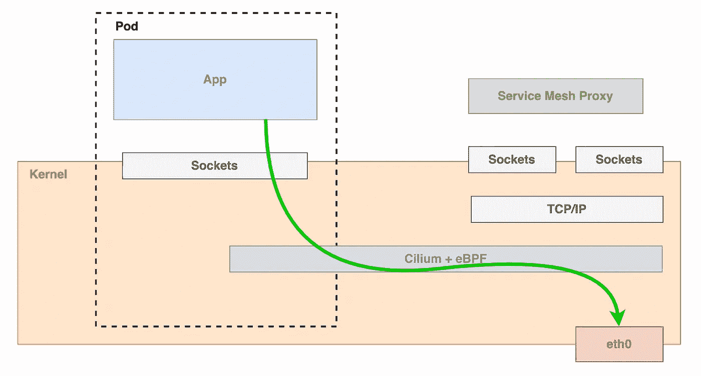

# 用纤毛重新定义服务网格

> 原文：<https://medium.com/nerd-for-tech/redefining-service-mesh-with-cilium-4738cdfb9899?source=collection_archive---------0----------------------->

你可能听说过 CNI 世界的纤毛。你还会发现它坐落在 CNCF 风景中的其他 CNI 之中。

来源:https://landscape.cncf.io/

但是，现在还有更多。它已经演变成一个服务网，只是与你过去看到的有些不同。在我们开始之前，如果您对服务网格完全陌生，我建议您访问我以前的博客，了解什么是基本的服务网格

 [## 解开服务网格

### 简化服务网格，以便您能够为您的架构做出正确的网络决策

levelup.gitconnected.com](https://levelup.gitconnected.com/untangling-the-service-mesh-24797e29eb92) 

## 那么这次有什么不同呢？

我们习惯于为网格提供服务，这些网格在您的应用程序 pod 旁边运行边车，并代理所有进出流量。它们管理 TLS、服务发现、重试、负载平衡等。总而言之，它们让我们的生活变得更加轻松，因为我们不需要在应用程序代码中管理所有这些逻辑。考虑到它们是容器化的，你可以独立于 sidecar 代码语言编写你的代码。

所以，如果我们看看数据包是如何在这里传输的，它看起来会像这样

在这里，我们将这段代码从应用程序中分离出来，放在一个 sidecar 中。这种脱钩改变了我们的生活。那么，可以进一步解耦吗？可以放在内核里吗？

来源:https://cilium.io/get-started/

您可以节省资源，因为您不必按单元运行它，而是按节点运行它。而且，由于流量会像这样移动，您还会降低延迟和复杂性

此外，如果我们不需要第 7 层信息来传输某些流量，我们可以完全跳过代理 pod，直接进入网络接口

通过消除标准服务网格的复杂性，您将面临显著的延迟和吞吐量改进[，这就是证据](https://cilium.io/blog/2021/05/11/cni-benchmark/)。

## 听起来太棒了，为什么我们一直没有这样做呢？

嗯，我们实际上非常接近 kube-proxy，它非常接近 Linux 内核，但不完全是，但有点像服务网格，同时依赖于用 iptables 实现的传统的基于网络的功能。

到目前为止，我们缺少的是第 7 层上下文，因为 kube-proxy 只需要专门在网络数据包级别上运行。它不能满足应用层流量管理、跟踪、认证等现代应用需求。

纤毛通过 eBPF 带来了解决方案。

## 这个 eBPF 是什么？

从历史上看，由于内核具有监督和控制整个系统的特权，操作系统一直是实现可观察性、安全性和网络功能的理想场所。

eBPF 可以在特权上下文(如操作系统内核)中安全有效地运行沙盒程序。它扩展了内核的功能，而不需要改变内核源代码或加载内核模块。这不仅安全，而且便于携带。

## 明白了，那么这个设置有什么帮助呢？

通过这种设置，您可以获得以下好处

*   在利用 BGP、XDP 和 eBPF 的同时，安全可靠地实施负载平衡
*   简单、高性能的跨集群连接
*   使用纤毛的哈勃框架的分布式的，有身份意识的可观测性。它为 L3/L4 和 L7 网络流数据提供了 Prometheus 兼容指标，并公开了上下文，如 pod 中的哪个应用程序进行了这些连接
*   支持几乎任何网络协议
*   更快的 pod 启动时间，因为不需要运行额外的边车
*   透明加密功能，它使用 Linux 内核中内置的高效 IPsec 功能来自动加密 Kubernetes 集群内部或集群之间的所有工作负载之间的通信
*   通过启用 DNS 感知策略(例如允许*.google.com)和应用感知策略(例如允许 HTTP GET /foo)，超越基本的 Kubernetes 网络策略

## 离别赠言

纤毛是一种看待服务网格的新方式，它带来了大量的额外好处。当然，它不像 Istio 这样的老玩家那样成熟，但考虑到他们的路线图，我相信会有新的浪潮到来。