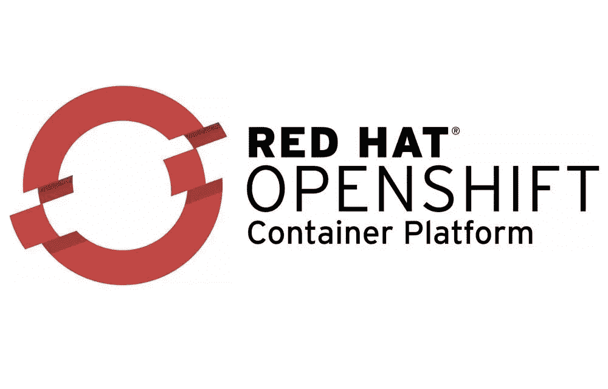

# RedHat 开放移位及其用例

> 原文：<https://medium.com/nerd-for-tech/redhat-open-shift-its-use-cases-7b415b005f51?source=collection_archive---------4----------------------->

## 关于 OpenShift 以及它如何在行业中被用来解决问题。

大家好！！！

我希望你们都很好，很健康。我猜你是来了解 openshift 的，以及它在哪里被用来解决问题并使行业受益。所以让我们开始吧。

首先说一下什么是 openshift，为什么需要它。让我简短地告诉你。我们都一直在使用一个系统来完成我们的任务。我们在裸机上使用操作系统。在工业上，他们使用集装箱化的概念；该应用程序打包了在任何环境中运行所需的库、框架和配置文件。它是迅捷的；它可以在几秒钟内启动一个操作系统。现在，我们必须管理这个容器以保持其活力，扩大和缩小规模。Kubernetes 是用于集装箱管理的工具之一。但是只有 Kubernetes 是不够的，又需要很多手工，于是我们有了 OpenShift。

OpenShift 是 RedHat 提供的软件，所以也叫 RedHat OpenShift。Openshift 帮助我们实现应用程序生命周期的自动化。它有助于连接从开发人员到生产人员的端到端连接，并有助于部署开发和监控以保持系统的活力。OpenShift 是由 Red Hat 开发的一系列容器化软件产品。它的旗舰产品是 OpenShift 容器平台——一个围绕 Docker 容器构建的本地平台即服务，由 Kubernetes 在 Red Hat Enterprise Linux 的基础上编排和管理。

OpenShift 是 RedHat 的平台即服务(PaaS)，它帮助我们在云上开发和部署我们的应用程序。这里的容器是最小的。当我们启动我们的应用程序时，涉及到不同的步骤。首先，我们的开发人员开发代码；他们会把它放在任何源代码管理工具上。从那里，他们必须进入测试环境，然后进入生产环境。我们需要许多服务器来部署应用程序，每个服务器都需要保存我们不同的模块或应用程序，并且需要有一个副本。在此之后，我们部署应用程序，客户端将增加流量，我们再次需要管理所有服务器以保持它们的运行。如果代码中出现任何更改或更新，开发人员需要推动 it 测试团队进行评估，然后继续生产。因此，在这里我们可以看到涉及到大量的手动工作。我们可以肯定，人工努力会有很多错误，然后我们可能无法使工作流连续。

## OpenShift 是如何工作的？

Openshift 是一个分层系统，其中每一层都使用 Kubernetes 和 Docker 集群连接到另一层。它有助于管理托管在 Kubernetes 顶部的容器。这个容器可以是任何应用服务器或数据库。容器包含轻量级的 Linux 系统，Kubernetes 支持并管理容器 orchestrion，OpenShift 通过自动化从开发到部署管理启动的应用程序。

Kubernetes 管理容器，Openshift 为它增加了更多的安全性，它还提供了 Kubernetes 所没有的监控。它还有助于自助服务供应，Openshift 将自动完成所有工作。OpenShift 还可以与其他工具连接，并使用这些工具帮助实现更多功能和更广泛的开发。

## **特点和优势**

以下是 openshift 的一些特性和优势:

*   **自助服务供应:**有了 openshift，开发人员现在可以做他们最擅长的事情，例如编码和测试。Openshift 将帮助开发者实现一切自动化。Openshift 可以帮助开发人员使用他们最熟悉的工具和语言，从而使开发更快、更准确。
*   **安全构建:**我们使用的是以安全性著称的软件或 RedHat 产品，所以我们不需要担心安全性，因为我们可以用 OpenShift 构建我们的应用程序。它包括来自领先的 Kubernetes 贡献者之一和开源软件公司的长期企业支持。
*   **编码推送:**有了 openshift，开发起来很简单。开发人员需要编码并推进到任何配置管理工具中，Openshift 程序将按照编程自动处理和管理所有中间工作。它将与一个不同的工具集成，以提供所有的需求，直到部署。

# 行业使用案例

## **空中客车**

空中客车公司是世界领先的跨国航空航天公司。它于 1970 年 12 月 18 日在荷兰成立。他们负责设计和制造商用飞机、防御系统和直升机。

空中客车公司正在过渡到在任何平台上提供服务，并提供软件定义的软件所需的访问权限。该组织选择使用 Red Hat OpenShift 和其他 Red Hat 技术为平台即服务(PaaS)创建一个文件。尽管如此，它仍然寻求提高内部技能和快速、高效的云应用程序开发的内部集成。为此，空客团队与 RedHat Openshift 合作了 6 周，并了解了如何按照 DevOps 实践构建云原生应用。

这有助于空客构建和展示统一的 PaaS 和可重用组件，以支持关键业务能力。他们能够使用 DevOps 获得云原生应用的关键技能和实践经验。它们还为显著加快新服务的交付速度奠定了基础。

## 福特汽车公司

福特汽车公司，俗称福特，是一家美国跨国汽车制造商，成立于 1903 年 6 月 16 日。它一直是汽车市场的主要组织之一。福特开发了许多不同种类的汽车，遍布全球。

福特汽车公司寻求以可接受的价格向其客户提供移动解决方案，包括向各种零售和商业消费者销售的经销商和零件分销商。为了加速交付和简化维护，该公司试图创建一个基于容器的应用程序平台，以更新其遗留的有状态应用程序并优化其硬件使用。

福特寻求我们的 RedHat Openshift 作为其解决方案，现在它已经受益于自助式供应在生产力和开发环境方面的改进。在 Sysdig 的帮助下，他们还利用 RedHat 的企业技术对其产品进行持续监控，从而增强了安全性。福特通过在裸机上运行包含容器技术的 Openshift 降低了他们的硬件成本。

# **结论**

这里有一个关于 OpenShift 的解释，它是如何工作的，以及它的好处。我还介绍了行业如何使用 OpenShift，以及他们如何从中受益。OpenShift 为开发者和组织提供了更多，许多其他组织也开始转向 openshift。

我希望我已经提供了一些关于 OpenShift 和一些用例的见解。博客上的任何建议都将受到高度重视，欢迎随时通过我的 LinkedIn 与我联系。

 [## 密山 Regmi -研究实习生- SkillGeek | LinkedIn

### 在世界上最大的职业社区 LinkedIn 上查看米山·雷米的个人资料。密山有一个工作列在他们的…

www.linkedin.com](https://www.linkedin.com/in/mishanregmi/) 

***感谢您的配合。祝你愉快。***