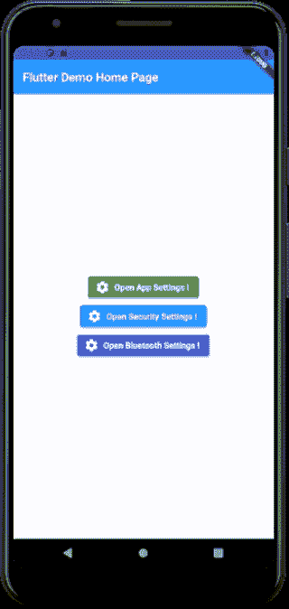
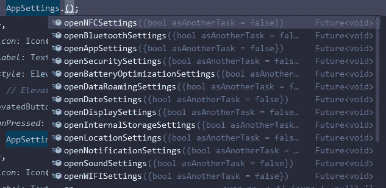
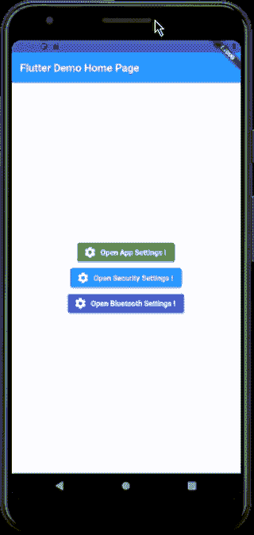

# 将你的应用重定向到本机设置

> 原文：<https://medium.com/nerd-for-tech/redirect-your-app-to-native-settings-84fabd72c1b?source=collection_archive---------10----------------------->

## 通过应用程序打开指定的系统设置。

*套餐* — [app_settings](https://pub.dev/packages/app_settings)

> 如果你想将你的应用重定向到本地设置，请按照以下步骤操作

*安装步骤-*

1.  使用 Flutter 运行以下命令:

```
$ flutter pub add app_settings
```

或者将其添加到您的包的`pubspec.yaml` 文件中:

```
dependencies:
  app_settings: ^4.1.0
```

2.安装软件包

```
$ flutter pub get
```

3.现在，在您的 Dart 代码中，您可以使用:

```
**import** 'package:app_settings/app_settings.dart';
```

**编码部分-**

只要调用名为`AppSettings` &的类，你就可以选择任何你想要的功能。



基本实现

*其他一些使用案例-*



*如果愿意，可以作为另一个任务打开。*

为此，只需添加`asAnotherTask: true`；



目前就这些。感谢您阅读这篇文章。

下次见🙌。