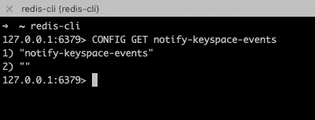
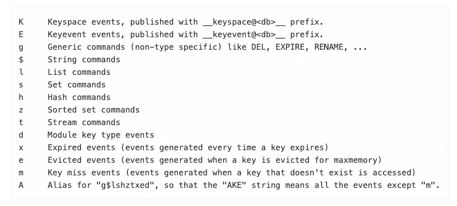
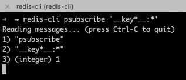
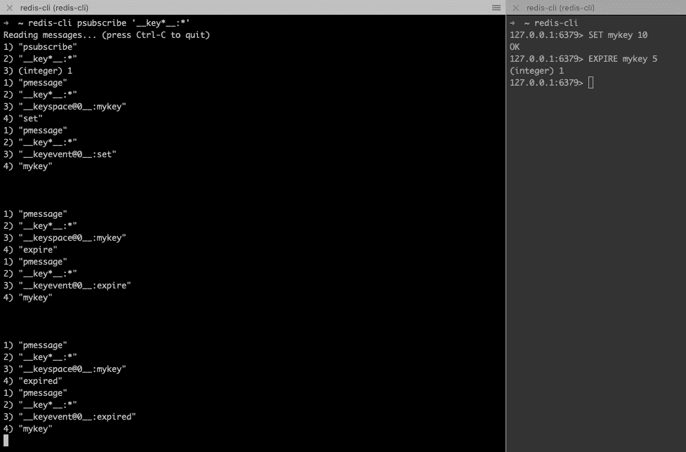

# Redis —在密钥过期或更改时得到通知

> 原文：<https://medium.com/nerd-for-tech/redis-getting-notified-when-a-key-is-expired-or-changed-ca3e1f1c7f0a?source=collection_archive---------0----------------------->

布雷特·乔丹([https://unsplash.com/photos/LPZy4da9aRo](https://unsplash.com/photos/LPZy4da9aRo))的功劳

你听说过 **Redis Keyspace 通知**吗？也许你们中的大多数人已经熟悉 redis，甚至每天都在使用它，但是你知道如果有一个关键的变化/过期发生，我们可以得到“通知”吗？

# 这是什么键空间通知？

长话短说，这是一种 pubsub 机制，允许您监听 redis 中的数据变化。使用该特性可能会有好处的简单用例，例如，您希望在某些密钥过期时得到通知，您希望监视某个特殊密钥的更改，以及您能想到的任何其他扩展用例。

如果你想了解更多的细节，你可以访问这个链接

 [## 关键空间通知

### 重要说明:自 2.8.0 密钥空间通知允许客户端订阅以来，密钥空间通知是一项可用的功能…

redis.io](https://redis.io/topics/notifications) 

# 闲聊够了，这里有一些例子

以下是“使用此功能”的步骤:

1.  使用 CONFIG SET 命令在 redis.conf /中启用 redis 通知
2.  使用确定的密钥模式创建订阅 redis 连接

关于第 1 点，默认情况下**被禁用**，根据文档，这是由于在启用该功能时使用了一些 CPU 功率。

这是我电脑上的例子

使用命令设置要启用的功能

> **配置设置通知-密钥空间-事件 KEA**

KEA 代表什么？它基本上设置了通知大量事件的功能，如列表、集合、散列、排序集合、过期密钥、逐出密钥等，详细信息可以在文档页面上阅读。你可以根据需要配置它，如果你只需要监听列表、散列和过期密钥修改，那么你可以像 **KElhe** 那样定义它。

基于文档的片段

然后，我们可以使用 PSUBSCRIBE redis 命令来订阅一个模式

PSU subscribe 代表用你想要的模式订阅([https://redis.io/commands/psubscribe](https://redis.io/commands/psubscribe))

我们可以测试一旦密钥被更改/设置/过期，我们的订阅客户端会得到通知。创建一个单独的终端，然后假设我们正在发送这个命令

> 设置我的密钥 20
> 
> 使我的密钥 10 过期

我把左边分成 3 个部分，这样你可以更容易地看到它。在第一个 SET 命令之后，我们得到了两次通知点**1–4**。我试着一个一个解释。看出来这 4 行(**第一条消息**):

1.)p 讯息
2。)__key*__:*
3。)__keyspace@0__:mykey
4。)设置

当你设置了一个 key，redis 会发布一个 pub sub 消息(点号 1)，带有一种“通道”点号 3(带有 **mykey** 是正在更改的 key，我猜 0 是 redis 默认的 DB？)，其中我们得到了自我们听 __key*__:*(订阅模式)以来，点号 4 是命令发生在该键，这是**设置**。

> 在某种程度上，**的 mykey** 已经被**设置**为第一条消息。

然后找出另外 4 行(**第二条消息** ):
1。)p 讯息
2。)__key*__:*
3。)__keyevent@0__:set
4。)我的钥匙

它与前一个类似，但我们从不同的角度来看，当我们执行 SET 命令时，redis 还发布了一个针对 key **mykey** (point 4)的 **set** (point 3)的 pub 子消息“key event”。

> 在某种程度上， **set** 已经在 **mykey** 上发生了第二条消息。

对于 SET 命令，我们得到两个 pub sub 消息(如上),因为我们监听(订阅)了 **__key*__:*** 模式。例如，如果我们将订阅模式命令改为 **__keyevent*:*** ，那么我们将只获得第二条消息。

最后，留意最后两条信息(两条 1-4 分)。当密钥过期时，我们也会收到相同模式的通知。第一条消息(keyspace)通知 **mykey** 是**过期**。而第二条消息表明**到期**事件正在 **mykey** 上发生。

> **因此，如果您需要在您的“受监控”密钥更改/过期时得到一些通知，以便您可以在应用程序中进行一些处理，那么尝试考虑 Redis 中的这个密钥空间通知特性会很好。**

# 需要关注的事情(必读)

虽然这个“特性”对于那些可能需要这样一个用例的人来说似乎很方便。请注意文档中的一些内容:

1.  当通知特性打开时，redis 上的 cpu 使用率增加了(我不知道有多少，可能是基于正在发生的许多事件，存在多少个键，等等)，这就是默认配置关闭的原因
2.  编程语言对 PSUBSCRIBE 命令的支持可以根据库的不同而不同，几年前我曾尝试使用 Golang redigo，它是受支持的。您可能希望检查您的编程/库对 redis 的客户端订阅/模式的支持
3.  密钥过期不是实时的，虽然如果您在本地(小密钥)上尝试，它看起来像是实时的，但文档中已经说明，由于 redis 过期逻辑，密钥可能不会在过期事件时被实时通知(请阅读文档的**过期事件的定时**部分)
4.  如果您使用 redis 集群，通知事件在每个节点上独立发生，如果您想要在跨节点的所有键上得到通知，您必须监听所有节点(参见文档中的集群中的**事件一节)**