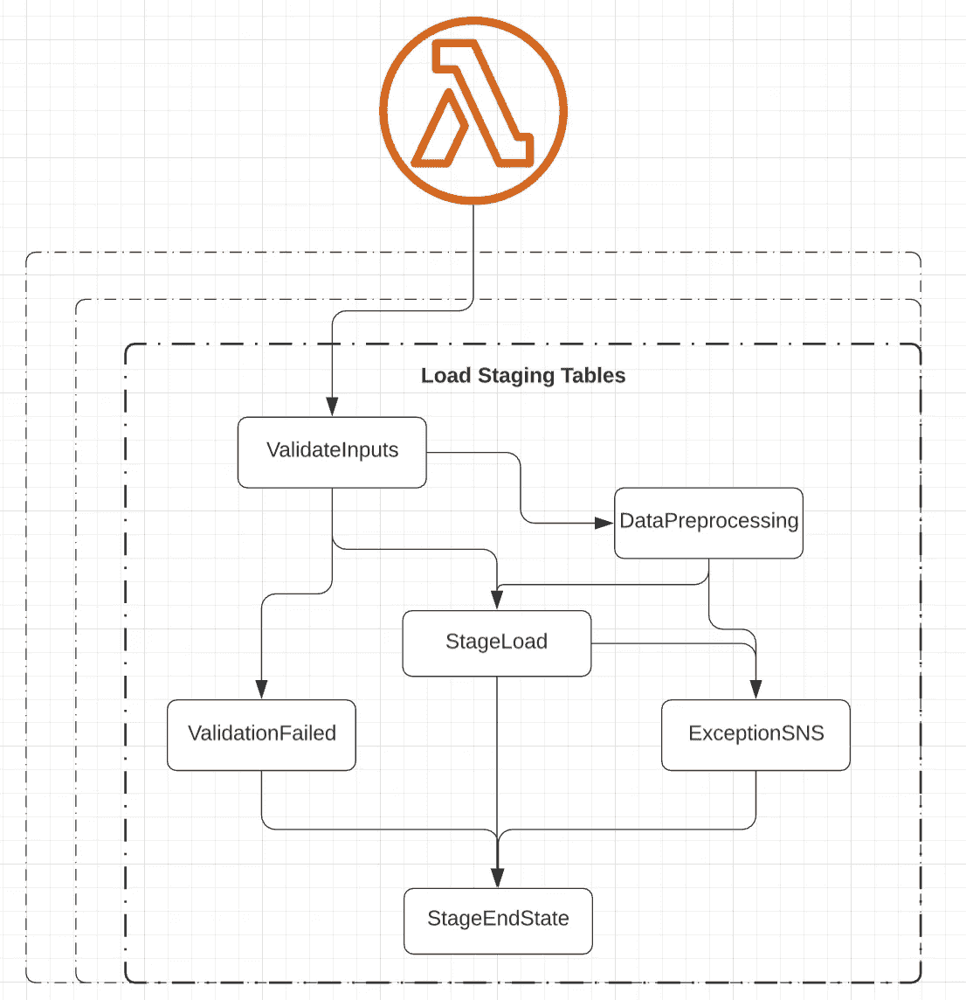
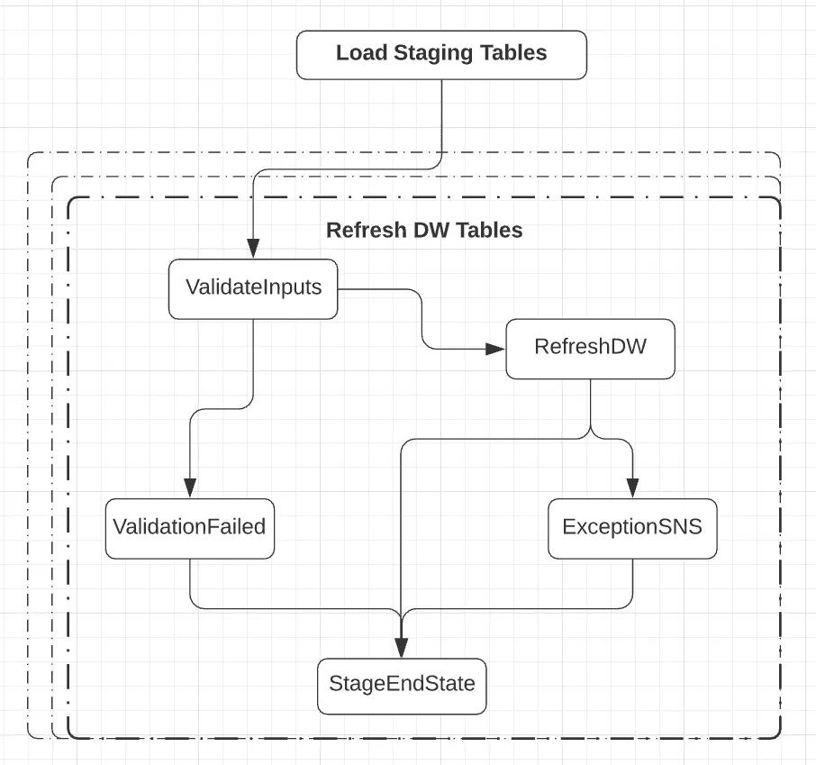

# 红线——红移管道

> 原文：<https://medium.com/nerd-for-tech/redline-a-redshift-pipeline-ca07d5e1ddcb?source=collection_archive---------13----------------------->

这是我作为数据工程师做过的最好的事情之一。让我带你和我们最好的朋友— **Data** 一起踏上一段奇妙的旅程。


来源:谷歌

**简要介绍这条管道** —
创建这条管道是为了从 s3 中挑选数据，并使用 Redshift Copy 命令将其加载到红移数据库中，然后在成功加载 **staging tables(原始数据表)**之后，使用查询文件中编写的查询刷新 **DW tables(自定义查询)**。看起来很简单，对吗？💭但是，为了使这个管道通用，我们引入了许多阶段和许多功能，使这个管道非常大。

我们把它分成 2 部分-
1。装载载物台
2。刷新数据仓库表

甚至在数据加载开始之前，我们需要验证管道是否已经为相同的输入运行，因为它会弄乱我们的表数据。**我们如何做到这一点？**
我在博客里已经详细分享了这个策略——*[***我是管道***](/nerd-for-tech/i-m-a-pipeline-571c49ab225b) ***。***
因此，当流水线启动时，我们将作业细节写入日志表，然后在每次运行开始时进行检查，如果有一个作业处于处理状态，具有相同的输入，我们返回，给出一个错误，否则继续。这个阶段实际上是一个 AWS Lambda 函数。*

*阶跃函数的初始输入—*

```
*{ "jobs":
   {  "job_name": "some_job_name",
      "stage":[{
             "table_name": "table1",
             "active": true,
             "pre_processing": true,
             "type": "incremental",
             "delta": "2:days",
             "s3path": "path/to/s3/"
             },
             {
             "table_name": "table2",
             "active": true,
             "pre_processing": false,
             "type": "full",
             "delta": "",
             "s3path": "path/to/s3/"
             }],
       "dw": [{
              "table": "dwTable1",
              "active": true
              },
              {
              "table": "dwTable2",
              "active": false
             }]
     }
}*
```

***输入** —
**类型**和**增量**在此定义 s3 中上传文件的频率。例如，对于表 1，如果 s3 路径是 s3://testbucket/files/因此，任何最新的文件都有完整的数据。
如果数据源是增量的，只有更新的记录到来，那么这里的类型将是增量的，增量被定义为时间范围。因此，如果 delta 是 2:days，这意味着应该选择路径中时间戳在最后两天以内的所有文件。
* *所有其他输入解释如下。*

*让我们在这里对 AWS Step 函数有一个清晰的了解。*

## *加载暂存表—*

**

*加载阶段表-按作者分类的图像*

*除了检查作业状态，我们的第一个 Lambda 函数还为我们做了几件事——I .检查给定的表是否存在于红移中。
二。检查提供的 S3 路径是否有效。
三世。根据提供的增量(预期时间段)检查文件是否存在。
并按表传递所有相关信息。JSON 被拆分并并行传递给装载阶段表部分。因此，加载阶段表部分的输入将是—*

```
*{
    "table_name": "table1",
    "active": true,
    "pre_processing": true,
    "type": "incremental",
    "delta": "2:days",
    "s3path": "s3://bucket/path/to/s3/",
    "table_exists": true,
    "job_name": "some_job_name",
    "job_status": "Processing",
    "job_id": "timestampvalue"
}*
```

*现在 **ValidateInputs** 阶段将检查所有这些输入，并根据这些值继续流程。这个阶段是由阶跃函数提供的选择状态。*

*这里我们来谈谈额外的价值——
1。table_exists —如果 table_name(这里是 table1)中提供的名称的表存在，则为 true，否则为 false。
2。job_status — *处理*如果同名的作业已经在运行，则根据上次运行判断是失败还是成功。
3。job_id —在红移表中标记正在进行的作业时分配为作业 id 的时间戳值。
4。现在将解析 S3 路径，这意味着如果路径存在并且作业类型已满，则将选择最新的时间戳分区。并且如果类型是增量的，那么将挑选落在增量范围内的所有分区。*

## ***流程**:*

*如果 **table_exist** 为 **false** 或者 **job_status** 为 **Processing** 或者该表的 **active** 标志为 **false** ，则该表的作业将通过验证失败触发 SNS 进入 StageEndState。
否则，如果 pre_processing 为真，则流程将转到数据预处理阶段，否则转到 StageLoad。
如果任何数据后处理或阶段加载失败，流程将通过触发 SNS 的 ExceptionSNS 阶段转到 StageEndState。(参见上面的**负载阶段表**流程)*

***# DataProcessing** stage 实际上是一个 AWS 胶水，编写它是为了让数据不嵌套。例如，如果一列包含数组—*

```
*"col1":"main", "col2":[{"name":"xyz","type":"data","value":123},{"name":"abc","type":"data","value":1234}]*
```

*这将扩展到—*

```
*"col1":"main", "col2":{"name":"xyz","type":"data","value":123}
"col1":"main", "col2":{"name":"abc","type":"data","value":1234}*
```

*# **StageLoad** 也是一个 AWS Glue，它将使用 Redshift UNLOAD 命令将 S3 数据加载到 Redshift。*

## *2.刷新数据仓库表—*

**

*刷新 DW 表—按作者排序的图像*

*在成功运行装载阶段表之后，流程进行到下一部分。在这里，输入也被验证，输入到验证输入阶段的样本——*

```
*{
    "table": "dwTable1",
    "active": false,
    "table_exists": true,
    "status": "SUCCESSFUL"
}*
```

*与前一部分类似，如果状态不是正在处理，table_exists 为真，active 标志为真，那么作业将针对给定的表运行。现在，这个 RefreshDW 阶段到底是什么？这也是一个 AWS 粘合作业，它从一个文件中提取查询并在 Redshift DB 中运行它们。*

*此外，如果任何作业(DataPreprocessing、StageLoad 或 RefreshDW)在退出之前失败，这些作业将被标记为失败。*

*最后，将再次触发 CheckJobs lambda 来关闭所有作业，这样在下一次运行时，我们的管道就不会发现它们处于处理状态。*

*谢谢大家！！*