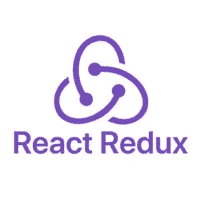
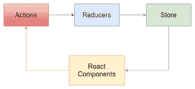

# 针对初学者的 REDUX 常见问题

> 原文：<https://medium.com/nerd-for-tech/redux-faqs-for-beginners-195ed82552cc?source=collection_archive---------3----------------------->

# Redux 是什么？

Redux 根据官方文档“是一个模式和库，用于管理和更新应用程序状态，使用称为“动作”的事件”“它帮助你管理全局状态。以便您可以在整个应用程序中调用和/或更新信息。

Redux 可以与任何前端集成，但最常用于 react。有了 redux，因为我们有了一个存储信息的全局位置，所以我们不必担心将状态提升到父组件。

Redux 本质上是不可变的。对状态和对象的任何更新都必须对状态或对象的副本进行。

# 什么是行动？

动作是一个普通的 JS 对象。动作通常定义应用程序中发生的事情。动作包含类型和有效载荷。类型有助于描述正在发生的事情，有效载荷是正在传递的实际数据。

动作创建器是一个返回动作对象的函数。

# 什么是减速器？

缩减器是一个函数，它接收当前状态和动作，并在必要时决定更新状态，然后返回一个新状态。缩减器监听并基于它接收到的动作(事件);它会做出相应的反应。

缩减器通常被写成条件或开关。

**Store——Store 是通过创建一个 reducer 来创建的，并带有一个默认的 getState()值，它返回当前的状态值。**

**Dispatch——redux 商店附带了一个名为。dispatch()，这是更新状态和传入动作对象的唯一方法。**

Reducers 的行为类似于事件监听器。一旦发生他们感兴趣的事情，就会相应地更新状态。

# Redux 数据流:

**初始**

1.  redux 存储是使用根 reducer 函数创建的
2.  存储调用根归约器并将返回值保存到初始状态。
3.  UI 组件评估 redux 存储的当前状态，并决定呈现什么。

更新

1.  应用程序中发生了一些事情。(点击了一个按钮)
2.  应用程序调度是对 Redux 商店的一个操作
3.  商店运行该操作，并将通过状态的副本以及任何更新作为新状态返回。
4.  商店通知所有订阅的用户界面
5.  每个组件检查是否有任何更新
6.  UI 重新呈现以反映任何更改。

# 结论

总之，您现在知道了 redux 是什么，并且对如何在您的全栈应用程序中使用 redux 有了大致的了解。编码快乐！