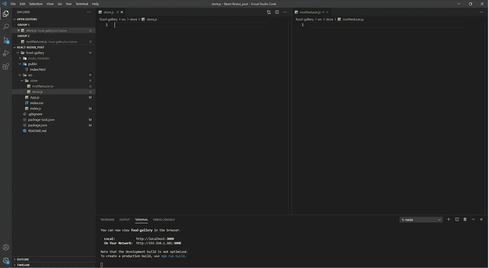
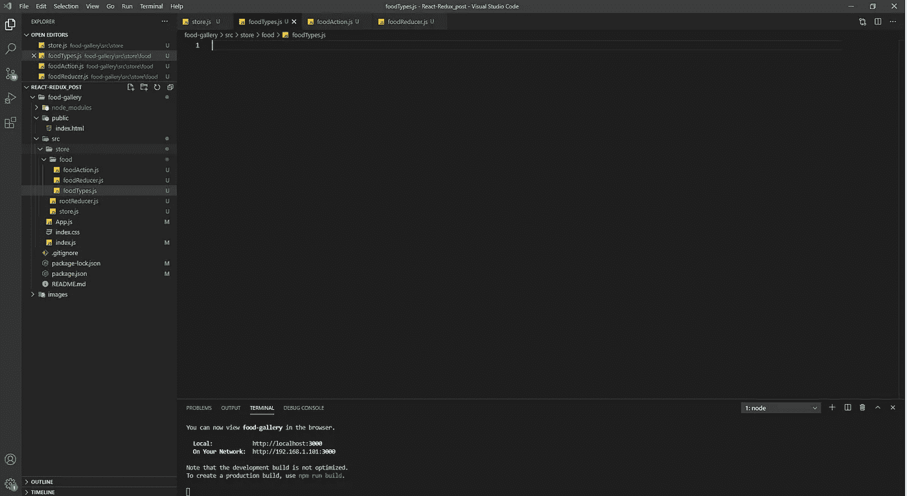
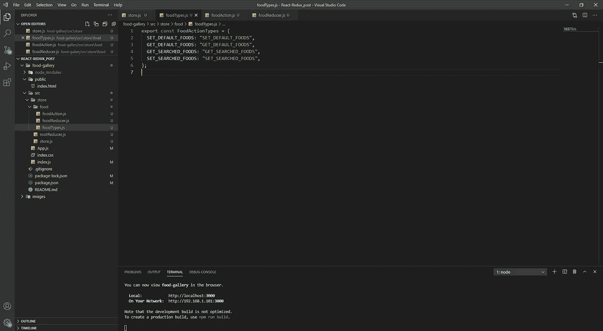
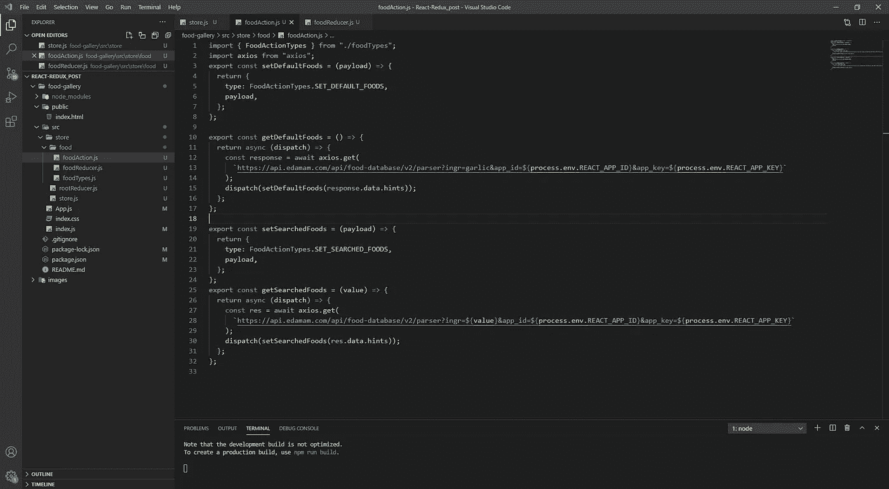
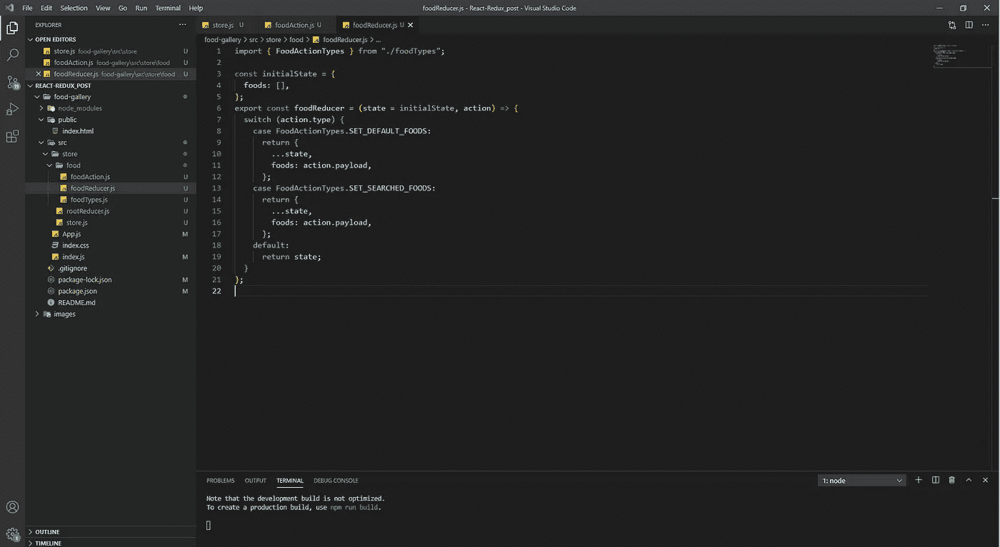
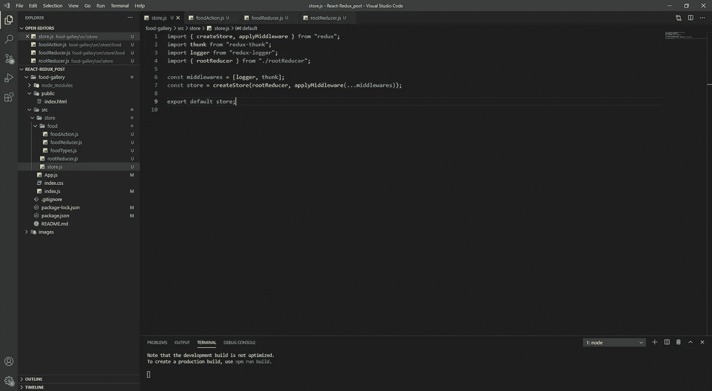
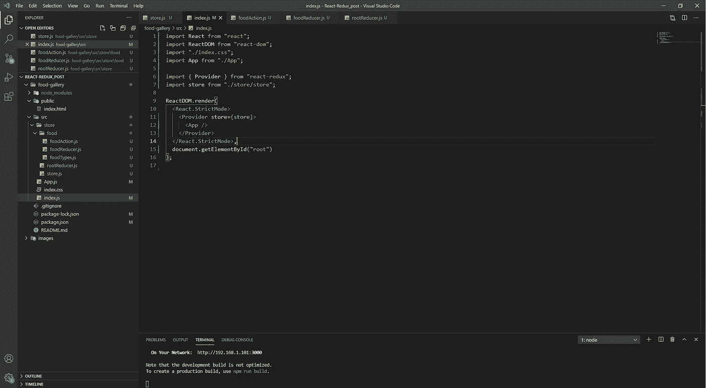
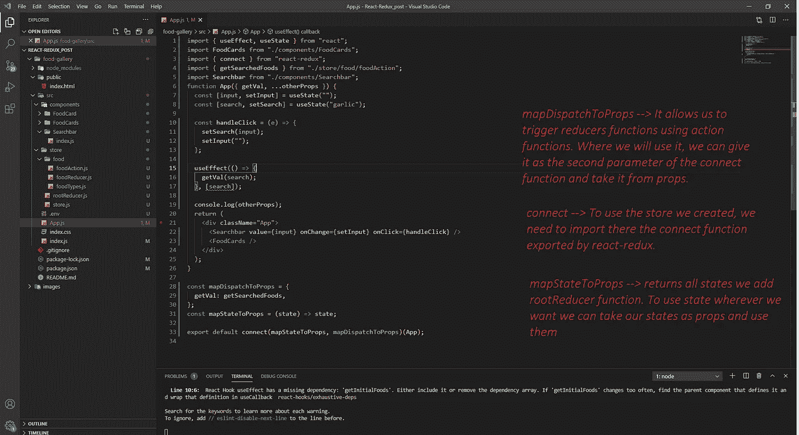

# 反应中的冗余

> 原文：<https://medium.com/nerd-for-tech/redux-in-react-54e05e56077e?source=collection_archive---------17----------------------->

反应还原

## React 中如何使用 Redux？

让我们开始用 npm 或 yarn 创建新的 React 项目。

因此，如果我们想创建 react 项目，我们需要按照一些步骤进入我们的 Visual Studio 代码(vs 代码)。

首先，打开新的终端，添加一些如下的东西，

*   npx 创建-反应-应用程序项目-名称
*   yarn create react-app 项目名称

好了，我们的项目已经创建好了，下一步在我们的项目中使用 Redux 是什么？

💲npm 安装 redux redux-logger react-redux react-thunk

💲纱线添加 redux redux-记录器 react-redux react-thunk

*   **redux** →允许我们在项目中实现 redux 以使用 redux
*   **react-redux** →允许我们绑定 react 和 redux 库
*   这是一个中间件，允许你编写返回一个函数而不是一个动作的动作创建器。thunk 可用于延迟动作的调度，或者仅在满足特定条件时才进行调度。内部函数接收存储方法`dispatch`和`getState`作为参数。
*   **redux-logger** →可以是带有 getter 函数的对象:prevState、action、nextState、error。如果您想打印基于特定状态或动作的消息，这很有用。

安装项目包的最后一步是下载我上面写的其他包。

使用 cd project-name 进入项目文件。然后打开终端，写下下面给出的命令

> NPM I react-redux redux redux-logger redux-thunk axios

现在让我们在 src 文件夹中创建一个名为 store 的新文件夹。该存储文件夹将包含所有 redux 文件。

将名为 rootReducer.js 和 store.js 的新文件添加到 redux 中。这个 rootReducer.js 文件合并了我们所有的 Reducer，因此我们需要导入我们所有的 Reducer，以便将它们合并在一起，还需要从 redux 中导入 combineReducers 函数。js 文件将包含我们的 store 对象。

store.js 和 rootReducer.js 文件初始状态

第二件事是创建一个新的文件夹，叫做我们有什么状态。如果你问你在说什么，那是什么？让我解释一下我在说什么。如果我们有一个名为 food 的状态，我们需要在 redux 文件夹中创建一个名为 food 的文件夹。这个 food 文件夹包含我们的 foodReducer 函数，它以我们的状态和动作作为参数，foodActionTypes 是避免魔术字符串的对象，foodAction 函数返回动作类型和动作负载。将新文件添加到我们的新食物文件夹中，创建食物状态的初始状态和名为 foodReducer 函数的函数。

项目冗余文件结构

让我们深入准备或初始化 redux。在开始时编写我们的操作类型可能会比较好，所以我将首先准备 foodTypes.js 文件。

foodTypes.js 文件

然后第二步是创建动作文件。在本例中，我们需要在 food 文件夹中创建一个名为 foodAction.js 的新文件。我们也将在那里写我们的动作函数。

foodAction.js 文件

第三步是 foodReducer 函数。

foodReducer.js 文件

第四步是编写 rootReducer 函数，将所有的 Reducer 组合到项目中。我们的项目只有一个减速器，但是您可以按照示例步骤添加新的减速器。总之让我们写 reducer 函数。

rootReducer.js 文件

哦，最后，是时候创建存储对象了😅

store.js 文件

从现在开始，我们有了存储对象，我们可以在任何地方管理它。🚀

## 我们如何管理我们的存储对象？

让我们将 store 添加到名为 index.js 的顶层项目中。

正如你所记得的，我们创造了一个食物减肥器。为了使用这个函数，我们必须用 react-redux 库提供的名为 Provider 的容器来包装我们的整个项目。这个提供者获取一个名为 store 的道具，它将获取我们到目前为止创建的 store 对象。

index.js 文件

现在，我们已经将我们的商店对象包含在我们的项目中，我们将能够在全球范围内管理我们的状态，而无需在我们想要的任何地方进行道具钻探。

让我们添加一些组件和样式。我不会在这里分享代码，如果你想看代码，你可以克隆或者下载到我的 github 仓库。

App.js 文件

最后一步是运行项目文件:

*   npm 开始
*   纱线起点

简单而有效的项目已经完成。这个项目向我们展示了许多重复的东西。顺便说一下，我们丑陋的项目看起来如下😄

丑陋的项目😃

让我告诉你，别忘了我用来获取数据的网站是这里的****。****

**项目文件在 [***github***](https://github.com/ahmetsuhan/medium-projects/tree/main/react-redux-using/food-gallery) 上**

**感谢阅读，下次见👋**