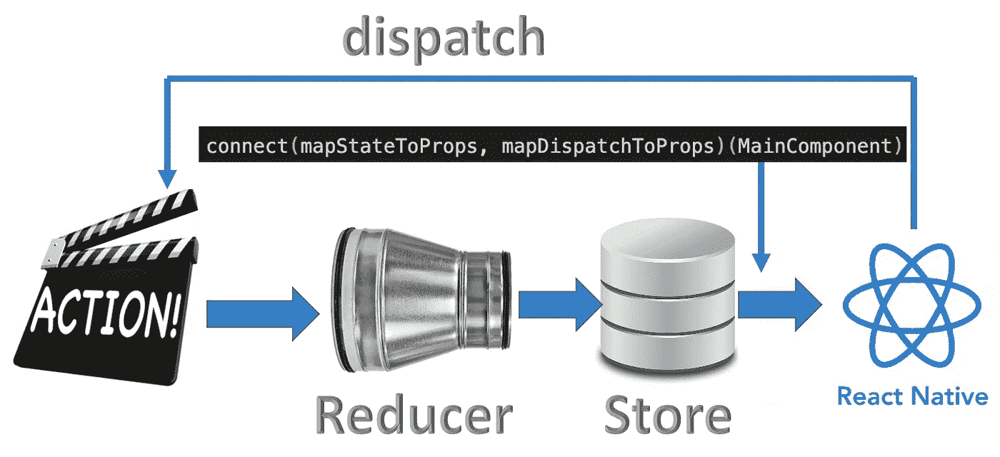
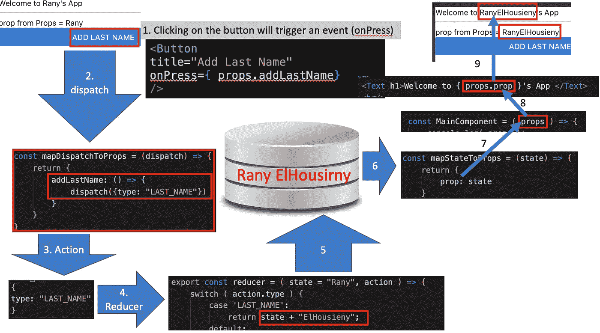

# Redux with React Native

> 原文：<https://medium.com/nerd-for-tech/redux-with-react-native-cdeeeeff68c9?source=collection_archive---------4----------------------->



在这篇文章中，我将通过一步一步地构建一个应用程序来解释 Redux 如何与 React Native 一起工作，并以这种方式解释细节。这将是针对每一步的一系列文章。

最终代码位于[https://github . com/ranyelhousieny/ReactNativeFoodApplication](https://github.com/ranyelhousieny/ReactNativeFoodApplication)

您可以克隆并使用

```
git clone [https://github.com/ranyelhousieny/ReactNativeFoodApplication.git](https://github.com/ranyelhousieny/ReactNativeFoodApplication.git)
```

1.  [https://lnkd.in/guBuBVP](https://www.linkedin.com/pulse/create-redux-hello-world-rany-elhousieny-phd%E1%B4%AC%E1%B4%AE%E1%B4%B0/):[𝑪𝒓𝒆𝒂𝒕𝒆𝒂𝑹𝒆𝒅𝒖𝒙](https://lnkd.in/guBuBVP)

2.[创建 React 原生 App](https://www.linkedin.com/pulse/create-react-native-base-project-run-rany-elhousieny-phd%25E1%25B4%25AC%25E1%25B4%25AE%25E1%25B4%25B0/?trackingId=fVq%2FbGEzug0okFdN6aGbPQ%3D%3D) [此处](https://www.linkedin.com/pulse/create-react-native-base-project-run-rany-elhousieny-phd%25E1%25B4%25AC%25E1%25B4%25AE%25E1%25B4%25B0/?trackingId=fVq%2FbGEzug0okFdN6aGbPQ%3D%3D)[https://lnkd.in/gDWG7AC](https://lnkd.in/gDWG7AC)

3.redux with React Native:1-阅读状态:[https://lnkd.in/gUbBRs8](https://lnkd.in/gUbBRs8)

4.[Redux with React Native:2-更新状态 https://lnkd.in/gPcUcMx](https://www.linkedin.com/pulse/redux-react-native-2-updating-state-rany-elhousieny-phd%E1%B4%AC%E1%B4%AE%E1%B4%B0/?published=t)

最后的步骤:

