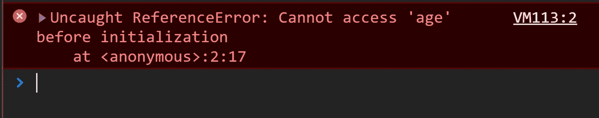

# 为什么在 JS 中引用错误(临时死区和吊装)

> 原文：<https://medium.com/nerd-for-tech/referenceerror-in-js-temporary-dead-zone-and-hoisting-3ea442715791?source=collection_archive---------14----------------------->


# **你在这里会学到什么？**

*   ***让 vs var —*** 一般区别。
*   ***吊装***
*   ***暂时死区***

要理解*提升*和*临时死区*首先我们应该知道 let 和 var 的范围差异。

## let vs var

*   *var 和 let* 都用于 javascript 中的变量声明，但它们之间的区别在于 var 是*函数作用域*而 let 是*块作用域*。

```
function fun(){
 if(true){
 var foo = 5
 let bar = 5
 }
 console.log(foo)
 console.log(bar) //ReferenceError: bar is not defined , because bar varible isn't function scope, bar is only block scope variable
}
fun()
```

"在 JavaScript 中，我们可以在声明变量并提供适当的初始化(赋值)后使用变量."'

# 声明和初始化有什么区别？

```
{
  let age; // declaring
  age = 20; // initializing
  let hands = 2; // declaring and initializing
}
```

如果我们在声明或赋值之前访问，会发生什么？

这里提升和临时死区(TDZ)进入画面。

**JS 引擎**即*解析和执行*你的代码有 **2 个步骤**要做:

1.  将代码解析成*抽象语法树/可执行字节代码*，以及
2.  **运行时执行**。

*   **编译时**:运行所有代码，寻找变量/函数声明
*   **运行时**:执行代码，包括赋值和函数调用

提升发生在步骤 1，这是由 JS 引擎完成的。因此，它实际上会将所有变量声明移动到它们作用域的顶部。

```
var hoistedVariable;
console.log(hoistedVariable); // undefined
hoistedVariable = 1;
```

# **吊装**

**提升**是一个在 ECMAScript 2015 语言规范之前的任何规范性规范中都不会使用的术语。提升被认为是一种思考执行上下文(特别是创建和执行阶段)在 JavaScript 中如何工作的一般方式。然而，这个概念一开始可能会有点混乱。

```
{        
        var age; // variable declaring
        console.log(age); // Undefined
	// Hoisting zone
	var = 25;// value assigning
	console.log(age); // 25 
}
```

从概念上讲，**提升**的严格定义表明，在代码执行之前，变量和函数声明被移到代码或作用域的顶部，但事实上并不是这样。相反，在*编译*阶段，变量和函数声明被放入内存，但是停留在您在代码中键入它们的地方。

# 暂时死区

**临时死区**是 JavaScript 中的一种行为，在用 let 和 const 关键字声明变量时会发生，而不是用 var。

`let`和`const` 变量从它们的封闭范围开始一直存在于 TDZ 中，直到它们被声明。

```
{
        console.log(age); // RefrenceError Due to TDZ
	// This is the temporal dead zone for the age variable!
	// This is the temporal dead zone for the age variable!
	// This is the temporal dead zone for the age variable!
 	// This is the temporal dead zone for the age variable!
	let age = 25; // When, we got there! No more TDZ
	console.log(age);
}
```

你也可以说变量存在于 **TDZ** 中，从它们被绑定的地方(当变量被绑定到它所在的作用域时)直到它被声明(当一个名字在内存中为那个变量保留时)。

如果我们在 TDZ 地区加入年龄变量会怎么样？



带功能的 TDZ

```
let a = f(); // ReferenceError 'Cannot access 'b' before initialization'
const b = 2;
function f() { return b; } // 2, b is in the TDZ
const a = f();
console.log(a) // 2
```

# 要点

*   结果是一样的。请记住，当使用`let/const/var`时，你应该*总是将变量声明移动到你的作用域*的顶部，以避免**时间死区和提升**。
*   如果你需要阻塞的作用域，就去找`let/const`，否则就去找 var，var 是函数作用域。
*   总是尝试使用 *let/const* ，因为如果代码中存在与变量相关的 bug，那么调试将变得更加容易。

我希望你在这里学到了新东西。

谢谢你的 time☺️

其他与 Javascript 相关的东西

## [理解 JavaScript 中的作用域和作用域链](https://ritik-chopra28.medium.com/understand-scopes-and-scope-chain-in-javascript-12ee91161abb?source=your_stories_page-------------------------------------)

## [JavaScript 中的调用栈](https://ritik-chopra28.medium.com/the-call-stack-in-javascript-291edfaa74e9?source=your_stories_page-------------------------------------)