# 反射探头与屏幕空间反射| Unity

> 原文：<https://medium.com/nerd-for-tech/reflection-probes-vs-screen-space-reflections-unity-218e4c923b75?source=collection_archive---------2----------------------->

## 一致

## 快速查看 Unity 中反射探头和屏幕空间反射的区别

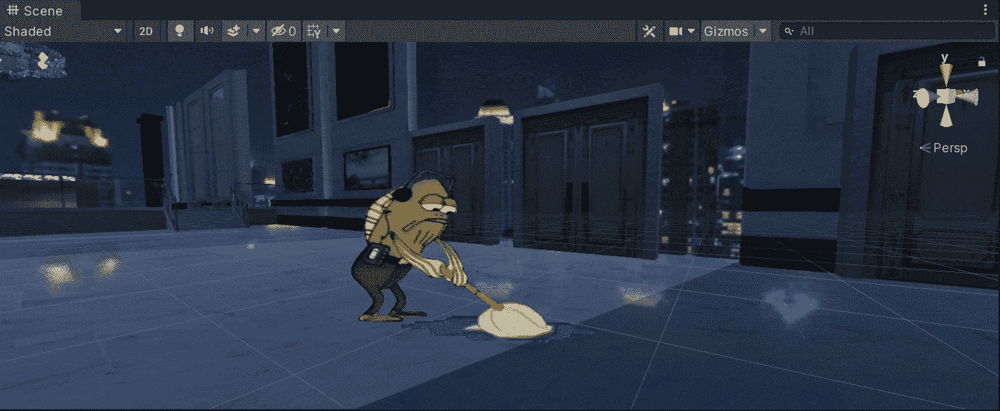

**目的**:找出 Unity 中反射探头和屏幕空间反射的区别。

在上一篇文章中，我介绍了[如何创建和实现光探测器](/nerd-for-tech/using-light-probes-in-unity-56bcedd1aafd)。现在，是时候用 Unity 找出反射探头和屏幕空间反射的区别了。

# 当前场景

首先，我们有几个静态游戏对象的下一个场景。如果我们看一下地板，我们可以注意到它反射了我们在[一个旧帖子](/nerd-for-tech/creating-a-skybox-in-unity-9399eff6a7b7)中创建的天空盒提供的光。发生这种反射是因为地板包含的材质的高平滑度设置。

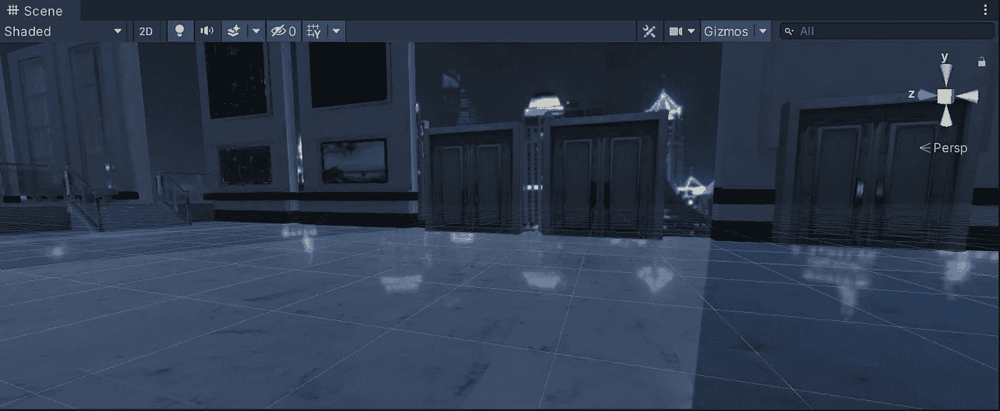

但是如果我们想从周围环境中反射静态的游戏物体会发生什么呢？让我们来看看几个选项。

# 反射探针

在第一个选项中，我们有反射探针，它提供了一个基本的方法来反射场景中的视觉环境。为了测试它，让我们通过点击 *+* > *灯* > *反射探头*来创建一个新的反射探头:

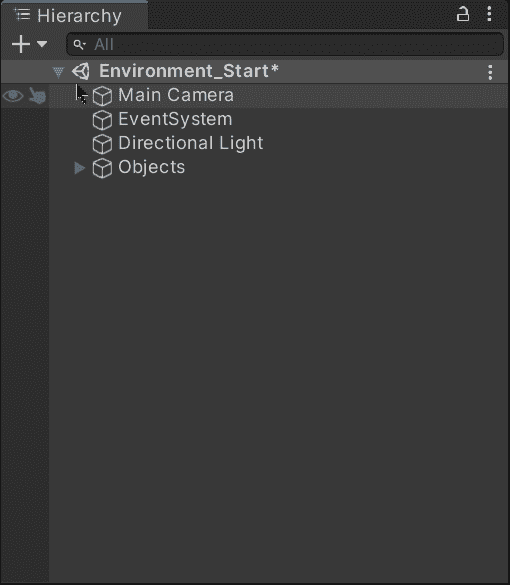

一旦创建了反射探针，我们将在场景中看到它:

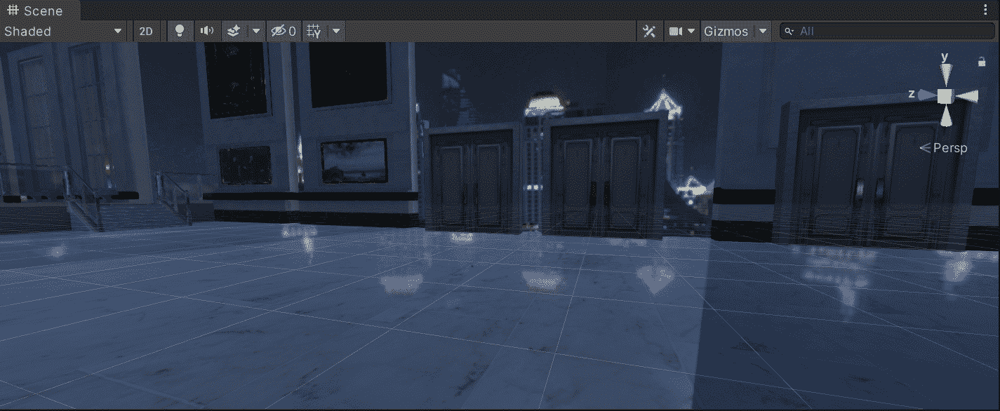

如果我们看一下检查器，我们会注意到反射探头的预览，它似乎捕捉到了视觉环境:

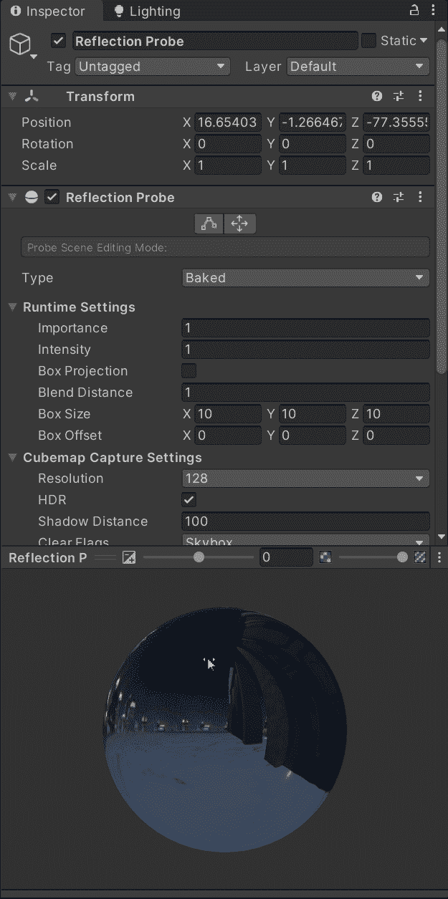

为了了解其工作原理，让我们将反射探头从静态游戏对象上移开:

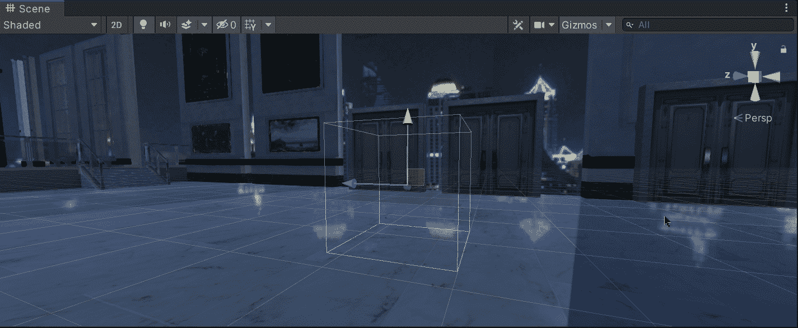

如果我们再次查看检查器，我们会注意到预览会根据反射探头的位置相应地发生变化:

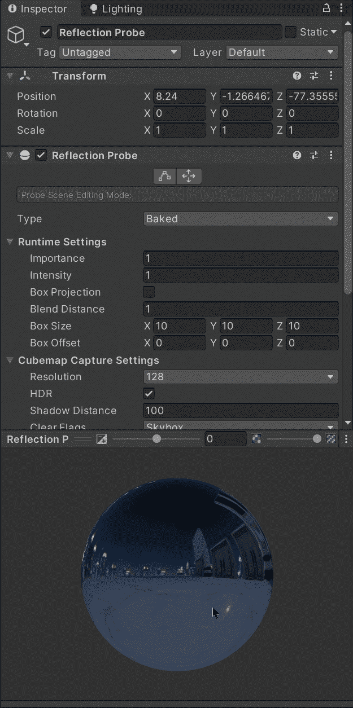

这种预览是由反射探头(在黄色立方体的中心)生成的，反射探头的作用就像一台摄像机，可以捕捉周围环境的视觉表现。这种视觉表示存储在立方体贴图中，具有反射属性的对象(如地板)可以使用它来显示它。

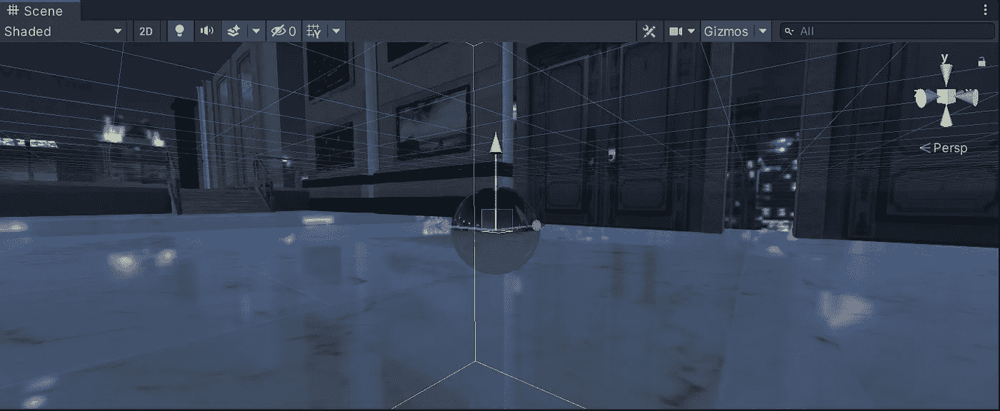

如果您想了解更多关于反射探头的信息，您可以查看 Unity 文档:

 [## 反射探针

### 你如何在整个工作流程中使用文档？请参加本次调查，与我们分享您的体验。切换到…

docs.unity3d.com](https://docs.unity3d.com/2021.1/Documentation/Manual/class-ReflectionProbe.html) 

接下来，我们可以修改反射探测盒的包围体。该效果框或区域决定了哪些对象受反射探测效果的影响。因此，如果一个物体穿过该区域，它将获得反射探头的反射立方体贴图。

要编辑包围体，我们可以单击检查器中的“下一步”按钮:

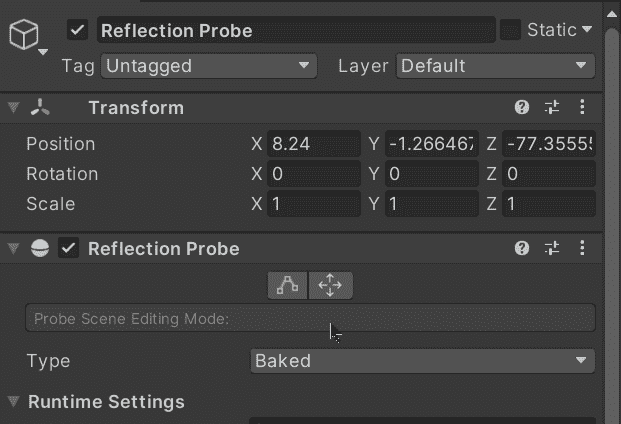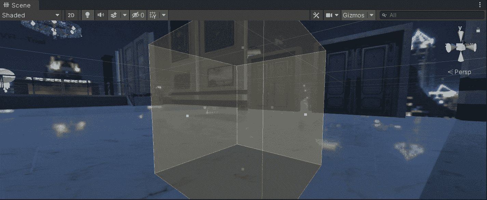

## 结果

在接下来的图像中，我们将能够看到反射探头在地板表面上工作的效果:

启用反射探头的地板。

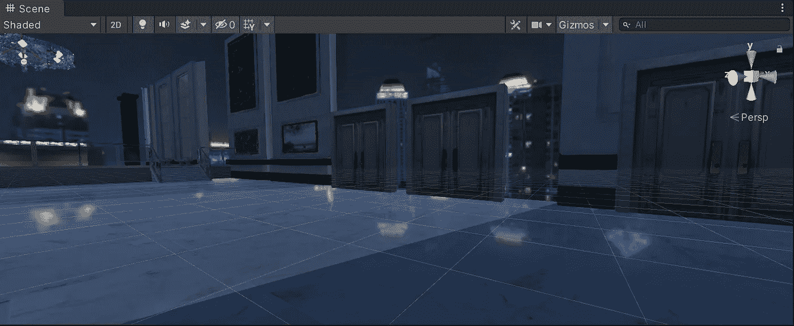

禁用反射探头的地板。

# 屏幕空间反射

其次，我们有屏幕空间反射，这是一种后期处理效果，可以创建微妙而真实的反射，模拟潮湿的地板表面或水坑。

如果你不知道如何启用这种后期处理效果，你可以查看我以前关于后期处理的帖子:

 [## 开始在 Unity 中使用后处理

### 关于如何开始在 Unity 中使用后处理的快速指南

medium.com](/nerd-for-tech/start-using-post-processing-in-unity-9b081da8f6a7)  [## 通过 Unity 的后期处理让你的游戏达到 AAA 级

### 一个关于 Unity 中后期处理效果的指南，让你的游戏达到 AAA 级

medium.com](/nerd-for-tech/bringing-your-game-to-a-aaa-status-through-post-processing-in-unity-276073f5827d) 

让我们在场景的摄像机中启用这种后处理效果:

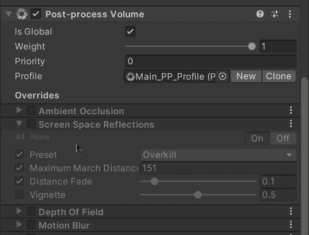

如果我们看一下应用了效果的场景，我们会注意到地板反射静态游戏对象的精度比反射探头高得多:

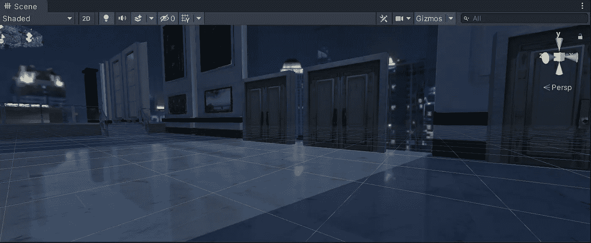

启用屏幕空间反射效果的地板。

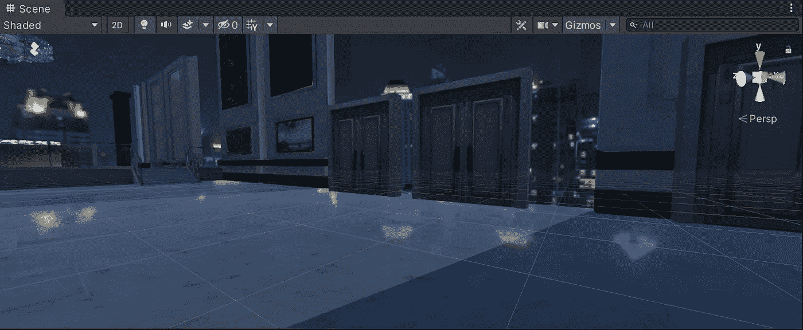

禁用屏幕空间反射效果的地板。

# 两者的区别

反射探针和屏幕空间反射效果之间的主要区别取决于我们在 Unity 中的游戏性能:

*   反射探测器通常用于移动游戏，而不是控制台或 PC 游戏，通过减少处理来进行反射，从而提高性能。
*   屏幕空间反射通常用于控制台和 PC(如果买得起的话),因为它意味着昂贵的性能成本。

如果我们看一下下面的 gif，我们会注意到，当相机离开反射探针效果区域时，效果从地板上消失了。虽然屏幕空间反射，但地板中的效果不会消失:

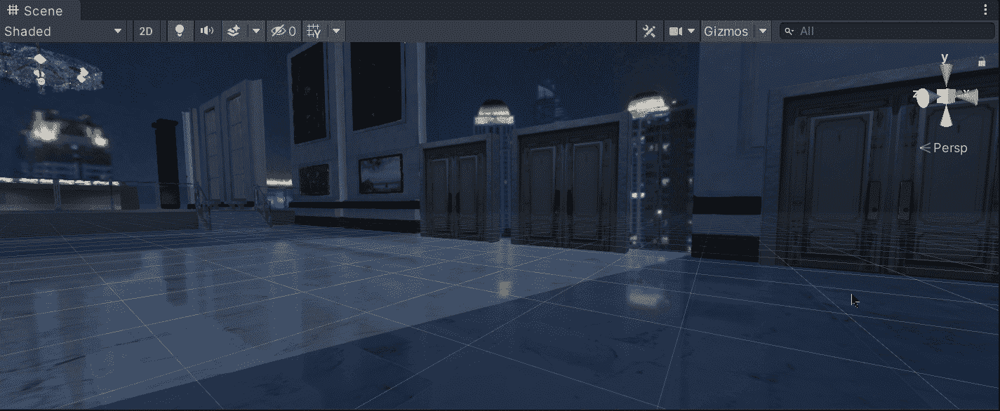

移动相机时的屏幕空间反射效果。

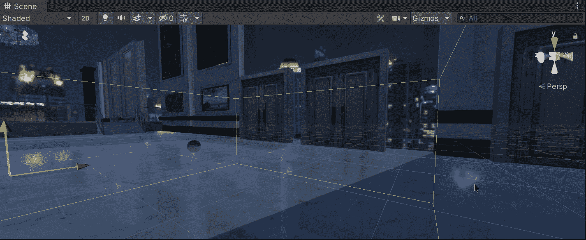

移动相机时的反射探针效果。

如果您想了解更多关于反射探头和屏幕空间反射的信息，您可以访问 Unity 文档:

 [## 反射探针

### 你如何在整个工作流程中使用文档？请参加本次调查，与我们分享您的体验。CG 电影…

docs.unity3d.com](https://docs.unity3d.com/2021.1/Documentation/Manual/ReflectionProbes.html)  [## 屏幕空间反射

### 屏幕空间反射效果创建模拟潮湿地板表面或水坑的细微反射。它反映了…

docs.unity3d.com](https://docs.unity3d.com/Packages/com.unity.postprocessing@3.1/manual/Screen-Space-Reflections.html) 

就这样，我们回顾了在 Unity 中使用反射探头和屏幕空间反射的区别！:d .我会在下一篇文章中看到你，我将展示在 Unity 中使用时间轴的介绍。

> *如果你想更多地了解我，欢迎登陆*[***LinkedIn***](https://www.linkedin.com/in/fas444/)**或访问我的* [***网站***](http://fernandoalcasan.com/) *:D**