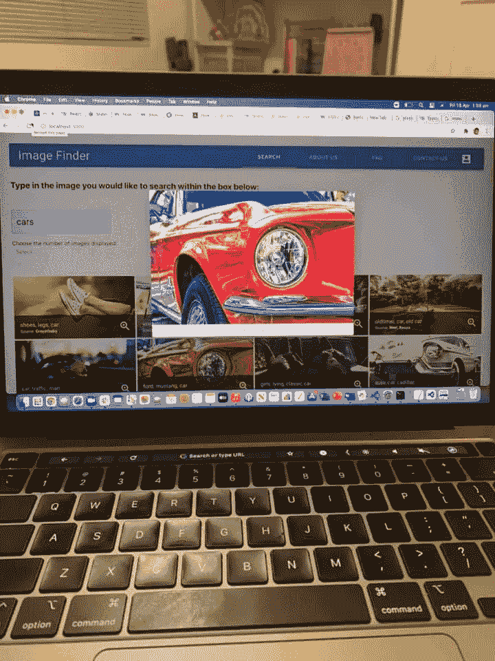

# 反思:我的第一个 React JS 项目

> 原文：<https://medium.com/nerd-for-tech/reflections-my-first-react-js-project-bf0b4e3794ea?source=collection_archive---------13----------------------->

> 我使用 React JS 的第一个项目明显比我使用 HTML/CSS 和基本 Javascript 完成的上一个天气应用项目更具挑战性。它要求在学习 React JS 库的同时，对 HTML/CSS 和 Javascript 有很强的理解，以便构建用户界面组件。

该项目的目标是:

1.  从头开始构建 React 单页面应用程序
2.  应用您的组件、道具和状态管理知识
3.  合并客户端路由
4.  使用来自外部 API 的数据
5.  将数据保存在模拟后端中

React JS 由脸书开发，是一项需要学习的重要用户界面技术，因为它允许开发人员快速构建高性能和丰富的用户界面，拥有强大的社区支持，是当今全球就业市场的热点和趋势。

> 我决定构建的 web 应用程序是一个图像查找器，它使用第三方 API 来查找免费的库存图像。我对这个项目的长期是集成一个用户用户库管理器，照片编辑器和绘图工具。我选择使用的第三方 API 是 [Pixabay 的 API](https://pixabay.com/service/about/api/) 。我选择这个开发者 API 的关键原因是因为它的可靠性、可信度和大型图像库(223 万个视频和图像)。

我选择 [Material-UI](https://material-ui.com/) 作为造型的用户界面框架，因为它基于 Google Material Design，拥有出色的文档和社区支持，并被许多大公司使用，包括亚马逊、美国宇航局、网飞和 Spotify。Material-UI 是比 Bootstrap 更好的选择，因为我对创建一个独特风格的网站很感兴趣。Bootstrap 风格的网站通常不太独特，但是有很高的一致性，因此对用户更友好。

通过完成这个项目，我巩固了新学到的 React JS 知识。我用钩子利用了类组件和功能组件。我为我的单页面应用程序(SPA)使用了客户端 React 路由。

我使用 Fetch API 从第三方 Pixabay API 获取数据，并使用 JSON 服务器将数据从我的一些 web 应用程序的表单发送到模拟后端 RESTful API。

[React Select](https://react-select.com/home) 库用于为我的应用程序快速构建选择输入控件组件。

此外，我的 HTML 和 CSS 技能通过应用盒子模型概念和利用 CSS 代码来修改一些 web 应用程序的样式。

考虑到这个项目使用了许多移动部件和外部库，在遇到一些重大的调试问题后，我学会了采用一种规范和系统的方法来编码。这里的一个关键教训是不要依赖于 [Visual Studio 代码](https://code.visualstudio.com/)在程序运行之前自动识别 bug(静态检查)。最佳实践(参考[麻省理工学院关于软件构造的文章](http://web.mit.edu/6.005/www/fa15/classes/01-static-checking/#static_checking_dynamic_checking_no_checking))是在每写完一行代码后运行代码并检查错误，而不是在执行代码前的几行后就离开(动态检查)。

此外，用 Material UI 和 React 制作一个响应式页眉是一项非常具有挑战性的任务，重构了我在网上找到的一个[教程](https://betterprogramming.pub/making-a-basic-header-responsive-with-materialui-and-react-2198fac923c8)中的代码。在开始重构任务之前，对你的代码和教程的代码有一个深刻的理解是很重要的。同样，调试过程需要有纪律和系统性。