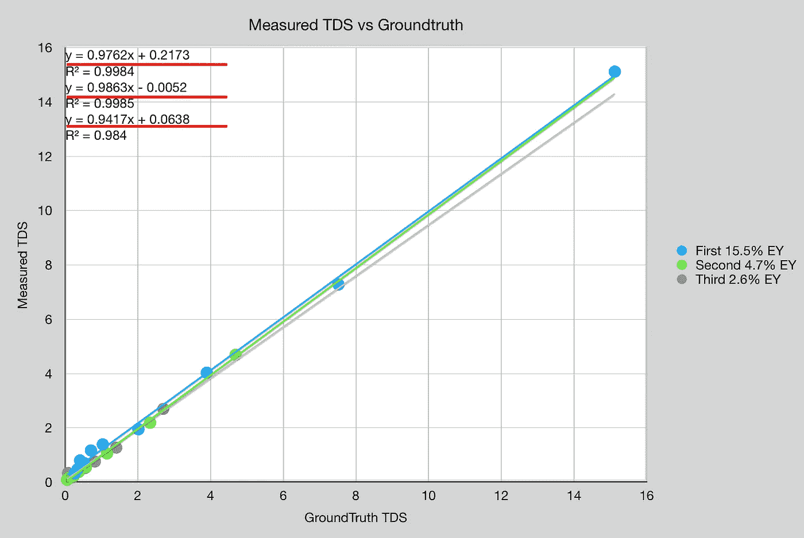
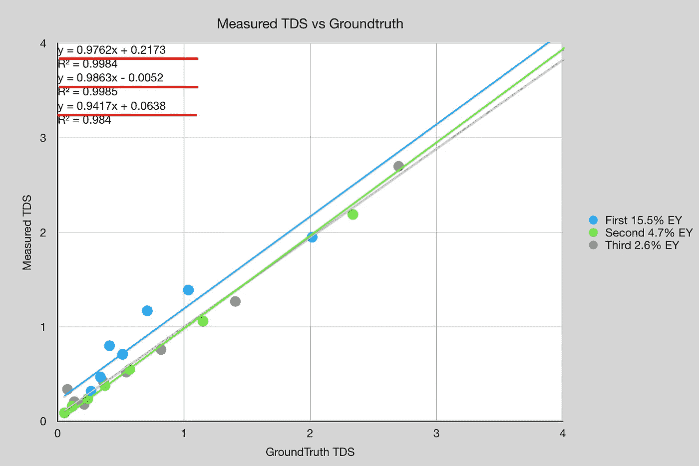
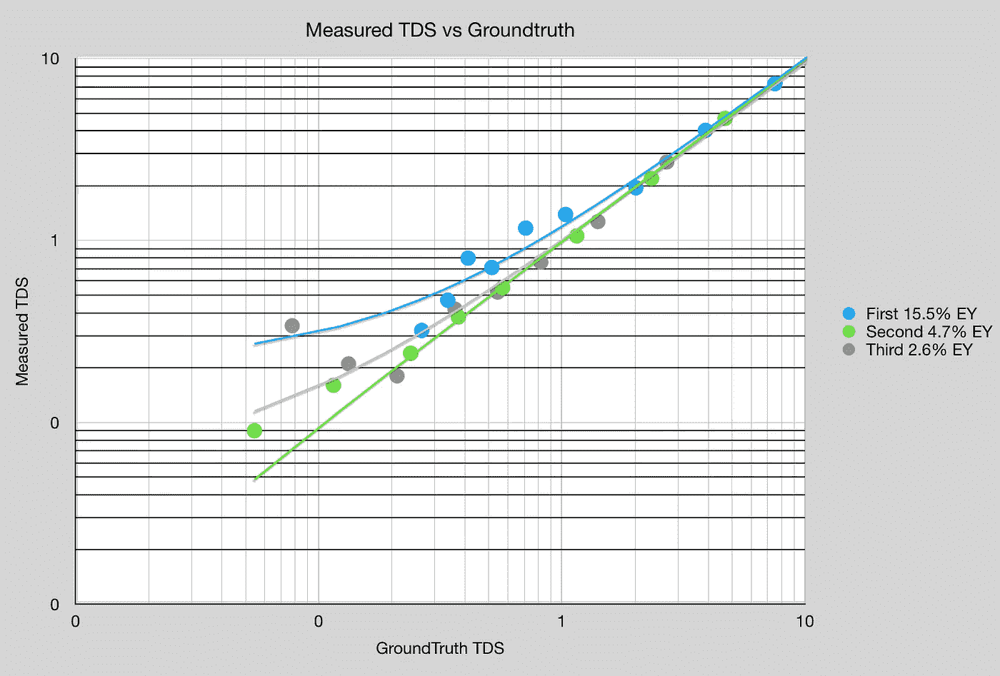
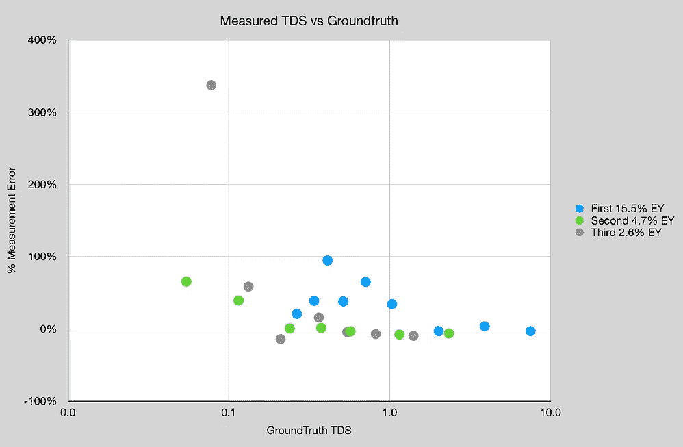
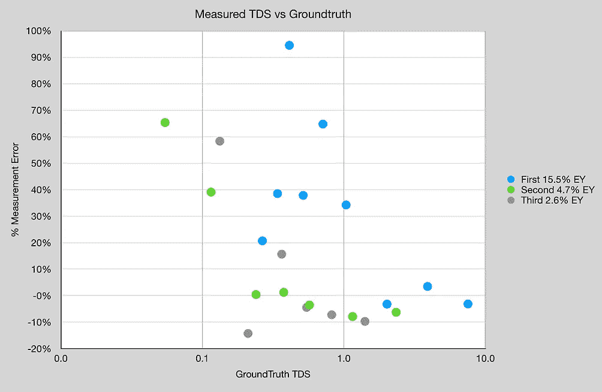

# 咖啡和浓缩咖啡的折光仪精确度

> 原文：<https://medium.com/nerd-for-tech/refractometer-accuracy-for-coffee-and-espresso-ab72bc6d9b0d?source=collection_archive---------1----------------------->

## 咖啡数据科学

## 测量中的探索

[之前的实验](https://rmckeon.medium.com/measuring-refractometer-accuracy-to-groundtruth-for-coffee-421929644587)已经显示了大约 1%总溶解固体(TDS)的有趣结果，所以我想测试更多。我想知道浓缩咖啡的不同部分读起来有什么不同，所以我拿了一杯意大利香肠开始测试。

所有图片由作者提供

我最初的问题是:如果我稀释第一个镜头与第二个镜头 1:1 的样本，它们在 TDS 读数中有相似的趋势吗？这给了什么引起折射变化一些指示。

对于每个样品，我添加了已知量的水，因此根据最初的 TDS 读数，它应该成比例缩放。地面真相是基于第一个样本。测试前，将原始样品置于室温下。

趋势线几乎成比例，但让我们放大。

我们在这里可以看到，镜头的第一部分在稀释 vs 镜头的第二和第三部分时有很多变化。我们可以看到，在绘制双对数图时，这一点更加明显:

如果我们来看一下测量误差，百分比误差在 TDS 为 1 左右大幅增加。

我怀疑镜头的第一部分可能会有问题，因为油，但我不确定。这个测试将会有趣地重复使用过滤器，并与其他咖啡进行比较。这个结果让我质疑当 TDS 小于 1 时，咖啡的总体准确度。需要更多的数据，这是一个很好的提醒，我们越了解我们的仪器，我们就可以更好地利用它来做出改善咖啡的好决定。

如果你愿意，可以在[推特](https://mobile.twitter.com/espressofun?source=post_page---------------------------)、 [YouTube](https://m.youtube.com/channel/UClgcmAtBMTmVVGANjtntXTw?source=post_page---------------------------) 和 [Instagram](https://www.instagram.com/espressofun/) 上关注我，我会在那里发布不同机器上的浓缩咖啡照片和浓缩咖啡相关的视频。你也可以在 [LinkedIn](https://www.linkedin.com/in/dr-robert-mckeon-aloe-01581595) 上找到我。也可以在[媒](https://towardsdatascience.com/@rmckeon/follow)和[订阅](https://rmckeon.medium.com/subscribe)关注我。

# [我的进一步阅读](https://rmckeon.medium.com/story-collection-splash-page-e15025710347):

[我未来的书](https://www.kickstarter.com/projects/espressofun/engineering-better-espresso-data-driven-coffee)

[我的链接](https://rmckeon.medium.com/my-links-5de9eb69c26b?source=your_stories_page----------------------------------------)

[浓缩咖啡系列文章](https://rmckeon.medium.com/a-collection-of-espresso-articles-de8a3abf9917?postPublishedType=repub)

工作和学校故事集