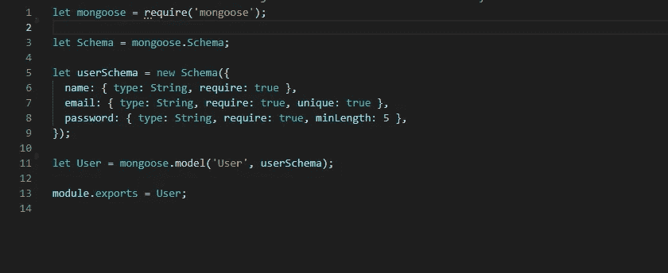
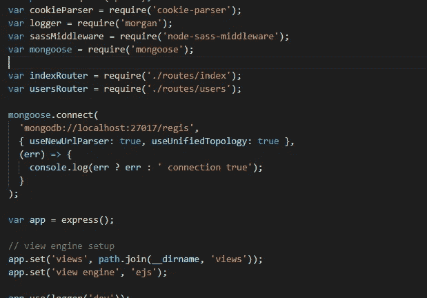
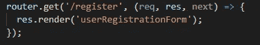
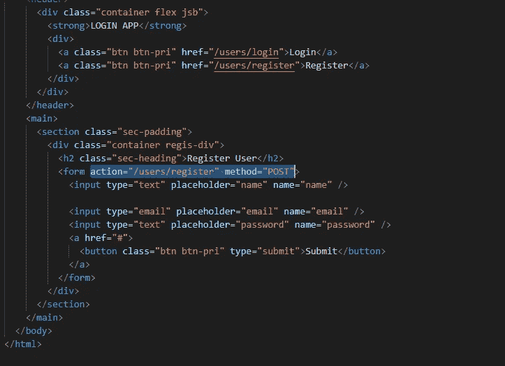
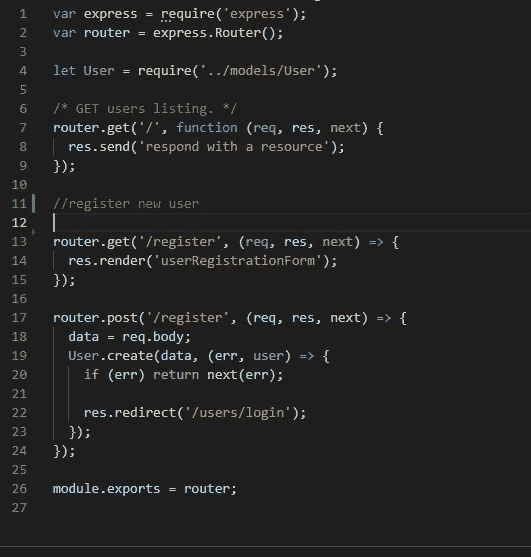
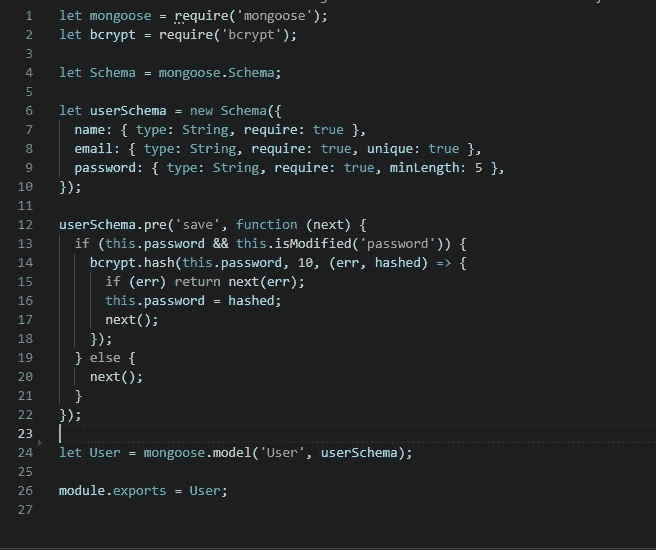
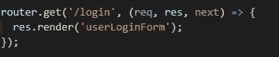
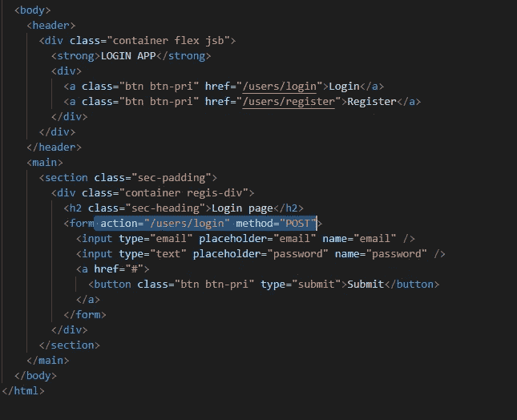
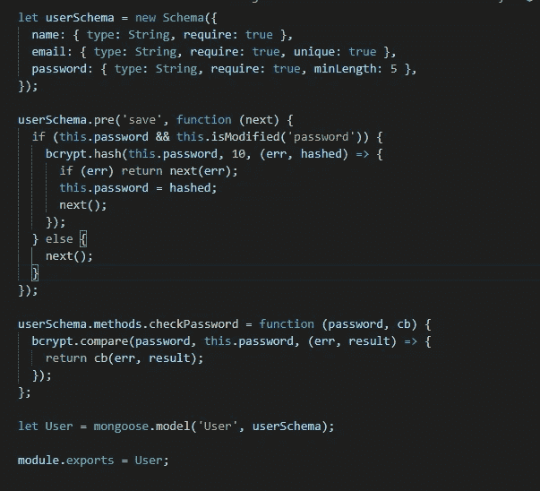
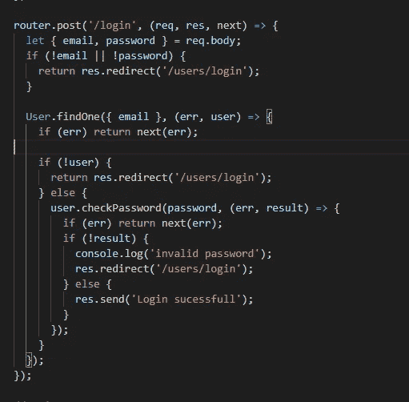

# 使用 MongoDB 在 expressJS 中存储数据的注册/登录

> 原文：<https://medium.com/nerd-for-tech/registration-login-using-the-mongodb-to-store-data-in-expressjs-dba79c8886f2?source=collection_archive---------5----------------------->


# ********第 1 部分:-处理注册部分。*******

# 第一步:-

*   首先，在系统中全局安装 express-generator 和 nodemon 包。

```
npm i --global express-generatornpm i --global nodemon
```

> " **Express-generator** ":-这将帮助您设置基本服务器
> 
> " **nodemon** ":-这将在您保存更改后自动重启您的服务器。

*   现在，我们可以通过键入以下命令来设置一个基本的 express 服务器

```
express --view=ejs --css=sass <ProjName>
```

*   现在，为了创建在 MongoDB 中存储数据的模型，我们必须安装“**mongose**”包。

```
npm i mongoose --save
```

# 第二步:-

*   现在，我们必须创建一个用户模型来在 MongoDB 中存储数据。我们必须在根目录下创建一个名为“ **models** 的新文件夹。完成后，我们必须在文件夹/root/models/中创建一个新的“ **User.js** ”文件。
*   我们可以根据我们的需要设置我们的模型，更多细节请参考图片。



为用户数据创建模型。

# 第三步:-

*   现在，我们必须将 MongoDB 数据库连接到我们的服务器。因此，首先将 mongoose 导入 app.js 文件，在初始化变量 app 之前，编写以下代码。

```
mongoose.connect('mongodb://localhost:27017/regis',{ useNewUrlParser: true, useUnifiedTopology: true },(err) => {console.log(err ? err : ' connection true');});
```

*   它看起来像这样:-



数据库连接

# 第四步:-

*   现在我们必须添加登录和注册链接到我们的索引页面(root/views/index.ejs)。这将帮助用户导航到相应的页面。

```
<a class="btn btn-pri" href="/users/login">Login</a><a class="btn btn-pri" href="/users/register">Register</a>
```

*   登录按钮的 href 属性的值必须是“**/用户/登录**”。
*   同样，对于注册按钮 href= "/users/register "。


向索引页添加链接。

# 第五步:-

*   现在，我们必须处理文件夹“ **/root/routes** 中的 **users.js** 文件中“/users”的路由。
*   索引页面上的 Register 按钮将在 **/users/register** 路径上执行 **GET** 请求。
*   因此，为了处理在 **/users/register** 路线上的 **GET** 请求，我们可以将响应作为***user registration form . ejs***文件发送到浏览器。该填充将包含一个 From，它具有**action = "/users/register " method = " POST "**

> 提示:-所有的 ejs 文件都必须放在**视图**文件夹中，即(**root/views/user registration form . ejs**)。



正在处理路由上的 get 请求。

*   ***user registration form . ejs***文件将如下所示。



userRegisterForm.ejs 文件

# 第六步:-

*   一旦我们填写并提交表单，它将在 route " **/users/register** "上执行 **POST** 请求。
*   现在要将数据添加到数据库中，我们需要导入**用户模型**。所以放到了 **routes** 文件夹里面的 users.js 文件中。在顶部，我们需要一个用户模型。

```
let User = require('../models/User');
```

*   现在我们可以在" **req.body"** 新变量**数据**中存储表单数据。
*   现在我们可以使用 mongoose 的 **User.create()** 方法将用户添加到数据库中。
*   一旦用户创建成功，我们可以重定向到“**/用户/登录**”路径。



处理文件“root/routes/users.js”中的注册请求

# 第七步:-

## ****加密(哈希)密码****

*   到目前为止，我们已经存储了用户输入的密码，因为它在数据库中。这使得我们的密码很容易被其他人获取。
*   这就是为什么我们需要加密密码，同时将它们存储在数据库中。
*   对于**散列**(加密)密码，我们需要将“ **bcrypt** ”包安装到我们的服务器中。

```
npm i bcrypt --save
```

*   现在，为了在注册新用户时加密密码，我们必须使用 mongoose 中间件( **hook** )，如 **pre(save)** 。
*   每次调用用户模式时，它首先执行预挂钩，然后再执行它的工作。
*   因此，为了加密密码，我们必须在 **pre(save)** hook 中使用 **bcrypt.hash()** 方法。
*   在这个钩子中，我们必须将“ **req.body** 中的密码改为散列密码。

> 提示:-我们必须在创建模型之前编写 pre(save)钩子。



使用 bcrypt 包散列密码。

# ********第 2 部分:处理登录部分。*********

# **第一步:-**

*   在 **index.ejs** 页面上的**登录**按钮将执行**获取路由**/用户/登录**上的**请求。
*   为了处理在" **/users/login** " route 上的这个 **GET** 请求，我们只需在响应中呈现" **userLoginForm.ejs** "页面。



rendring userLoginForm.ejs 文件。

# 第二步:-

*   “userLoginForm.ejs”文件必须包含一个带有字段**电子邮件**和**密码**的简单登录表单。
*   这个表单必须有属性(*action = "/users/log in " method = " POST "*)
*   “userLoginForm.ejs”文件将如下所示。



“用户登录信息来源. ejs”文件

# 第三步:-

*   现在要处理 route " **/users/login** "上的 **POST** 请求，我们必须首先从 **req.body** 中的 formData 提取电子邮件和密码。
*   在以下 3 个条件下，服务器必须重定向回“/用户/登录”。

1.  ***邮箱和密码为空时。***
2.  ***当邮箱与数据库中的用户不匹配时。***
3.  ***当密码与数据库中现有密码不匹配时。***

*   这里我们要使用 mongoose 的 **User.findOne()** 方法在数据库中查找用户。
*   写出上面提到的各个案例来处理错误。

# **第四步:-**

*   请记住，我们已经将哈希(加密)密码存储到数据库中，但我们现在有普通密码来匹配哈希。
*   这个问题可以通过使用 **bcrypt** 包的“**bcrypt . compare()”**方法来解决。
*   但是首先，我们必须在用户模型中编写方法来检查密码是否匹配。我们可以通过在模型中使用

```
userSchema.methods.name=function(){};
```



添加 checkpassword 方法。

# 第五步:-

*   现在，在处理路由的 **users.js** 文件中，我们可以使用这个 **checkPassword()** 方法来检查密码是否匹配。
*   最后，路由处理程序必须如下所示



在“/用户/登录”上发布请求

*   如果电子邮件和密码匹配，将返回“登录成功”消息作为响应，否则将再次重定向到登录页面。