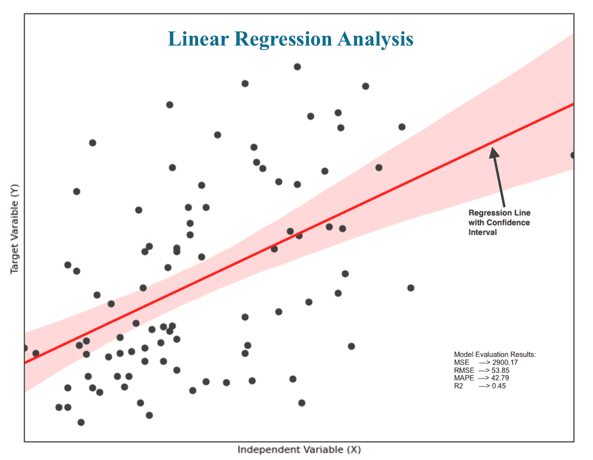
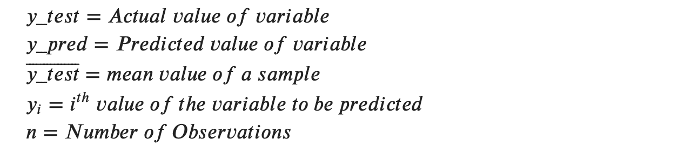
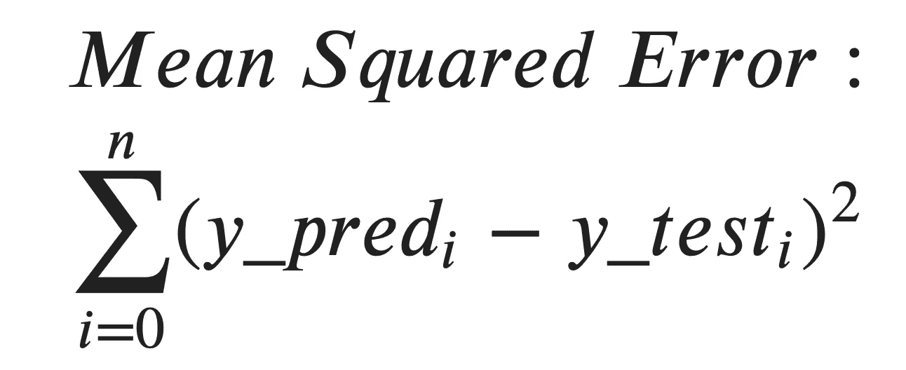
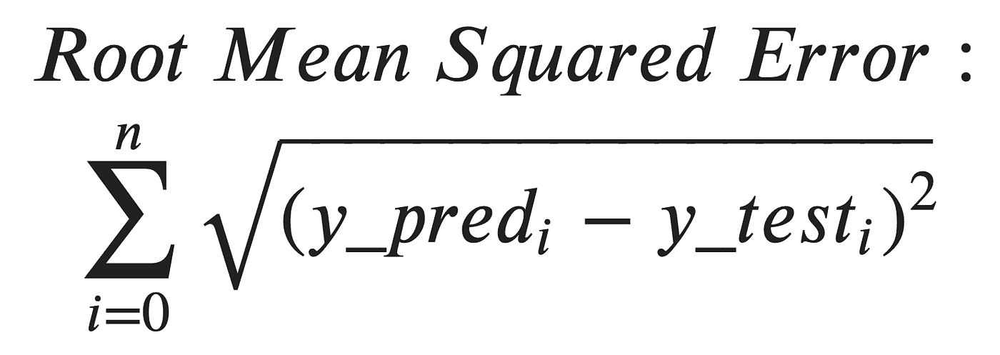
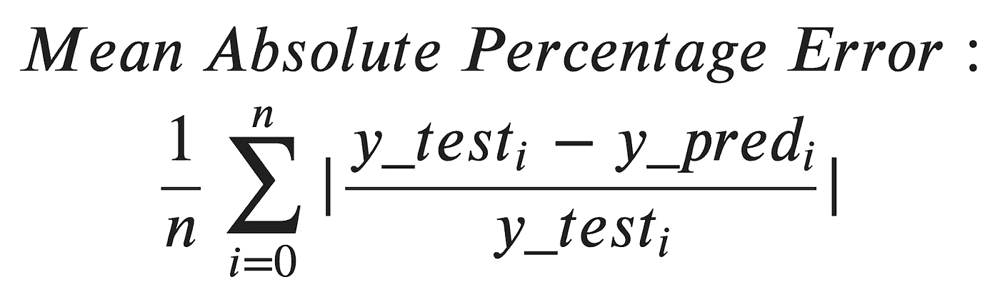
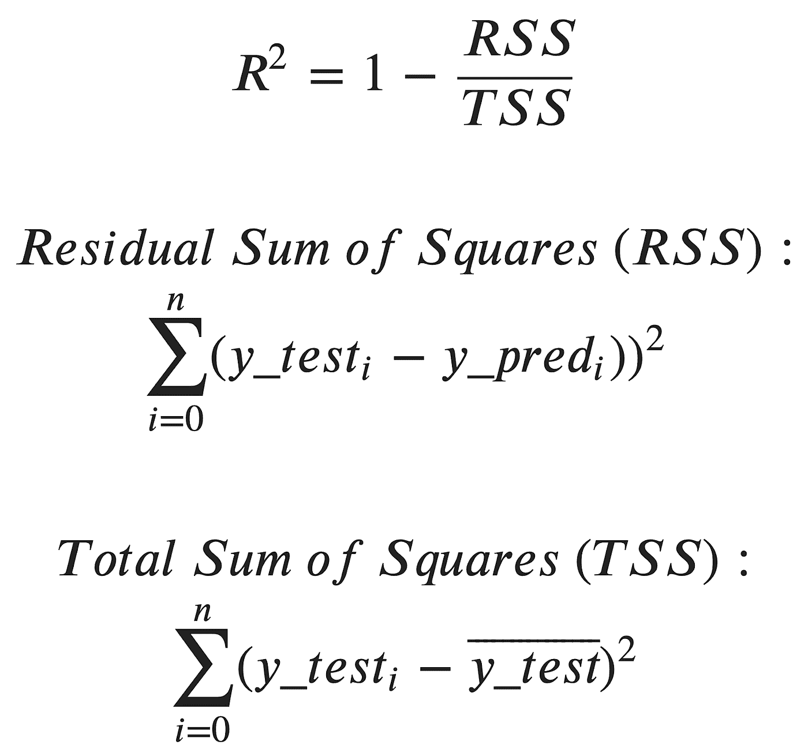
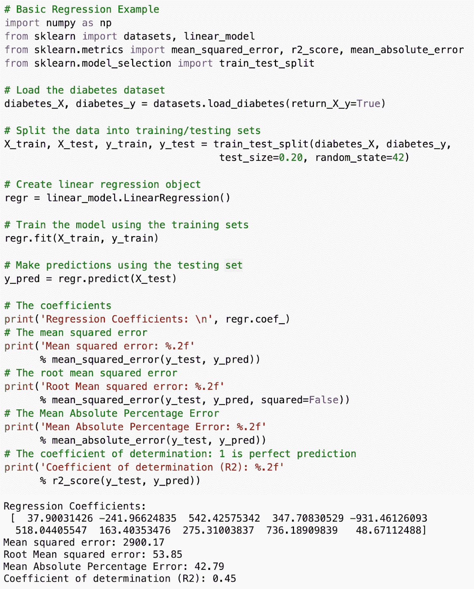
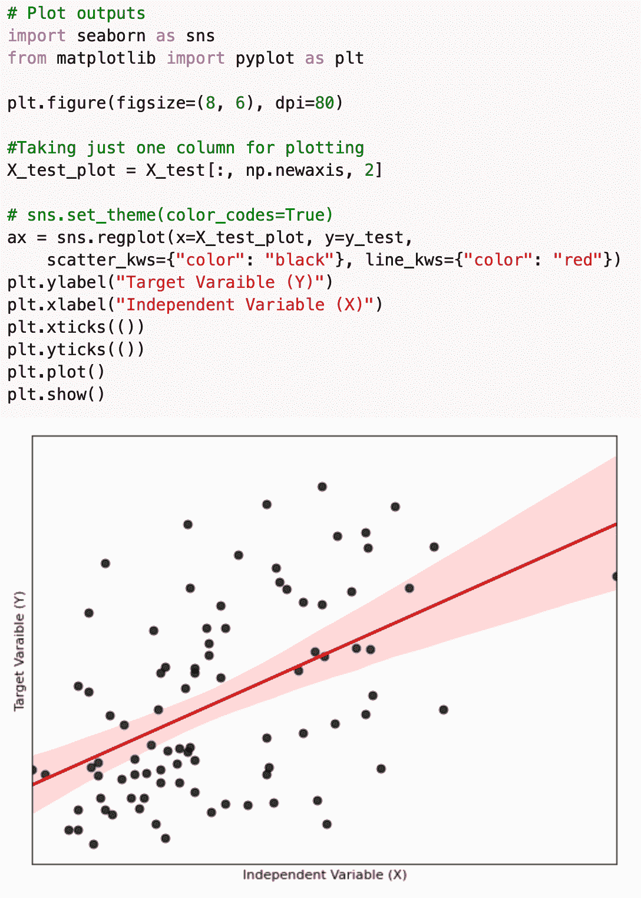

# 回归性能评估方法

> 原文：<https://medium.com/nerd-for-tech/regression-performance-evaluation-methods-9a6368a7f518?source=collection_archive---------17----------------------->

# 介绍

每当我们构建任何模型时，总会有一个如何评估模型性能的困境。特别是如果它回归模型，因为有许多评估方法可用，每一个都有自己的利弊。在我们深入研究这些方法之前，让我们用更简单的术语来理解什么是线性回归。

# 什么是线性回归？

线性回归是一种计算两个变量之间关系的方法。顾名思义，假设两个变量是线性相关的。用简单的语言来理解，考虑一下人类的身高体重。一般来说，在年龄、性别等其他因素不变的情况下，身高和体重是线性相关的。例如，以年龄在 30 岁左右的任何 10 名男性运动员的身高和体重为例。你会发现高个子运动员体重高，而矮个子运动员体重轻。

# 如何评价回归模型性能？

当我们理解什么是线性回归时，让我们深入研究一下如何评估回归模型的性能。

# 均方差

# RMSE(均方根误差)

# MAPE(平均绝对百分比误差)

# r 平方

r 平方值始终介于 0 和 1 之间，即 0 表示最差，1 表示最好。

R2 的问题是，它不惩罚额外的参数，使用额外的参数，它总是增加或保持不变。所以**调整后的 R2** 就是这个问题的解决方案。

# 密码

# 结论

因此，无论何时构建回归模型，您都可以使用上述任何方法来验证您的模型。我更喜欢用 RMSE 和 R2 来验证回归模型。