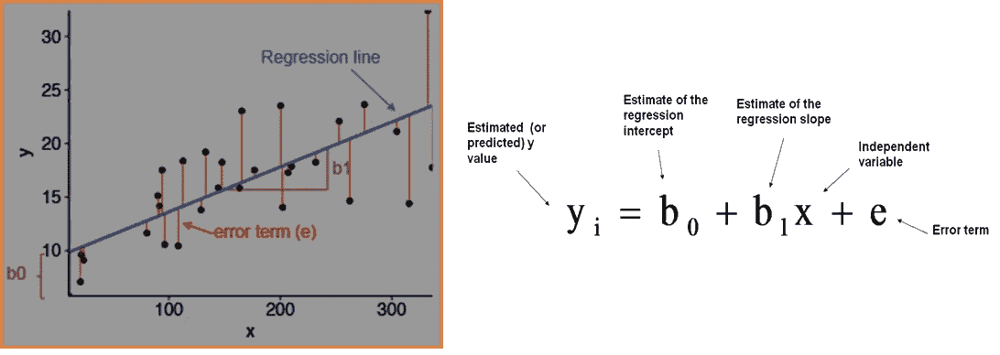
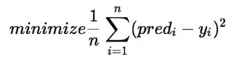
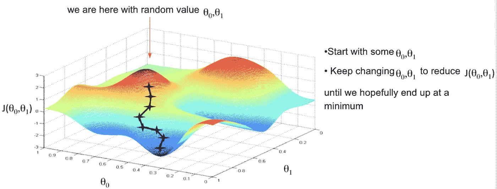

# 常规剂量的机器学习

> 原文：<https://medium.com/nerd-for-tech/regular-dose-of-machine-learning-2cdae2b99e46?source=collection_archive---------28----------------------->

## **第二章**

上次在[第 1 章](https://adityak2804.medium.com/regular-dose-of-machine-learning-f19d46bab0c9)中，我们讨论了什么是机器学习，它有哪些类型，如果你还没有读过，我建议你去看看之前的文章。好的，今天我们继续讨论一些概念。

我们开始吧。

所以在开始之前，我想先介绍一下什么是**机器学习模型**。机器学习模型是用数据集训练的文件或程序，因此它可以找出给定数据之间的某种模式或关系。在模型被训练之后，它被输入一些它不知道的数据，然后模型被期望根据它在训练时观察到的逻辑或模式提供输出。

例如，假设您想要一个识别水果的应用程序。因此，您将使用一个巨大的带标签数据集(已经为训练模型标记/贴标签的样本集合)来训练您的模型，然后您可以在可以识别任何水果的应用程序中使用该模型。

# **线性回归**

所以，线性回归的定义如下:

> “线性回归是一种**线性模型**，例如，假设输入变量 **(x)** 和单个输出变量 **(y)** 之间存在线性关系的模型。更具体地说， **(y)** 可以从输入变量 **(x)** 的线性组合中计算出来

在统计学中，线性回归是一种形成标量响应(因变量)和一个或多个解释变量(自变量)之间关系的线性方法。

数学上它可以表示为 E[Y] = β₀+ β₁X

一个解释变量的情况也称为简单线性回归，当有**多个输入变量**时，统计文献通常将该方法称为多元线性回归。

有人一定会问为什么要用线性回归回答是因为它容易表示。在线性回归中，使用线性预测函数对关系进行建模，该线性预测函数的未知模型参数根据数据进行估计。这种类型的模型被称为线性模型。

## 线性回归假设

线性回归模型可以由下面的等式表示

*   *Y* 是预测值
*   *θ* ₀是偏差项。
*   *θ* ₁,…， *θ* ₙ为模型参数
*   *x* ₁， *x* ₂,…， *x* ₙ为特征值。

上述假设也可以表示为

在哪里

*   *θ* 是模型的参数向量，包括偏差项 *θ* ₀
*   *x* 是 *x* ₀ =1 的特征向量

## **线性回归中的假设**

线性回归中有一些假设，如下所示:

*   **线性**:认为 ***X*** 与 ***Y*** 的均值之间的关系应该始终是线性的。
*   **同异方差**:在统计学中，同异方差意味着同质不变性。所以在线性回归中，我们认为残差的方差对于*的任意值都是相同的*
*   ***独立性:**认为没有观测是相关的，每个观测本身都是独立的。*
*   ***正态性:**对于 ***X*** 和 ***Y*** 的任何一个定值都是正态分布的。*

## *价值函数*

*该函数主要用于测量我们假设函数的准确性(在第 1 章的[中讨论)，因此我们可以得到一条最佳拟合线。因此，当我们最终使用我们的预测模型时，它将针对 *X* 的输入值预测 *Y* 的值。因此，更新θ₁和θ₂值非常重要，以达到使预测的 *Y* 值(predᵢ)和真实的 *Y* 值( *Y* ᵢ).)之间的误差最小的最佳值](https://adityak2804.medium.com/regular-dose-of-machine-learning-f19d46bab0c9)*

*数学上，*

****

*这个函数也被称为“平方误差函数”或“均方误差”。*

*平均值减半( )，以便于计算梯度下降，因为平方函数的导数项将抵消( )项。*

*所以我们的想法是选择θ₁和θ₂，使'predᵢ'的价值尽可能接近'Yᵢ'。*

# *先说“梯度下降”。*

## *什么是梯度？*

*“梯度是对我们稍微改变输入时输出变化多少的度量”——Lex frid man。简单地说，这是对输入改变时输出偏差的观察。*

***梯度下降**是一种寻找可微函数局部最小值的优化算法。梯度下降简单地用于找到尽可能最小化函数成本的函数参数(系数)的值。*

*数学上，*

**

*这里的' **α'** 称为学习率。因此，如果' **α'** 较大，则学习步长较大，反之亦然。*

*为了更新θ₁和θ₂值以降低成本函数(最小化 RMSE 值)并获得最佳拟合线，模型使用梯度下降。想法是从随机的θ₁和θ₂值开始，然后迭代地更新这些值，达到最小成本。*

**

*所以今天我们讨论了线性回归和一些更多的概念。我希望你们能和我一起享受学习新概念的乐趣。但是，如果你有任何疑问或困惑，请随时通过评论区联系我。如果你想让我在某些方面有所改进，请留下你宝贵的反馈。*

*谢谢，学习愉快！！！*