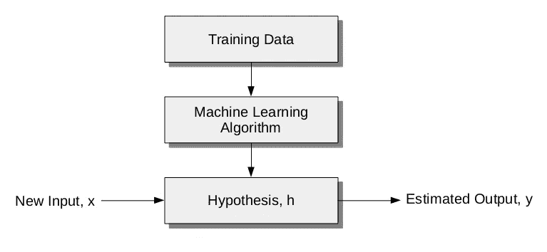
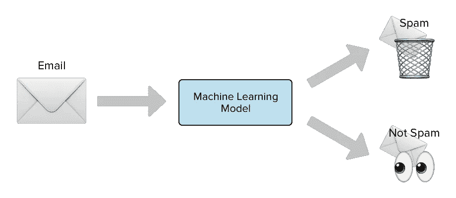
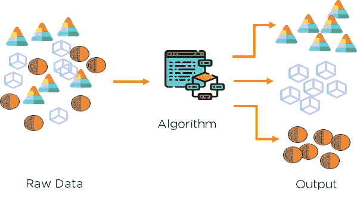
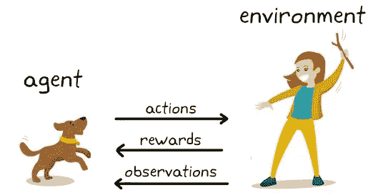

# 常规剂量的机器学习

> 原文：<https://medium.com/nerd-for-tech/regular-dose-of-machine-learning-f19d46bab0c9?source=collection_archive---------18----------------------->

## **第 1 章**

# **简介**

嘿，伙计们，感谢你们加入我学习机器学习(ML)的旅程。我是 Aditya Kumar，就像你一样，我也是计算机科学的新手，但不用担心，我们会一起学习的。

我是那种每天学习和准备笔记的人。所以我决定把所有的东西按章节汇编起来，每隔一段时间贴在这里，这样像我一样的每个人都可以参考。

所以我们开始吧！

# 什么是机器学习？

根据 Arthur Samuel (1959)的说法，机器学习是一个研究领域，它赋予计算机在没有显式编程的情况下进行学习的能力。但我认为这是一个相当笼统的说法。因此，为了从根本上解释最大似然，让我们参考 Tom Mitchell (1998)给出的一个解释，一个计算机程序据说从经验 **E** 中学习一些任务 **T** 和一些性能测量 **P** 。如果由 **P** 测量的其在 **T** 上的性能随着经验 **E** 而提高。

我建议你再看一两遍上面的内容，以清楚地了解 ML 的基本概念。还是很困惑，别急我们用一个例子来理解这个。

让我们考虑一个场景，其中机器学习模型需要将电子邮件分类为垃圾邮件或非垃圾邮件。

体验**E**——看着你给邮件贴上垃圾邮件或非垃圾邮件的标签。

任务 **T** —将电子邮件分类为垃圾邮件或非垃圾邮件。

性能 **P** —被正确分类为垃圾邮件或非垃圾邮件的电子邮件数量(或分数)。

# **先说机器学习算法的类型:**

广义上，机器学习算法分为三类:

1.  ***监督学习***
2.  ***无监督学习***
3.  ***强化学习***

我们将依次讨论每种类型。

# **监督学习**

根据维基百科，监督学习是基于输入和输出对的示例/集合来学习将输入映射到输出的函数的机器学习任务。

监督机器学习是最著名的机器学习形式。它非常容易理解和实现。给定一组带标签的数据(输入-输出对)，模型然后试图形成一个函数，该函数可用于自动预测给定输入的输出，而无需显式编程。类比来说，这就像我们小时候如何学习新的语言、概念等，并形成自己的逻辑/推理。

对于我们的机器模型，这种逻辑或推理是以函数的形式和约定来表示的，也称为**“假设函数”**。通常，监督学习被描述为一种**面向任务的算法**，因为它高度专注于单一任务。

这是我们最有可能遇到的学习类型，因为它在许多常见的应用程序中都有展示:

*   垃圾邮件分类
*   广告流行度
*   人脸识别

# 无监督学习

这种方法与之前的方法有很大的不同，它是一种算法，可以自己从未标记的数据中学习模式。想法是，通过模仿，一台机器被迫建立一个其空间的紧凑的内部表示。与监督学习不同，该算法提供了大量未标记的数据集，并提供了理解数据属性的工具。在此基础上，它可以学习根据属性对数据进行分组或聚类。

无监督学习之所以如此有趣和流行，是因为这个世界上的大多数数据都是未标记的，拥有一个智能算法来处理巨量的未标记数据，并从中找出意义，这无疑是许多行业潜在利润的巨大来源。

无监督学习正在蓬勃发展的一些领域是:

*   购买习惯分析
*   对用户日志进行分组
*   推荐系统(用于网飞、Spotify、Prime Videos 等)

# 强化学习

强化学习与监督学习和非监督学习有很大的不同。在上述场景中，我们可以很容易地在输入和输出状态之间建立联系，并在给定的数据集中找到关系，或者研究数据的特征并在此基础上对其进行分类。

但在强化学习中，一切都是为了在特定情况下找到合适的行动，以实现回报最大化。可以总结为这是一个从错误中学习的算法。

因此，只要我们向算法提供某种信号，将好的行为与积极的信号联系起来，将坏的行为与消极的信号联系起来，我们就可以加强我们的算法，使其更喜欢好的行为而不是坏的行为。随着时间的推移，算法学会犯更少的错误。

那么强化学习的范围是什么？我们在哪里使用它？

*   自动驾驶汽车的模型
*   视频游戏
*   工业模拟
*   资源管理

现在我们已经了解了三种不同类型的机器学习算法，重要的是要记住，很多时候我们往往会忘记它们之间的区别，我建议与基本概念保持一致。如果有任何疑问，我们讨论到目前为止，你可以随时联系我，我祝你一切顺利，学习愉快！！！