# 正则表达式备忘单

> 原文：<https://medium.com/nerd-for-tech/regular-expressions-cheat-sheet-ab86a1207735?source=collection_archive---------13----------------------->

正则表达式(或 Regex)是一种模式(或过滤器),它描述了一组与该模式匹配的字符串。

正则表达式用于搜索特定模式的字符串或验证用户输入的值，如验证用户输入的电子邮件地址。


意大利罗马圆形大剧场

# 为什么我们使用正则表达式？

根据给定字符串中存在的字符对该字符串执行某种操作。操作可以是验证字符串，也可以是更改字符串的某些部分。

# 正则表达式的类型:

## 1.字符类别:

字符类允许您匹配某个字符集中的任何符号。字符类也称为字符集。

**\d** 为数字(0–9)
**。**用于每个字符
**\w** 用于空格
**\t** 用于制表符

## 2.边界匹配:

检查边界条件，比如一个字符串是以给定的字符串开始还是以给定的字符串结束。

**^** 检查前缀边界条件
检查前缀边界条件 **$** 检查后缀边界条件

# 示例:

## 1.更改字符串中的某个字符

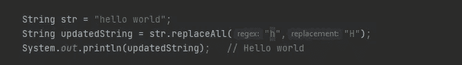

我们可以直接使用字符作为正则表达式，就像上面的例子一样，我们使用' **h** '作为正则表达式，将所有的' **h** '替换为大写的' **H** '。

注意:正则表达式区分大小写。

## 2.更改字符串的所有字符

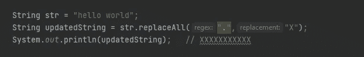

**。**代表字符串中的所有字符(大写、小写、数值、空格等)。所以这里我们用 X 改变了字符串中的所有字符

## 3.更改字符串的前几个字符。

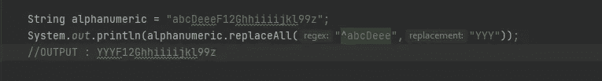

这里我们使用一个叫做胡萝卜的边界匹配器( **^** )。它检查字符串是否以“abcDeee”开头，然后将它替换为“YYY”。正如我们所看到的，正则表达式中的字符数不需要等于我们用来替换当前字符串的新字符串中的字符数。

## 4.检查字符串从某个子串开始

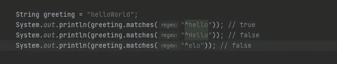

它返回一个布尔值，表示以给定的字符串值开始的字符串。

## 5.检查字符串以某个子字符串结束

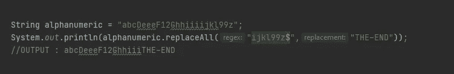

这里的 **$** 是一个字符类变量，用来检查字符串的结尾。

## 6.用新字符串替换字符串中的某些字符

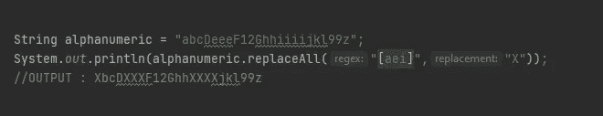

它会将所有的 **a、e 和 I 的**替换为“ **X** ”。这是一种 OR 操作符，如果它找到任何给定的字符，然后用给定的字符串替换它。

## 7.仅在某些字符后替换这些字符。

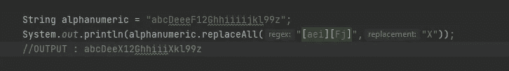

它将检查第一个方括号中的任何字符后面是否跟有第二个方括号中的任何字符，如果条件匹配，则用给定的字符串(**‘X’**)替换它。

## 8.使用方括号区分大小写

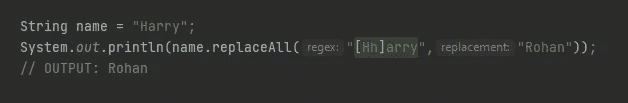

检查字符串是否以某个字符开头，不区分大小写。

## 9.替换除少数字符之外的所有字符。

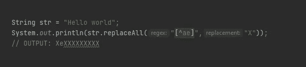

我们将使用方括号中的胡萝卜( **^** )来实现这一点，它也被称为 NOT 运算符。

## 10.替换某个范围内的字符

如果我们想用一个给定的数字替换顺序数字和字母，那么一种方法是

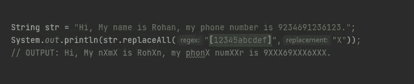

但是我们可以用一种更好的方式来写:

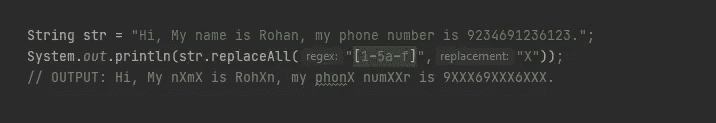

## 11.range regex 中区分大小写

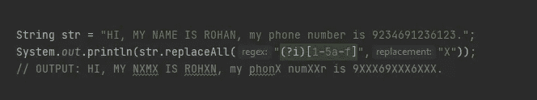

一种方法是如上所示使用**(?i)** 正则前。我们也可以用传统的方式**【a-fA-F1–6】**。

## 12.替换字符串中的所有数字

我们已经知道了一种方法(使用方括号范围值)，还有另一种方法，使用字符类变量 **(\\d)** 。

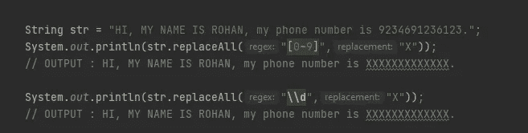

我们添加了一个额外的( **\** )来转义这个字符。

## 13.替换字符串中的所有非数字字符

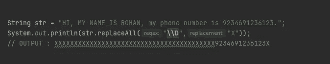

**(\\D)** 表示 **(\\d)** 的否定。所以它代表了除数字以外的所有字符。

## 14.替换字符串中的所有数字、字母和\

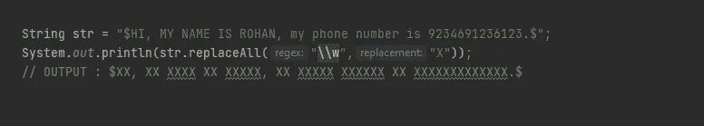

**(\\w)** 表示包括所有数字、字母和 _ 的字符。
**(\\W)** 代表所有剩余字符(特殊字符)。

还有许多其他字符类参数，请参考:

[**https://docs . Oracle . com/javase/8/docs/API/Java/util/regex/pattern . html**](https://docs.oracle.com/javase/8/docs/api/java/util/regex/Pattern.html)

# 数量词

它指定正则表达式中的元素出现的频率。

## 15.为具有重复字符的字符串写入正则表达式

如果我们的目标是一个有连续重复字符的字符串，那么我们可以纠正一次，并在花括号中添加该字符的出现。

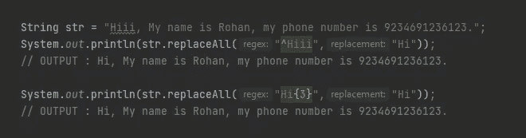

在上面的例子中，我们替换了一个有 3 个连续的 **i 的字符串(Hiii)。我们可以用如图所示的两种方法做到这一点。在这里，正则表达式没有太大的区别，但是当字符串大小增加时，第二个选项看起来更易读。**

## 16.为一个或多个字符添加条件

**+** '是一个匹配一个或多个操作符。它检查给定的字符是否至少出现过一次。

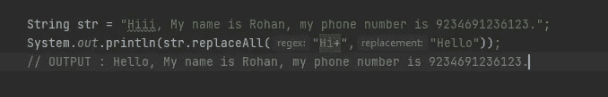

它将替换所有包含 1 个 **H** 和任意数量的 **i** 的字符串。

## 17.设置字符数限制

我们可以使用花括号来设置范围。

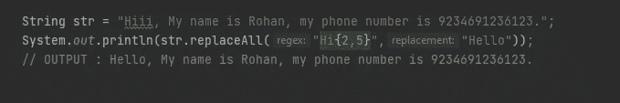

如上例所示，如果 **i 的数量**在 2–5(2，3，4，5)的范围内，那么只有它会更新字符串。

## 18.字符 0 或更多次出现

对于一个或多个，我们使用“+”量词。同样，我们可以使用**“*”**表示 0 或更多。它就像一个可选的操作符。

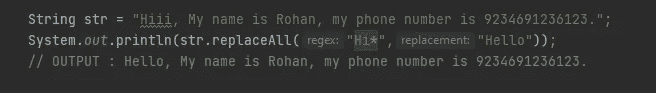

请参考 Pattern 类以了解更多关于量词的信息:

## [https://docs . Oracle . com/javase/8/docs/API/Java/util/regex/pattern . html](https://docs.oracle.com/javase/8/docs/api/java/util/regex/Pattern.html)

# 模式匹配

## 19.HTML 模式匹配

假设我们有一个很大的 HTML 代码，我们想要检查我们有多少个

## 标签，我们想要提取标签中的数据。

为此，我们需要学习**模式和匹配器**类。

如果我们想在下面的 HTML 代码中找到

## 标签的数量。

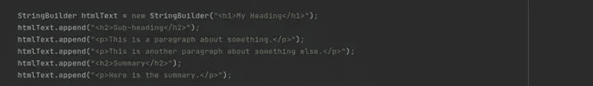

我们如何实现这一目标？

首先，我们需要检查给定代码中是否存在任何

## 标签。

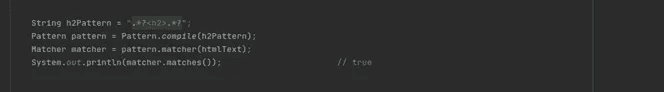

**注意**:我们只能使用 matcher 对象一次，因此要重用它，我们需要使用 **matcher.reset()** 方法重置 matcher 对象。因为我们已经使用它来检查是否存在任何< h2 >标签，所以我们需要在使用它来提取数据存在的索引之前重置它。

# 群体模式

## 20.我们可以使用一个组模式来提取出现在

## 标签中的数据。

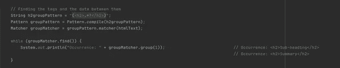

如果我们在这里看到我们也获得了带有数据的标签，为了省略标签而只获得数据，我们需要改变我们的分组模式。我们将创建多个组，而不是一个组，例如:

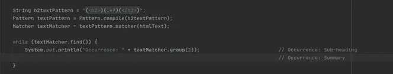

第二组指向

## 标签之间的数据。

# 练习的任务很少

## 任务 1:用一个

```
String str = “My name is maddy”;
```

## 任务 2:检查给定的字符串是否以“he”开头

```
String str = “Hello World”;
```

## 任务 3:检查给定的字符串是否以“ld”结尾

```
String str = “Hello World”;
```

## 任务 4:用“Hi”改变给定字符串的前 5 个字符

```
String str = “Hello World”;
```

## 任务 5:改变给定字符串中所有带 X 的元音

```
String str = “Hello World”;
```

## 任务 6:检查字符串是否正好包含 6 个数字

```
String str = "712632";
```

## 任务 7:检查给定的字符串是否不包含数字

```
String str = "Hello T0M";
```

## 任务 8:使用模式和匹配器类提取出现在

标签中的数据

```
StringBuilder htmlText = new StringBuilder("<h1>My Heading</h1>");
    htmlText.append("<h2>Sub-heading</h2>");
    htmlText.append("<p>This is a paragraph about something.</p>");
    htmlText.append("<p>This is another paragraph about something    
    else.</p>");
    htmlText.append("<h2>Summary</h2>");
    htmlText.append("<p>Here is the summary.</p>");
```