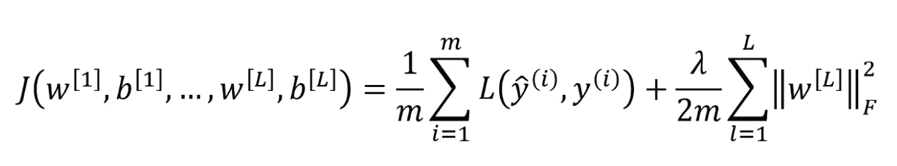

# 机器学习中的正则化

> 原文：<https://medium.com/nerd-for-tech/regularization-in-machine-learning-5e1adcacef6?source=collection_archive---------5----------------------->

在训练你的神经网络或任何机器学习模型时，主要关注的是避免过度拟合。如果过度拟合，模型将不够准确，因为它太努力地试图捕捉训练数据集中存在的噪声。噪声是数据点，并不真正代表数据的真实属性，而是随机的。学习这样的数据点会导致模型过度拟合的高风险。

避免**过拟合**的技术有很多种。其中之一是使用交叉验证，这有助于估计测试集的误差，并决定哪些参数最适合您的模型，这也称为超调。另一种技术是正则化，我们将在本文中讨论。

# 定义

**正则化**是一种通过在给定训练集上适当拟合函数来减少误差的方法，同时避免模型的过度拟合。

# 避免过度拟合的常用技术

1.  **L2 正规化—** 这是最常见的正规化形式。它对目标函数计算中所有参数的平方值进行惩罚。对于网络中的每个权重 *w* ，项 *(λw^2)/2* 被添加到目标中，其中λ是正则化强度。常见的是在前面看到 1/2 的因子，因为这一项相对于参数 *w* 的梯度仅仅是 *λw* 而不是 *2λw* 。它严重地惩罚了大的权重向量，而偏爱较小的权重向量。

正则化目标函数

在上面的等式中，L 是任何损失函数，F 表示 Frobenius 范数。

2. **L1 正则化—** 这是正则化的另一种常见形式，其中对于每个权重 *w，*项 *λ|w|* 被添加到目标中。同样，我们可以结合 L1 正则化和 L2 正则化: *λ1|w|+λ2w^2* 。具有 L1 正则化的神经元最终仅使用其最重要输入的稀疏子集，并且变得对“噪声”输入几乎不变。一般来说，L2 正则化可以预期比 L1 给出更好的性能。

3.**退出**——这是一种极其有效、简单且最近推出的正规化技术。它是通过仅保持神经元以某种概率 *p* 活动，或者在训练时将其设置为零来实现的。因为丢失层的输出是随机二次抽样的，所以在训练过程中会降低网络的容量。它可以在网络中的任何或所有隐藏层以及输入层上实现。它不能用于输出图层。

4.**数据扩充** —减少过度拟合的另一种方法是增加数据大小。在机器学习问题中，我们无法增加训练数据的大小，因为标记的数据太昂贵了。但是在图像的情况下，我们可以通过翻转、旋转、缩放或移动图像来增加数据集的大小，以创建新的样本。

5.**提前停止** —这是一种交叉验证策略，我们将训练集的一部分单独作为验证集。当我们看到验证集上的性能越来越差时，我们会立即停止对模型的训练。这就是所谓的提前停止。

# 结论

*   过度拟合发生在更复杂的神经网络模型中(即具有许多层或许多神经元的网络)
*   通过使用 L1 和 L2 正则化以及丢弃，可以降低神经网络的复杂度
*   L1 正则化迫使权重参数变为零
*   L2 正则化迫使权重参数趋向于零(但从不精确为零)
*   较小的权重参数使得一些神经元的贡献可以忽略不计→神经网络变得不太复杂→较少过拟合
*   在丢失期间，一些神经元以随机概率 p 被去激活→神经网络变得不那么复杂→更少的过拟合