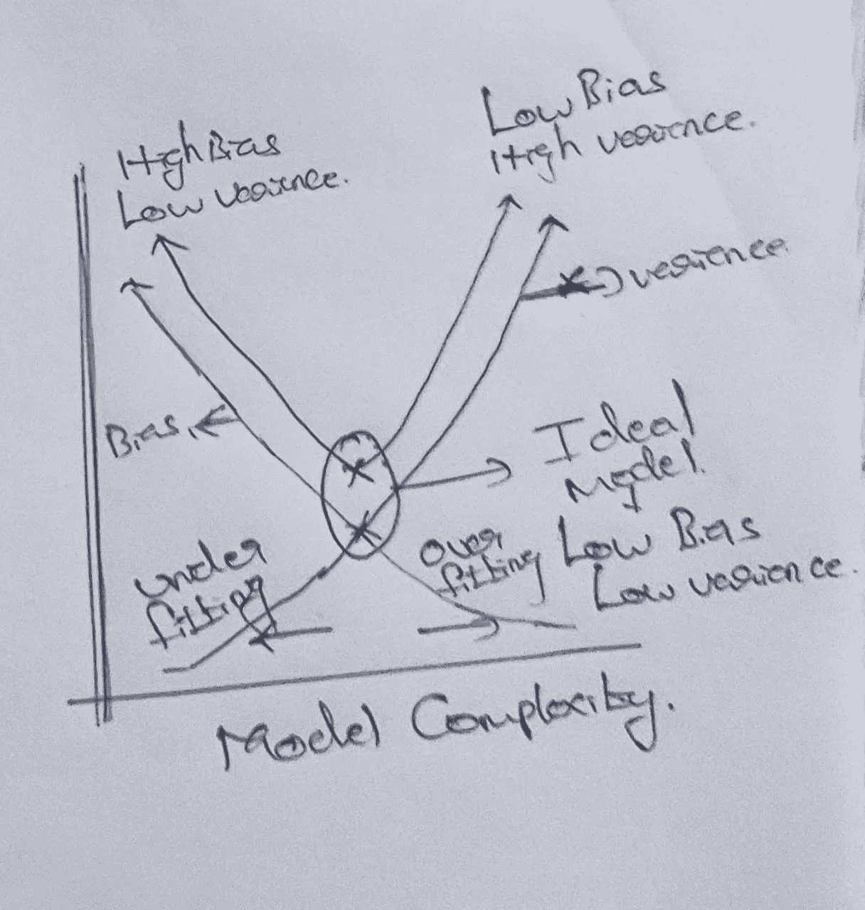
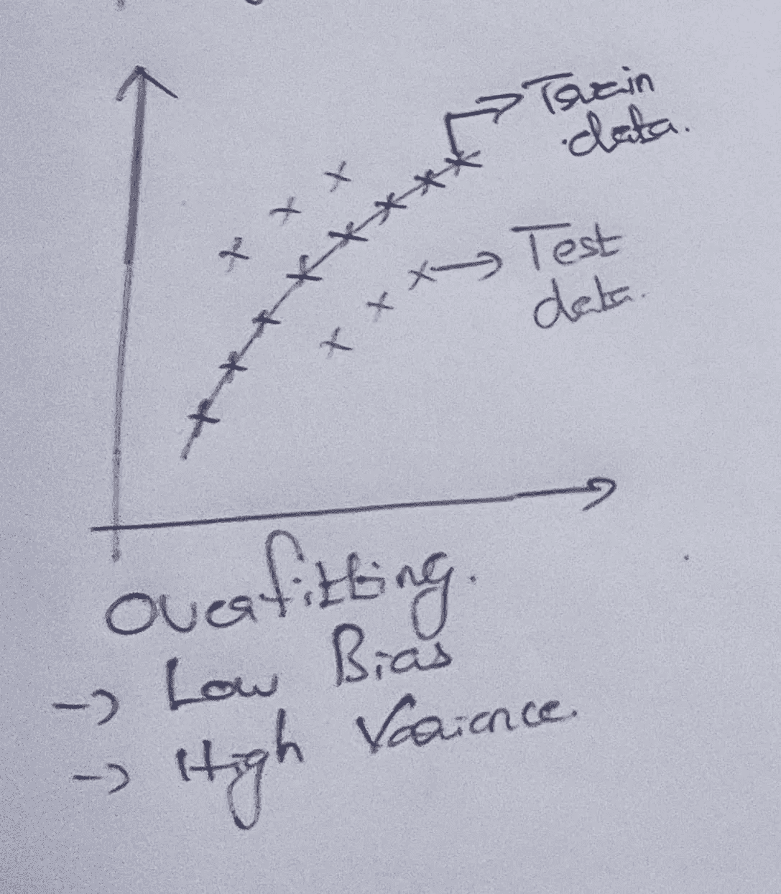
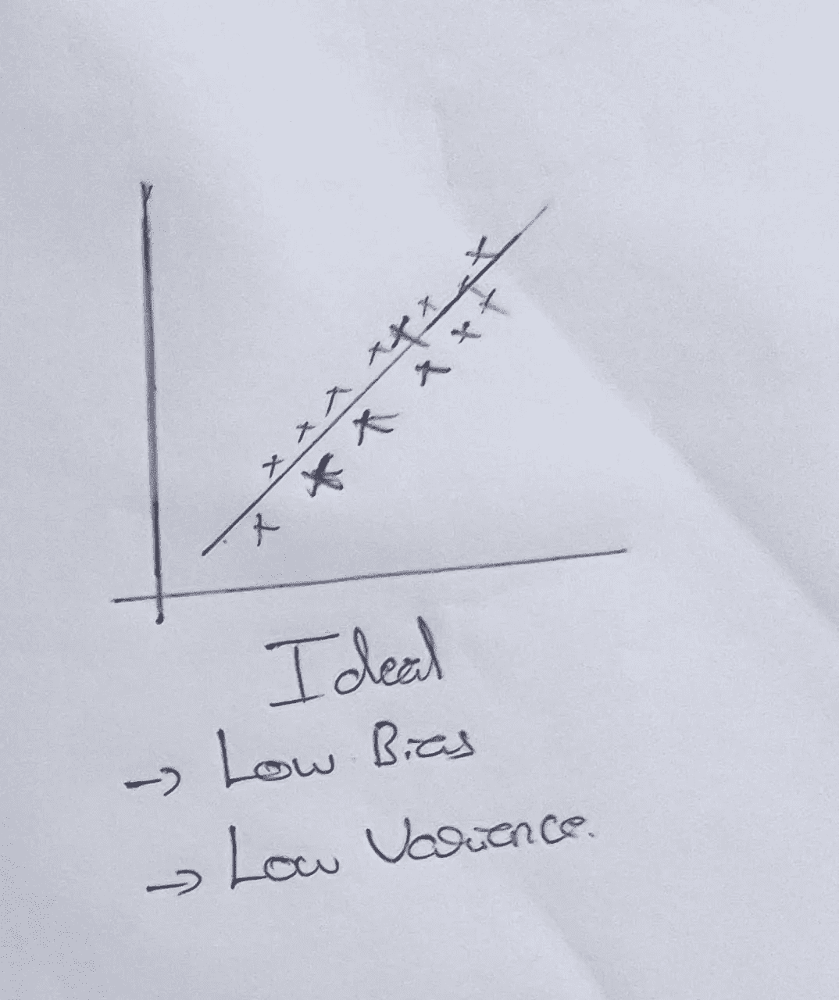
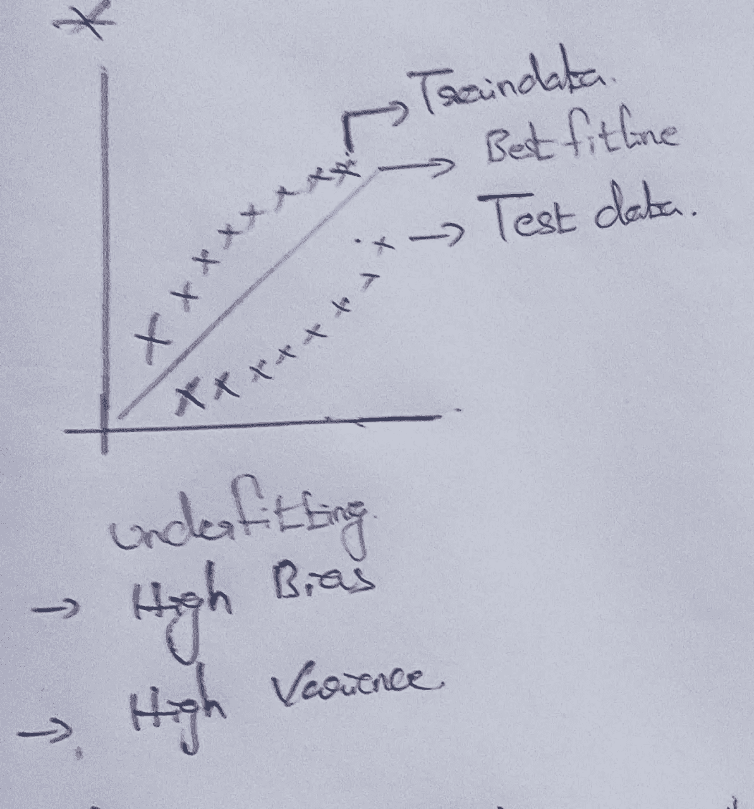
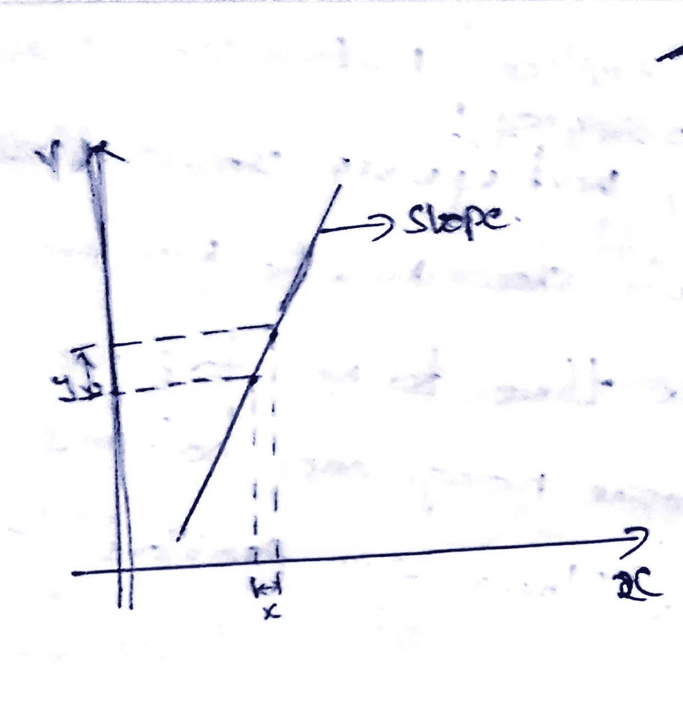
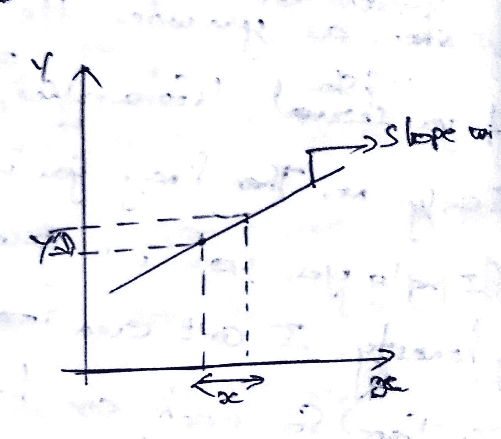
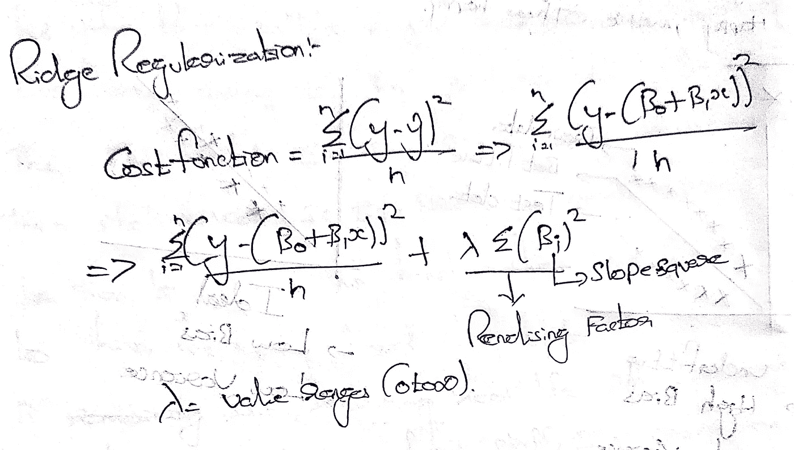
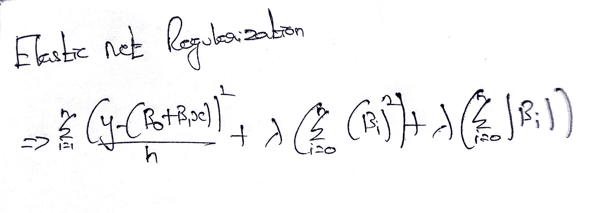

# 正规化-套索，山脊，弹性网。

> 原文：<https://medium.com/nerd-for-tech/regularization-lasso-ridge-elastic-net-524e1cfee6d7?source=collection_archive---------30----------------------->

为什么我们需要正则化方法？回答:如果线性回归模型导致过度拟合，我们应用正则化技术来避免过度拟合问题。

在进入正则化技术之前，我们可以理解过度拟合和欠拟合。

## 偏差和方差-权衡:

**偏差-** 平均模型预测值与实际值之间的误差。

**方差-** 给定数据集的模型预测的平均可变性。

图 1:偏差-方差权衡

图 2:偏差-方差

图 3:过度拟合。

**过拟合**

图 4:理想状态

*   过度拟合意味着模型为训练集提供了好的结果，但为测试集提供了差的结果
*   当我们为模型提供更多预测值时，会发生过度拟合，最佳拟合线将尝试通过训练数据中的每个点。它具有低偏差和高方差。

.

.

.

.

.

**理想**:

*   理想模型是指具有最佳拟合线，即最佳斜率(m)和截距值(x)的模型。
*   它具有低偏差和低方差。

.

.

.

.

.

.

图 4:装配不足。

**欠配合**

*   欠拟合均值模型对于训练和测试数据集给出了不好的结果。
*   由于我们在训练数据集中有一个低的度量分数，我们不会用这个模型来预测测试数据集。它具有高偏差和高方差。

.

.

.

.

## 正规化:

图 5:陡坡。

图 6:缓坡。

*   如果坡度更陡，x 的小变化会导致 y 的大变化。
*   这可能会导致过度拟合。
*   斜率越高，系数越高，这将导致过度拟合。

.

.

.

.

*   为了惩罚较高的斜率，我们将偏差添加到模型中，即正则化方法。
*   如果斜率很小，x 的单位变化会导致 y 的单位变小。

.

.

.

*   **规则化**是一个向训练数据添加偏差的过程，可以为测试数据产生更好的结果。

## 山脊正规化(L2):

*   向成本函数添加一个惩罚因子，即该值的平方。

图 7:山脊正则化公式。

*   众所周知**梯度下降**是回归模型的核心，用来寻找优化的斜率和截距值，通过在代价函数中加入惩罚因子，它将试图形成更一般化的模型。
*   随着λ值变得更高，系数将试图向零压缩，这意味着它使系数值变小，但不为零。

## 套索正规化(L1):

*   套索正则化的工作方法也与岭正则化相关，但我们不是平方斜率，而是取斜率的绝对值。

图 8:套索正则化。

*   既然我们取的是绝对斜率值，那么就有可能把斜率值变为零。
*   零系数意味着变量和目标之间没有关系，所以无效。
*   套索正则化有助于特征选择。

## 弹性网络正则化；

*   岭和套索正则化的组合，可从套索中消除要素，并从岭中降低要素系数。

图 9:弹性网络正则化。

*   因此，正则化方法的主要目标是通过降低斜率(系数)来获得最小误差，从而使训练和测试的误差落在同一范围内。

## 参考:

*   参考这个文件来理解，我如何通过应用正则化方法来克服线性回归模型中的过拟合问题。

[https://github . com/rishikumar 04/Data-Science-Training/blob/main/Linear _ Regression/05 _ Big % 20 city % 20 health % 20 inventory . ipynb](https://github.com/Rishikumar04/Data-Science-Training/blob/main/Linear_Regression/05_Big%20city%20Health%20Inventory.ipynb)