# 机器学习中的正则化技术

> 原文：<https://medium.com/nerd-for-tech/regularization-techniques-in-machine-learning-a31daf2acc3e?source=collection_archive---------8----------------------->

## **什么是正规化？**

正则化是 ML 中一种常用的技术，它解决了我们模型的过拟合问题。好的..有人可能会问，我们还可以降低模型复杂性来解决这个问题。是的，这个问题是真实的，但是，如果我们降低模型的复杂性，我们可能会以拟合不足而告终，这是完全不可取的。因此，我们需要一种更可靠的技术，确保我们不会丢失任何数据信息，同时能够自信地预测我们的目标变量。这就是正规化发挥作用的地方。

这是一种回归形式，它将系数估计值约束或缩小到零。换句话说， ***这种技术不鼓励学习更复杂或更灵活的模型，以避免过度拟合的风险。***

## 它是如何工作的？

在进行正规化工作之前，让我们快速浏览一下 OLS 是如何工作的。我们知道，在 OLS，模型参数是通过考虑残差平方和(RSS)的最佳值来确定的。OLS 的拟合过程涉及一个损失函数，称为残差平方和或 RSS。选择系数，使得它们最小化这个损失函数。

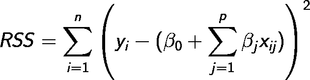

其中:

*   n 是**观察值(数据)**的总数。
*   yi 是**观测值(数据)**的实际输出值。
*   p 是**特征总数**。
*   βj 是一个**模型的系数**。
*   xij 是第**个观察值，**第**个特征值**。

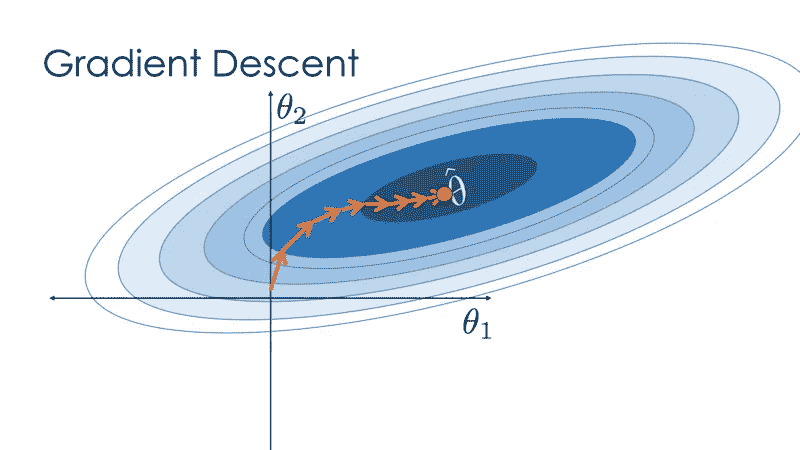

在 OLS 的例子中，我们通过梯度下降达到最优，梯度下降从一个随机的起点(0，0)开始。

***正则化线性回归模型非常类似于最小二乘，除了通过最小化一个稍微不同的目标函数来估计系数。我们最小化 RSS 和一个惩罚系数大小*** *的“惩罚项”之和。*

***正则化对优化算法施加了约束。***

在 ML 中主要使用了 3 种正则化技术，让我们分别讨论它们。

## **套索回归:**

在 lasso 中，参数的绝对值之和乘以一个收缩因子被添加到 OLS 的损失函数中。

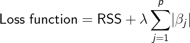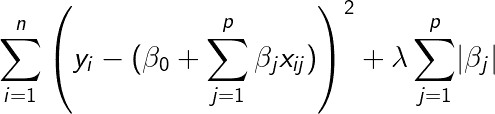

其中:
λ是一个调谐参数(收缩因子)，用于在模型与数据的拟合度和模型系数的大小之间寻求平衡:

*   微小的λ对系数大小没有影响，相当于正常的线性回归。
*   增加λ会使系数恶化，从而使系数向零收缩。

上图显示了套索回归，其中 ***RSS 通过添加收缩量进行了修改。*** 现在，通过最小化这个函数来估计系数。这里， ***λ是调节参数，它决定了我们想要对模型的灵活性进行多少惩罚。*** 一个模型的灵活性的增加是通过它的系数的增加来表示的，如果我们想最小化上面的函数，那么这些系数就需要很小。这就是套索回归技术如何防止系数升得太高。此外，请注意，我们缩小了每个变量与响应的估计关联，除了截距β0，此截距是 xi1 = xi2 = …= xip = 0 时响应平均值的度量。

让我们通过数学方法改变损失函数来理解系数是如何降低的。

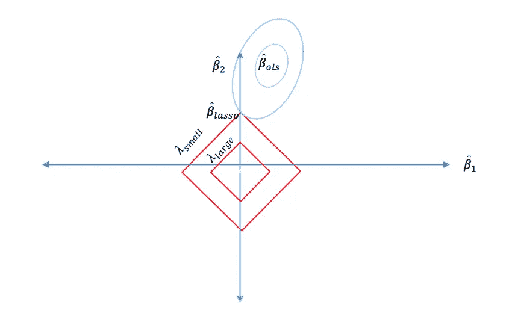

这些椭圆边界是为特定值误差函数绘制的。简单地说，如果我们沿着这些边界移动，我们的 RSS 函数值不会改变，但我们会遇到各种系数的组合。

***对于套索，方程变成，|β1|+|β2|≤ s*** 。这意味着*拉索系数对于位于由|β1|+|β2|≤ s 给出的菱形内的所有点具有最小的 RSS(损失函数)*

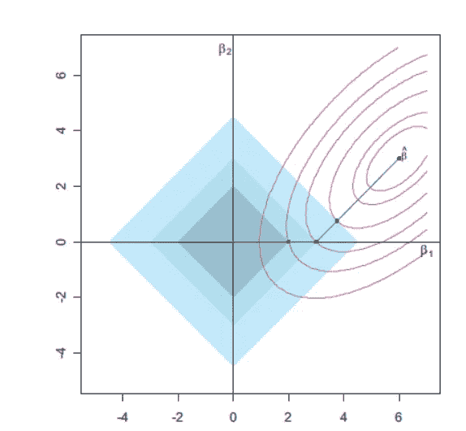

套索回归只是放了一个约束。

由于绝对函数在 0 处不可微，所以我们不能在这里使用梯度下降，但我们使用其他优化方法，如*坐标下降*等。

***套索约束在每个轴上都有角，所以椭圆通常会在一个轴上与约束区域相交。当这种情况发生时，其中一个 coefficients 将等于零。*** 我们在这种情况下只考虑了两个参数，但在多个参数的情况下，可能会将多个参数减少到零。所以，**用于*特征选择*也。**

## 2.**岭回归:**

在岭回归中，我们添加一个罚项，它等于系数的平方和乘以收缩因子。

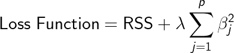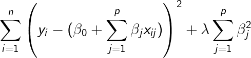

***岭回归用β + β ≤ s*** 表示。这意味着*岭回归系数对于位于由β + β ≤ s 给出的圆内的所有点具有最小的 RSS(损失函数)*

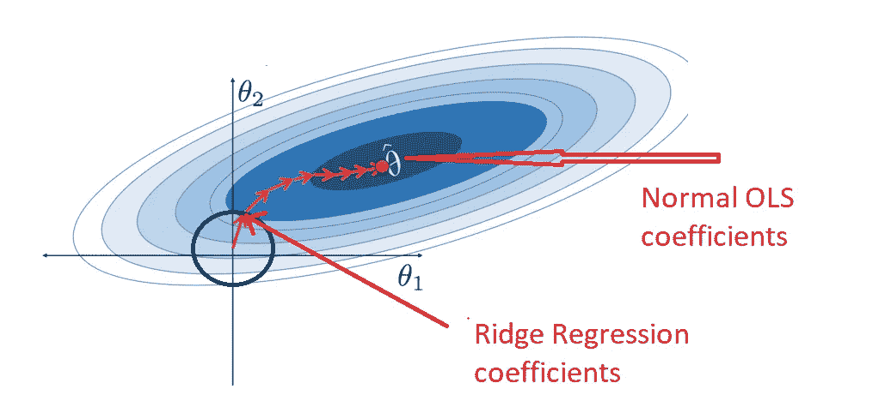

## 3.弹性净回归；

这是一种回归，是套索和山脊的结合。

约束区域是圆形和菱形的组合。除了形状，一切都一样。

**弹性网回归=a *拉索回归(L1 范数)+b *岭回归(L2 范数)**

**L1 _ 诺姆=a/(a + b)**

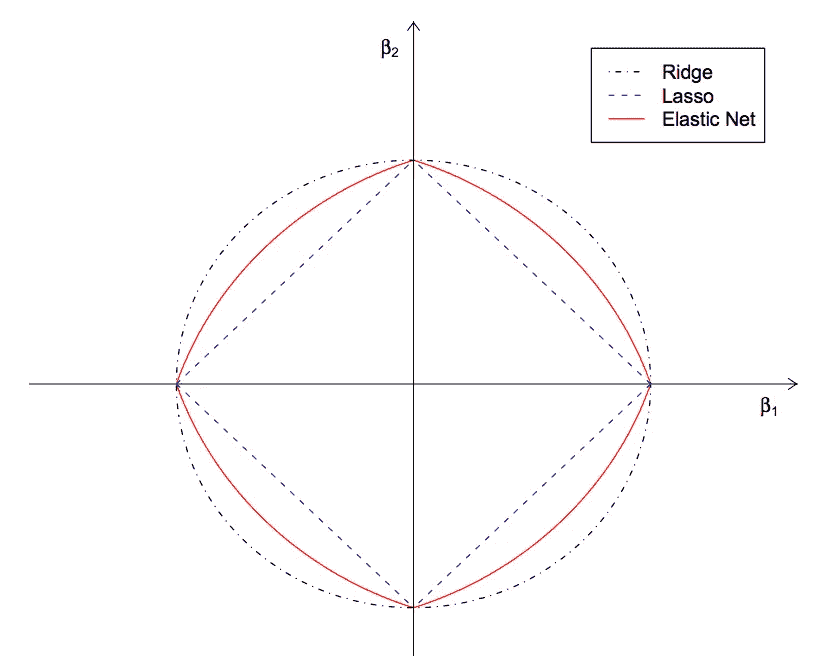

***不同 L1 比下弹性网的行为:***

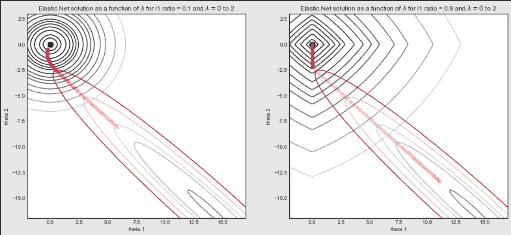

# 正规化实现了什么？

*正则化，显著降低了模型的方差，而没有显著增加其偏差*。因此，在上述正则化技术中使用的调谐参数λ控制对偏差和方差的影响。随着λ值的上升，它会降低系数的值，从而降低方差。**因此，应该仔细选择λ的值。**

实现这些算法的一个流行库是 Scikit-learn。它有一个很棒的 API，只需几行 python 代码就能让你的模型开始运行。

如果你喜欢这篇文章，**请在下面为这篇文章鼓掌以示支持，**请发表评论。

你也可以在[推特](https://twitter.com/MuduliSumanta)、[、**直接给我发邮件**、](http://sumanta.skm97@gmail.com)或者 [LinkedIn](https://www.linkedin.com/in/sumanta-kumar-muduli-08a303198/) 上关注我。我很乐意收到你的来信。

乡亲们，祝你们有美好的一天:)