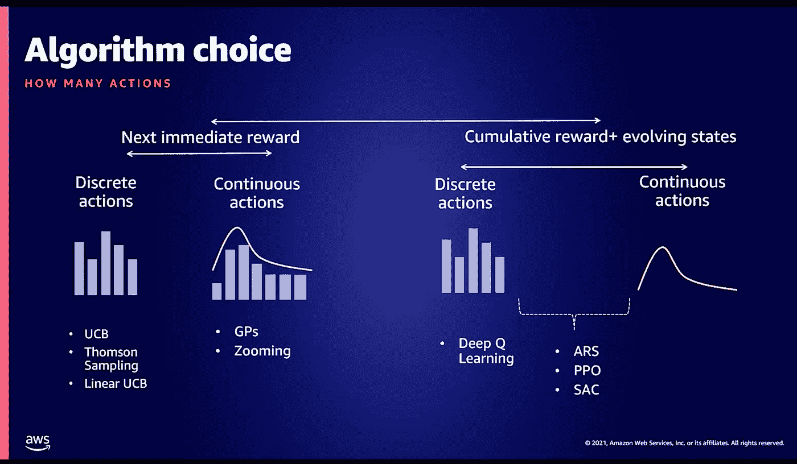

# 强化学习在商业问题中的应用

> 原文：<https://medium.com/nerd-for-tech/reinforcement-learning-applied-to-business-problems-412b478046a7?source=collection_archive---------21----------------------->

2021 年澳大利亚和新西兰在线 AWS 峰会上 SageMaker 演讲的要点


[阿丽娜](https://unsplash.com/photos/ZiQkhI7417A)在 [Unsplash](https://unsplash.com/photos/ZiQkhI7417A) 上的照片

这里介绍了一些关键要点和我对演讲*使用强化学习解决业务问题*的想法，该演讲首次出现在 [2021 AWS 在线峰会澳大利亚和新西兰](https://aws.amazon.com/events/summits/online/anz/)。总的来说，我发现将 RL 部署到生产中的 3 个问题**和 4 个步骤**有助于思考业务问题。这些概念也不仅仅局限于 AWS SageMaker 服务。****

# 介绍

甚至在开始，演讲者提到了两件我完全同意的事情:

1.  企业认识到机器学习或强化学习的潜在价值，但将机器学习概念转化为生产是另一回事。
2.  RL 的最大障碍在于问题的公式化，接下来的步骤将由公式化的问题决定。

哦，还有第三个项目。肯定还有其他的 RL 应用，但我并不是在抱怨游戏中 RL 的进步。

3.RL 的应用不仅仅是在游戏中。

我的意思是，考虑到游戏中的许多配置和可能性，谁不会对 Alpha Go 通过 RL 击败当时的世界冠军感到惊讶。好了，这里跑题了。

演讲者确实提到了强化学习是机器学习的一个子集。至少这是对我强调我希望演讲者思想的一个暗示。对我来说，可能也受到我的同事的影响，尽管机器学习(更具体地说是强化学习)确实有其自身的优点，但并不是所有的商业问题都应该被表述为机器学习问题或子集强化学习问题。从一开始就有这样的描述将会(a)释放资源和人员专业知识，这些资源和人员专业知识可以用于具有更大影响的 ML/RL 问题,( b)在给定时间、金钱和范围的情况下，当其他传统开发工作可以完成工作时，防止期望问题。我仍然看到 ML/RL 问题的巨大影响，但是业务问题不应该过于“被迫”来适应 ML/RL 问题，如果它确实适合 ML/RL 问题，则应该在制定阶段给予最大限度的关注。

进入主题，我很喜欢作者如何根据他的经验给出部署 RL 的 3 个问题和 4 个步骤，我们将在接下来的部分中讨论这些。即使你使用谷歌云数据实验室，这些概念也适用。把它们列在这里。

三个问题:

1.  (州)我有什么信息？
2.  (行动)需要多少决策？
3.  (测量)我的算法如何？

四个步骤:

1.  问题定式化
2.  建立培训和评估体系
3.  选择 RL 算法
4.  A/B 测试

# 三个问题

很高兴看到这三个问题在区域供热、动态定价和库存补充等例子中得到一致应用。

开始时，我真的很想看看我如何使用这个 3 个问题的概念，我甚至注意到了一个简单的状态、动作和用例度量的表格。这些例子是精心挑选的，为不同的 RL 潜在问题提供了一点广度(在不到 30 分钟的演讲中)。

他们是否只是利用 S-A-M 提示来微妙地宣传与 AWS 相关的 SAM(如 SAM CLI)？不只是我注意到了，对吧？

```
+---------+-----------------+----------------+------------------+
|         | District        | Dynamic        | Inventory        |
|         | Heating         | Pricing        | Replenishment    |
+---------+-----------------+----------------+------------------+
| State   | Historic        | Freight price, | Historic demand, |
|         | weather,        | week of the    | inventory,       |
|         | current circuit | year for the   | items ordered    |
|         | temperature     | season         |                  |
+---------+-----------------+----------------+------------------+
| Action  | Return water    | Daily ticket   | Safety coverage  |
|         | setpoint        | price          | weeks            |
+---------+-----------------+----------------+------------------+
| Measure | Diff between    | Daily revenue  | Average          |
|         | 22C and         |                | coverage and     |
|         | room temp       |                | margin over      |
|         |                 |                | lifetime         |
+---------+-----------------+----------------+------------------+
```

S-A-M 提问在代码演练中也很明显。我只是希望他们也能提供一些他们所展示的代码库的直接链接。由于一些例子是真实世界的例子，一些数据可能是不可用的，但它们可能包括代码回购的虚拟数据。总的来说还是好的一面，因为有些讲座甚至没有提供一些代码演练。

有一个用例，作者说他们将 RL 性能与其他传统 ML 解决方案进行了比较。我认为这种方法(如果资源不是问题的话)是一种很好的实践。就像我们之前说的，不是所有的业务问题都需要 RL。其中一些可能是其他形式的机器学习问题，甚至不是机器学习问题。

在用例的最后，演讲者还认识到，在 RL 旅程的开始，开发人员和数据科学家可能没有把握或直觉如何选择算法，我很高兴他提供了一个概述。如果只允许我从整个演讲中截取一张截图，大概会是下图:



AWS SageMaker 演讲中的算法选择

从经验来看，开发人员或数据科学家可能会选择一种不一定遵循图像的算法。RL 的世界仍在发展/学习，相当多的算法仍有待实现，可能会击败我们现有的算法。

# 四个步骤

我们已经涵盖了主要在`Three Questions`部分讨论的`1\. Problem Formulation`和`3\. Choosing an RL algorithm`的大部分要点。在这一部分，我想重点介绍一下`2\. Building a Training and Evaluation System`和`4\. A/B Testing`。

在构建系统的时候，我喜欢作者强调的如果我们想要优化长期前景或者选择即时回报。这些方法将导致不同的结果/系统。如果我们只为下一个直接回报而优化，我们可能会有更简单的算法，而不需要转移函数。作者在之前的演讲中也有一个用例跳过了转换函数。

最后一部分涉及 A/B 测试。我通常只在电子邮件营销活动或网站变更中看到这种测试，但在 RL(通常可能是 ML)部署中看到这种测试也是有意义的。这可能有助于修改 RL 中使用的奖励系统。此外，在较小的人群中应用它可以降低风险，并且我们还可以根据真正重要的 it 基线来衡量 RL 的性能。

# 离别笔记

这是一次全面的信息交流，让我想看看其他相关的交流。例如，亚马逊 SageMaker MLOps 的 A/B 测试机器学习模型也在本次峰会上。