# 强化学习:用雅达利游戏进行深度 Q 学习

> 原文：<https://medium.com/nerd-for-tech/reinforcement-learning-deep-q-learning-with-atari-games-63f5242440b1?source=collection_archive---------2----------------------->

在我之前的帖子[中，我尝试使用深度 Q 学习来解决侧翻问题。在这篇文章中，我将进一步探索深度 Q 学习，但在雅达利游戏的背景下。](/nerd-for-tech/first-look-at-reinforcement-learning-67688f36413d)

2013 年，论文由 Deepmind 团队[用深度强化学习](https://www.cs.toronto.edu/~vmnih/docs/dqn.pdf)玩雅达利(Mnih et。al)探索了在雅达利游戏上使用深度 Q 学习的概念。目标是提出一个深度学习模型，该模型可以处理高维输入，并在不同的 Atari 游戏中实现超人的基准，而无需调整模型的底层架构。读完这篇论文后，我想尝试并实现这样一个模型，并希望能够训练一个代理来玩一些经典的 Atari 游戏，如 Breakout 或 Pong。我还将实施发表在英国《自然》杂志上的后续论文[通过深度强化学习进行人类水平的控制](http://files.davidqiu.com//research/nature14236.pdf)中的想法。此外，我还将谈到一个我们可以添加的修改，称为双 DQN。

首先，我需要为这个问题选择一个环境。当我第一次开始这个项目时，我想尝试解决网球这个游戏。然而，在对我的模型进行了几个小时的训练后，结果并不比随机游戏好多少。看看我的训练参数，我只训练了我的代理人大约 50 集，其中每集最多需要 200 帧才能完成。所以总共大约 10，000 帧。看看 Deepmind 的论文，他们已经训练了他们的代理超过 1000 万帧。虽然我的 10，000 帧需要大约 1.5 小时来运行，但是 1，000 万帧需要 2 个月！最后，我决定选择 Pong，这是一种比较容易学的游戏。

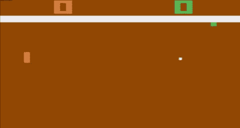

一个机器人(左)对抗一个 RL 代理(右)

# **环境设置**

对于这个实验，我将使用 OpenAI 的健身房库和预构建的环境。注意，目前 OpenAI 的 atari-py 包中唯一的环境是俄罗斯方块，所以你必须从其他地方导入 rom。我将在文章的最后把这个文件包含在我的代码中。这里是环境:

```
#initial environment
env = gym.make('PongNoFrameskip-v4')#Atari preprocessing wrapper
env = gym.wrappers.AtariPreprocessing(env, noop_max=30, frame_skip=4, screen_size=84, terminal_on_life_loss=False, grayscale_obs=True, grayscale_newaxis=False, scale_obs=False)#Frame stacking
env = gym.wrappers.FrameStack(env, 4)
```

在第一行中，我初始化了环境‘PongNoFrameskip-v4’。gym 采用的格式是['Game]['NoFrameskip '，' Deterministic '，None]['-v0 '，'-v4']的串接字符串。以下是对每个术语的快速解释:

*   “无帧跳过”:环境的每一步都是一帧
*   “确定性”:每一步对 k 帧执行相同的动作，并返回第 k 帧。k = 4。
*   无:与“确定性”相同，但 k 是从[2，5]中采样的。
*   “-v0”:每一步都有 0.25 的概率重复前面的动作
*   “v4”:每一步都将遵循您发布的操作

在第二行中，我应用了一些在《自然》杂志论文中详述的预处理。Atari 包装器遵循 Machado 等人(2018)“重温街机学习环境:通用代理的评估协议和开放问题”中的指南。每个参数的快速解释:

*   NoopReset:通过在复位时随机选择 no-ops(无动作)来获得初始状态。
*   缺省情况下跳帧:4
*   Max-pooling:采用最近观察的最大像素值来消除一些 Atari 游戏中的闪烁效果。
*   失去生命时的终止信号:默认关闭。Machado 等人(2018)不推荐。
*   默认情况下，调整为正方形图像的大小:84x84
*   灰度观察:将观察转换为灰度
*   缩放观察值:将观察值缩放到[0，1]

请注意，我们不会缩放观察值，并将值类型保持为 uint8，以获得更有效的内存存储，并且只会在将它输入到模型中之前进行缩放。

第三行将每 k 帧堆叠成一次观察。这将使模型了解一个动作是如何进行的，而不仅仅是输入是一个静止的帧。请注意，这并不意味着我们将每 k 帧分组在一起，每帧的观察值都是堆叠的，因此它们会重叠。我们的观察维度应该是(4，84，84)，其中输入是大小为 84x84 的图像，并与最后 4 帧堆叠在一起。关于预处理后的观察，值得注意的一件有趣的事情是，《自然》杂志选择保留游戏中的分数，而不是将其剔除。

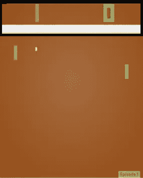

分数用黑色方框标出

# **实现深度 Q 学习**

我们将使用 epsilon-greedy 算法来选择最佳动作，其中有 epsilon 机会从动作空间中随机抽取一个动作。根据 Deepmind 的规范，我们将使用线性退火在一百万帧内将ε从 1 减少到 0.1，而不是使用ε衰减。

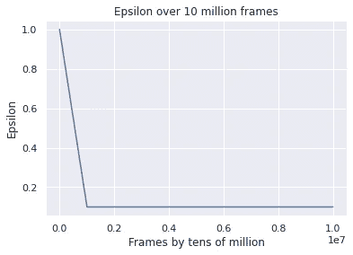

类似于我在以前的帖子中描述的基线深度 Q 学习算法，我们将使用神经网络来学习特定状态的 Q 值，而不是查找 Q 表。这是因为对于更复杂的环境，例如 Atari 游戏，存储所有可能状态所需的存储器效率太低，并且 Q 值收敛需要长得多的时间。我们将使用下面的等式来获得目标 Q 值，并让网络更新其权重。


给定状态和动作的目标 q 值

当我们处理作为输入的图像时，网络将是一个卷积神经网络。正如《自然》杂志论文中所详述的，

> 神经网络的输入由预处理图 w 产生的 84 × 84 × 4 图像组成。第一个隐藏层将 32 个步长为 4 的 8×8 滤波器与输入图像进行卷积，并应用整流器非线性。第二个隐藏层将 64 个 4×4 的滤波器与步长 2 进行卷积，之后是整流器非线性。其后是第三个卷积层，它将 64 个 3×3 的滤波器进行卷积，步长为 1，其后是一个整流器。最后一个隐藏层是全连接的，由 512 个整流单元组成。输出图层是一个完全连接的线性图层，每个有效动作都有一个输出。

我在 Keras 中的实现如下所示:

```
model = Sequential(
    [
        Lambda(lambda tensor: tf.transpose(tensor, [0, 2, 3, 1]), output_shape=(84, 84, 4), input_shape=(4, 84, 84)),
        Conv2D(32, kernel_size=(8, 8), strides=4, activation="relu", input_shape=(4, 84, 84)),
        Conv2D(64, kernel_size=(4, 4), strides=2, activation="relu"),
        Flatten(),
        Dense(512, activation="relu"),
        Dense(env.action_space.n, activation="linear"),
    ]
)rms = tf.keras.optimizers.RMSprop(learning_rate=0.00025, rho=0.95, epsilon=0.01)
model.compile(loss="mse", optimizer=rms)
```

在我的实现中，我包含了一个 Lambda 层，它将 NCWH(批处理、通道、宽度、高度)格式的输入转换为 NWHC。这是因为当我用 CPU 训练我的模型时(无法配置 GPU)，不支持 NCWH 格式。如果是在 GPU 上训练，那么可以忽略 Lambda 层，用(4，84，84)作为第一个卷积层的输入形状。《自然》杂志的论文中详细描述了优化器的规格。关于 RMSprop 的更多信息，我发现这篇文章非常有帮助。

我们还将使用经验回放，并在“记忆”数组中跟踪过去的转换。该论文中描述的参数在存储器中存储多达 100 万个跃迁。存储器将被随机播放的 50000 个过渡预填充。在小批量更新期间，将从存储器中统一采样一批用于训练。该论文还提到了一个更复杂的策略，强调模型学习最多的过渡，类似于[优先清扫](https://link.springer.com/article/10.1007/BF00993104)。另一个修改在论文中有详细描述:

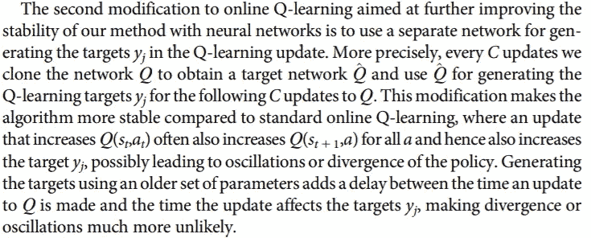

修改声明在每次 C 更新时克隆网络，并使用克隆的网络作为目标 Q 值的目标网络，并训练在线网络，而不是对两个任务使用相同的网络。这是为了减少网络的不稳定性，因为每次我们更新网络时，目标也会改变。使用目标网络将确保目标不会因 C 更新而改变。如下所示，微分损失函数将模型参数θᵢ用于当前 q 值，将克隆模型参数θᵢ⁻用于目标 q 值。

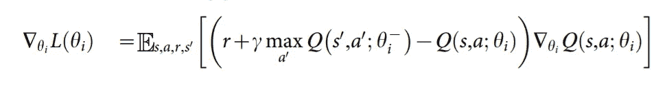

对损失函数求微分时的梯度

该算法的摘要如下所示:

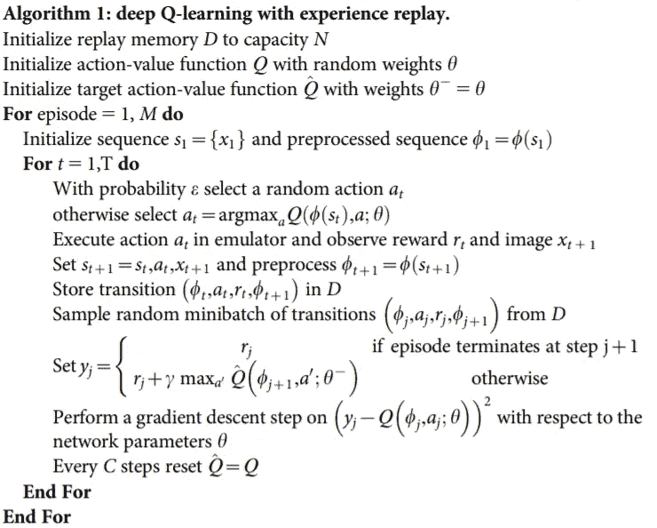

# 双 DQN

我们可以对该算法进行的另一种修改称为双重深度 Q 学习。在论文[中用双 Q 学习进行深度强化学习](https://arxiv.org/pdf/1509.06461.pdf) (Hasselt et .al 2015)，解决了高估 q 值的问题。尽管拥有过于乐观的价值观不一定是件坏事，但如果行动价值观不一致，它会对最终的政策产生负面影响。

本文中提出的变更是关于培训期间的目标值。

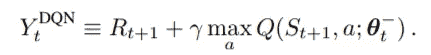

当我们使用神经网络来训练我们的代理时，我们希望基于我们的模型认为它的 Q 值与我们的模型认为它的 Q 值之间的差异来更新我们的模型。上面的等式表明，我们的目标是奖励+贴现的未来效用，其中我们使用神经网络来预测行动值，并选择最高的一个。这里的问题是我们使用了 max 操作符，在这里我们使用相同的值来选择一个动作并对该动作求值。这可能导致过于乐观的价值估计，因此我们需要一种方法来将选择与评估分离。

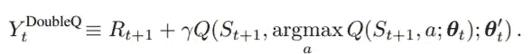

上面的等式是我们如何调整 DQN 目标等式的。我们没有使用 max 运算符来选择最佳操作并同时获取操作的值，而是使用 argmax 使用网络 q 和权重θₜ来选择操作，然后使用网络 q 和另一组权重θ′ₜ.来评估该操作本文将双 q 学习的概念与 DQN 相结合来创建一个简单的双 DQN 修改，其中我们可以使用目标网络作为权重θ′ₜ，使用在线网络作为权重θₜ.

让我们仔细看看高估是如何导致次优政策的。以文中提出的这个定理为例:

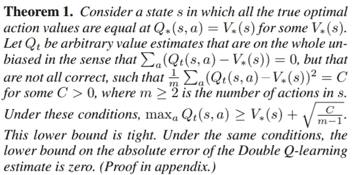

证明可以在论文中找到(查看下面的链接)

当我们具有无偏误差，使得真实最优网络 v 和任意网络 Qₜ之间的动作值的差之和均方误差 C > 0 时，我们可以导出一个紧下界:√(C/m-1)，其中 m 是动作的数目。使用双 Q 学习，误差的下限是 0。

```
#action selection with online network
best_future_action = np.argmax(model.predict(np.expand_dims(new_state, axis=0)))#action evaluation with target network
target = reward + discount_factor * target_model.predict(np.expand_dims(new_state, axis=0))[0][best_future_action]
```

# 我的结果

实现算法后，我准备训练我的代理。但是，我确实严重低估了训练时间。在《自然》杂志的论文中，他们训练了代理人 5000 万帧，相当于 38 天的播放时间。至于我，我选择使用更简单的 Atari 游戏，它需要更短的时间来收敛，根据我看到的一些例子，大约是 750，000 帧。即使减少了训练时间，在我的本地 CPU 上进行训练也要花费几天时间，而且我遇到了内存问题。我决定用 200，000 帧来训练我的模型，其他超参数被缩放到训练帧的数量。

首先，让我们看看随机策略的效果。在 150 次游戏中，随机策略的平均分数为-20.273，分数由 Cpu 分数-代理分数计算得出，游戏在 21 分结束。正如预期的那样，与人类基准-3 相比，随机策略不是很好。

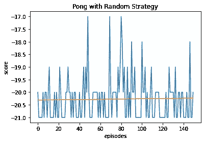

在训练我的模型之后，我没有得到我期望的结果。分数并没有随着时间的推移而提高，最终的策略和随机的策略一样好。检查培训损失历史，看起来模型确实在减少损失。

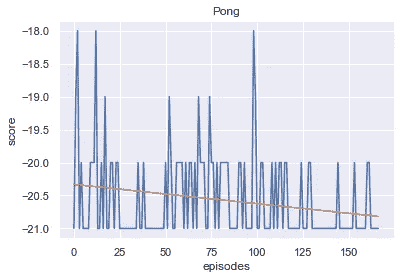

训练 Pong 超过 150 集

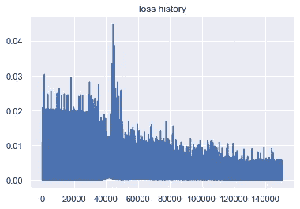

乒乓球训练损失

那为什么我的模特没有训练呢？一些关于为什么会发生这种情况的假设。首先，我缩小了所有的超参数，从 1000 万帧训练到 20 万帧。尽管一切仍按比例进行，但有一个主要问题。解决问题所需要的帧数还是一样的。当我在前 20，000 帧中减少ε时，学习策略仍然和随机策略一样好。

其次，这可能是由于 Pong 中奖励的稀疏性。在 CartPole 环境中，我们奖励代理人杆子直立的每一个时间步。这种反馈允许代理快速区分好的和坏的行为。然后，我们修改了奖励，使其与极角成比例，以获得更精确的反馈。然而，DQN 的情况不同。DQN 最初是作为一种通用解决方案提出的，用于解决给定图像输入的所有 Atari 游戏环境。因此，我们不能分配更精确的奖励，Pong 的奖励系统是-1 或 1 分。这意味着代理人在每次演练中学习的奖励要少得多，并且在每次奖励之间有大量的帧，这使得代理人更难掌握一个动作的未来效用。

在使用与上一篇文章相似的超参数的 CartPole 环境进行健全性检查之后，我们得到了以下结果:

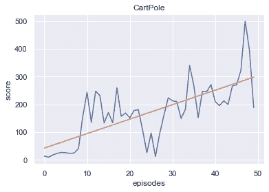

唷。至少算法是可行的，代理将在一个更容易的环境中学习。将此与 2013 年报告中详述的基线 DQN 实施进行比较，我们得到了类似的结果，10 集的平均得分为 476。

总的来说，这是一次有趣的经历，我对 DQN 算法进行了更深入的研究，增加了目标网络和一个简单的双 Q 学习实现。仍然有可以改进的地方，比如优先清扫和决斗网络，但这是未来要探索的。尽管 DQN 是第一个使用图像输入解决 Atari 游戏的模型，但事实仍然是，DQN 确实有很长的训练时间和缓慢的收敛速度。在未来，我将探索其他种类的算法，如用于连续动作的深度确定性策略梯度(DDPG)、近似策略优化、A3C 等等！

我的代码:[https://github . com/cheng i600/rl stuff/blob/master/Q % 20 learning/Atari _ dqn . ipynb](https://github.com/chengxi600/RLStuff/blob/master/Q%20Learning/Atari_DQN.ipynb)

来源:

*   [用深度强化学习玩雅达利](https://www.cs.toronto.edu/~vmnih/docs/dqn.pdf) (Mnih et。铝 2013)
*   [通过深度强化学习的人类级控制](http://files.davidqiu.com//research/nature14236.pdf) (Mnih et。铝 2015)
*   [采用双 Q 学习的深度强化学习](https://arxiv.org/pdf/1509.06461.pdf) (Hasselt et。铝 2015)