# 强化学习:政策梯度介绍

> 原文：<https://medium.com/nerd-for-tech/reinforcement-learning-introduction-to-policy-gradients-aa2ff134c1b?source=collection_archive---------2----------------------->

在以前的帖子中，我一直在研究一种形式的强化学习，Q 学习，在这种学习中，代理人找到一种最优策略，使状态轨迹上的总回报最大化。后来，我用深度神经网络扩展了 Q 学习，并探索了 DQN 的实现。在这篇文章中，我想探索一种不同的强化学习方法，称为策略梯度，旨在直接优化策略。与 Q 学习不同，代理不是基于状态-动作值选择最佳动作，而是从动作的概率分布中选择。我将展示政策梯度定理的证明和一个朴素的算法，加强(威廉姆斯 1992)，使用这种推导。令人惊讶的是，威廉姆斯是我现在就读的东北大学的教授！

# 介绍

首先，我们来定义一些术语。与选择带有一些噪声的最大值操作的 epsilon greedy 算法不同，我们基于当前策略选择操作。π(a | s，θ) = Pr{Aₜ = a | Sₜ = s，θₜ = θ}，这是给定时间步长 t 的状态 s 和时间步长 t 的策略参数θ时，时间步长 t 的动作 a 的概率

现在，代理将基于性能测量函数 J(θ)相对于θ的梯度来学习策略。我们将使用梯度上升来调整政策参数，以找到最优政策:θₜ₊₁ = θₜ + α∇J(θₜ).

在处理策略函数π时，我们可以通过确保π(a | s，θ) ∈ (0，1)来保留探索的概念，因此策略不会变得确定。对于参数化的数字偏好，我们为状态-动作对得出一个值 h(s，a，θ)。我们可以使用 softmax 将它转化为概率分布:

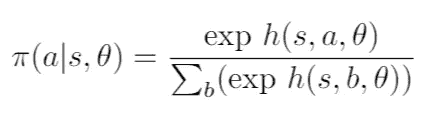

与行动偏好相比，根据 softmax 而不是 epsilon 贪婪策略选择行动有一些优势。首先，行动偏好允许代理接近确定性策略，而 epsilon greedy 将需要保持一定程度的噪音以鼓励探索。行动偏好也集中于建立一个最优的随机政策，而不是集中于一个值。这意味着，如果策略是确定性的，那么最佳行动的概率将趋近于 1。如果最佳策略是随机的，那么行动偏好将形成概率分布。对于ε贪婪策略，没有形成随机策略的自然方法。

另一个优点是在策略参数的函数上平滑地调整动作概率。对于ε贪婪策略，如果我们基于最大值选择一个动作，Q 值的微小变化会导致不同的动作。这可能极大地高估了所选行动的重要性，并汇聚成一个次优的政策。

现在让我们看看代理如何学习最优策略的参数。请记住，我们将根据性能测量函数 J(θ)来调整参数。这就把我们带到了策略梯度定理，它让我们在不推导状态分布的情况下近似 J(θ)相对于θ的梯度。


摘自萨顿巴尔托律师事务所，2017 年

μ(s)这里是我们的随机策略π的策略分布。q 是遵循策略π的动作值函数，而π(a|s，θ)是给定参数θ下的状态的动作分布。

这就解决了未知环境下需要知道状态分布的问题。以下证明([萨顿&巴尔托，2017](http://incompleteideas.net/book/bookdraft2017nov5.pdf)；秘书 13.2)将借助[莉莲翁的文章](https://lilianweng.github.io/lil-log/2018/04/08/policy-gradient-algorithms.html)进行详细演练。

# 政策梯度定理的推导

定义 J(θ) = V_πθ(s)，其中 V 是带参数θ的策略π的值函数。然后我们有:

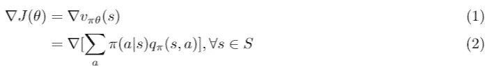

我们可以将值函数展开为类似于期望方程的值函数，其中，对于动作空间中的所有动作，我们找到遵循策略π的动作的概率乘以遵循策略π的状态-动作对的值的总和。

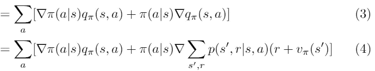

然后在(3)中，我们应用乘积法则:d/dx[f(x)g(x)]= f '(x)g(x)+f(x)g '(x)。在(4)中，我们扩展了 q 函数。如前所述，给定一个状态-动作对，q 函数给出一个值。如果我们假设环境是非确定性的，那么下一个状态也将是非确定性的。给定状态-动作对和下一个状态 s '的奖励+值函数，我们乘以新状态 s '和奖励 r 的概率。这给了我们所得到的新状态 s '的期望值。然后我们对所有可能的新状态求和。请注意，奖励使用了强化学习中的一个基本概念，我们必须考虑当前的奖励和未来的效用。

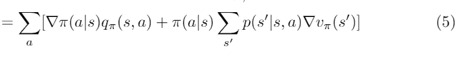

我们可以将 p(s '，r | s，a)简化为 p(s' | s，a)因为 p(s '，r | s，a)中所有奖励的总和与 p(s' | s，a)相同。然后，我们可以跳过 p(s '，r| s，a ),因为 r 不是θ的函数(梯度是关于θ的)。奖励消失了，因为它是一个常数。

回忆一下我们推导的那一行①，∇J(θ) = ∇v(s).请注意，在我们展开的等式的末尾，有一个类似的 v(s’)项。我们可以观察到∇v(s)是递归的。让我们试着扩展一下递归。

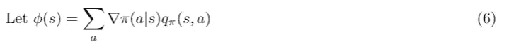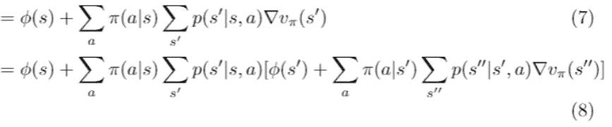

正如你所看到的，在第(8)行中，除了从 s '到 s ' '的转换之外，我们用我们到目前为止得到的结果替换了术语∇v(s'。我们可以定义这个转换来稍微简化这个等式。

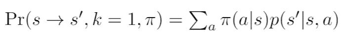

上面的函数是在遵循策略π的 k 个步骤中从状态 s 到状态 s’的转移的概率。然后我们可以修改步骤(6)和(7)来使用它，但也要记住对所有可能的下一个状态 s’求和。

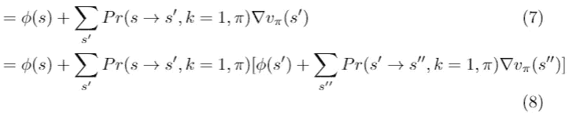

我们可以进一步简化。如果把相乘的项进行分布，就可以把 Pr(s → s '，k=1)和 Pr(s' → s ' '，k=1)组合起来得到 Pr(s → s ' '，k=2)。

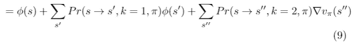

在反复展开递归位之后，我们可以把它写成求和。

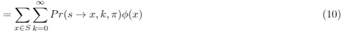

这里，我们对从起始状态 s 到状态 x 的跃迁的所有可能长度为 k 步的所有目标状态 x 求和。注意，在 k=0 时，Pr(s → s，k = 0，π)通常为 1，因此我们没有忽略第一个ϕ(s 项。

现在我们可以走向证明的结论。

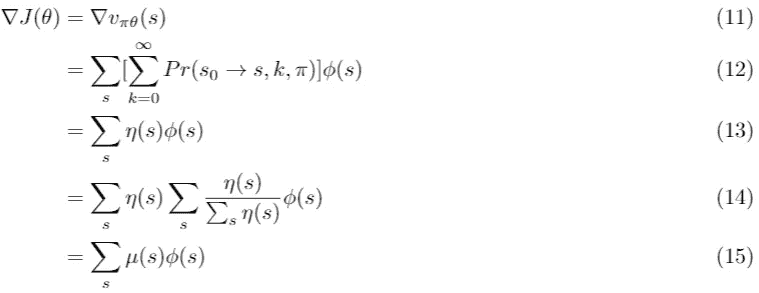

在第(12)行，我们有从起始状态 s0 到结束状态 s 的任何 k 长度步长的跃迁分布，我们将其简化为η(s)。然后，在第(14)行，我们将η(s)归一化为每个最终状态 s 的概率分布∈ (0，1)。然后，我们构建了μ(s ),这是遵循我们的随机策略的动作的概率分布。当我们展开ϕ(s)函数时，我们已经证明了关系式:


摘自萨顿巴尔托律师事务所，2017 年

# 强化算法

现在有了策略梯度定理，我们可以提出一个简单的算法，利用梯度上升来更新我们的策略参数。该定理给出了所有状态和动作的总和，但当我们更新参数时，我们将只使用一个样本梯度，因为我们无法获得所有可能的动作和状态的梯度。我们可以把它写成期望值，因为样本梯度的期望值和实际梯度是一样的。因此，我们有以下内容:

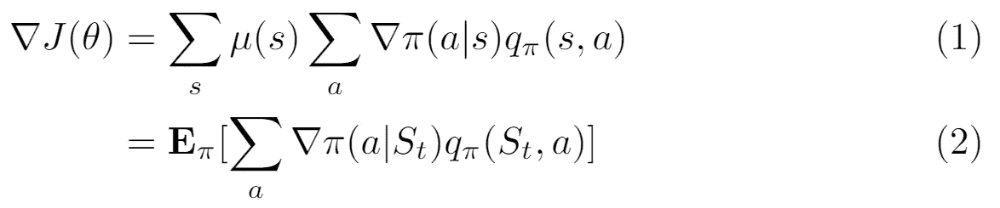

请注意，我们在(2)中用 Sₜ替换了 s。这是因为我们正在公式化方程以采用样本梯度，其中我们使用样本状态 Sₜ和样本动作 Aₜ，而不是所有状态和动作的总和。现在，让我们用一个简单的动作 Aₜ.代替所有动作的总和

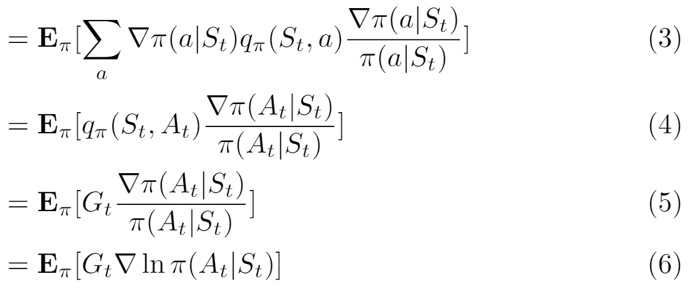

在(3)中，我们将该值乘以末尾的项，这样样本动作的值就由选择该动作的概率来加权。然后在(4)中，我们可以去掉所有动作的总和，用一个样本动作 Aₜ.代替 a 在(5)中，我们可以用时间步长 t 的累积贴现回报 Gₜ来代替状态-行动价值函数。然后，我们可以使用事实 d/dx[ln(x)] = 1/x 来简化方程


然后，我们可以在期望值中使用这一项来执行梯度上升，以更新我们的策略参数。我们可以在朴素强化算法中使用这个更新。

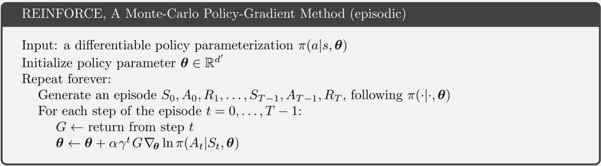

摘自萨顿巴尔托律师事务所，2017 年

请注意，该算法是一种蒙特卡罗方法，因为我们不是在每个时间步长后更新参数，而是使用静态参数θ对整个轨迹进行间歇采样，然后更新参数。在上面取自教科书(萨顿和巴尔托，2017 年)的伪代码中，更新行略有错误，因为我们不应该更新我们用来获得策略日志概率的相同参数。在我们的实现中，我们可以简单地累加梯度，并在一集结束时一次性更新参数。现在让我们开始实现吧！

# 实施加固

对于我的实现，我决定使用 Pytorch 而不是 Keras，因为我想探索其他机器学习库。对于策略参数，我使用了神经网络，因为它可以为我做梯度上升。请注意，我将在梯度前面添加一个负号来执行梯度上升，而不是梯度下降。这是我的关系网:

```
#Using a neural network to learn our policy parameters
class PolicyNetwork(nn.Module):

    #Takes in observations and outputs actions
    def __init__(self, observation_space, action_space):
        super(PolicyNetwork, self).__init__()
        self.input_layer = nn.Linear(observation_space, 128)
        self.output_layer = nn.Linear(128, action_space)

    #forward pass
    def forward(self, x):
        #input states
        x = self.input_layer(x)

        #relu activation
        x = F.relu(x)

        #actions
        actions = self.output_layer(x)

        #get softmax for a probability distribution
        action_probs = F.softmax(actions, dim=1)

        return action_probs
```

实现算法后，我用以下参数测试了我的结果:

*   γ(折扣系数):0.99
*   剧集数量:1000
*   最大步数:10000

首先，让我们看看我们的代理如何处理 150 集的随机策略:


不出所料，这些都是一些低于标准的结果，平均得分为 21.48。现在，让我们看看我们的算法超过 1000 集的训练历史。

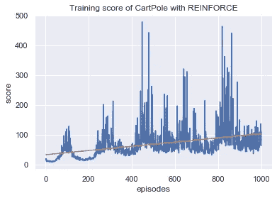

每集累积奖励

查看我们的训练历史，我们可以看到我们的代理人随着时间的推移慢慢学习。然而，我们注意到，与其他学习方法相比，比如我在[上一篇](/nerd-for-tech/first-look-at-reinforcement-learning-67688f36413d)文章中提到的 DQN，这种学习方法很慢，而且变化很大。这是意料之中的，因为与使用深度神经网络的算法相比，增强算法不太复杂。尽管如此，我们仍然能够使用学习的策略在 50 集上获得 79.6 的平均分数，这优于人类基准(me)30.8。

总的来说，这是对政策梯度方法的一个很好的介绍，这比我从 CS4100 讲座中学到的 Q-learning 更难理解。我认为试图理解萨顿&巴尔托教科书中每个方程背后的所有推导和推理是很有趣的，这让我对这个话题有了更深的理解。展望未来，我肯定想学习更多关于策略梯度方法和 Pytorch 的知识，我在实现 REINFORCE 时曾使用过 py torch。

我的代码:[https://github . com/cheng i600/rl stuff/blob/master/Policy % 20 gradients/reinforce . ipynb](https://github.com/chengxi600/RLStuff/blob/master/Policy%20Gradients/REINFORCE.ipynb)

参考资料:

*   [强化学习:导论(萨顿&巴尔托 2017)](http://incompleteideas.net/book/bookdraft2017nov5.pdf)
*   [政策梯度算法(Lilian Weng)](https://lilianweng.github.io/lil-log/2018/04/08/policy-gradient-algorithms.html)