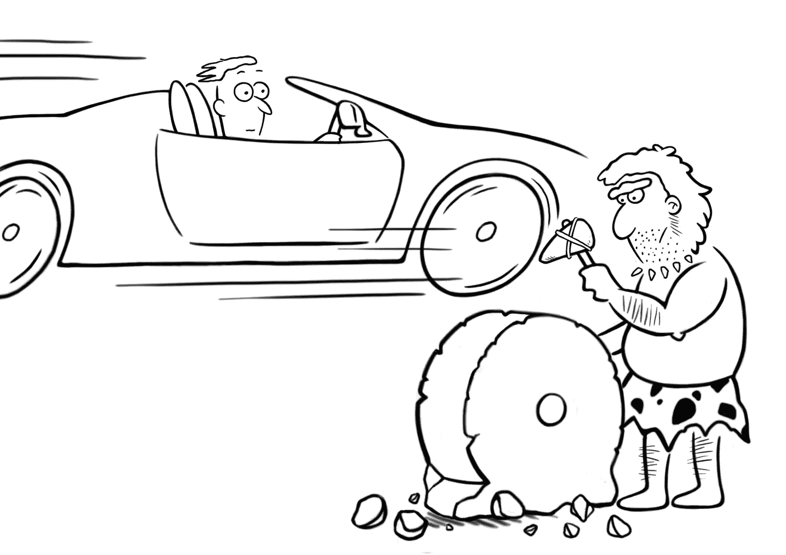

# 重新发明轮子

> 原文：<https://medium.com/nerd-for-tech/reinventing-the-wheel-f4a2152d9f27?source=collection_archive---------0----------------------->

我写代码。所以当我写代码时，我几乎本能地被迫重写已经存在的代码。假设我需要从 PDF 中提取一些文本。有很多种软件可以很好地做到这一点。但我的第一反应是尝试从头开始重写这个软件。

虽然我的一些计算机科学家、软件工程师和程序员同事对此感到惊讶，有时甚至批评这种行为…