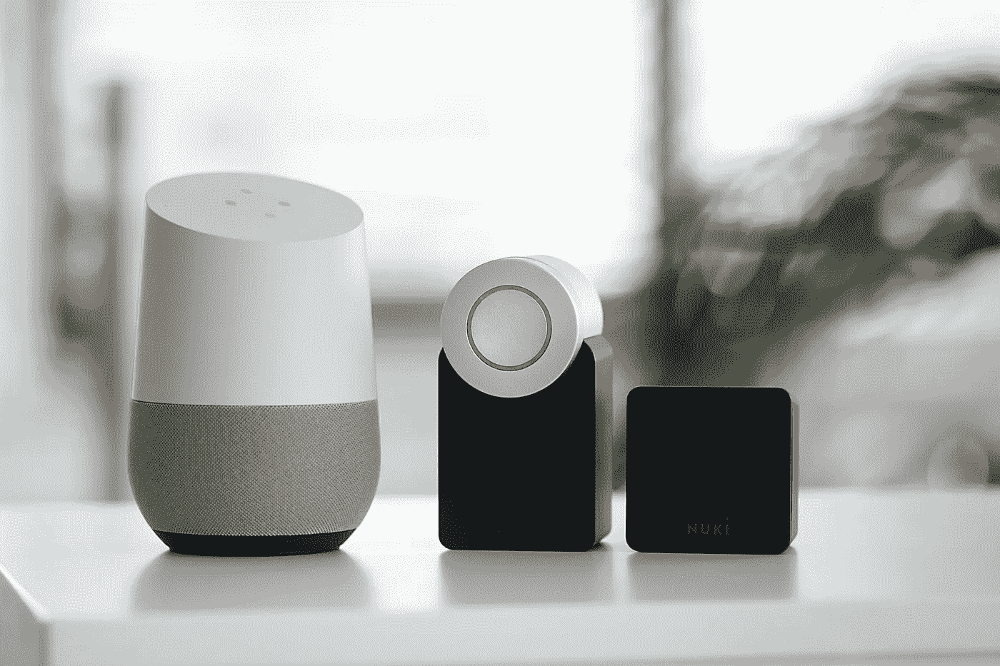

# 智能家居背后的相关算法

> 原文：<https://medium.com/nerd-for-tech/relative-algorithms-behind-smart-home-b1a1caec5df?source=collection_archive---------8----------------------->

## 人工智能与智能家居——第二部分

# 深度学习

深度学习由 Hinton 等人在 2006 年首次提出。深度学习的本质是一个人工神经网络，是指算法的集合，在多层神经网络上解决图像、文本等各种问题。深度学习的核心是特征学习，目的是通过一个层次化的网络获取特征信息，从而解决过去手工设计特征的重要问题。

深度学习是一个包含几个重要算法的框架:

*   卷积神经网络(CNN)
*   自动编码器
*   稀疏编码
*   受限玻尔兹曼机(RBM)
*   深度信仰网络(DBN)
*   递归神经网络(RNN)

深度学习从概念提出到现在已经应用了 14 年。对于不同的类型(图像、语音、文本)，需要选择不同的网络模型才能达到最佳效果。此外，强化学习和深度学习的结合近年来也创造了许多伟大的成果，比如 AlphaGo 就是其中之一。

## (1)人脸识别

图像识别是深度学习领域最受欢迎的应用。无论是深度学习还是其他机器学习方法(例如向量机)，图像识别都是研究的热门。这也是 ImageNet 竞赛产生的原因。ImageNet 通过建立强大的图像库，邀请各大 AI 研究人员测试算法的效果，促进了蓬勃发展，并导致了今天的 AI 领域。

## (2)语音识别

自 2009 年深度学习被引入语音识别领域以来，短短几年时间，TIMIT 数据集中基于传统高斯混合模型(GMM)的错误率从 21.7%下降到 17.9%，引起了业界的广泛关注。谷歌的 GoogleNow，苹果的 Siri，微软的 Skype Translator，科大讯飞都是基于深度学习的算法。语音识别目前发展的比较好，国内的一些方言现在已经可以准确识别了。

## (3)自然语言处理

自然语言处理(NLP)是通过构造计算算法来自动分析和表征人类自然语言的学科领域。自然语言处理有五个主要任务，**即分类、匹配、翻译、结构预测和顺序决策过程**。在这些任务中，单词、短语、句子、段落甚至文档通常被视为一系列标签(字符串)，尽管复杂性并不相同。

事实上，句子是应用最广泛的处理单位。**最近的研究表明，深度学习可以提高前四项任务的表现，并成为解决这些任务的最先进技术。**

如今，基于 NLP 的系统已经被广泛使用，比如谷歌强大的搜索引擎和亚马逊的语音助手 Alexa。此外，NLP 还可以帮助机器执行与复杂自然语言相关的任务，例如机器翻译和对话生成。

## 为什么高质量的训练数据对人工智能机器学习如此重要？

现在的人工智能也叫数据智能。在这个发展阶段，**神经网络的层数越多，需要的标记数据量就越大**。事实上，数据有着重要的作用。因此，从谷歌和微软到普通个人开发者，所有开发者都非常重视高质量的标签数据。

在当前的人工智能应用实践中，不同水平的数据质量显示出人工智能解决方案的价值有着非常明显的差距。如果说之前的算法模型使用的一般数据集是粗粮，那么算法模型目前需要的是定制的营养餐。如果公司想要进一步提高某些模型的商业化，他们必须逐步从通用数据集向前发展，以创建独特的数据集。

## NLP 服务

我们在电子商务、零售、搜索引擎、社交媒体等领域提供不同类型的自然语言处理。我们的服务包括语音分类、情感分析、文本识别和文本分类(聊天机器人相关性)。

ByteBridge 与全球 30 多个不同的语言社区合作，现在提供[数据收集和文本注释服务](https://tinyurl.com/3fdwyt6f)，涵盖**英语、中文、西班牙语、韩语、孟加拉语、越南语、印度尼西亚语、土耳其语、阿拉伯语、俄语等语言**。

# 结束

将你的数据标注任务外包给 [ByteBridge](https://tinyurl.com/3fdwyt6f) ，你可以更便宜更快的获得高质量的 ML 训练数据集！

*   无需信用卡的免费试用:您可以快速获得样品结果，检查输出，并直接向我们的项目经理反馈。
*   100%人工验证
*   透明和标准定价:[有明确的定价](https://www.bytebridge.io/#/?module=price)(包括人工成本)

为什么不试一试？

资料来源:https://zhuanlan.zhihu.com/p/136740483