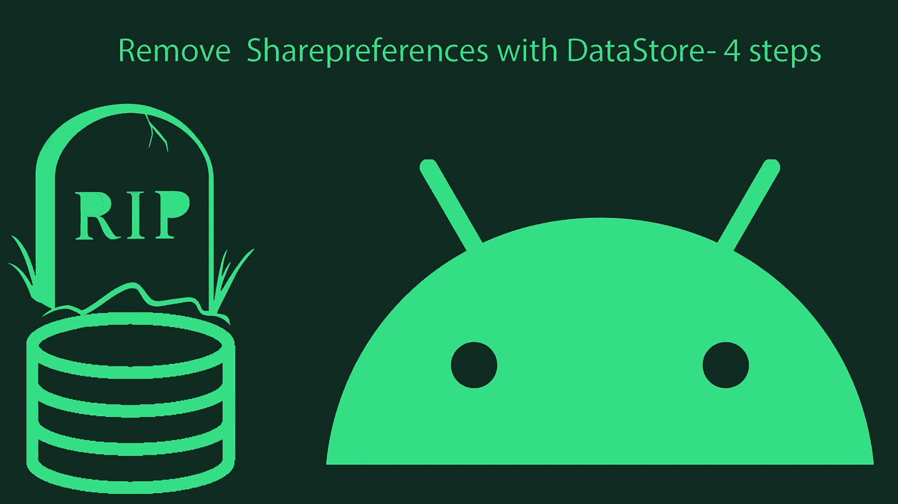
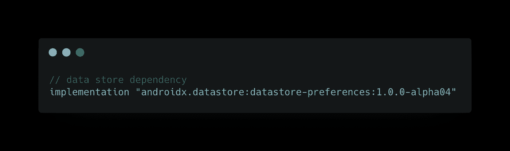
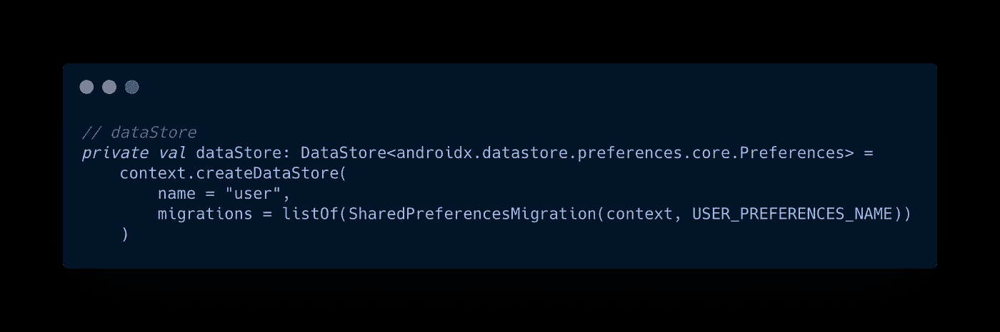
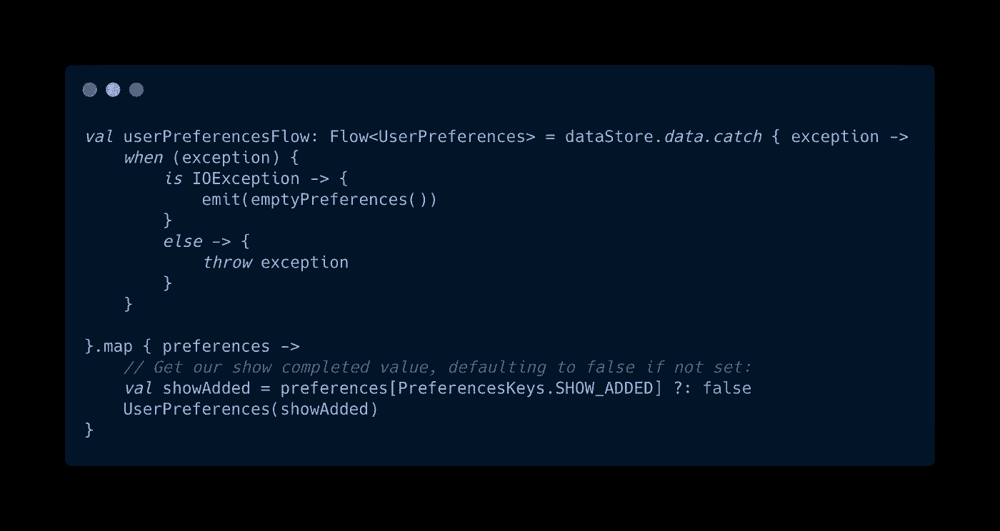
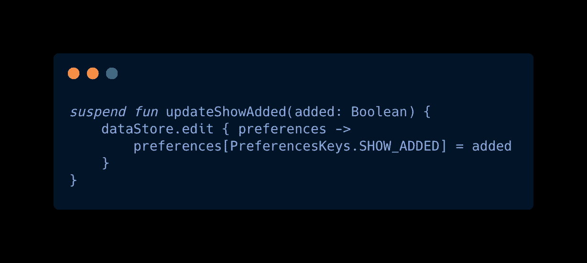
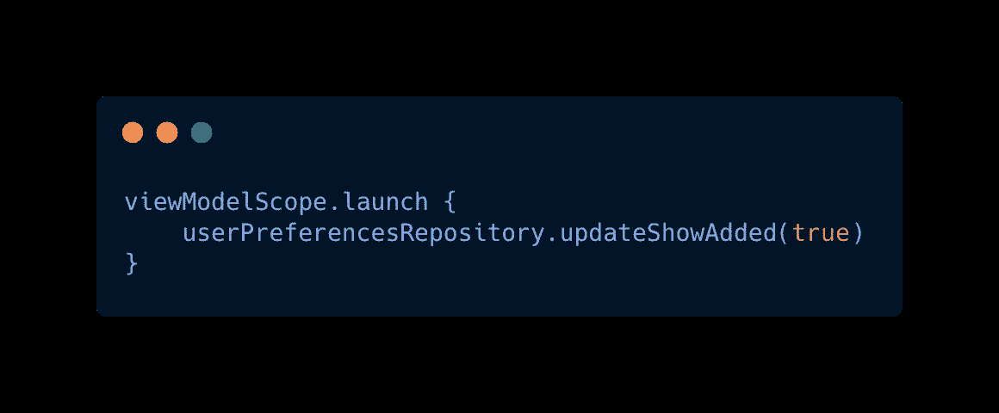

# 使用数据存储删除 SharedPreference 个步骤

> 原文：<https://medium.com/nerd-for-tech/remove-sharedpreference-with-datastore-4-steps-dc1c4f90a19b?source=collection_archive---------2----------------------->

# 在你的应用模块的 **build.gradle** 文件中添加依赖关系

# 创建数据存储

在这里，如果您想迁移已经存在于您的应用程序中的**共享参考**，请将其作为列表传递给**迁移**👆争吵

# 从数据存储中提取数据

在从数据存储中读取时，可能会有一个**异常**，它可以是 **IOException** 或其他任何东西，因此我们在流的顶部添加了 **catch** 来正确处理这种情况

> *数据存储返回流程*

# 将数据插入数据存储

**DataStore 是异步 API，构建在 Kotlin 协程和流**之上，因此我们在函数中添加了 **suspend** 关键字

## 参考

*   [https://developer . Android . com/topic/libraries/architecture/datastore](https://developer.android.com/topic/libraries/architecture/datastore)
*   **全码样本【https://github.com/navczydev/datastore】:**
*   [https://developer.android.com/kotlin/flow](https://developer.android.com/kotlin/flow)

# 👏👏👏👏快乐编码👏👏👏👏

# 保持联系

*   [领英](https://www.linkedin.com/in/navczydev/)
*   [推特](https://twitter.com/navczydev)