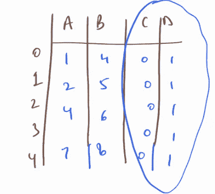
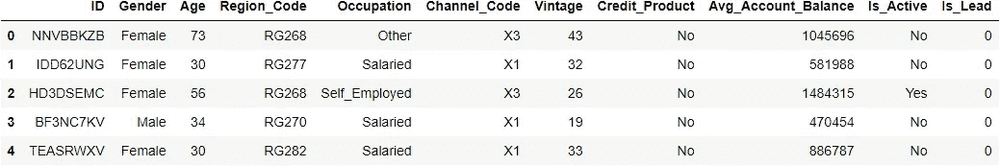
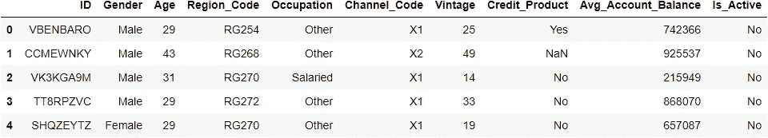
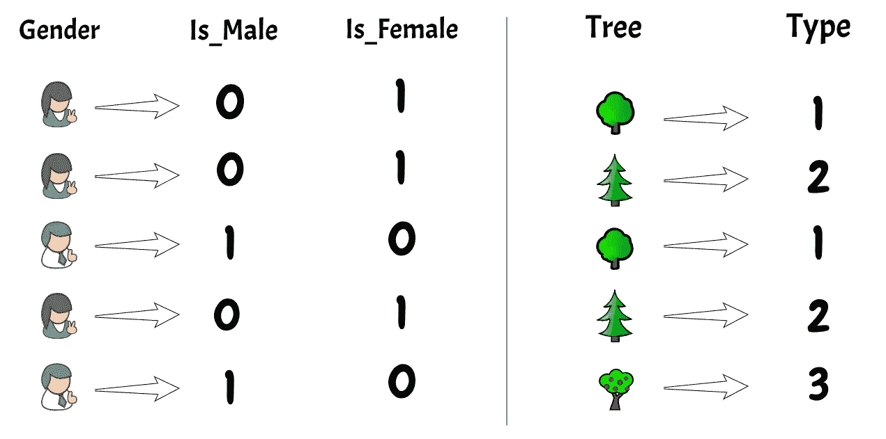
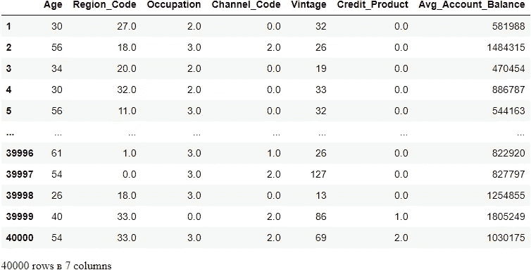

# 使用 VarianceThreshold 删除常量要素:要素选择-1

> 原文：<https://medium.com/nerd-for-tech/removing-constant-variables-feature-selection-463e2d6a30d9?source=collection_archive---------0----------------------->

## 使用 Python 变量阈值移除常量/准常量预测值的最直接指南

**在本指南中，您将准确阅读在进行特征选择时移除恒定特征所需的内容。**


[图像参考](https://www.walpaperlist.com/2020/01/beautiful-wallpaper-rainbow-rose.html)

*常量要素在数据集中的所有观测值中显示相似/单一值。这些特征不提供允许 ML 模型预测目标的信息。*



这里的 c、D 列是常量特征

**预测因子的高方差:良好的指示**

**低方差预测值:对模型不利**

我们可以使用 Sklearn 的方差阈值来丢弃常量特征。

**参考官方文件**:[https://sci kit-learn . org/stable/modules/generated/sk learn . feature _ selection。VarianceThreshold.html](https://scikit-learn.org/stable/modules/generated/sklearn.feature_selection.VarianceThreshold.html)

你可以在我的 GitHub 上找到完整的代码文件和数据集:[https://github.com/shelvi31/Feature-Selection](https://github.com/shelvi31/Feature-Selection)

## 差异阈值:

方差阈值是一个要素选择器，用于从数据集中移除所有在建模中没有太大用处的低方差要素。

它只关注特征(x)，而不是期望的输出(y)，因此可以用于无监督学习。

阈值的默认值为 0

*   如果方差阈值= 0(移除恒定特征)
*   如果方差阈值> 0(移除准常数特征)

## Python 实现:

```
import pandas as pd
import numpy as np# Loading data from train.csv file
train_df = pd.read_csv("train data credit card.csv")
train_df.head(5)
```



```
train_df.shape(245725, 11)
```

## 缩短庞大的数据集

```
train = train_df.loc[1:40000,:]
train.shape(40000, 11)
```



```
#Filling Null values if anytrain = train.fillna("None")
```

## 删除 ID 列，定义目标

```
train1 = train.drop(["ID","Is_Lead"],axis=1)
y = train["Is_Lead"]
```

因为方差阈值只能对数字数据起作用。我们需要首先转换另一个非整数/非浮点列的数据类型。为此，我们将使用一个顺序编码器。



[图像参考:中等](https://www.google.com/url?sa=i&url=https%3A%2F%2Fmedium.com%2Fanalytics-vidhya%2Ftypes-of-categorical-data-encoding-schemes-a5bbeb4ba02b&psig=AOvVaw0ARUG45y3UZ9_hSZuzrEVJ&ust=1623853386354000&source=images&cd=vfe&ved=0CA0QjhxqFwoTCKDQvfbrmfECFQAAAAAdAAAAABAD)

## 要查看每列中唯一值的数量:

```
train1.nunique(axis=0)Gender                     2
Age                       62
Region_Code               35
Occupation                 4
Channel_Code               4
Vintage                   66
Credit_Product             3
Avg_Account_Balance    35278
Is_Active                  2
dtype: int64
```

## 使用顺序编码器:阈值处理前需要

在顺序编码中，每个唯一的类别值都被赋予一个整数值。比如“红”是 1，“绿”是 2，“蓝”是 3。这称为序数编码或整数编码，很容易逆转。通常，使用从零开始的整数值。

```
# import ordinal encoder from sklearn
from sklearn.preprocessing import OrdinalEncoder
ord_enc = OrdinalEncoder()

# Transform the data
train1[["Gender","Region_Code","Occupation","Channel_Code","Credit_Product","Is_Active"]] = ord_enc.fit_transform(train1[["Gender","Region_Code","Occupation","Channel_Code","Credit_Product","Is_Active"]])
```

## 主要代码:

## 定义和拟合阈值

对于一个非常大的子集具有相同值的准常数要素，使用阈值 0.01 将意味着删除 99%的值相似的列。

```
from sklearn.feature_selection import VarianceThreshold

var_thr = VarianceThreshold(threshold = 0.25) #Removing both constant and quasi-constant
var_thr.fit(train1)

var_thr.get_support()array([False,  True,  True,  True,  True,  True,  True,  True, False])
```

输出:

*   真:高方差
*   错误:低方差

## 选取低差异列:

按照我上面的代码，我删除了 75%或更多相似的列(您可以保留您喜欢的任何值)

```
concol = [column for column in train1.columns 
          if column not in train1.columns[var_thr.get_support()]]

for features in concol:
    print(features)Gender
Is_Active
```

## 删除低差异列:

```
train1.drop(concol,axis=1)
```



```
train1.columnsIndex(['Gender', 'Age', 'Region_Code', 'Occupation', 'Channel_Code', 'Vintage',
       'Credit_Product', 'Avg_Account_Balance', 'Is_Active'],
      dtype='object')
```

这就是我们如何看到哪些列具有高方差，从而有助于更好的模型。在应用阈值之前，不要忘记将列 dtype 转换为 integer 或 flow。

一旦确定了低方差列，就可以随时反转编码，用原始数据继续您的旅程。另外，在预测结果之前，不要忘记从测试数据中删除相同的列！:)

干杯！

谢尔维·❤

**参考文献:**

*   [https://sci kit-learn . org/stable/modules/generated/sk learn . feature _ selection。VarianceThreshold.html](https://scikit-learn.org/stable/modules/generated/sklearn.feature_selection.VarianceThreshold.html)