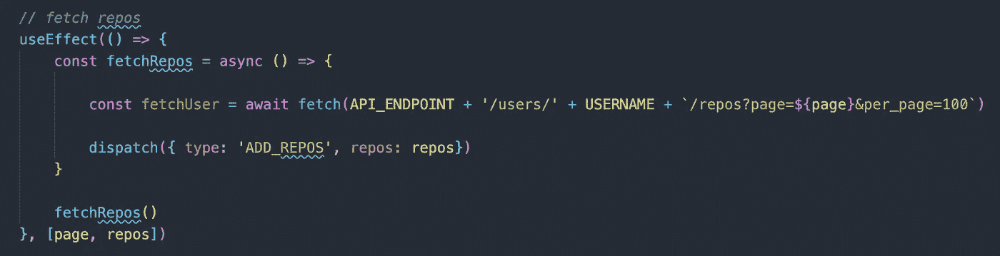
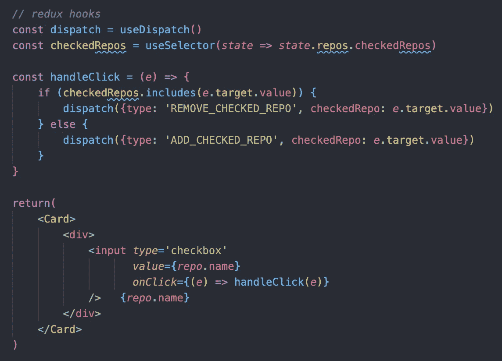
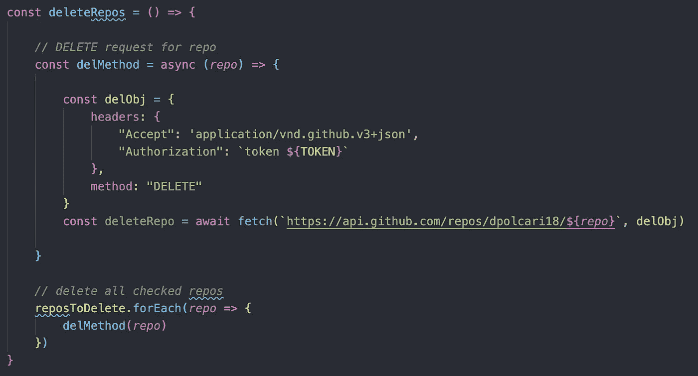

# 使用 JavaScript 删除 GitHub Repos

> 原文：<https://medium.com/nerd-for-tech/removing-repos-with-javascript-baba54fabeb0?source=collection_archive---------22----------------------->


乔舒亚·索蒂诺经由 unsplash.com[拍摄](https://unsplash.com/photos/LqKhnDzSF-8)

我最近完成了熨斗学校的沉浸式软件工程训练营。从兴奋中平静下来后，我很快切换到找工作模式。我的任务清单中有一部分是“清理”我的 GitHub。所以我用一些很酷的徽章和图片定制了我的[个人资料](https://github.com/dpolcari18)，然后意识到我有超过 300 个回复需要删除。

这些 repos 都是我们作为训练营的一部分建立的实验室，只有大约 15 个是我建立和/或合作的项目。我知道我需要摆脱这些，但不确定最好的方法是什么。GitHub 有一个分步指南[告诉你如何手动操作，分六步，其中一步是输入你的用户名和回购名称。](https://docs.github.com/en/github/administering-a-repository/deleting-a-repository)

如果你读过我以前的任何一篇文章，你可能会发现一个围绕着某种类型的*效率*和/或不做任何不必要的工作的主题。出于好奇，我计算了一下自己的时间，用了**23 秒**手动删除了一个回购。在这一点上，我认为必须有一个更好的方法来做到这一点。

在谷歌上快速搜索了几下后，我被介绍给了 GitHub API，并毫不惊讶地发现了一种让[删除](https://docs.github.com/en/rest/reference/repos#delete-a-repository)你的回购请求的方法。我现在要做的就是测试我新学到的编程技能。我想到的是一个非常简单的 React 应用程序，它可以按名称获取并显示你所有的回购，并允许你一次检查多个回购，然后删除它们。我是这样做的:

1.  为您的回购提出 GET 请求

GitHub 在其 REST API 中提供了以下端点，用于检索特定用户的 repos 列表。

```
GET https://api.github.com/users/{username}/repos
```

你所需要的是你的用户名来发出请求。下面是我的代码。



如你所见，当我的应用程序渲染时，我使用了`useEffect`钩子来调用 fetch。我使用 Redux 进行状态管理，并将 repos 数组存储在 state 中。这完全是矫枉过正，我只是想复习一下 Redux，并且可能应该用 React state 来完成以保持简单。关于这一步的最后一个注意:GitHub 将结果限制在每页 100 个，这就是你看到`page=${page}&per_page=100`的原因。

2.启用多选复选框

为了保持简洁，我跳过了在屏幕上显示各个回复的步骤。一旦它们出现在那里，我就使用复选框将各个 repos 添加到我的 Redux 状态的新数组中，代码如下:



3.为您选择的回购提出删除请求

这一步花了大部分时间来解决。我要做的第一件事是在 GitHub 中创建一个 OAuth 令牌，允许我的程序删除我账户上的回购。遵循 GitHub 的这个[指南](https://docs.github.com/en/github/authenticating-to-github/creating-a-personal-access-token)并确保在选择范围和权限时选择`delete_repo`。此外，请确保在单击关闭该页面之前将密钥复制到您的项目中，因为您将无法再次看到该密钥。

我使用以下端点来发出删除请求。`{owner}`是你的 GitHub 用户名，`{repo}`只是回购名称。

```
DELETE https://api.github.com/repos/{owner}/{repo}
```

对我来说，最棘手的部分是找出要使用的正确标题。我提出的大多数请求都使用了`accept: 'application/json'`头，但是 GitHub 更喜欢你使用`accept: 'application/vnd.github.v3+json'`。需要的另一个头是`authorization: `token ${token}``，其中 token 是上面创建的 OAuth 令牌。

一旦我把标题整理好了，剩下的就很容易了。我所要做的就是遍历我选择删除的 repos 数组，并提交删除请求。以下是我使用的代码:



有了这一切，我终于把我的 300+回购减少到一个很好的可管理的数字，我用我认为大多数程序员更喜欢的方式做了这件事，用一个自动化的、可重用的解决方案，而不是蛮力的、耗时的方法。

话虽如此，这个*确实比两个小时花了我更多的时间*，据我估计，手动的话我会花更多的时间。但这一次这不是重点。关键是我能够扩展我的编程技能来解决问题，并在这个过程中使用新的 API。谁知道呢，也许其他人会看到这个回购，并用它来清理他们的 GitHub。

一如既往，我很乐意在下面的评论中听到你们对这个话题的任何想法或建议！