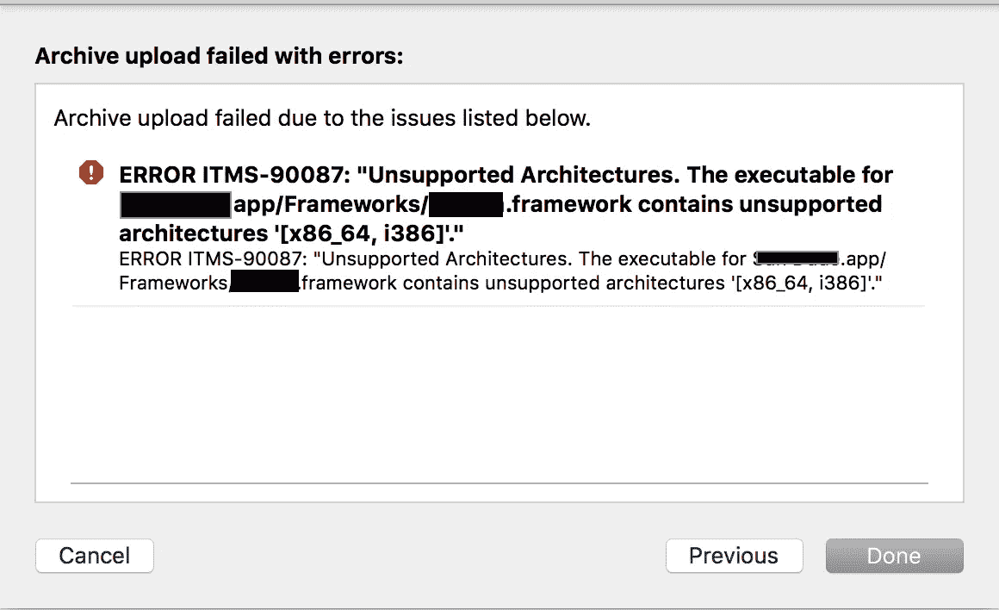
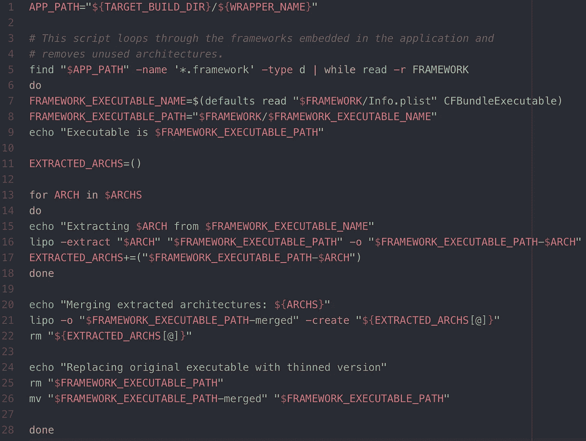
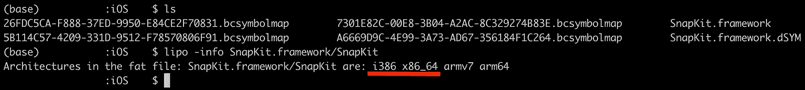
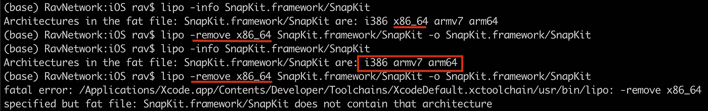
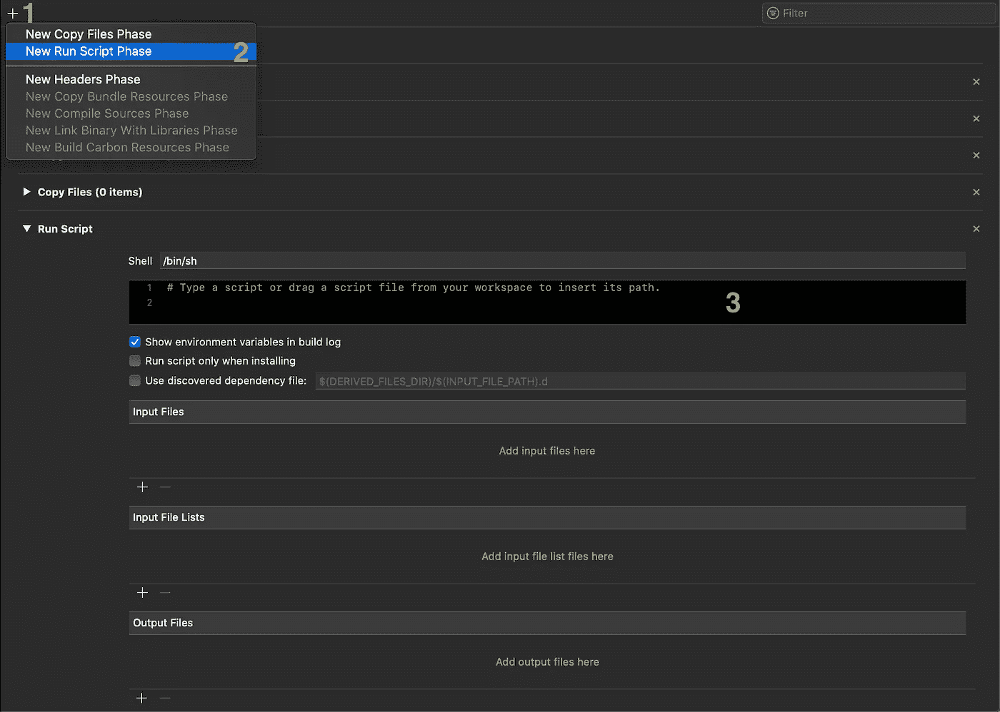
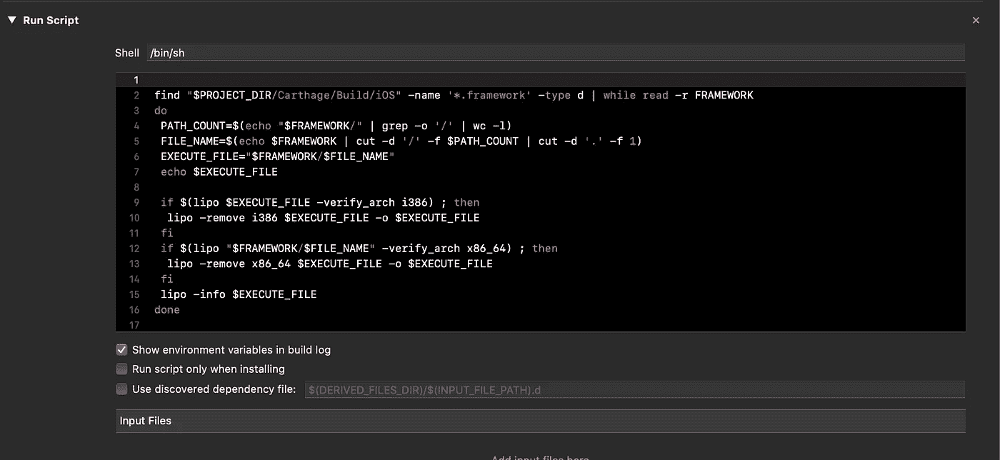

# 从框架中删除模拟器体系结构[x86_64，i386]

> 原文：<https://medium.com/nerd-for-tech/removing-simulator-architecture-from-framework-x86-64-i386-d8c4218b8e1?source=collection_archive---------0----------------------->

你好 iOS 介质阅读器！

几天前，我在上传应用程序到应用商店时遇到了问题。这个问题促使我写了第一篇文章。让我们开始吧:

那么问题出在哪里？问题在于上传应用程序到 App Store 时出现的这条迷人的信息:

这条消息意味着你的 ***。添加到您的项目中的框架*** 文件包含被禁止的架构 **x86_64** 和 **i386** 。

一如既往,**堆栈溢出**为我们提供了一个解决方案，其中一个建议的解决方案是:

[https://stack overflow . com/questions/42641806/check-and-remove-unsupported-architecture-x86-64-i386-in-IPA-archive？answertab=votes#tab-top](https://stackoverflow.com/questions/42641806/check-and-remove-unsupported-architecture-x86-64-i386-in-ipa-archive?answertab=votes#tab-top)

上述解决方案在我的项目中运行良好，直到我不得不将 Mac 上的操作系统升级到 Catalina。

对于那些没注意到的人，更新后说明 ***。框架*** 文件被当作一个目录。所以看起来不会是这样的:

看起来会像一个:

由于这一行代码，这种细微的差别在您的脚本中造成了巨大的混乱:

负责在***$ APP _ PATH***(“***$ APP _ PATH”***是我们框架所在的路径)找到带有**的文件。框架**扩展。乍一看，一切似乎都很好……几分钟后，我意识到 ***。框架*** 文件现在是一个目录，代码的`*framework '末尾缺少了`/`。正确的条目应该如下所示:` *。框架/`。

知道我在代码中添加了这个缺失的元素，并希望修复这个问题。但是问题还是出现了...

因此，我决定寻找一种不同的解决方案，并创建自己的脚本来消除这种有缺陷的架构。

# 如何**检查**框架是否包含被禁止的架构？

要回答这个问题，我需要在中的可执行文件上使用带有 **-info** 选项的 **lipo** 命令。框架目录。

> M 矿石信息关于**脂**命令:**https://ss64.com/osx/lipo.html**T43

我将以[**snap kit . framework**](http://snapkit.io)**为例:**

****

**巴什:脂肪信息 SnapKit.framework/SnapKit**

# **如何**去除**被禁建筑？**

**答案是再次使用 **lipo** 命令**T5，这一次用 **-remove** 选项:****

****

**bash:lipo-remove x86 _ 64 SnapKit.framework/Snapkit-SnapKit.framework/Snapkit**

**到目前为止一切顺利。在这一点上，我可以检查框架包含的架构，并删除不必要的架构。**

**现在我已经得到了创建该脚本所需的一切，我需要检查可执行文件是否包含我想要删除的架构，因为如果不包含，我将得到如下所示的致命错误:**

****

**bash:当我试图删除不存在的架构时出现致命错误**

**为了解决这个问题，我需要再次使用 **lipo** ，这次使用 **-verify_arch** 选项。稍后我会解释如何使用它。**

**现在我有了创建脚本所需的所有必要元素。**

**如果您从未在 Xcode 中创建过运行脚本，请转到项目**构建阶段**并遵循以下截图中的步骤:**

****

**xcode-->构建阶段-->+-->新运行脚本阶段**

# **最终脚本:**

****

**这个脚本中发生了什么:**

*   **首先，我需要找到框架目录的所有路径，例如:“myawesompoject/Carthage/Build/iOS/snap kit . framework/”并重复它，直到我找到所有正在发生的可能性，**
*   **对于每个找到的路径:**
*   **计算由“/”分隔的单词数，取最后一个，在“.”之前的“cut”单词,**
*   **获取 ***中可执行文件的路径。框架*** 目录，例如:"SnapKit.framework/SnapKit"。**
*   **打印找到的文件名(用于检查)，**
*   **检查可执行文件是否包含搜索到的体系结构，**
*   **移除不必要的架构，**
*   **打印包含的架构(也用于检查目的)。**

**第一次归档项目时，架构可能不会被删除。当这种情况发生时，只需再次存档。**

> **提示:在归档项目之前，最好复制您的 ***。*** 框架目录到另一个地方。当脚本完成工作时，可执行框架文件将不再包含架构模拟器，因此您将需要使用 Carthage 再次构建您的依赖项，并在模拟器上运行它。**

**希望那篇文章对某人有帮助:)**

**谢谢，祝你好运！**

**脚本要点:
[https://gist . github . com/Rafal-Prazynski/74b 910 FBA af 27540742 DAC 49 a 84843 ff](https://gist.github.com/Rafal-Prazynski/74b910fbaaf27540742dac49a84843ff)**

## **出于好奇:**

> **1)我调查了一下为什么第一次没有移除架构。结果是，在脚本运行之前，框架已经被复制了。这解释了为什么在第二次尝试后归档会正确运行。**
> 
> **2)如果您想了解更多关于 ipo 指令的信息，请访问以下网站:【https://ss64.com/osx/lipo.html】**