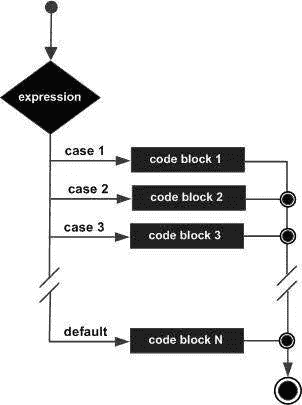
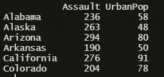
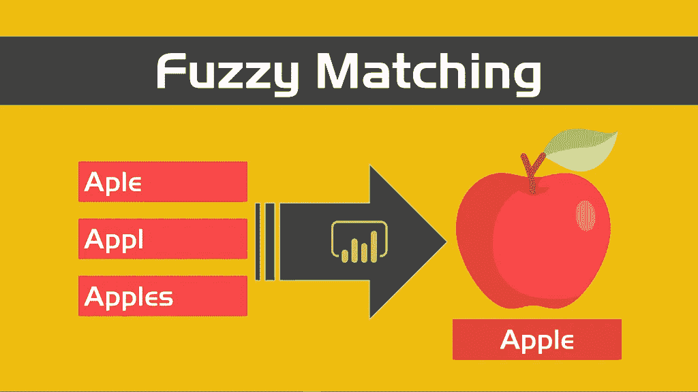
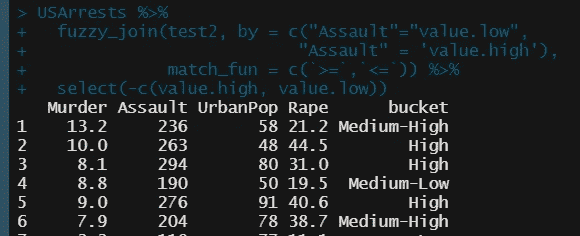

# 用 R 中的连接替换 case_when()

> 原文：<https://medium.com/nerd-for-tech/replacing-case-when-with-joins-in-r-76db708b17f4?source=collection_archive---------3----------------------->

我曾经发现自己编写了大量的`ifelse()`或`case_when()`语句来重新编码值或创建新列——直到有人告诉我可以使用 join 来代替。



case_when()的概念图

# 如何用连接替换 case_when()的示例。

让我们在 R 中使用一个公共数据集:



使用攻击和城市人口列的美国记录

通过运行一个快速的最小/最大集合函数，我们可以看到最小攻击是`45`，最大攻击是`337.`

假设我们想要创建一个新的列来表示大量的攻击:高攻击、中高、中、中低和低攻击？

我们可以做一个`case_when()` …

```
USArrests %>%
  mutate(buckets = case_when(Assault >= 300 ~ "High",
                      Assault < 300 & Assult >= 250 ~ "High-Medium",
                      Assault < 250 & Assult >=200 ~ "Medium",
                      Assault < 200 & Assult >=150 ~ "Medium-Low",
                      Assault < 150 ~ "Low")) 
```

它可以工作，但是很快就变得很麻烦，我不认为这是优化。相反，我们可以创建一个引用表，然后使用一个`fuzzy_join()`。你也可以用`left_join()`来做这件事，但是我认为`fuzzy_join`是最好的选择，所以我将展示它。

*注:如果我有几个类别，我就只做一个* `*case_when()*` *或者* `*if_else()*` *。为了简单起见，我举了一个包含几个类别的例子。我也很喜欢使用其他函数的连接来创建引用表，我会用它来创建多个数据集，而不是复制大型的* `*case_when()*` *或* `*if_else()*` *语句。*



fuzzy_join()的一般示例

# fuzzyjoin::fuzzy_join()

创建参考数据框:

```
ref.df <- data.frame(
             bucket = c(“High”, “Medium-High”, “Medium-Low”, “Low”),
             value.high = c(max(USArrests$Assault), 249, 199, 149),
             value.low = c(250, 200, 150, min(USArrests$Assault)))
```

上面，我知道我想要高低桶来分别包括最大和最小攻击。为了使用硬编码值的例子，我只是创建了随机桶。

接下来，使用`fuzzy_join()`匹配您的高值和低值之间的值:

```
USArrests %>% 
  fuzzy_join(ref.df, 
                    by = c("Assault"="value.low",
                           "Assault" = 'value.high'), 
             match_fun = c(`>=`,`<=`)) %>% 
  select(-c(value.high, value.low))
```

## fuzzy_join()逐行:

1.  在您要加入的数据帧中加入管道(主 df)
2.  调用函数并输入参考数据帧
3.  我们要匹配低(`value.low`)和高(`value.high`)。
4.  接下来，`match_fun()`会告诉 R 你想要如何匹配每一个。`match_fun()`中的第一个参数与`by = c()`中的第一个参数一致，第二个参数与`by = c()`中的第二个参数一致。我在这里做的是说:匹配如果`Assault`大于或等于(`≥`)到`value.low` **，如果** `Assault`小于或等于(`≤`)到`value.high`。`match_fun()`接受任何逻辑运算符。如果这很混乱，你可以把它想象成`between()`。。
5.  最后，我使用`select(-c)`从最终的数据帧中删除了不必要的列。

结果是:



所有的方法都可以让你得到相同的结果，并有他们的位置。对于我想重用的许多类别(与示例不同)或代码，我倾向于使用`fuzzy_join()`选项，因为在我看来，它更具可伸缩性，更容易出错。

在我的 Github 上，我还有其他关于如何使用日期的例子。