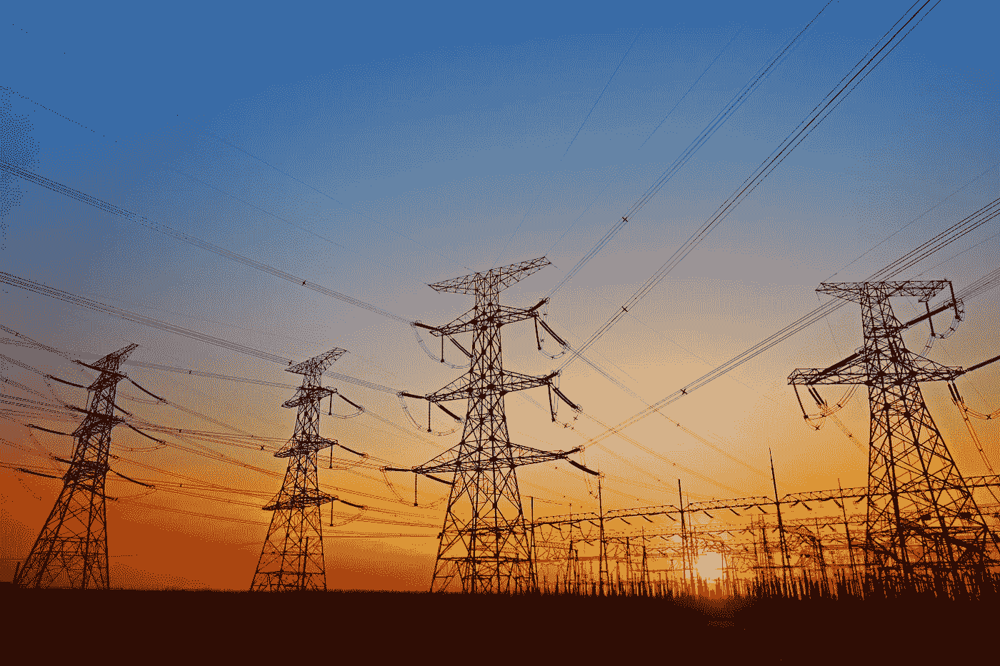

# 报告:关键基础设施漏洞达到创纪录水平

> 原文：<https://medium.com/nerd-for-tech/report-critical-infrastructure-vulnerabilities-at-record-levels-bf44f38ff100?source=collection_archive---------6----------------------->

这是关于互联网连接的经典好消息/坏消息。便利是诱人的。成本节约也是如此。提高效率具有良好的商业意义。但是上网的风险会破坏所有这些优势，尤其是如果一个组织没有为此做好准备的话。

这就是工业控制系统(ICSs)的故事，它运行着美国的许多关键基础设施——电力和其他能源、水、下水道、交通等等。

工业网络安全公司 Claroty 在其最近的[半年期 ICS 风险和漏洞报告](https://claroty.com/wp-content/uploads/2021/08/Claroty_Biannual_ICS_Risk_Vulnerability_Report_1H_2021.pdf)中写道，“资产以创纪录的数量暴露在网上，随之而来的是它们所有的瑕疵:未打补丁的漏洞、不安全的凭证、薄弱的配置，以及使用过时的工业协议。”

所有这些都相当于一个组织的数字版本，让门、保险库和所有文件柜大开着。

Claroty 报告称，2021 年上半年在 ICSs 中发现的漏洞数量比前六个月增加了 41%，达到 637 个，影响了 76 家供应商。更糟糕的是，这些漏洞中的大多数被评为高或严重严重性，需要较低的攻击复杂性，可被远程利用，不需要访问权限，并可能导致 ICS 可用性的完全丧失。

当然，不仅仅是研究人员注意到了这些事情。网络罪犯也是如此。该报告没有统计有多少攻击试图利用这些漏洞，但确实列举了今年引起国际关注的几起[事件，包括针对 Colonial Pipeline 和 JBS 食品公司的勒索软件攻击，以及试图在佛罗里达州奥尔德斯马尔的饮用水下毒。](https://armerding.medium.com/securing-critical-infrastructure-takes-securing-control-systems-82d35b4b9c03)

但是，即使攻击还没有像漏洞那样猖獗，这些攻击对殖民地和 JBS 的影响也是巨大的——主要的燃料和食品供应中断导致价格飙升和数百万美元的付款。

它们已经严重到足以引起联邦政府的高度关注。

*   国土安全部运输安全管理局(TSA)在 7 月发布了一项安全指令“要求运输危险液体和天然气的 TSA 指定的关键管道的所有者和运营商实施一系列迫切需要的网络入侵防护措施。”在此之前，5 月份的一份指令要求关键管道的运营商“(1)向 CISA 报告已证实和潜在的网络安全事件；(2)指定一名网络安全协调员，每周 7 天、每天 24 小时待命；(3)审查目前的做法；以及(4)确定任何差距和相关补救措施，以应对网络相关风险。”
*   6 月，联邦网络安全和基础设施安全局(CISA)发布了[“运营技术资产面临的勒索软件威胁日益增加”，](https://www.cisa.gov/publication/ransomware-threat-to-ot)一份详细描述“运营技术资产和控制系统”面临的威胁的情况说明书
*   拜登总统于 7 月 28 日发布了一份[国家安全备忘录](https://www.whitehouse.gov/briefing-room/statements-releases/2021/07/28/national-security-memorandum-on-improving-cybersecurity-for-critical-infrastructure-control-systems/)，建立了一个工业控制系统网络安全倡议，被描述为“联邦政府和关键基础设施社区之间的自愿合作努力，以显著改善这些关键系统的网络安全。”他说，目标是鼓励使用“提供威胁可见性、指示、检测和警告的技术和系统，以及在基本控制系统和操作技术网络中促进网络安全响应能力的技术和系统。”
*   就在上周，在白宫与拜登举行的会议上，世界上一些最大的科技公司的负责人承诺花费数十亿美元进行网络安全培训，并改进安全技术。白宫表示，拜登召集此次会议是为了讨论银行、能源和水务行业的私营部门关键基础设施实体为改善网络安全和与政府合作所做的努力。苹果公司的蒂姆·库克、微软公司的塞特亚·纳德拉、亚马逊公司的安迪·贾西、Alphabet 公司(谷歌母公司)的桑德尔·皮帅和 IBM 公司的阿文德·克里希纳都出席了会议。

会后，白宫表示，国家标准和技术研究所将与私营部门合作，制定新的指导方针，以建立安全技术并评估技术的安全性，包括开源软件。

但是，八年多前，奥巴马总统发布了一项关于改善关键基础设施网络安全的行政命令。从那以后，这个问题变得更加严重。

美国国家安全局(National Security Agency)前高级顾问兼监察长乔尔·布伦纳(Joel Brenner)在 2017 年 3 月题为[“保持美国安全:走向更安全的关键部门网络”](https://internetpolicy.mit.edu/critical-infrastructure-2017/)的报告中写道，“控制美国和其他大多数国家关键基础设施的数字系统很容易被渗透，在架构上也很脆弱，我们很久以前就知道了。”

在后来的[博客文章](https://www.lawfareblog.com/what-trump-administration-must-do-protect-critical-infrastructure)中，他宣称，“自 90 年代以来，白宫一直在发布无效的指令来解决关键网络的问题。"

**一个沉重的遗留升降机**

那么，为什么 ICS 的安全性还没有大幅度提高呢？因为这是一个难以解决的复杂问题。

首先，美国的许多关键基础设施被安全专家委婉地称为“遗产”。这不是赞美。这意味着，虽然它被设计为可以安全运行很长时间——几十年——但它最初并不是为了连接到互联网而设计的。

在过去，处理这一问题的一种技术含量较低但有效的方法是“空气间隙”——使 ICSs 的操作部分脱离互联网，并与互联网上的任何其他计算机(如信息技术(IT)网络)断开连接。

虽然空气间隙不能保证安全，但它使恶意软件更难从一个系统跳到另一个系统。

正如近三年前《安全周刊》( Security Week)所说的那样,“空中间隙”的使用意味着“工厂和造船厂或多或少可以免受网络攻击”

但即使在那时，由于运营技术(OT)和信息技术日益交织在一起，这种差距正在消失或完全消失。随着空气间隙的消失，集成电路的漏洞更容易被黑客远程利用，正如 Colonial Pipeline 和 JBS 的攻击所证明的那样。

那么为什么不直接更新和修补 ICSs 中的漏洞呢？这也很复杂——比在你的手机或笔记本电脑上下载一个应用程序的免费补丁要复杂和昂贵得多。这通常意味着让系统供应商安装补丁并重新测试系统，以确保其正常工作。许多人会为此收费。

这也可能是一场日程安排的噩梦——提前六个月进行计划，以便在非常有限的时间内关闭系统。事实上，Claroty 的研究员陈·弗拉德金在一篇博文中承认“补丁和产品更新需要停机时间，这在许多领域是不可容忍的。”

**深厚的技术债务**

最后，有时补丁可能与旧的操作系统不兼容。

Synopsys 软件完整性小组的首席科学家萨米·米格斯(Sammy Migues)表示，ICS 安全是一个棘手的问题，这在很大程度上是由于大量的“技术债务”，即更新 ICS 所需的资金。

“我们可能会在拜登总统的基础设施法案上花费 100 亿美元，但可能仍然无法让 ICS 安全与当前的威胁模型相匹配，”他说，“可能是因为当前的许多软件仍然不安全，没有足够的芯片来再造美国的每一台 ICS 设备，谁会重新安装它们呢？”

这并不意味着 ICS 的所有者和运营商不能提高他们的安全性。米格斯说，他们可以，而且肯定应该做出努力，“以一种经过深思熟虑和优先考虑的方式。

“例如，参见 [ISA/IEC 62443](https://www.isa.org/certification/certificate-programs/cybersecurity) ，”他补充道，这是“世界上唯一基于共识的自动化网络安全标准系列，也是政府网络安全计划的关键组成部分。该项目涵盖了工业自动化和控制系统评估、设计、实施、操作和维护的整个生命周期。

Claroty 报告还提供了一个缓解措施列表，即使无法打补丁也有帮助，从网络分段开始——不是像空气间隙那样完全断开，而是将网络划分为多个组成部分，以便管理员可以限制对 ot 系统的访问。

他们还应该限制员工访问员工工作所需的内容，即最低权限原则，并要求安全的远程访问。这有助于检测和防止勒索软件、网络钓鱼和垃圾邮件。

Migues 说，重要的是要意识到，ICS 安全需要同时关注系统的数字和物理组件。虽然更好的软件安全性至关重要，但佛罗里达州 Oldsmar 事件表明，攻击者不应该能够使用远程访问来改变供水系统的处理方式。

他说，他不会责怪奥尔德斯马尔在资源有限的情况下尽了最大努力。“但是，也许把饮用水变成致命的是你需要开车去工作，进入大楼，并登录去做的事情，”他说。

“如果我们想要在实际监测和/或控制动力学事件的 OT 中获得更多的安全性，我们需要在使这些东西现代化、可操作和可管理方面进行更多的投资，”他补充道。“我们绝对不应该用软件取代物理和化学。我们确实需要在 IT 和 OT 之间投资软件，以双重检查物理和化学的说法，但当软件认为它比汩汩的排水泵更聪明时，不要单方面推翻它。”

**不神奇，但细致入微**

总的来说，专家说 ICS 运营商需要遵循已经存在了 20 年的建议。

Synopsys 软件完整性小组的首席安全顾问 Michael Fabian 说:“在 ICS 环境中管理安全没有真正的黑魔法。“就人们应该做什么而言，这与你如何对待其他系统类似，但由于每个系统或垂直行业的独特特征，还有一层细微差别。”

他说，集成电路的安全方法、控制和要求应该基于 ISA/IEC 62443，“因为它是最成熟、最全面的行业标准。”

但是 Fabian 承认这可能很困难。他说:“总体而言，安全目标和技术得到了很好的理解，或者应该得到很好的理解。”。“但是在给定环境中应用它们需要理解技术、它如何做它做什么、它的用户的需求、操作和维护因素以及其他因素，以开发如何将这些目标应用于该环境。这就是人们失败的地方，尽管存在内部组织因素，如资金或战略差异。”

他说，创建一个清单并“用一些技术来‘修复’它是行不通的”，因为组织必须分析、理解和规划他们的安全目标是什么，以及如何在他们的环境中应用它们。

“组织只是在整体上挣扎——这与 it 网络安全挑战没有太大区别，”他说。