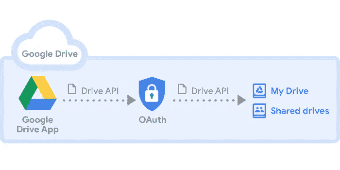
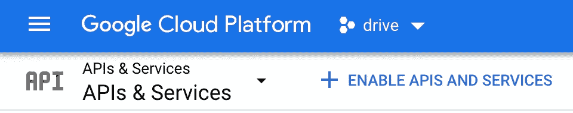
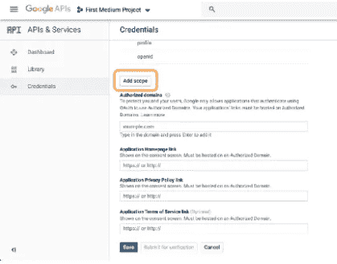

# 使用 Python 从 Google API 请求/获取文件

> 原文：<https://medium.com/nerd-for-tech/request-get-files-from-google-api-with-python-f6dab75681ae?source=collection_archive---------9----------------------->



> 本文介绍了如何首先设置 Google Drive API，然后创建一个 python 脚本来下载文件。

在[谷歌云平台](https://console.cloud.google.com/apis/library?folder=&organizationId=&project=drive-1605468482834)中提供了不同种类的 API 库。

但是我们感兴趣的是 [Google Drive API](https://console.cloud.google.com/apis/library/drive.googleapis.com?id=e44a1596-da14-427c-9b36-5eb6acce3775&project=drive-1605468482834) 。

# 创建您的项目

首先，你应该在 Google 开发者控制台中创建一个项目。

```
[https://accounts.google.com/o/oauth2/v2/auth](https://console.developers.google.com/)
```

然后如下:

> 点击启用 API 和服务



当您启用它时，您可以使用 API 发出不同的请求(push、post、get ),并且您可以在这个[链接](https://developers.google.com/drive/api/v3/reference?apix=true)上检查它们。

当所有设置和完成后，如下所示:

创建凭据


选择你需要的证书可能会让人不知所措，幸运的是谷歌已经做了很好的工作，创造了一些你可以很容易跟随❤的东西


然后，在 Google 向您推荐 **OAuth 客户端 ID** 之后，在您可以设置它之前，您需要设置 **OAuth 同意屏幕**。

设置好 Creditentials 之后接下来要做的是确定**范围**你希望你的应用程序在你的个人 Google Drive 中做什么**查看、下载、创建、编辑、删除**。



接下来还有几个步骤，但剩下的应该更容易完成。所有这些都完成后，你将拥有你的**客户端机密**，你可以下载它，这样你的应用程序就可以用它来验证自己。继续点击**下载**，这是向下箭头图标。

你的客户秘密是一个`JSON`文件。改名为`client_secret.json`。


# 连接并接收来自 Google Drive 的文件

这里必须使用的包很少。

在我的主要项目 [IG_Tk_drive](https://github.com/Mozes721/IG_Tk_Gdrive) 中，我专注于下载图片，然后上传到 IG 上。

确保您的工作目录至少有 **storage.json** 或 **client_secret.json** 文件。

注意:

> 一个可以在没有另一个的情况下工作，我们从访问 storage.json 的 creds 变量开始，如果它不工作，那么它将使用 client_secret.json 访问它并覆盖 creds 变量

所以用 creds 变量传递 OAuth 2.0 凭证。json 文件

此后，对于 drive 变量，我们将在 DRIVE 中使用**Google API client . discovery**方法版本 3‘v3 ’, http 将使用使用存储或 client_secret json 文件的 creds 进行授权。

我们首先创建 get_file 函数，该函数立即转到 *img_file()* 函数，在那里创建一个访问存储的驱动器文件的变量,“mimeType”选择我们要查找的文件类型。

获取文件，遍历这些文件，并对该目录中列出的项目做一个返回语句。


现在我们回到 get_file 继续我们的旅程。

因此，我们提示用户根据从 img_files 函数中分离出来的图像(我的意思是打印出来的)选择一个图像，然后将它附加到 image_input 中(就像这样，所以我的主项目可以工作，否则不需要创建 image_input 变量)。

因此，如果 choose_img 被找到作为文件['name']，那么创建具有正确文件['id']，['name']的 id 和 name 变量，文件将再次循环。

现在，它将转到最后一个函数调用 download_file，并在它旁边的参数中添加属性。

所以“id”和“name”属性在 download_file 括号中传递。

创建一个请求变量 use DRIVE，它将使用 files()方法通过 id 名称获取文件。

正在创建 fh 变量。我们使用 io 包 FileIO 方法来管理文件相关的输入和输出操作(“wb”表示文件以二进制模式打开进行写入)。

我们传入使用 MediaIo…的下载变量，并传入 fh 和 request

在 while 循环中，下载时传入状态和 done，将 done 更改为 True。

# 结论

恭喜你！您现在已经启用了 Google Drive API，并从您选择的位置下载了图片。它不必就此停止，你还可以在你的 Gdrive 和其他一些操作中插入图像。还有其他谷歌应用编程接口，如谷歌日历，YouTube 数据应用编程接口，谷歌分析等。你可以创造一个你选择的项目，机会如此之快，我知道我会的！

# 相关故事

[](/codex/instagram-choose-img-from-gdrive-or-local-storage-629fa836dd4f) [## Instagram:从 GDrive 或本地存储中选择图像

### 这个项目分为三个部分:谷歌 API，目录搜索，Instabot/Tkinter

medium.com](/codex/instagram-choose-img-from-gdrive-or-local-storage-629fa836dd4f) [](/nerd-for-tech/find-files-folders-in-your-directory-with-python-2ff11081e373) [## 使用 Python 查找目录中的文件和文件夹

### 摘要

medium.com](/nerd-for-tech/find-files-folders-in-your-directory-with-python-2ff11081e373) [](https://python.plainenglish.io/dynamic-e-mail-automation-from-excel-file-103d35bd9225) [## 从 Excel 文件实现动态电子邮件自动化

### 使用 Python 向整个 Excel 列表发送电子邮件，或者单独发送带有翻译文本选项的电子邮件！

python .平原英语. io](https://python.plainenglish.io/dynamic-e-mail-automation-from-excel-file-103d35bd9225)