# 快速 RCNN 目标检测研究综述

> 原文：<https://medium.com/nerd-for-tech/research-summary-object-detection-upto-fast-rcnn-43d5944f4f6f?source=collection_archive---------6----------------------->

大家好，我是 Aditya Raj，IIITA 的二年级学生，在 yellowbacks.com 担任机器学习工程师。

在这里，我将解释对象检测从零开始到快速 RCNN。这些没有前提条件，一切从基础解释。这个故事将让你对深度学习中的对象检测的架构和工作有一个美好的见解。

我将在博客中介绍 yolo 版本和其他一些高级技术，如 detectron、mask RCNN。

让我们开始:

# 介绍

**预先要求的部分:-**

1.  计算机视觉/深度学习中的图像
2.  Convnets
3.  图像分类与目标检测
4.  分类目标检测
5.  RCNN
6.  图像特征提取和空间金字塔池( **SPP** )
7.  SPPNet

**主要章节:-** 对 **Fast-RCNN** 的研究总结

**注意:-** 主动深度学习研究人员可以忽略预先要求的部分，可以直接阅读主要部分，只需更新即可。

**必填部分**

# 计算机视觉/深度学习中的图像

计算机视觉或深度学习领域中的每幅图像都可以被视为某个维度(例如:224x224)的矩阵，矩阵的每个值称为像素值，表示图像中该点或部分的颜色强度。

如果我们仔细观察旁边的黑白图像，它在矩阵形式中的像素值在白色区域接近 0.255，而在黑色区域为 0。

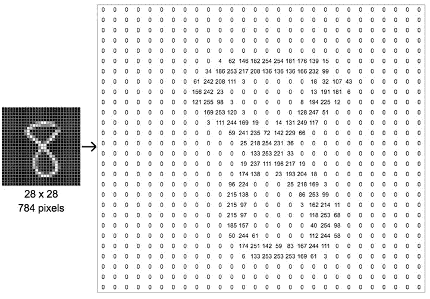

**图片来源:——miro.medium.com**

上面的 B&W 图像是一个 2-D 矩阵，矩阵的每个值作为图像部分的颜色强度表示值或像素值。在彩色图像的情况下，我们假设它们是红、绿、蓝(RGB)三种颜色的不同强度的组合，因此我们为它们中的每一个都有 2D 矩阵，它们的像素值代表各自的颜色强度。

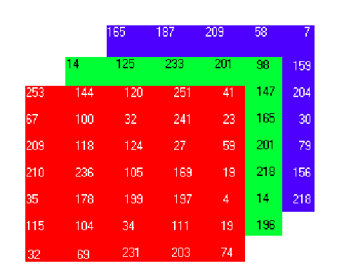

— — 3 维矩阵

**图片来源:——researchgate.net**

现在我们得到的是日常生活中使用的 RGB 或普通彩色图像的三维矩阵。这些是我们将在其上应用深度学习方法进行图像分类、对象检测和其他操作的矩阵。

Convnets

Convnets 或卷积神经网络是一种神经网络体系结构，用于通过卷积运算(不是普通的矩阵乘法)、合并等从图像中提取特征。在由图像和特定技术形成的矩阵上。

**卷积运算**

卷积核

**图片来源:——分析 Vidhya**

核是简单的 2D 矩阵，其形状取决于输入图像。输入图像矩阵上的核映射，具有简单的逐元素乘法和线性加法，结果给出较低维度的矩阵。核按照滑动窗口方法沿着矩阵移动。

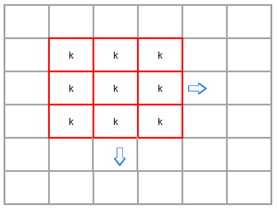

请参见下图，以更好地理解内核的卷积运算。

**图片来源:——分析 Vidhya**

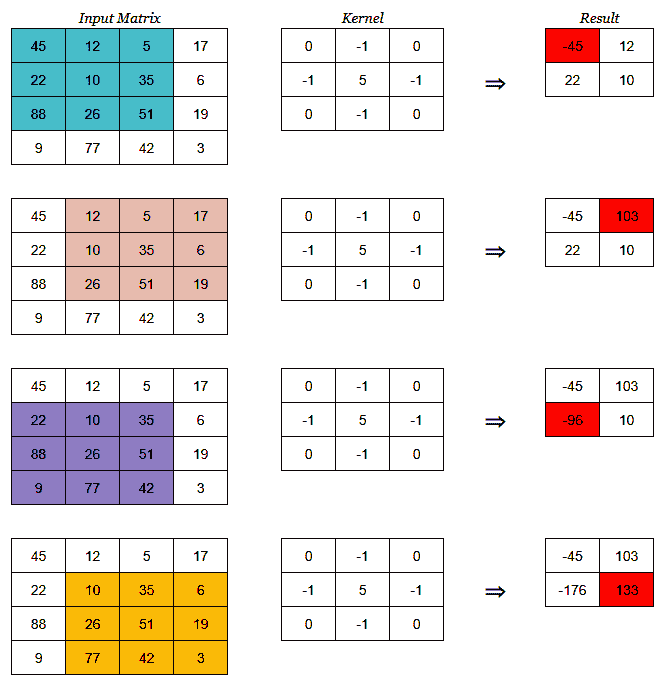

上述给定卷积结果的第一项可以解释为:-

**图片来源:——分析 Vidhya**

*45 * 0+12 *(-1)+5 * 0+22 *(-1)+10 * 5+35 *(-1)+88 * 0+26 *(-1)+51 * 0 =-45*

输出的矩阵形状和结果也取决于内核滑动的行数/列数，称为**步距**。

输出矩阵的形状也可以通过在输出上放置新的行和列来改变，这被称为**填充**。

如果新添加的行/列的所有值都为零，则称为**补零。**

这些全核卷积、大步走、填充组合在一起称为图像矩阵上的**卷积运算**。

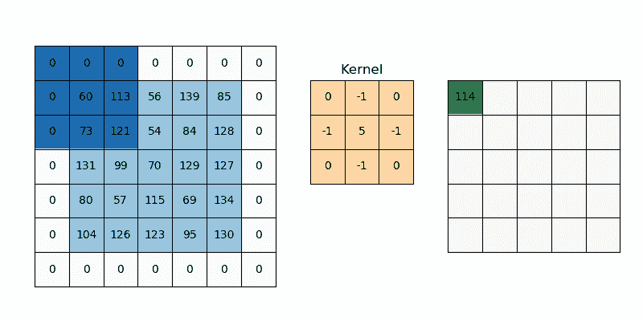

**联营**

汇集操作通过滑动二维过滤器(或内核)来概括图像矩阵的特征图。

汇集的类型:-

I .)最大池化:-它从过滤器覆盖的特征图中选择最大元素。

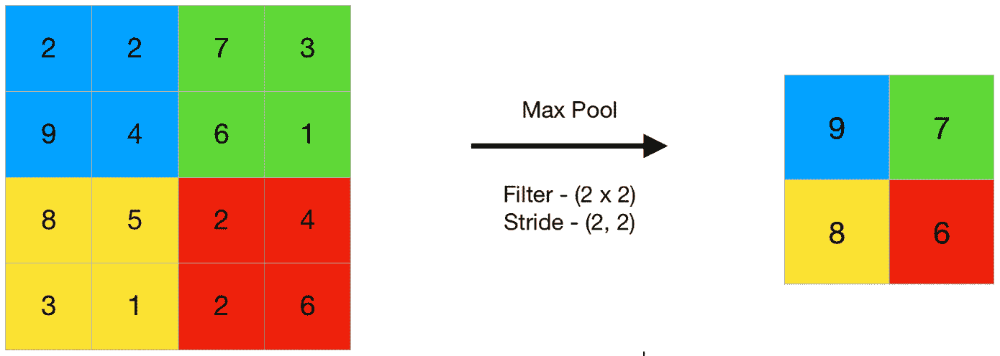

二。)平均池:-它选择过滤器或内核覆盖的特征映射中所有元素的平均值。

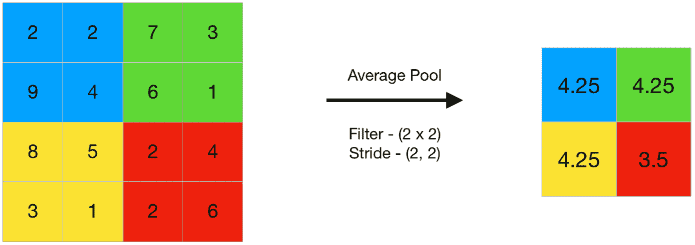

三。)全局池化:-它将整个特征图缩减为单个值，(它可以是全局最大或全局平均池化)。**以上图片来源=极客对极客**

# **卷积架构**

卷积架构由层形式的一系列卷积和池操作组成，也称为卷积层和池层。

有许多著名的 CNN 架构，为每个卷积层或池层预定义了层数、内核大小、滤波器大小。

示例:- VGG16

**图片来源:——极客的极客**

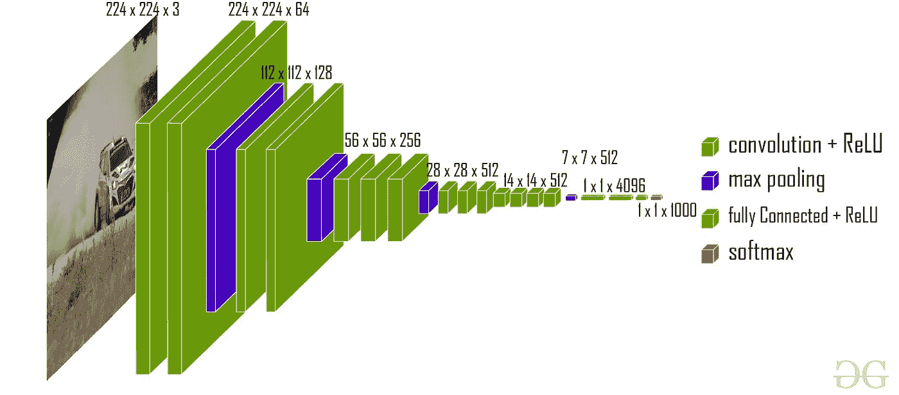

我们现在可以很容易地理解这个著名的架构，有一些卷积层，一些与 ReLU 激活和一些最大池层与 softmax 作为最后一层，以提供类概率输出。

图像分类与目标检测

图像分类:-它基本上是通过在 CNN 架构提取的特征的帮助下对数据进行训练来对图像进行分类。

图像定位:-这定位图像中存在的对象，即借助于图像矩阵上的一些操作，借助于一些计算机视觉技术，如滑动窗口、视觉单词包和选择性搜索等，将对象从背景中分离出来。。

对象检测:-当图像中存在多个对象时，首先在图像定位的帮助下，在给定图像中定位所有对象，然后 CNN 架构和分类算法利用深度学习预测该对象。**图片来源:- geeksforgeeks**

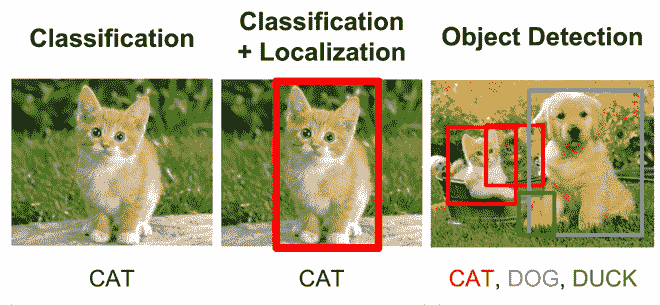

分类目标检测

**滑动窗口:-** 在这个算法中，我们选择一个小尺寸的网格，并以给定的步幅在输入图像上滑动。用任何 CNN 算法对输入图像矩阵中被网格覆盖的部分进行卷积，以预测该部分图像的类别。它可以是任何物体或背景。网格在整个输入图像上滑动，每个部分都很复杂。【cogneethi.com】图片:

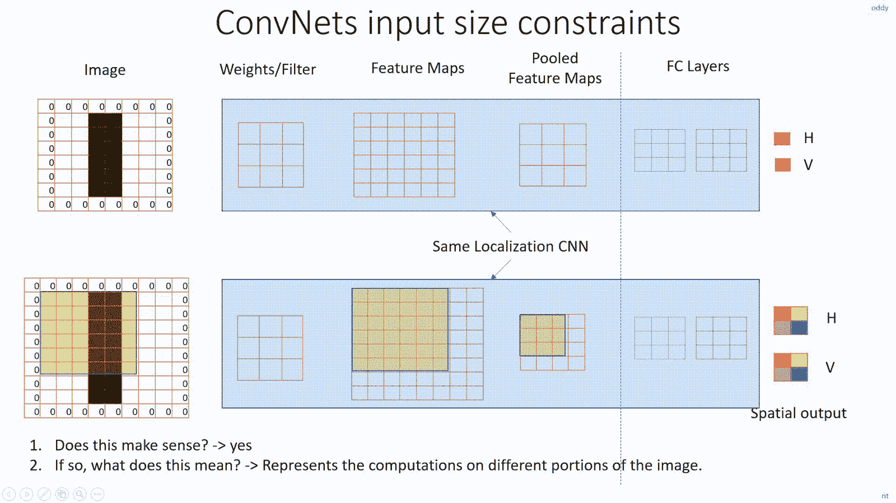

问题——我们需要将 CNN 应用于大量的位置和规模，因此计算量非常大，内存效率也非常低。

**区域提议:-** 在这里，输入图像矩阵中更有可能是任何物体的片段被一些区域提议算法定位，然后在它们上面进行 CNN。

我们借助“选择性搜索”算法找到可能包含对象的“斑点”图像区域。通常会生成 1000–2000 个这样的区域(区域建议),然后 CNN 会进行分类。

**选择性搜索:-** i .)我们将使用 *Felzenszwalb 等人*的论文“高效的基于图形的图像分割”中的方法生成输入图像的片段

二。)我们将使用下面给出的贪婪算法递归地将较小的片段组合成较大的片段。

**贪婪算法:** 1。从该组区域中选择两个最相似的区域。2.较大的区域由这两个较小的区域组合而成。3.这些步骤重复多次。**图片来源:- geeksforgeeks**

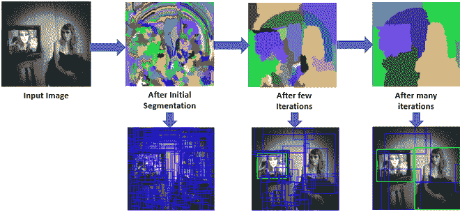

# 美国有线电视新闻网

区域 CNN 是基于 CNN 的图像区域分类算法，被训练来预测区域或对象的类别及其位置。让我们来理解它的工作步骤:-

1.  使用基于选择性搜索算法的区域提议方法，从输入图像矩阵中取出 2000 个矩阵形式的提议区域(可能包含对象的图像部分)。**图片:——FAIR(Facebook AI 研究)**

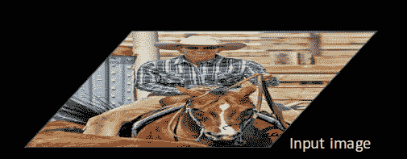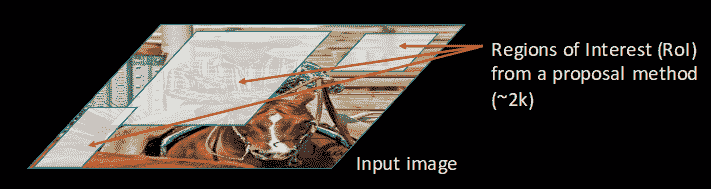

2.现在，所有这些感兴趣区域(RoI)矩阵都被扭曲或调整大小为具有一定尺寸的矩阵，使得它可以作为 CNN 的输入被给出，用于特征提取。**图片:——FAIR(Facebook AI 研究)**

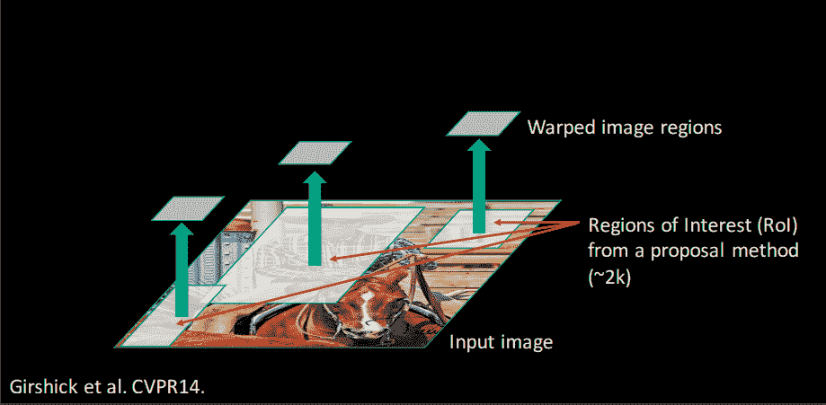

3.现在这些矩阵形式的扭曲图像区域被输入到 convnets 用于特征提取。

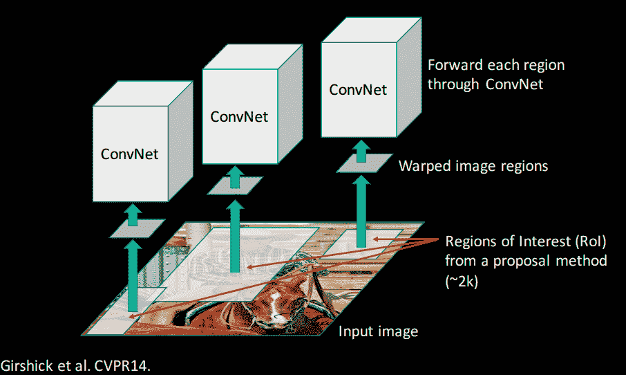

4.从 CNN 提取的特征被进一步传递到分类器(在这种情况下是 SVM ),以预测检测到的对象的类别。**图片:——FAIR(Facebook 人工智能研究)**

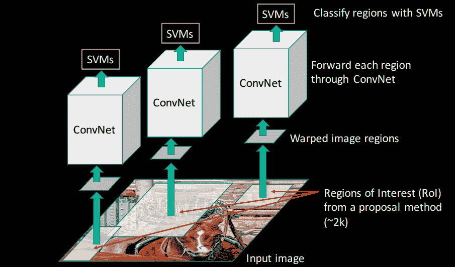

5.除了预测对象的类别，我们还需要指定图像中对象所在的区域，即预测 ROI 在输入图像矩阵中的位置。这可以通过在 CNN 图层后添加包围盒回归器和 SVM 来实现。它将以方框坐标的形式给出输出(方框是表示输入矩阵中 ROI 的矩形)，即输出=(x1，y1，x2，y2)。为了训练它，最小平方损失(L2 损失)最小化被使用。

**图片来源:——FAIR(Facebook AI 研究)**

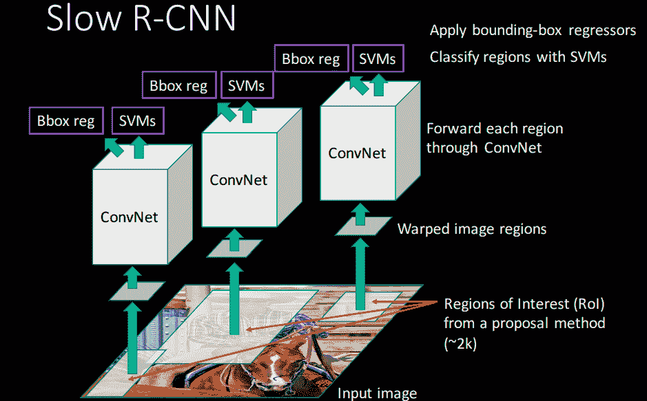

现在，在 RCNN 中，为了提高准确性，采取了几个步骤，如:-

I .)CNN 架构在区域提议而不是旧图像上进行了微调。

二。)在训练期间，提取的最终特征也用对数损失(softmax 层)以及 SVM 和边界框回归量进行微调。

三。)softmax 层仅在测试或对象检测期间达到训练时间，仅 SVM 和 Bbox 寄存器。都存在。

**RCNN 的弊端**

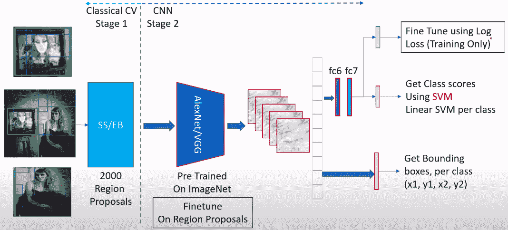

1.)这是一个三阶段的训练网络，因此速度非常慢

*   使用 softmax 分类器(对数损失)微调网络。
*   具有线性 SVM(铰链损耗)的训练网络。
*   用包围盒回归器(最小平方损失)训练网络。

2.)CNN 架构应用于每一个 ROI，这使得它在内存和时间上非常低效。

3.)对于 VGG 16，每幅图像的训练需要 84 小时，推断(检测)需要 47 秒，这使得它的使用非常缓慢。

# 空间金字塔池( **SPP** )

空间金字塔池是一种在局部空间箱中维护空间信息的方法。箱柜的大小和数量是固定的。所有滤波器的响应汇集在空间箱中。在下图中，池分为三个级别。在 SPPNet 中，类似的三级池是这样完成的。

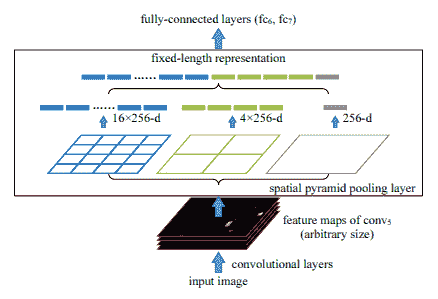

*   第一个池是对整个输入图像的全局最大池，给出具有 1×1×256D(特征深度图)的单个输出。
*   第二个池基本上是在将输入图像矩阵分成四个象限后应用全局池，给出 4x1x256 D 输出。
*   第三个池也是类似的，但是图像被分成 16 个象限，给出输出 16x1x256 D。
*   所有三路输出连接在一起，形成一个固定的 21x1x256 D 输出。
*   在 SPP 中，我们可以看到输出的固定长度为 21，与输入图像矩阵的大小和维数无关。

SPP 的另一个重要好处是图像大小调整，我们不需要扭曲 ROI(这会降低精确度),因为图像大小调整会由 SPP 自动完成，精确度会更高。

**图片来源:——cogneethi**

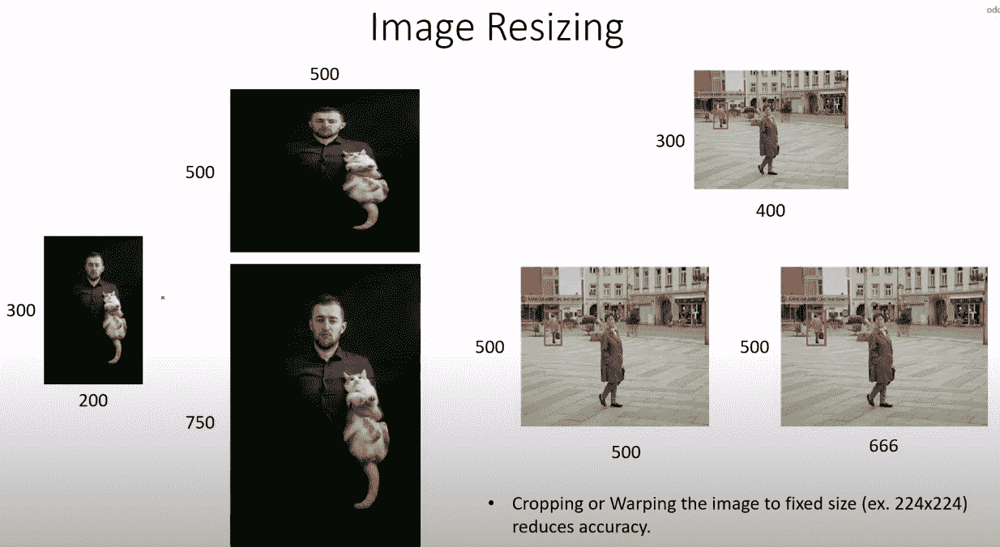

SPPNet

为了克服 RCNN 的缺点，引入了 RCNN。RCNN 效率低的主要原因是 CNN 必须对 2000 个 ROI 中的每一个进行操作。在 SPPNet 中，这个问题得到了解决。

*   只有一个输入图像矩阵被发送到 CNN 层以获得特征图。**图片来源:- FAIR**

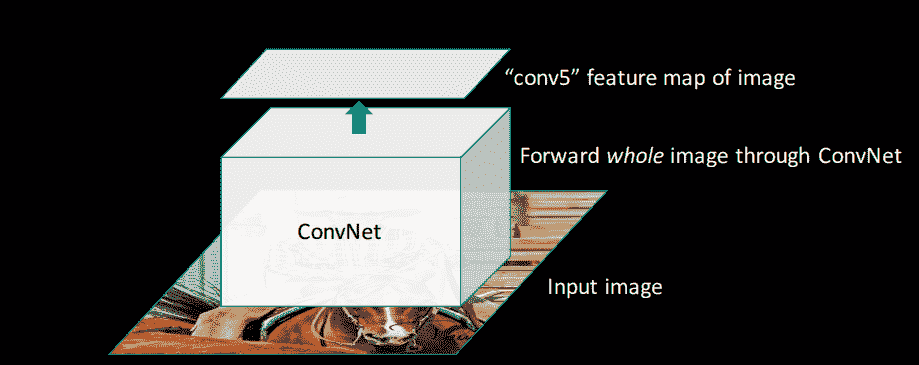

*   现在通过在特征图上应用选择性搜索算法来选择 ROI。**图片来源:- FAIR**

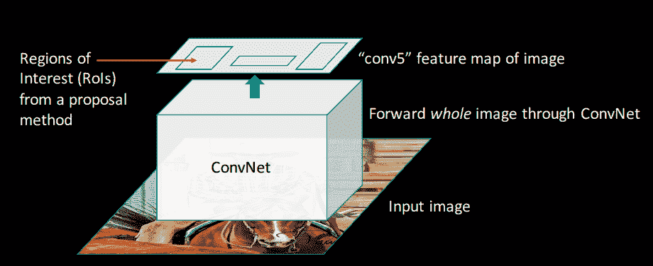

*   空间金字塔池层应用于这些感兴趣区域，以提供固定维度的输出，而与输入无关。**接下来的三张图片来源:——集市**

*   SPP 层的固定维度输出随后被传递到密集层，并且最终提取的特征用 SVM 进行分类。

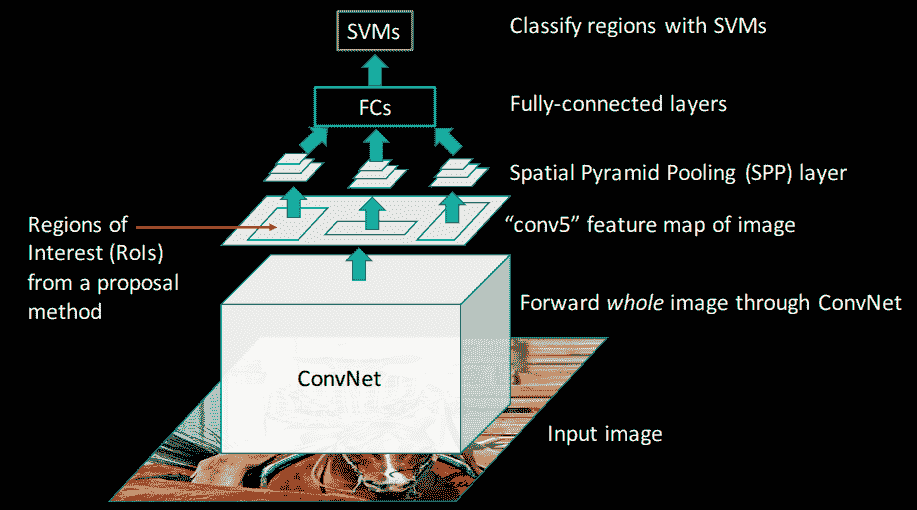

*   现在，除了来自某个区域的对象类，我们还需要找到对象的位置，因此还需要添加一个边界框回归器，就像在 RCNN 中一样。

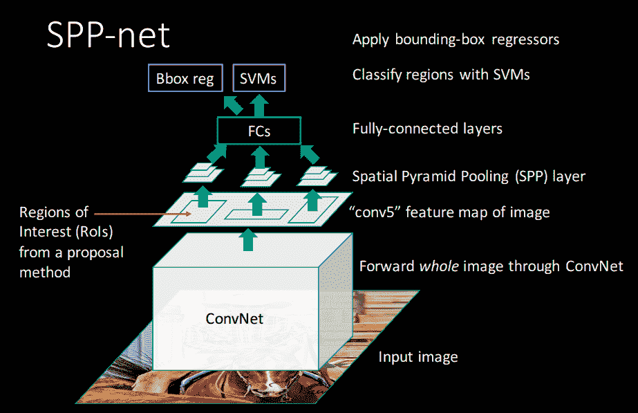

与 SVM 和 Bbox 回归器一起，softmax 层也仅在训练期间使用。

**图片来源:——cogneethi**

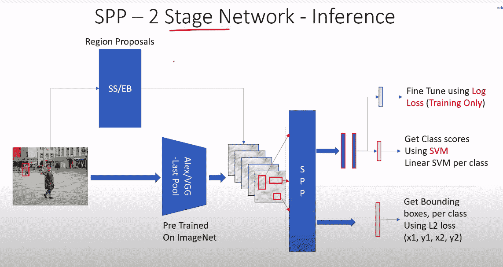

主要部分::研究主题

快速 RCNN

SPPNet 比 RCNN 更好更快，但它仍有几个缺点

*   这仍然是一个三阶段的训练过程，softmax 层(对数损失)，SVM(铰链损失)，Bbox 回归(L2 损失)，使其缓慢。
*   它的训练时间仍然是 25 小时，而且内存效率低下。
*   我们不能在 SPP 之前更新 convnet 层。

为了解决这些问题，对 SPPNet 进行了一些修改和升级，以实现快速 RCNN

SPPNet =训练速度:- 3 倍，测试速度:- 10 到 100 倍

快速 RCNN =训练:-快 9 倍，测试:- 0.3 秒

**(对比 w.r.t RCNN)**

因此，提出了快速 RCNN:一种联合学习以分类对象提议和空间位置的单阶段训练算法。

让我们了解 SPPNet 中导致 Fast-RCNN 的更改:-

1.  不使用多级 SPP: L0(1x1)、L1(2x2)、L3(4x4)

这里使用了单层 SPP 和 7x7 网格:

**接下来的 3 张图片来源:——cogneethi**

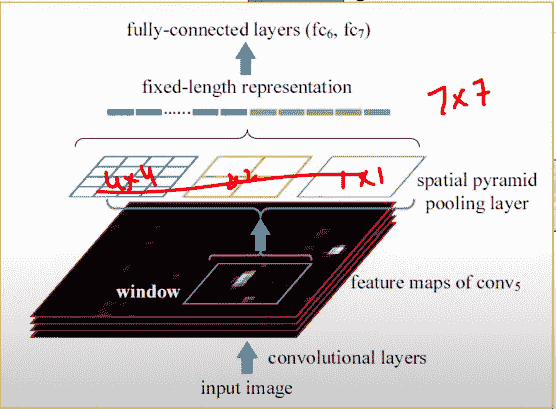

2.代替在训练中与 SVM 一起使用 softmax 和使用 SVM 作为分类器，我们将在训练和作为分类器两者中仅使用单个 softmax 分类器。

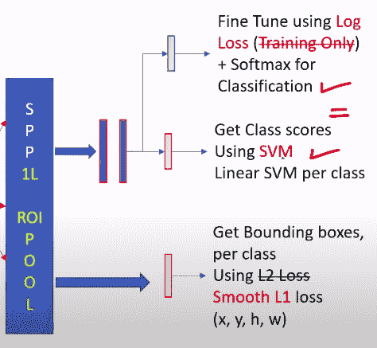

**早先在 SPPNet** 中**现在在 Fast-RCNN** 中

3.对于边界框回归量:-

I .改变其架构，将两个 FC 层添加到特征图，从那里连接两个不同的 FC 层，一个通向 softmax(用于分类)，另一个通向 Bbox 回归器(用于以[x，y，w，h]的形式预测对象的位置)**此处:- x，y =中间位置的变化。训练期间显示对象的矩形，w，h =训练期间显示对象的矩形的高度和宽度的变化。**

二。在训练包围盒回归中，使用 L1 损失代替 L2 损失。

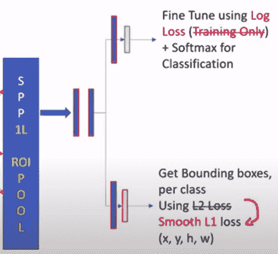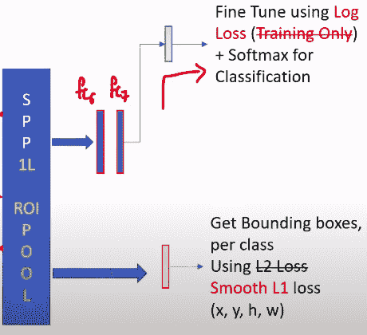

早期 Bbox 架构当前 Bbox 架构

4.训练的阶段减少了，

最初 SVM +软最大值被减少到只有软最大值

现在，

classfn(对数损失)+ Bbox 寄存器。(L2 损失)= >连接成单个损失函数，在反向传播中被最小化。

因此网络从**三级损耗 fn 降低。**至**单级损耗 fn。**

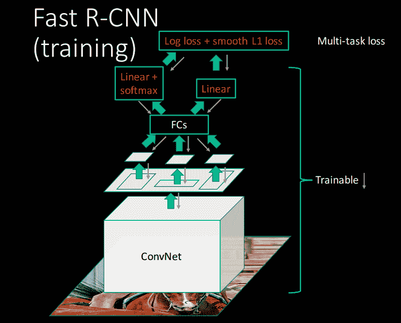

5.我们知道 CNN 的前几层基本上是随处可见的形状和边缘检测器，因此为了进一步优化和减少时间，我们将在我们的 Fast-RCNN 中从第 3 层或第 4 层训练 CNN 层。

快速 RCNN 体系结构

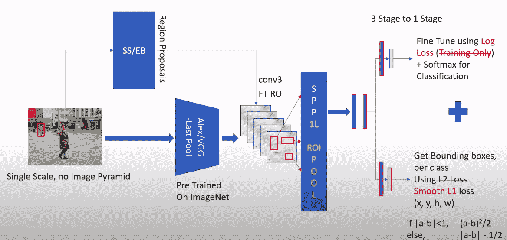

我希望你喜欢这一点，任何疑问，建议，感谢 msg 我:-

8292098293

adityaraj20008@gmail.com

不要忘记喜欢和分享我的内容，谢谢。