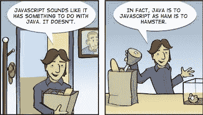

# 足智多谋

> 原文：<https://medium.com/nerd-for-tech/resourceful-js-e295776e0b8b?source=collection_archive---------19----------------------->

&事情就发生在那天。它深深地印在我的脑海里&迫使我思考。去思考“JavaScript”。嗯，和其他人一样，我认为这是和“Java”有关的东西，只是后来才意识到-

双关语 XD

在安静地思考了为什么是“JavaScript”之后，我敢于抓住这个机会。改变我人生轨迹的机会。意想不到的冒险。

这篇文章不是关于“为什么”，而是关于“如何”。稍微用谷歌搜索一下，就能帮你理清“JavaScript”背后的“为什么”。我知道你在上面(如果你不知道的话)。所以现在原因很清楚了，让我们让事情变得简单些。

# … **但是不知道怎么开始**

好吧，这句话一直让我惊讶。作为一个初学者，你有点像那句话的搭档(我最)。原因要么是你害怕，要么是更害怕。因为你知道外面发生的事情，比如，X 先生刚刚破解了 UYZ 公司的面试，小姐。z 赢得了一大笔奖金，而 chintu 开发了一个 android 应用程序。感谢社交媒体。现在你害怕了，害怕竞争，你不停地问自己——你能做得一样好吗？否则，你会更害怕，只是为了害怕，就像编码一样&它从来就不意味着容易。你喜欢那些编码迷因，对吗？你，我&在开始做唯一一件困扰我们一段时间的事情时，也就是学习编码时，我们都会有同样的不安全感。

我不知道如何开始

让我们暂时将我们的合作伙伴排除在外(考虑到那些混乱的思维)&实际上开始编码。用 JS 编码。

在做同样的事情时，我点击了谷歌，想知道——有没有关于 JavaScript 入门的资源？原来，有洪水。天哪，太多的资源，不同的层次，概念和教学方法。难怪，这是 JS——如今广泛使用的必备语言。现在，现在，去哪一个？哪些是最好中的最好？(思维混乱)。暂停。这就是这篇文章的目的。来帮助您在精彩的“JS 之旅”中找到一系列经过微调的资源。

我可以列举很多。但说实话，大部分都值得一试。&在“变”的时代，你不可能在一个单一的资源上保持冷静。为了更大的利益，你必须不断地出没。简而言之，尝试新事物！你就是这样成为一个伟大的程序员的(谷歌 XD)。

# **免费，免费&免费**

免费得到东西的感觉达到了另一个层次。因为它是免费的。这里有一些你可能会喜欢的免费资源-

1.  **自由代码营**

当谈到“代码”这个话题时，不可避免地，没有人能忘记提到“FreeCodeCamp”。因为它是许多开发者的家园。

一个旨在帮助人们学习编码的非营利组织。他们有一个网站，提供 300 小时的认证(免费)。包括 JS。你不需要太多东西来开始。请访问并开始了解他们令人惊叹的课程结构。

 [## freeCodeCamp.org

### 免费学习编码

www.freecodecamp.org](https://www.freecodecamp.org/) 

同时他们也有一个 Youtube 账户。他们有大量各种主题的视频。实际上你会发现很多。你可以搜索任何适合你口味的。

2.布拉德·特拉弗斯

一个心胸宽广的人。他创建了大量的教程&也是免费的。有不同的项目可以让你接触到 JS。这就像——边学边做一些疯狂酷的东西。下面是他在 JavaScript 上的特别播放列表。

3. **JavaScript30**

如果你是拖延者阶层的继承者，并试图挑战它。然后给你一个# 30 天的挑战，和韦斯·博斯一起学习 JavaScript。一个最著名的播客语法的全栈开发者和宿主，有一些东西可以让你开始使用。他提供免费和高级课程，幸运的是，JavaScript30 属于免费课程。

 [## JavaScript 30

### 用香草 JS 在 30 天内用 30 个教程构建 30 个东西

javascript30.com](https://javascript30.com/) 

一个 30 天的普通 JS 挑战，你将能够在 30 天内用 30 个教程建造 30 个东西。你可以在 Twitter、Instagram 和其他社交媒体渠道上发布你的进展。通过这样做，你不仅能让自己对挑战负责，还能认识一些和你一样正在做&尝试的朋友。志同道合。听起来很棒，对吧？

4.**网络忍者**

给你一个编码大师忍者。一个有大量视频的 youtube 频道。频道最大的好处是什么？他不断创造和更新他的东西，以确保他的学生成为下一个忍者。你不能忘记他的教学方式。又一部杰作。不容忽视的是，他还开设了一门关于 JS 的高级课程。如果你像我一样喜欢他的教学方式，那么你肯定可以/必须去尝试。

值得一提的是…

1.  Florin Pop — [Youtube](https://youtu.be/dtKciwk_si4) 频道
2.  网站开发简化版— [Youtube](https://youtube.com/playlist?list=PLZlA0Gpn_vH-0FlQnruw2rd1HuiYJHHkm) 频道

但是付费课程更有见地…我猜？因为他们是有报酬的。让我也为你列出来，

# 报酬如此丰厚，

1.  **学院名称**

哈，更可能是许多程序员的大师。他把一切从零开始，到主题的最高级部分。他的课程值得一学。你可以在 YouTube 上看到他的 JS 课程的一个片段(实际上是一个 5 小时长的部分)—

他最棒的一点就是，嗯，去看看吧，自己去找。

2. **CodeWithMosh**

Noonies 顶级编程大师。是的， **Moshfegh Hamedani** 是许多尝试不同事物的救世主。你会对“为什么事物是这样的”有更清晰精确的解释。

3.**编码上瘾者**

真的沉迷于创造一些最酷的东西。他设计和编码项目的方式是非常令人难以置信的。你只是爱上了那些最终的结果。太满足了。姓名——约翰·斯米尔加,《编码上瘾》的创始人。他特别用 JavaScript 创建了不同类型的播放列表。包括学习小而强大的东西的 JavaScript 金块，一些 JS 挑战&令人敬畏的项目。

我读书吗？真的吗？是啊，是啊，我读。但是有时候文档开始有点困难(对我来说)。没关系，我确实有一些学习 JS 的网站和书籍。&我爱他们的存在。让我在这里也提到他们-

# 读出来

1.  **MDN**

MDN Web Docs，前身是 Mozilla Developer Network，前身是 Mozilla Developer Center，是面向 Web 开发者的文档库和学习资源(我复制了这句话)。我大部分时间都在访问 MDN，寻找 JS 中的 UIO 语法，或者只是想知道 YUI 在 JS 中是如何工作的。干净又好走。

 [## JavaScript | MDN

### JavaScript (JS)是一种轻量级、解释型或即时编译的编程语言，具有一流的…

developer.mozilla.org](https://developer.mozilla.org/en-US/docs/Web/JavaScript) 

2. **JavaScript 信息**

几乎所有你想知道的关于 JavaScript 的东西都写在这里。从头开始阅读，掌握 JS 的高级部分。全部覆盖。

 [## 现代 JavaScript 教程

### 现代 JavaScript 教程:简单，但详细的例子和任务的解释，包括:闭包，文档…

javascript.info](https://javascript.info/) 

3.**雄辩的 JavaScript**

这是一本在 JS 界很有名的书。许多人更喜欢与之配套的书籍版本。但是我会推荐—

 [## 雄辩的 JavaScript

### 各种艺术家的插图:封面和章节插图。像素艺术在第 7 章和…

eloquentjavascript.net](https://eloquentjavascript.net/) 

不是因为它是一个在线网站，而是因为它们所展示的内容。您可以随时尝试作者教给您的所有代码片段。你可以在网站上运行它，真的！除此之外，你还可以在同一个网站上找到练习和提示的答案。用互动的方式重做一些东西会让它变得不那么无聊。呵呵！

几乎没有其他东西可以尝试，

1.  **W3School**——[网站](https://www.w3schools.com/)
2.  **黑客月**——[网站](https://hackernoon.com/tagged/javascript)
3.  **你不知道的 JS**—[Github 上的丛书](https://github.com/getify/You-Dont-Know-JS)
4.  **牛逼的 JS 学习** —在 [Github](https://github.com/micromata/awesome-javascript-learning) 上学习 JS 的学习资源
5.  你不会忘记这件事吧？

好吧好吧，我就此打住。这足以让你在相当长的时间内与 JS 挂钩。一切事物本身都是最好的。值得一试。不过，我可能错过了其他一些精彩的。因为内容在不断更新，所以你也必须更新你的资源。但是这些对于成为一名 JavaScript 开发人员来说是很好的。

那么下一步是什么？去喝杯咖啡，用 JS 构建一些东西。如果你愿意，那就去买《原子习惯》这本书来学习习惯&如何培养习惯。**原子习惯**——许多伟大的程序员使用的首选书籍&。

JS 万岁。

如果你还在，你可以在 Github 上联系我，

 [## TidbitsJS -概述

### 很高兴见到你，我是 Sujata Gunale 又名 TidbitsJS🤓自学开发者👩‍💻从事 Web 开发📝正在写作…

github.com](https://github.com/TidbitsJS) 

我忘记写我的介绍了吗？哦，我做到了。没什么特别的，我们开始吧，

仅仅是另一个在技术世界里游荡的有着好奇心的复杂人类。