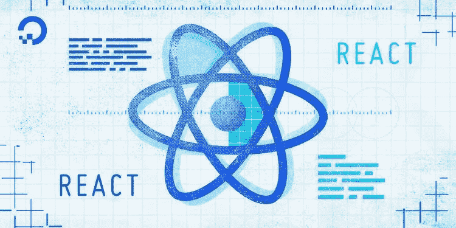

# 机智的反应

> 原文：<https://medium.com/nerd-for-tech/resourceful-react-b0b9298fd9be?source=collection_archive---------10----------------------->

在过去的几个月里，你一直在学习 JavaScript，你希望在 React 上更进一步。但是你到底从哪里开始呢？

来源— [数字海洋](https://www.digitalocean.com/community/tutorials/react-axios-react)

这是我的内在灵魂在开始下一个显而易见的旅程时呼喊的。感谢老友记&谷歌，我在适当的时候弄明白了事情。希望在直接进入 ReactJS 之前，您对 JavaScript 有一定的了解。这就是说——你必须知道 JS。没有它，就像学习射箭没有弓一样。JS 是基础。你能行的！

好吧，这个标题可能会帮助你猜测这不是关于“为什么反应？”。选择是你的选择。即使在这个不断变化的时代，人们仍然在使用 PHP——没有人能阻止它。话虽如此，我的意思并不是对 PHP 开发人员或 PHP 本身漠不关心。我的意思是——这是选择。不管是你自己的，还是你一直工作的公司的原因，或者是要求。它可以是任何东西。一定要明确你背后的“为什么”。

谁知道十年后呢——React 可能感觉像一个旧的玩具故事。

说够了，让我为您提供一些资源，让您开始使用 ReactJS 网关。资源以免费、付费、文章等形式混杂在一起。确保去做你想做的事情。

一如既往，

1.  **自由代码营**

如果这让你吃惊，那么你在学习编程的时候已经错过了一些重要的东西。这是免费代码主页。大量的视频、文章和课程可以帮助你。其中一个课程是关于前端库的，也就是我们的 React。

 [## freeCodeCamp.org

### Bootstrap 是一个前端框架，用于设计响应性网页和应用程序。这需要移动优先…

www.freecodecamp.org](https://www.freecodecamp.org/learn/front-end-libraries/) 

您不仅将学习使用 Redux 的 ReactJS，还将学习 Jquery——另一个前端框架。这肯定会让你知道 ReactJS 的必要性和本质。

2.**学院**

可能并不意外，对吧？Academind 是一个天才的头脑，他和我们都非常注意学习。在他的付费课程中，他详细阐述了反应的主要部分。他详细地讲授了功能组件和类组件。

我为什么要相信你们两个？—你可能会质疑。没问题。这是他在 YouTube 上 50 多个小时课程的片段。如果你喜欢，就去买。接下来你就知道了。

3.Scrimba

如果看《如何编写 X 代码》时的现代互动有一张脸。如此优雅的设计。哇，你会目不转睛的。在 Scrimba 上写一天代码永远不会无聊。来自经验丰富的代码大师的各种课程。只是拜访&敬畏你自己。

注意——如果你想边做边学，那就去看看詹姆斯·奎克在 React 上的课程《打造电影搜索应用》。太迷人了。

 [## 浏览 scrimba.com 上的所有软件开发课程

### 寻找你的下一个软件开发或设计课程，从初级到高级。所有课程都使用我们的互动…

scrimba.com](https://scrimba.com/allcourses?q=react) 

4.布拉德·特拉弗斯

你想让我在这里不提他吗？不要。Brad 在 ReactJS 上创建了不同类型的播放列表。我最喜欢的项目之一是——ReactJS 项目。在那里你通过建立项目来学习，从而保持你的动机健全。

Brad 在 ReactJS 上也有自己的课程，是付费的。你可以在他的 YouTube 频道上找到。

不要忘了看看嘉宾创作者。

5.**编码上瘾者**

不，不，没有错误的链接。这是他为像我和你这样的人(付不起学费的人)免费开设的编程上瘾课程。15 个 React 项目—这是专长。你从零开始&走到它的顶端。

除此之外，你将获得一些设计或造型知识。总的来说，更擅长前端。创作者 John 将每个项目都提升到专业水平。喜欢那些创意项目。

已经有 5 个了。还想要更多吗？？

6.**零到精通**

精通，字面意思。大量信息集中在一个地方。教练深入基层，让学生感觉——对，就是这样，没那么难。

 [## 2021 年完成 React 开发人员(带 Redux、Hooks、GraphQL)

### 刚刚更新了 2021 年 React 的所有新功能(React v17)！加入由超过 400，000 名开发人员组成的实时在线社区…

www.udemy.com](https://www.udemy.com/share/101WH42@Pm1gVGJjcFEGdUVGCnZ/fj5uSn1L/) 

课程是付费的。水平有点高但是很有前途。它涵盖了从 Redux saga、GraphQL、Stripe、PWA 到 React 中的测试的令人难以置信的经验。所以物有所值。

你可能会想——这不是教程地狱吗？

不，是的。看情况，更准确地说。如果你一个接一个地浏览每个视频，除此之外什么都不做，那么答案是肯定的。那我为什么列出这么多？因为他们每个人都能提供不同的东西。你不可能在一个地方得到所有的东西。不要指望有 Reactopedia。

你需要做的是——跟随教程，从中学习和构建项目。然后开始你自己的项目——可能是你的作品集，也可能是你脑海中那个梦幻网站的设计。或者只是从互联网上复制另一个网站，就像维基百科的克隆版。有太多的事情可以解决。我会把它留给你去想象。

完成视频。告诉我阅读指南。文章、博客或教程等。

你应该读书。真的。有一些很棒的作者在不同的领域写作。

你可以通过[脸书](https://reactjs.org/)开发者团队查看官方指南。开始时(对我来说)理解起来多少有些困难。但是对你来说事情可能会不同。

我理解的没有太多压力的博客是—

1.  德米特里·帕夫卢丁

伟大的作家。在前端开发上写得过多。以简单的方式解释。有很多关于 ReactJS 的文章，包括关于 useEffect、useCallback、useMemo 等的流行指南。如果这对你来说是陌生的，不要担心。你最终会得到它的(为了记录，我第一次使用它时仍然很挣扎:()。

 [## Dmitri Pavlutin 博客

### Dmitri Pavlutin 博客是一个学习 JavaScript、CSS、React 和更多前端开发的地方

dmitripavlutin.com](https://dmitripavlutin.com/) 

2.**戴夫·塞迪亚**

戴夫的书——Pure React 是必读书。对组件和生命周期的流畅解释。

 [## 戴夫·塞迪亚

### 如果你在 React 上仍然有困难，即使在所有教程(甚至一些付费课程)之后…

daveceddia.com](https://daveceddia.com/) 

通过他的博客，他确保困难的部分或未知的部分为我们所熟悉。

3.**肯特·c·多兹**

EpicReact 的创造者。小说家。一个通过高质量软件帮助人们让世界变得更好的讲师(改写他的口号。XD)。肯特的博客是一个地方，在那里你将受到考验，以及奖励。你会发现自己在阅读软件和相关的东西。也反应过来。

 [## 肯特·多兹

### 来看看 Kent C. Dodds 如何帮助你提升软件工程师的职业水平。

kentcdodds.com](https://kentcdodds.com/) 

更多？更多？

列表中的最后一个但并非最不重要的或单一的来源。这是著名的 GitHub 知识库，是在 React 集合上创建的。

 [## GitHub - enaqx/awesome-react:关于 react 生态系统的一系列精彩内容

### 关于 React 生态系统的牛逼东西集合- GitHub - enaqx/awesome-react:牛逼东西集合…

github.com](https://github.com/enaqx/awesome-react) 

awesome-react 包含了从一般教程、工具、博客、视频、游乐场、测试，到 react 中 AR VR 的所有内容。你肯定会不知所措，直到最后。就是这样。如果你仍然认为，你错过了什么，那么，你只是一个**谷歌搜索**了。(&我很确定搜索引擎算法会监听你)

Woah，6 ( 1320 字)分钟读完为止。还不错。让我再多加几秒钟。无红利(ex-dividend)

发现我在这里工作—

 [## TidbitsJS -概述

### 很高兴见到你，我是 Sujata Gunale 又名 TidbitsJS🤓自学开发者👩‍💻从事 Web 开发📝正在写作…

github.com](https://github.com/TidbitsJS) 

一路顺风。我希望，你能很快知道“如何反应”。

**何查卡尔**👋