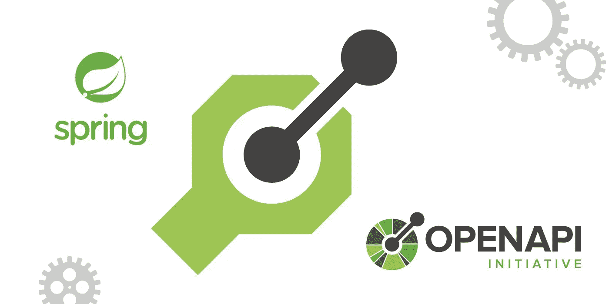
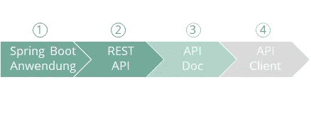
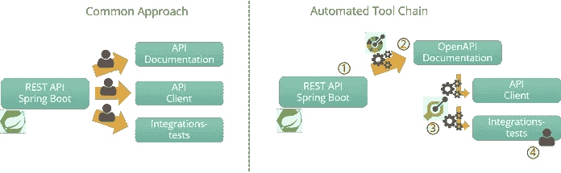
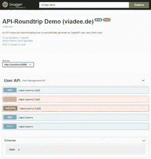
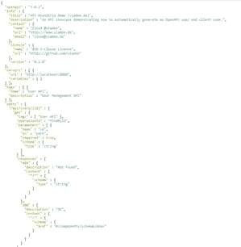

# REST-API-与 SpringDoc 和 OpenAPI 生成器的往返

> 原文：<https://medium.com/nerd-for-tech/rest-api-roundtrip-with-springdoc-and-openapi-generator-30bd27ccf698?source=collection_archive---------3----------------------->

在 Spring Boot 应用程序中提供 JSON REST 端点是显而易见的，就像许多先进的框架一样。只需包含 Spring Boot Web Starter 作为依赖项，定义一个用@RestController 注释的类，并实现至少一个用@RequestMapping(或特定注释)注释的方法作为 HTTP 请求的处理程序。

然而，在一个完整的 API 生命周期中，还有更多的事情要做。在本文中，我们介绍了一个**自动化工具链**，它帮助**将 Spring Boot** [**REST API 开发**](https://www.viadee.de/seminar/api-design-und-management) **专业化，并自动化了大量的手工工作**。

## 代码优先，但要有规范

在 API 社区中，就像任何传统类型的接口一样，人们经常讨论是从接口规范开始，然后实现呈现 API(API-设计优先)，还是从实现中生成规范(代码优先)。这两种方法都是合理的。在这篇文章中，我们将重点关注代码优先方法的用例，就像 Spring Boot 经常做的那样。

下图说明了代码优先的方法，首先，建立一个 Spring Boot 应用程序(1)，然后，创建 REST 端点和隐式 API)。有时会编写 API 文档，例如，根据 OpenAPI 标准(3)，有时也会创建 API 客户端(4)。

## 示例:用户 API

作为本文的一个案例，我们提供了一个用户 API 示例项目。这为所展示的工具链提供了参考，并且可能会支持您为自己的环境设置工具链。

API 允许创建、更新和查询用户。为此，使用 GET、POST、PUT 或 DELETE 以符合 HTTP 的方式提供 REST 操作。

虽然下面包含了相关的代码片段，但是完整案例的代码在 GitHub 上是公开的:[https://github.com/viadee/api-roundtrip-spring-boot](https://github.com/viadee/api-roundtrip-spring-boot)

# API-往返——全套服务包

在本文中，我们将 API 往返称为完整 API 包的**开发，包括以下工件:**

*   *REST-API*
    API 本身
*   *API 文档*
    作为 OpenAPI 规范的 API 文档
*   *API-Client*
    使用 API 的客户端，可以很容易地集成到应用程序中
*   *集成测试*
    在部署后，例如在测试环境中，自动测试 API 的功能

## 现状

对于其他接口类型(如 SOAP 或 CORBA)来说，提供文档(WSDL)和预构建的客户端是相当确定的。然而，这样的工件在 REST APIs 中并不常见。一个重要的原因是缺乏已建立的自动化——或者至少已建立的自动化并不广为人知。

现在的集成测试经常使用 Postman、SOAP UI 或者放心等工具。它们都允许向 REST API 发送 JSON 请求。

由于创建和维护 JSON 请求以及检查结果 JSON 响应的必要性，与最初的 API 开发相比，这通常会导致大量的人工工作。

考虑到整体包装，即使是 Spring boot 应用程序中的一个小调整，通常也需要大量的手动操作，而且常常令人烦恼。

## 自动化得益于 SpringDoc 和 OpenApi 生成器

对于改善现状的有效 REST API 开发，需要一个提供功能的自动化工具链，至少从使用 SOAP 和 CORBA 中可以知道。一方面，这个**自动化了重复的手工任务**，另一方面，这个**解决了集成测试开发中的媒体中断**。

后者是在用 Java 实现集成测试**时实现的，就像 Spring Boot 应用程序本身一样。**

下图概述了我们在本文中描述的工具链。

首先，基于 Spring Boot REST API 实现，使用 SpringDoc 生成一个 OpenAPI 文档。在第二步中，使用 OpenAPI Generator 生成适当的客户端代码和集成测试代码，从而简化 API 文档。

当然，实现实际的测试逻辑仍然需要手工操作。

具体来说，工具链由以下组件组成:

*   *实现了 REST-API (1)*
*   **SpringDoc* 生成 API 文档作为 OpenAPI 规范和 Swagger UI，促进 Spring Boot 应用基础设施。(2)*
*   **OpenAPI* 根据 SpringDoc 生成的 OpenAPI 规范生成 API 客户端和集成测试的代码。(3)*
*   **Maven
    当然，可以用 Gradle 构建类似的链。**
*   **集成测试* 集成测试的执行取决于具体的环境。在本文中，我们提供了一个例子，在这个例子中，集成测试是在部署本身之后用 Maven 在部署管道中触发的。(4)*

# *API-round trip——简而言之就是工具链*

## *Spring Boot API 实施*

*用户 API 由带有相应 spring 注释的接口定义。应该小心选择方法名。默认情况下，它们将被用作 OpenAPI 规范中的 operationID，并通过它定义生成的 API 客户端的方法名。*

*建议显式地**指定一个@ResponseStatus** ，因为这将在以后自动生成一个更干净的 OpenAPI。*

*API 接口由 Spring @RestController 实现。为了简单起见，我们用非持久散列表实现了用户数据的存储。*

*最后，必须在 pom 文件中添加 Maven 依赖项，并且必须创建并启动@SpringBootApplication。这是通过[http://localhost:8080/API/users](http://localhost:8080/api/users)向 API 发送第一个请求所必需的。*

*到目前为止，这是一个简单的 Spring Boot 基础设施。我们的 API 往返的实际工具链从这里开始。*

## *API 文档生成*

*对于 SOAP Web 服务，提供一个 WSDL 并让它由 Web 服务基础设施自动生成是很常见的。然而，对于 REST APIs 来说，这还不是现成的。*

***SpringDoc 通过处理 Spring Boot 基础设施和提供额外的配置能力，自动生成 OpenAPI 规范和 Swagger-UI 在线文档，填补了这一空白**。*

*为了能够在您自己的应用程序中处理 SpringDoc，下面的 Maven-Dependency 就足够了，因为它也间接引用了 SpringDoc 核心:*

*这意味着在 Spring Boot 应用程序的(新)启动之后，可以立即到达 Swagger UI:[http://localhost:8080/Swagger-UI . html](http://localhost:8080/swagger-ui.html)*

*也可以检索 OpenAPI 规范:[http://localhost:8080/v3/API-docs](http://localhost:8080/v3/api-docs)*

*这两种类型的文档都可以进行广泛的配置和补充。*

****

*SpringDoc 提供了各种注释，例如@OpenAPIDefinition，用于丰富 API 文档的内容，如下例所示:*

*建议在此时添加服务器规范。稍后，在 OpenAPI 文件生成期间，API 将在一个随机的空闲端口上启动，如果没有在这里明确指定，一个相当不熟悉的端口规范将在 API 规范中结束。*

*当然，如果 API 端点的最终 URL 是已知的，那么应该在这里输入。*

*如果 OpenAPI 规范的 JSON 需要用带有缩进和换行符的“漂亮打印机”进行格式化，则应该在 Spring Boot 应用程序.属性或 yaml 文件中添加以下配置:*

*如果需要，Swagger UI 和 OpenAPI 文档的 URL 可以设置在 actuator 或任何其他上下文中。*

*最后，OpenAPI 规范必须存储为本地文件，以便以后的客户端代码生成可以访问它。SpringDoc 为这一步提供了一个 Maven 插件，与 Spring Fox 等类似工具相比，它提供了更多的便利。*

*在典型的 Spring Boot 配置中，整个依赖关系只在运行时加载和解析，因此，SpringDoc Maven 插件需要一个正在运行的应用程序。该插件从上面提到的 URL 下载 OpenAPI 规范。*

*为了实现这一点，SpringDoc Maven 插件在 Maven“集成测试”阶段进行了配置，如下例所示:*

*除了用于下载 OpenAPI 规范的 URL 之外，还可以通过 outputFileName 和 outputDir 参数来定义目标文件。我们在示例中省略了这些参数，因此默认情况下，该文件被写入 target/openapi.json。*

*为了确保 Spring Boot 应用程序能够在“集成测试”阶段成功启动，我们首先使用 codehaus build-helper-maven-plugin 确定一个空闲端口。然后在“预集成-测试”阶段在 spring-boot-maven-plugin 中配置自由端口，以启动 Spring Boot 应用程序( <goal>start</goal> )并在“后集成-测试”阶段停止它( <goal>stop</goal> )。*

*动态端口选择确保 Maven 工具链能够工作，即使应用程序已经在标准端口 8080 上运行。*

*现在，生成 API 文档的第一步已经完成。接下来，我们将重点关注为 API 客户端和集成测试生成代码。*

## *API 客户端和集成测试生成*

*OpenAPI 规范提供了详细的接口描述，足以实现对 API 端点的有效请求。OpenAPI Generator 是一个非常活跃和成熟的开源工具，用于基于这些规范生成代码和其他工件。我们在往返工具链中使用它来生成代码，这些代码将 REST API 调用封装为易于使用的 Java 接口。*

*OpenAPI Generator 是从 Swagger Code Gen 项目中派生出来的，旨在实现更轻、更快的开发。到目前为止发布的版本，以及 OpenAPI 生成器的活跃社区都符合创始人的目标。*

*同时，有超过 130 种不同的代码生成器，用于客户端和服务器实现，以及文档和其他 API 和数据格式，如 GraphQL 或 protobuf。*

*OpenAPI 带有一个 Maven 插件，所以代码生成可以直接集成到整个工作流程中。Gradle 的插件也是可用的。以下示例显示了并发 Maven 插件配置。*

*这个例子展示了使用 Java 代码生成器和 java8 DateLibrary 选项的插件配置，以 java.util.LocalDate 的形式生成日期数据字段。*

*此外，设置了目标代码的各种包，并且生成器被配置为只生成客户机源代码，而不生成进一步的文档或 Gradle 和 Maven 工件。*

*不幸的是，在 OpenAPI Generator 的当前版本中，仍然需要指定要生成的基础设施类，因为对“仅客户端代码”设置的功能请求仍然是开放的。*

*要将代码生成与上一代 OpenAPI 规范结合起来，需要考虑两件事情:*

1.  *在父 maven 模块中，api 子模块必须放在客户端/集成测试子模块之前*
2.  *OpenAPI 规范(<inputspec>)的代码生成器路径必须引用之前下载的规范</inputspec>*

*要编译用“本地”OpenAPI 生成器设置生成的 Java 客户端代码，需要一些依赖关系。*

*作为 GitHub 上的示例应用程序的一部分，我们提供了一个最小的配置:[https://GitHub . com/viadee/API-round trip-spring-boot/blob/main/client/POM . XML](https://github.com/viadee/api-roundtrip-spring-boot/blob/main/client/pom.xml#L24)*

## *集成测试执行*

*如果除了纯客户端代码之外还生成集成测试，一个有效的策略是将它们实现为单元测试，但是使用 Maven failsafe 而不是经典的 surefire 插件单独运行它们。如果集成测试在一个单独的 maven 模块中，整个设置会变得更加实用，该模块指定了额外的规则，比如不要将集成测试与整个应用程序捆绑在一起。*

*failsafe 插件是成熟的 surefire 插件的一部分，但它默认运行在 Maven 集成测试阶段。*

*默认情况下，failsafe 插件附带一个名称过滤器，指定要执行的单元测试类。下面的代码示例根据“*IntegrationTest.java”模式扩展了集成测试的名称筛选器:*

*此外，以下 Maven 配置确保了在正常测试阶段 surefire 插件不会运行集成测试，并且集成测试代码不会部署或安装在 Maven 存储库中。*

*在 GitHub 上提供的示例项目中，我们将集成测试执行封装在一个单独的概要文件中，以便在部署管道中运行时获得更多的控制。*

# *结论*

*REST APIs 因其简单性而被广泛采用。然而，这种简单性也带来了许多挑战，尤其是维护和可持续性方面。*

*OpenAPI 标准将 REST API 的开发和管理推向了一个新的高度，基于它的生成器和集成为维护困境提供了出路。*

*文章中展示的工具链**完全基于免费和标准工具**，并利用了 REST APIs 的复杂 Spring Boot 基础设施。类似的自动化也可以用 Quarkus 和 Micronaut 等框架创建，也可以用 JavaScript 或 Python 等其他语言为客户端创建。*

*对于那些积极想要扩展他们在 API 开发和 API 管理方面的**专业知识的人**，我们认为值得看看 OpenAPI、SpringDoc 和 OpenAPI Generator。*

***现代 API 是独立的产品，能够显著实现全新的数字商业模式和流程**。对高质量 API 的日益自觉的处理有助于挖掘这一巨大潜力。*

*类似地，自动化，比如本文中介绍的工具链，有助于开发新的质量标准，大大减少了人工工作量。*

*此外， [**OpenAPI 规范**](https://www.viadee.de/seminar/api-design-und-management) **为许多其他用例提供了基础，如** [**公共或私有 API 目录**](https://www.viadee.de/seminarkategorie/cloud/) **或 API 质量分析**以获得更好、更同质的 API 产品。*

**你在努力使你的 API 开发专业化吗？我很高兴与你讨论你的想法和问题。给我写个* [*邮箱*](mailto:benjamin.klatt@viadee.de) *或者上*[*LinkedIn*](https://www.linkedin.com/in/dr-benjamin-klatt-4680081/)*联系就行了。**

**

*Benjamin Klatt 博士是一名集成架构师和敏捷蔻驰。*

*他的重点是产品和[流程的数字化](https://www.viadee.de/en/solutions/business-process-management)、[集成架构](https://www.viadee.de/en/solutions/java/)和[敏捷方法](https://www.viadee.de/en/solutions/agile-methods/)。*

**最初发布于*[*https://blog . viadee . de*](https://blog.viadee.de/en/rest-api-roundtrip)*。**