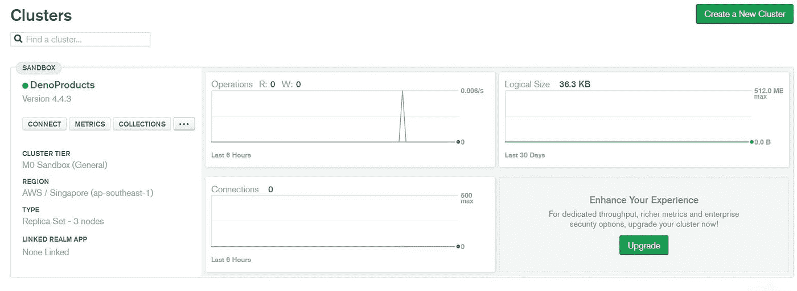
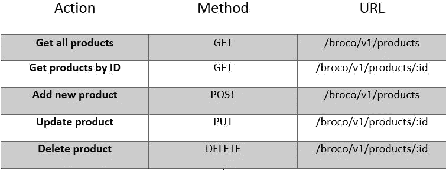

# 使用 Deno 和 MongoDB 的 REST API

> 原文：<https://medium.com/nerd-for-tech/rest-api-with-deno-and-mongodb-11ffe57c5d51?source=collection_archive---------9----------------------->


本文将向您展示如何用 [**Deno**](https://deno.land/) 和 [**MongoDB**](https://www.mongodb.com/2) **构建一个简单的 REST API。**

**Deno -** *Deno 是一个基于 V8 JavaScript 引擎和*[*Rust*](https://www.rust-lang.org/)*的 TypeScript 和 JavaScript 的安全运行时，由 Node.js 的最初创建者 Ryan Dahl 创建*

**先决条件-**[***Deno***](https://deno.land/)**预装，* [***邮差***](https://www.postman.com/downloads/)**API 客户端，*[***MongoDB***](https://account.mongodb.com/account/login)**

# *****步骤:*****

# *****1。创建 server.ts 并导入 *Oak* 中间件。*****

```
***import { Application } from ‘https://deno.land/x/oak/mod.ts'***
```

# ***2.创建数据库。***

***登录 **MongoDB 云图谱**并创建一个新的集群，如果你还没有的话。让一切保持原样，并为您的集群命名(在我的例子中是**‘deno products’**)。下面是我们创建的集群。***

******

***然后进入**数据库访问>添加新的数据库用户，**提供用户名和密码，点击**添加用户。*****

***之后，我们需要允许网络访问，因为默认情况下，我们将无法连接到这个数据库，除非我们将 IP 地址列入白名单。因此，进入**网络访问>添加 IP 地址，**您可以添加您当前的 IP 地址或允许从任何地方访问。***

***然后进入**你的集群>连接>连接到你的应用，**复制你的连接字符串。***

***在你的根目录下创建一个名为 **db** 的文件夹，并在里面创建 **mongodb.ts** 文件。复制并粘贴下面的代码。***

```
***import { MongoClient } from “https://deno.land/x/mongo@v0.8.0/mod.ts";const client = new MongoClient();client.connectWithUri(“**<Paste your connection string here>**”);const db = client.database(‘products’);export default db***
```

# ***3.创建控制器。***

***在根目录下创建一个名为 **controller** 的文件夹，并在其中创建 **products.ts** 文件。在这个文件中，我们需要为我们的 **API** 执行 **CRUD** 功能。***

```
***import { RouterContext } from ‘https://deno.land/x/oak/mod.ts'import db from ‘../db/mongodb.ts’const productsCollection = db.collection(‘products’)// @desc Get all the products// @route GET /broco/api/productsconst getProducts = async (ctx: RouterContext) => {const products = await productsCollection.find();ctx.response.body = products}// @route GET /broco/api/products/:idconst getProductsById = async (ctx: RouterContext) => {const id = ctx.params.id;const products = await productsCollection.findOne({_id: {$oid: id}})ctx.response.body = products}//@route POST /broco/api/productsconst addProducts = async (ctx: RouterContext) => {const {value: {name, uprice, description}} = await ctx.request.body()const products: any = {name,uprice,description,date: new Date()};const id = await productsCollection.insertOne(products)console.log(id)products._id = idctx.response.status = 201ctx.response.body = products}// @route PUT /broco/api/products/:idconst updateProducts = async (ctx: RouterContext) => {const id = ctx.params.id;const {value: {name, uprice, description}} = await ctx.request.body()const { modifiedCount } = await productsCollection.updateOne({_id: {$oid: id}}, {$set: {name,uprice,description}})if (!modifiedCount){ctx.response.status = 404ctx.response.body = {message: ‘Product does not exists’}return}ctx.response.body = await productsCollection.findOne({_id: {$oid: id}})}// @route DELETE /broco/api/products/:idconst deleteProducts = async (ctx: RouterContext) => {const id = ctx.params.idconst product = await productsCollection.deleteOne({_id: {$oid: id}})if(!product) {ctx.response.status = 404ctx.response.body = {message: ‘Product does not exists’}return}ctx.response.status = 204}export { getProducts, addProducts, getProductsById, updateProducts, deleteProducts }***
```

# ***4.创建路线。***

***在根目录下创建 **routes.ts** 文件，复制并粘贴下面的代码。***

```
***import { Router } from ‘https://deno.land/x/oak/mod.ts'import { getProducts, addProducts, getProductsById, updateProducts, deleteProducts } from ‘./controller/products.ts’const router = new Router()router.get(‘/broco/v1/products’, getProducts).get(‘/broco/v1/products/:id’, getProductsById).post(‘/broco/v1/products’, addProducts).put(‘/broco/v1/products/:id’, updateProducts).delete(‘/broco/v1/products/:id’, deleteProducts)export default router***
```

*****路由器-** *一个注册中间件的接口，该接口将在请求某些 HTTP 方法和路径时运行，并且它还提供了参数化所请求路径的一部分的方法。****

****GET()-**-*当****GET****方法被请求时，为指定的路由注册中间件。***

****post() -** *请求****POST****方法时，为指定的路由注册中间件。***

****put() -** *当****PUT****方法被请求时，为指定的路由注册中间件。***

****delete() -** *请求* ***删除*** *方法时，为指定的路由注册中间件。***

# **5.完成 server.ts 文件。**

**使用注册中间件。**使用()**方法和，然后使用**处理中间件的入站请求。**倾听()(listen)法。**

```
**import { Application } from ‘https://deno.land/x/oak/mod.ts'import router from ‘./routes.ts’const port = 5000const app = new Application()app.use(router.routes())app.use(router.allowedMethods())console.log(`Server is running on port: ${port}`)await app.listen({ port })**
```

# **6.运行服务器。**

**使用以下命令启动服务器。**

```
**deno run --allow-net --allow-write --allow-read --allow-plugin --unstable server.tsNOTE: Because the MongoDB plug-in API of the Deno is still not stable, the --unstable flag needs to be used.**
```

# **7.用 Postman API 客户端测试 API。**

**在[**http://localhost:5000**](http://localhost:5000)**上使用以下端点测试 API。****

****

**恭喜你……🥳，你已经用 Deno 和 MongoDB 创建了一个 REST API。**

**源代码:[https://github.com/giwi97/octo-broccoli](https://github.com/giwi97/octo-broccoli)**