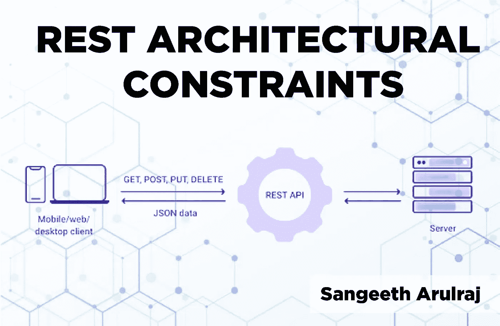
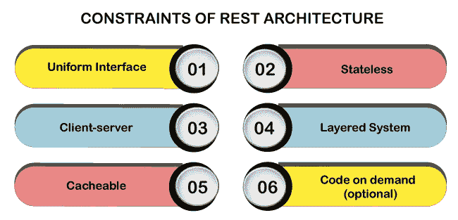
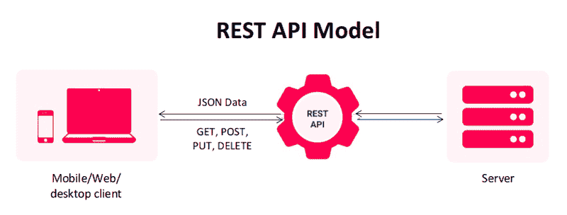
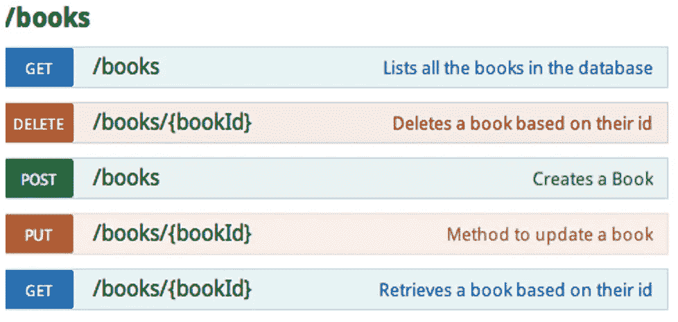

# REST 架构约束

> 原文：<https://medium.com/nerd-for-tech/rest-architectural-constraints-8c110e290b58?source=collection_archive---------1----------------------->

REST 是一个使用 Web 协议和技术的分布式网络平台。REST 架构包括围绕资源传输构建的客户端和服务器交互。此外，在线出版商在向用户交付联合内容时，通过启用网页内容和 XML 语句来使用 REST。用户可以通过网站的 URL 访问网页，使用 web 浏览器阅读 XML 文件，并根据需要解释和使用数据。

**静止中的约束**

REST 中有 6 个约束。这些约束限制了服务器管理和响应客户机请求的方式，使得系统通过在这些约束内工作来实现所需的非功能属性，如一致性、可伸缩性、可用性、可编辑性、可访问性、可移植性和可靠性。如果一个系统违反了任何必要的约束，它就不能被称为 RESTful。

***制服界面***

正如约束本身的名称所适用的那样，您必须为网络中的资源确定 API 接口，该接口向 API 用户公开并由 API 用户忠实地遵循。一个设备资源应该只有一个逻辑 URI，并且应该提供一种获取相关或补充数据的方法。

***无状态***

如果客户端应用程序需要成为最终用户的有状态应用程序，用户登录一次，然后执行其他批准的操作，那么每个客户端请求都将包含支持请求所需的所有信息，包括身份验证和授权细节。

***客户端-服务器***

这基本上意味着客户机和服务器的应用程序应该能够独立开发，而不相互依赖。客户应该只知道 URIs 的资源。

***分层系统***

REST 允许您使用分层的系统架构在服务器 A 上部署 API，在服务器 B 上存储数据，例如，在服务器 c 上对请求进行身份验证，客户端通常无法判断它是直接连接到终端服务器，还是连接到中间服务器。

***可缓存***

在 REST 中，如果需要，必须对资源进行缓存，然后这些资源必须声明自己是可缓存的。可以应用服务器或客户端高速缓存。

***按需编码***

约束是可选的。大多数时候，您会以 XML 或 JSON 格式发送静态资源表示。但是如果需要，您可以自由地返回可执行代码来支持应用程序的组件。

**REST API 的规则:** *在创建 REST API 端点时，有一些规则需要记住。*

*   REST 是基于资源或名词，而不是基于动作或动词。这意味着 REST API 的 URI 应该总是以名词结尾。*例子:/api/users 是一个很好的例子，但是/api？type=users 是创建 REST API 的一个不好的例子。*
*   HTTP 动词用于标识动作。一些 HTTP 动词有- ***【获取、放置、发布、删除、更新、修补】*** 。
*   web 应用程序应该像用户一样被组织成资源，然后使用 HTTP 动词像- ***GET、PUT、POST、DELETE*** 来修改这些资源。作为一名开发人员，通过查看端点和使用的 HTTP 方法，应该很清楚需要做什么。

*   在 URL 中始终使用复数，以保持 API URI 在整个应用程序中的一致性。
*   发送适当的 HTTP 代码来指示成功或错误状态。

参考:

[https://www . geeks forgeeks . org/rest-API-architectural-constraints/](https://www.geeksforgeeks.org/rest-api-architectural-constraints/)