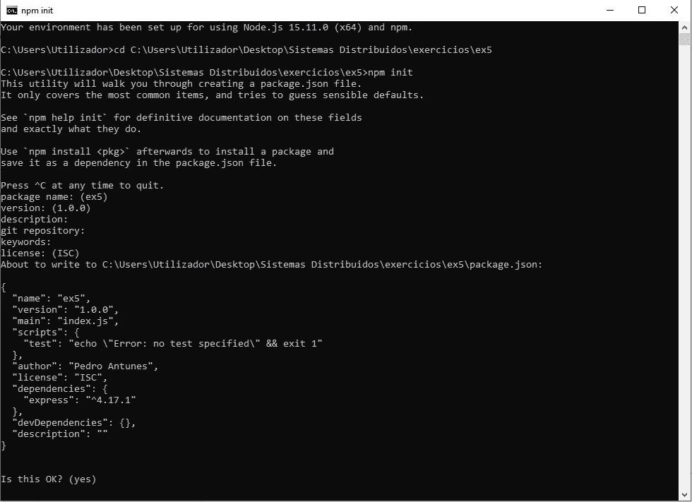
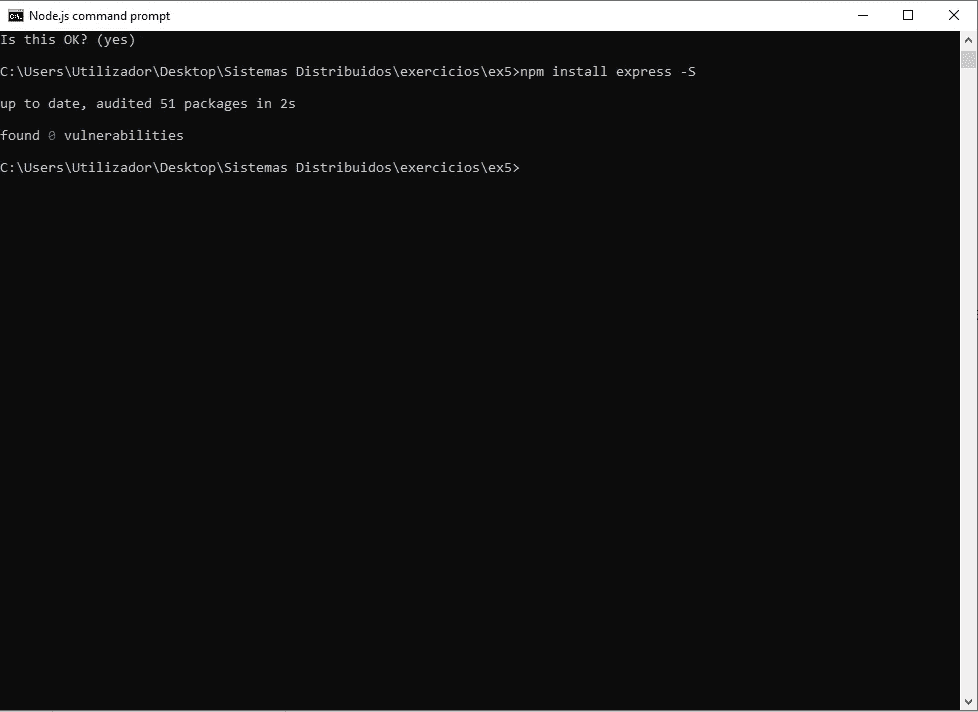
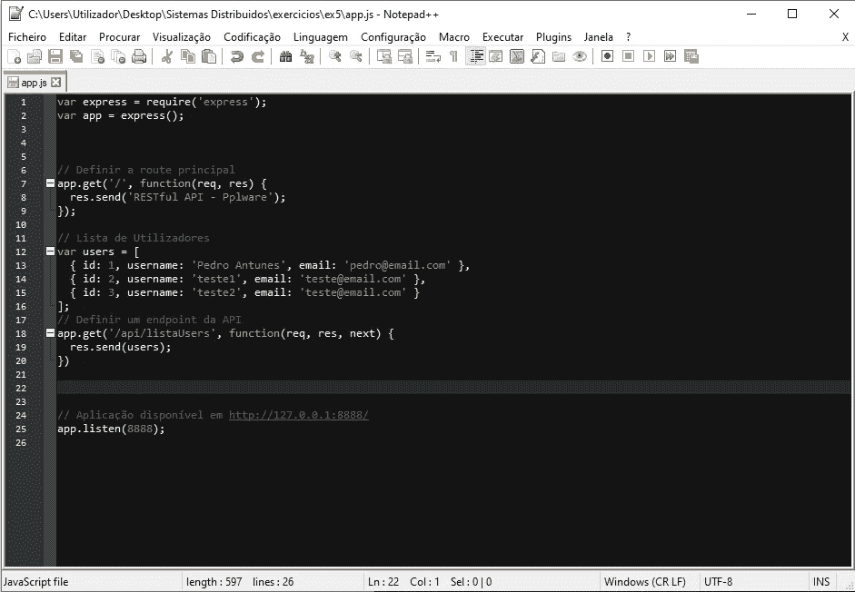
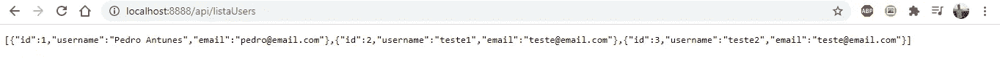
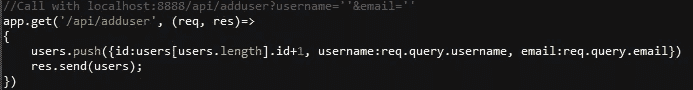
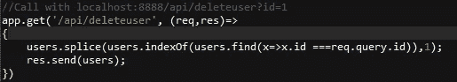
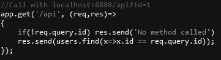
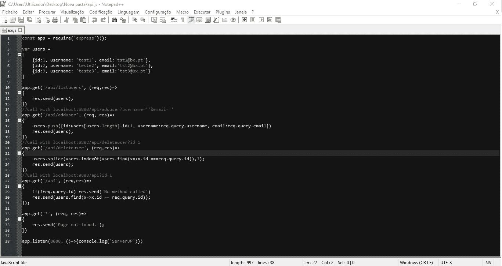

# 使用 Node.js 的 RESTful API

> 原文：<https://medium.com/nerd-for-tech/restful-api-with-node-js-3ab362cd42ca?source=collection_archive---------14----------------------->

**REST —具象状态转移**是一种使用 HTTP 协议进行通信的架构模型。介绍一个资源 JSON 更有用。

为了这个教程，吴创造了四种方法:

*   **列表用户** (GET) —所有用户列表
*   **addUser** (PUT) —添加用户
*   **删除用户**(删除)—删除用户
*   :**id**(POST)——用户的详细信息

第一步是为我们的项目和 package.json 创建一个目录

要创建 package.json，请键入以下命令:

> npm 初始化

然后，只需通过单击 enter 回答将出现在命令提示符上的几个问题，之后，提示符的输出应该如下所示:

npm 初始化

这一步完成后，我们将安装 Express.js 模块，为此只需键入以下命令:

> npm 快速安装

输出应该是这样的:

输出

我们要实现的第一个方法是**列出用户:**

在我们的 JavaScript 文件(Notepad++)中，我们将创建以下代码:

app.js

现在，我们保存文件并执行以下代码:

> node app.js

现在在浏览器上放入以下 url:

> [http://localhost:8888/API/listaUsers](http://localhost:8888/api/listaUsers)

输出应该是这样的:

输出

要添加新用户，我们必须添加以下代码(在列出用户的函数下面):

添加用户

要删除用户，我们必须添加以下代码(在添加用户的函数下面):

删除用户

要显示用户的详细信息，我们必须添加以下代码(在删除用户的函数下面):

用户的详细信息

我们最终的代码应该是这样的:

最终代码

现在，为了测试我们的 JavaScript 代码，我们必须调用以下 url:

显示用户列表:

> 本地主机:5000/api/listusers

添加用户:

> localhost:5000/api/adduser？用户名= '用户名' &电子邮件= '用户邮件'

删除用户:

> localhost:5000/api/deleteuser？id=1

显示用户的信息:

> 本地主机:5000/api？id=1