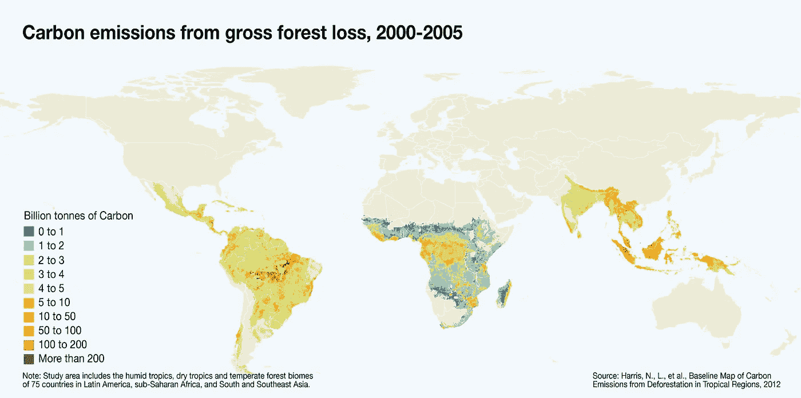
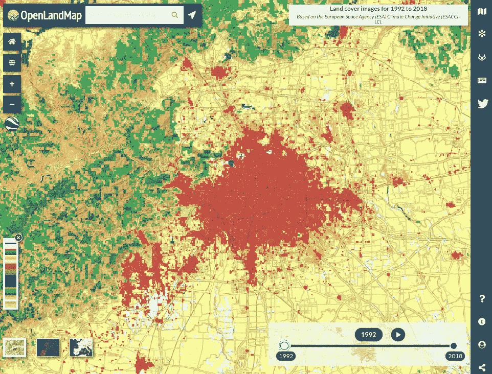
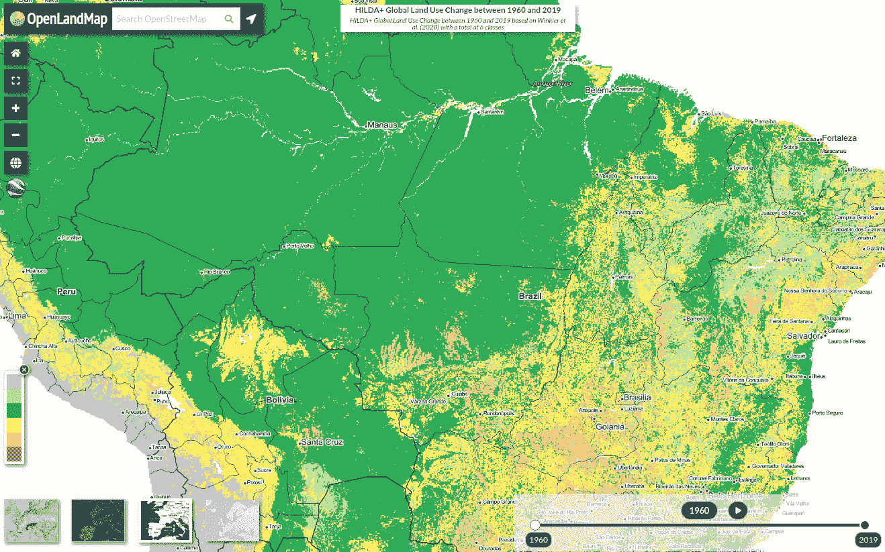
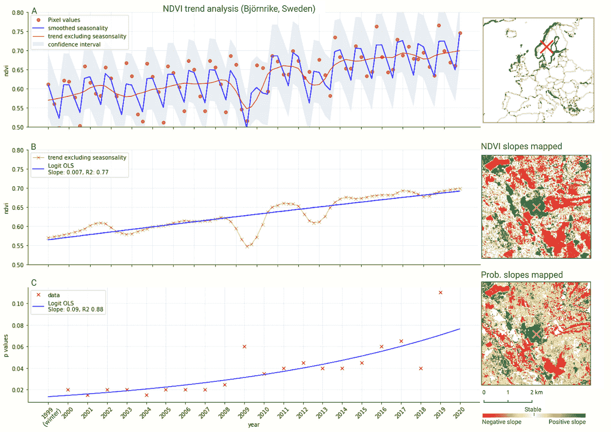
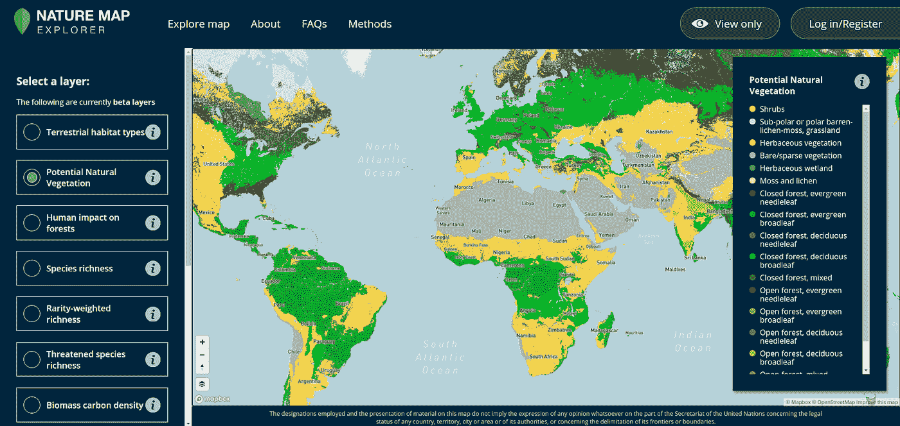
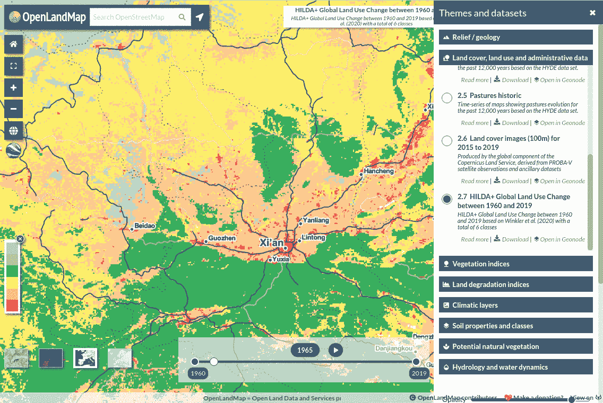

# 恢复文化:什么是土地退化，如何衡量它，你能做些什么来扭转一些负面趋势？

> 原文：<https://medium.com/nerd-for-tech/restoration-culture-what-is-land-degradation-how-to-measure-it-and-what-can-you-do-to-reverse-341e448994da?source=collection_archive---------1----------------------->

*编写人:Tom Hengl (OpenGeoHub)、Ichsani Wheeler (OpenGeoHub)、Robert A. McMillan (OpenGeoHub)、Kris Deveria (OpenGeoHub)、Leandro Parente (OpenGeoHub)、Chris van Diemen (OpenGeoHub)、Valentina del conte(OpenGeoHub)*

> 土地退化是陆地生态系统功能的系统性丧失:初级生产力、生物量和生物多样性的严重下降。这意味着土地的产量低于其自然生产能力，甚至最终完全退化，产量很少或根本没有。没有植物。没有动物。没有水。如果这种情况发生得足够广泛，它也会改变气候。自 150 年前工业革命开始以来，土地退化一直在以惊人的速度持续加速。但是并没有失去一切！我们现在知道如何通过系统的土地保护做法、扩大农业生态系统、景观规模的再水化以及大规模种植草、灌木和森林，通过亲近自然以及设计和建设有复原力的生态系统来扭转土地退化。但是哪里的土地恢复潜力最大呢？你如何参与进来，并帮助重新绿化，重新储存和扩大有弹性的陆地生态系统？

# 土地退化:你应该担心吗？

土地退化反映了陆地生态系统及其初级生产力的系统性丧失。它一般包括:

*   **地上和/或地下长期生物量的显著损失**，从而导致初级生产力、积极小气候/短水循环的损失。
*   **生物多样性的重大损失**，我们经常看到物种的完整功能群完全消失，通常没有一个短期的途径来重新殖民一个被遗弃的地区。
*   **生态系统恢复能力显著丧失**，这意味着退化的陆地生态系统在没有重大干预的情况下恢复能力下降，甚至可能永久性地转变为新的、功能更低的状态。

原始的原生植被和自然生态系统(也称为[、](https://en.wikipedia.org/wiki/Biome)和/或【自然栖息地】和/或[生态区](https://en.wikipedia.org/wiki/Ecoregion))通常被认为随着时间的推移相对稳定，并与自然和当前气候保持平衡。在过去的几代人里，对食物和纤维日益增长的需求导致人们急剧增加对天然植被和土壤的开发，首先是为了资源开采，然后是为了经济作物。

图片:森林砍伐，尤其是热带森林生态系统的皆伐导致排放量增加，进而导致全球变暖效应加剧和进一步荒漠化。这表明，土地退化和全球变暖往往是自我延续的过程。

这些做法往往在不知不觉中导致了土壤碳的流失、水供应的损失和养分循环能力的降低。我们正在清空生态系统最基本功能的“桶”。有时，这种损失是如此之大，以至于水桶不再存在，整个生态系统崩溃，基本上死亡。花费 1000 到 10000 年发展起来的物理和生物结构可能在几十年内被摧毁。

自 150 年前工业革命开始以来，我们的 [**生物圈**](https://en.wikipedia.org/wiki/Biosphere) 一直在经历一些似乎越来越糟糕的动荡时期，导致全球生态系统的[严重不稳定。换句话说:地球这个“拥挤的伊甸园”可能会在 50 到 100 年后从我们这一代人的记忆中消失。我们会成为比喻中的“逐渐变暖的锅里的青蛙”吗？不记得发生了什么，因此无法想象会再次发生什么？](https://www.ted.com/talks/johan_rockstrom_10_years_to_transform_the_future_of_humanity_or_destabilize_the_planet)

气候变暖和生物多样性丧失影响了每个人的食物和水安全，这些重要资源可能会变得更加稀缺，导致文明的又一次崩溃。一些人认为，这一次我们(人类)走得太远了，现在面临的不仅仅是当地生态和文明的崩溃，我们现在还面临着一场[大灭绝事件，很可能包括我们](https://bigthink.com/philip-perry/the-example-of-easter-island-shows-why-humanity-will-be-extinct-within-a-100-years)。事实上，大多数科学家现在都同意，地球生物圈正处于其历史上第六次大灭绝的[起点，这主要是由化石燃料和农业/食品工业的扩张以及城市扩张造成的。我们对这个星球历史上可能最大的](https://www.theguardian.com/environment/2017/jul/10/earths-sixth-mass-extinction-event-already-underway-scientists-warn)**生态灭绝负有直接责任:**

*   **[仅在过去的 40 年里，地球就失去了一半的野生动物。](https://www.theguardian.com/environment/2014/sep/29/earth-lost-50-wildlife-in-40-years-wwf)**
*   **由于大量使用杀虫剂，超过 40%的昆虫种类正在减少，三分之一濒临灭绝。**
*   **如果目前的森林砍伐速度继续下去，不到 100 年，地球上所有的雨林就会被摧毁，**
*   **到 2048 年，全世界的海洋可能会被完全捕捞殆尽，**
*   **[在过去的 150 年里，由于侵蚀、压实、荒漠化、酸化和土壤有机碳的损失，地球上一半的表土已经流失](https://www.worldwildlife.org/threats/soil-erosion-and-degradation)，**
*   **[由于全球变暖和气候变化，水土流失可能增加 60%](https://doi.org/10.1073/pnas.2001403117) ，**
*   **[自 1992 年里约会议以来，全球碳排放量增加了 48%](http://infographics.pbl.nl/website/globalco2-2016/) ，**

**[Ripple 等人(2019)](https://academic.oup.com/bioscience/article/70/1/8/5610806) 概述了全球生态系统退化和相关气候危机的主要已知趋势。土地退化只是更广泛和复杂的环境损失的一个方面，但考虑到全球变暖和全球安全，生态系统功能的衰退是人类必须面对的最令人关切和最紧迫的紧急问题之一。**

**一方面，地球表面的自然栖息地和土壤正在迅速被剥离，限制了碳储存能力以及水和食物的供应；另一方面，人类目前花费[数万亿美元](http://watson.brown.edu/costsofwar/)用于毁灭性的战争、[多余的火星任务和](http://spacenews.com/op-ed-mars-for-only-1-5-trillion/)寻找更有效的方法来提取不可再生资源。**

**如果我们把这几万亿的一部分投资在恢复退化的土地上会怎么样？我们能否减轻一些气候变化的影响，并支持所有国家的公正、公平和充分的发展，这样就没有必要首先建造真实或虚拟的墙？也许格里塔·图恩伯格在扭转生态系统退化的行动上显得过于激进？我们真的能指望未来科技保护我们免受全球变暖、洪水和火灾的影响吗？或者我们应该像对待现实社会的生死一样对待这场危机——变得更加激进？有大量证据表明，人们对危机的速度感到严重担忧。然而，在经历了这么多之后，说了这么多，做了这么多，我们仍然在排放越来越多的二氧化碳。众所周知，说的比做的多得多！**

**总之，生物圈问题比你可能接受的要糟糕得多。这会成为我们**的集体耻辱吗:我们知道该做什么，但却无法接受必要的文化进化？我们真的别无选择，只能把我们的脑袋埋在沙子里吗？首先，我们需要对我们环境的现状和趋势有一个清晰的认识。****

# **如何衡量土地退化？**

**阻止这种生态系统衰退的消极趋势的第一步是掌握目前全球有多少土地退化以及这些土地在哪里。在衡量我们正在失去多少土地时，第一个挑战是界定退化到底是什么，以及我们如何量化退化？由于土地退化的定义常常因地、因国而异，**的数字可能会有很大差异**。 [Gibbs & Salmon (2015)](https://www.sciencedirect.com/science/article/pii/S0143622814002793) 试图以千兆公顷(Gha)为单位估算全球土地退化，并得出结论认为“退化土地总面积从不到 1 千兆公顷到超过 6 千兆公顷不等”。 [Le 等人(2016)](https://link.springer.com/chapter/10.1007/978-3-319-19168-3_4) 估计*“土地退化热点覆盖全球约 29%的土地面积，并出现在所有农业生态和土地覆被类型中”*，但同样，这一数字应仅在所用措施的背景下考虑。[可持续发展研究所的报告](https://www.iisd.org/articles/land-degradation-land-restoration)提到，全球土地总面积的 25%已经退化，32 亿人直接受到土地退化的影响。**

**最近， [Kulmala (2018)](https://www.nature.com/articles/d41586-017-08967-y) 提出了一种新的综合方法，他建议我们长期需要一个永久性的标准化监测站全球网络来帮助提高气候和环境变化估计的准确性。没有科学的监测系统，可持续发展将是不可能的，这些系统旨在大规模工作并提供准确的决策数据( [Espey，2019](https://www.nature.com/articles/d41586-019-02139-w) )。**

**为了系统地防治土地退化，联合国建立了包括《荒漠化公约》在内的几个特别实体，这些实体多年来一直在研究监测土地退化和实现 [**土地退化中立** (LDN)](https://www.unccd.int/actions/achieving-land-degradation-neutrality) 的方法，即至少防止任何进一步的大规模土地退化。LDN 方案提供了一个全球默认的 **3 指标框架**，该框架根据可测量的(具体的)变量定义了土地退化:**

1.  **自然栖息地/生产用地的损失:以土地覆盖和土地利用图中土地覆盖类别的变化来衡量。**
2.  **植物净初级生产力的损失:以吨/公顷/年计量。**
3.  **地上和地下生物量的损失:以吨/公顷/年计量。**

**评估土地退化的方法(在国家和区域一级)在 [**LDN 良好做法指南**](https://www.unccd.int/sites/default/files/relevant-links/2021-03/Indicator_15.3.1_GPG_v2_29Mar_Advanced-version.pdf) 文件中有详细解释。强烈鼓励国家和区域用户使用其他指标，根据其具体国家和关切的背景，建立衡量和监测框架，尽可能设定目标和跟踪进展。**

# **地图中的土地覆盖/初级生产力动态**

**LDN 和类似项目使用的一些描述全球陆块土地覆盖动态的全球参考数据集包括(排名不分先后):**

*   **[欧洲航天局(ESA)气候变化倡议(ESACCI-LC)](http://maps.elie.ucl.ac.be/CCI/viewer/) 以 300 米空间分辨率对 1992-2018 年的土地覆盖时间序列进行预测，**
*   **[哥白尼 CGLS-LC100](https://land.copernicus.eu/global/products/lc) (集合 3)2015-2019 年 100 空间分辨率年度和全球土地覆盖图，**
*   **[MODIS mod 13 Q1](https://lpdaac.usgs.gov/products/mod13q1v006/)250 米空间分辨率的 NDVI / EVI 影像时间序列，**
*   **[JRC 土地生产力动态(LPD)](https://wad.jrc.ec.europa.eu/landproductivity)1999–2013 年 1 公里分辨率年度全球，**
*   **[欧空局生物质气候变化倡议(生物质 _ CCI)2010 年、2017 年、2018 年 100 米空间分辨率的全球地面生物质产品](https://catalogue.ceda.ac.uk/uuid/84403d09cef3485883158f4df2989b0c)，**
*   **【2001 年和 2012 年 25 公里空间分辨率的 ESDAC 全球土壤侵蚀图([博雷利等人，2017](https://www.nature.com/articles/s41467-017-02142-7) )，**
*   **[HILDA+(历史土地动态评估)数据集](https://doi.pangaea.de/10.1594/PANGAEA.921846)，空间分辨率为 1 公里，涵盖 1960 年至 2018 年期间 [(Winkler 等人，2021 年)](https://www.nature.com/articles/s41467-021-22702-2)，**
*   **[影响观测站【2020 年 10 米分辨率的全球土地利用/土地覆盖图，](http://www.impactobservatory.com/)**
*   **[谷歌地球延时摄影](https://earthengine.google.com/timelapse/)显示了 1984 年以来的卫星图像时间序列，**

****

***图像:时间推移可视化示例:*[*OpenLandMap.org 数据门户中显示的使用*](https://openlandmap.org/#/?base=Stamen%20(OpenStreetMap)&center=39.8670,116.4975&zoom=10.049247630760222&opacity=65&layer=lcv_land.cover_esacci.lc.l4_c&time=2015) [*ESACCI-LC 土地覆盖时序数据*](http://www.esa-landcover-cci.org/) *所见的北京 1992 年至 2019 年* *的扩展。***

**最近发布的 [HILDA+数据集](http://hilda.plus/hildaplus_map.html) ( [Winkler 等人，2021](https://www.nature.com/articles/s41467-021-22702-2) )目前覆盖了最长的一段时间(70 年)，即它基本上可视化了世界上大多数热带森林丧失和城市化过程。下面给出了 HILDA+可视化的一些例子。**

****

***Image:*[*HILDA+dataset*](http://hilda.plus/hildaplus_map.html)*(Winkler 等人，2021)显示了 1960 年至 2019 年拉丁美洲热带森林覆盖的变化。视觉化* [*希尔达+OpenLandMap.org*](https://openlandmap.org/#/?base=Stamen%20(OpenStreetMap)&center=-11.8097,-52.1153&zoom=6.163732922496704&opacity=65&layer=lcv_land.use.land.cover_hilda.plus_c&time=1960)*。***

**下面的可视化显示了基于欧洲大陆[wit jes 等人，2021](https://doi.org/10.21203/rs.3.rs-561383/v1)[20 年 NDVI 时间序列数据(2000–2019)拟合的](https://maps.opendatascience.eu)[**【NDVI**](https://nl.wikipedia.org/wiki/Normalized_Difference_Vegetation_Index)**趋势**(回归斜率)。可以拟合一条回归线来估计变化的总体趋势，然后平均起来可以显示趋势在哪里是积极的，在哪里是消极的。**

****

***图片:使用 NDVI 时间序列数据拟合的趋势函数示例(20 年；一年 4 季)用于单个像素(空间分辨率 30×30 米)。瑞典的这个特定像素显示了 NDVI 的逐渐改善。* [*后 Witjes 等人，(2021)*](https://doi.org/10.21203/rs.3.rs-561383/v1) *。***

**注:估计初级生产力的一般趋势通常不是一项简单的任务。生态系统中有许多过程是突然而剧烈的，如森林火灾、洪水等，但在一个有弹性的生态系统中，这些过程可以相对较快地恢复。上面的图显示了 NDVI 相对平稳的正增长的一些例子，但是对初级生产力趋势的任何解释都是特定于气候/生境区域的，并且取决于时间尺度。也就是说，每个气候带和土地利用类别的 NDVI 特征都有所不同，需要进行同类分类，因为它们通常的光谱特征/特征应该可以决定一种变化是否可以归类为土地恢复或退化。**

**总之，由于有了地球观测计划，如美国国家航空航天局/美国地质勘探局的 Landsat、[MODIS](https://modis-land.gsfc.nasa.gov/)和[GEDI](https://gedi.umd.edu/)、[欧空局的 Sentinel](https://sentinel.esa.int/)和[JAXA 的 ALOS](https://global.jaxa.jp/projects/sat/alos/)计划，我们现在可以比 20-30 年前更客观地探测主要的土地退化热点并监测土地流失趋势。土地退化仍然是一个复杂的地图特征(关于深入的讨论，请参见: [Anderson & Johnson，2016](https://doi.org/10.1007/978-3-319-19168-3_5) )，但我们在这方面越来越好，并且比以往任何时候都更清楚地了解大多数无意造成的破坏的规模。**

# **土地潜力和土地恢复**

**术语**“土地潜力”**或**“土地资源潜力”**表示一块土地在最高可实现的初级生产力、地上和地下生物量、生物多样性和生境复原力方面所能提供的实际最大或最佳效益(例如，假设给定的土壤、气候、生物、土地形状/形态、地质和年龄)。简而言之，如果我们能够以某种方式帮助加速自然生态系统的积累过程，这是对一个地方可能会变成什么样子的估计。这是一个有点理论性的概念，通常不容易定义或验证，所以有时我们能做的最好的事情是使用来自类似生态区域的相关例子(类似的气候、地形、土壤等)，然后假设这是可以扩大到大面积的目标土地潜力( [Hengl 等人 2018](https://peerj.com/articles/5457/) )。本质上，它最好被视为设计的模板。**

**土地潜力也可以绘制出来，但验证通常很麻烦，尤其是如果需要几十年的时间才能确定一个最佳预测。尽管存在这些挑战，许多项目还是制作了土地潜力测绘地图和工具(未分类):**

*   **[自然地图。地球](https://naturemap.earth/)项目:展示自然资源地图，包括潜在自然植被和栖息地类型的全球地图( [Jung 等人，2020](https://doi.org/10.1038/s41597-020-00599-8) )，**
*   **[a evidence](https://www.agevidence.org/):是一个数据库，收录了自 1980 年以来近 300 篇同行评议的研究论文，由 [TNC](https://www.nature.org/en-us/) 提供超过 22，000 个数据点，显示了再生农业的所有积极案例。**
*   **【Landpotential.org】项目:为众包地面数据采集和服务土地潜力估算提供数据门户和手机应用。**
*   **粮农组织的土壤碳隔离图显示了土壤碳潜在增加的估计值，假设在保护性农业中进行一些合理且廉价的改变，**

****

***图片:潜在自然植被(PNV)的全球地图，或* [*自然地图中显示的“没有(无知)人的地球”可能是什么样子。地球观察器*](https://explorer.naturemap.earth/map) *。下载地图使用:*[*https://doi.org/10.5281/zenodo.3631253*](https://doi.org/10.5281/zenodo.3631253)*。对比* [*实际植被图为 2018 年*](https://land.copernicus.eu/global/products/lc) *。潜在生物群落的地图可在* [*这里*](https://openlandmap.org/#/?base=BingMaps%20(Aerial)&center=34.5787,-2.2038&zoom=3.819225939641972&opacity=85&layer=pnv_biome.type_biome00k_c) *获得。***

**土地恢复与土地退化截然相反。在某种程度上，陆地生态系统(除非整个物种已经被摧毁并灭绝)最终积累了足够的结构、秩序和多样性，以至于它们达到了“稳定状态”(前面提到的自然栖息地)。这些自然过程通常需要 100 到 10，000 年，相对于我们自己的生命周期来说，这超出了一个有意义的时间框架。然而，我们的技术和创新大脑可以用来加速土地恢复，并可能将几千年压缩成几十年。我们可以介入，用相对较少的努力(但是大量的理解)帮助生态系统再次积累和稳定。**

**利用技术和土地管理技术恢复生态系统弹性、初级生产力以及地上和地下生物量的项目可称为**“土地恢复项目”**。**联合国环境规划署下属的国际资源小组** (IRP)在其报告中概述了土地恢复的主要原则:[“为实现可持续发展目标而恢复土地”](https://wedocs.unep.org/bitstream/handle/20.500.11822/29749/LandSDG.pdf)。**

**土地恢复的基本步骤通常是:**

1.  **确定和定位具体的土地恢复热点或优先地区，**
2.  **确定一个地区的**土地潜力**(假设一个给定的优选土地利用系统)，**
3.  **制定土地恢复的长期/短期计划，确认预算和回报，**
4.  **通过积极行动实施土地恢复，如修梯田、修建灌溉系统、种植和系统改变土地用途等。**
5.  **使用**景观** **关键绩效指标**(KPI)跟踪年度或更短时期内的变化，如初级生产力、防止侵蚀、水渗透、土壤碳封存等。**
6.  **重新评估和修改并确认趋势是积极的，KPI 目标已经达到。**

**[大型生态系统恢复项目](https://www.globalcitizen.org/en/content/ecological-restoration-projects/)包括[撒哈拉和萨赫勒绿色长城](https://www.unep.org/news-and-stories/story/worlds-biggest-ecosystem-restoration-project)、[巴基斯坦“十亿树海啸】、](https://www.unep.org/news-and-stories/story/pakistans-ten-billion-tree-tsunami)、[中国黄土高原恢复](https://rethink.earth/turning-desert-to-fertile-farmland-on-the-loess-plateau/)，仅举几例。下面的动画展示了中国西海固省植被覆盖的改善。**

****

***图片:中国黄土高原大规模修复为* [*希尔达+时序上看到的*](https://openlandmap.org/#/?base=OpenTopoMap&center=35.6376,106.8306&zoom=6.526432143932163&opacity=64&layer=lcv_land.use.land.cover_hilda.plus_c&time=1994) *。灰色像素代表贫瘠区域，即已经转化为自然植被或农田/牧场的区域。***

**因此，肯定已经有了一些想法，关于一些最重要的土地恢复热点在哪里，以及在一些未来的“积极预测”中，地球可能是什么样子。变得有些复杂的是，我们需要同时处理三个相互交织的问题:(1)全球森林砍伐/生物多样性栖息地的丧失，(2)全球变暖，(3)食物、纤维和水的生产。这意味着，所有的设计必须解决这些多重目标。这也意味着，没有人类的纯粹自然的想法对我们的追求几乎没有用处。此外，随着全球变暖，植被(如森林和牧场物种)正在向气候更适宜的地理位置迁移！因此，任何土地潜力/土地恢复计划也需要是动态的，并在长期方案中提供短期步骤。**

# **行动起来制止土地退化**

**在前面的章节中，我们讨论了什么是土地退化及其对立面:土地潜力和土地恢复。我们在此列出了目前已知的缓解全球变暖和类似环境退化问题的最佳解决方案和策略。这些包括以下有影响力和面向行动的举措(未分类，并假设有一些重叠):**

*   **保护和恢复热带森林生态系统/ **防止非法砍伐森林**，**
*   ****保护和恢复湿地、泥炭地和红树林**，**
*   **通过**灌溉和大量种植草、灌木和树木**防止荒漠化和土壤侵蚀，**
*   **通过**建造梯田和水渗透系统**改善上游和下游集水区的水管理，防止复杂地形中的土壤侵蚀。**
*   ****保护或再生农业**实践，**
*   **大规模的农业生态系统，如**农林业和永久农业****
*   **土壤性质的改善，特别是**土壤有机碳、养分循环和保水**，**

**简单而系统的土地恢复以及改变我们种植和收获作物的方式，作为解决全球变暖的一种方法，也可能在逆转碳排放和减缓全球变暖方面发挥重要作用。 [Bossio et al (2020)](https://doi.org/10.1038/s41893-020-0491-z) 分析全球土地数据，得出土壤固碳约为自然气候解决方案潜力的 25%的结论。[沙等，(2022)](https://doi.org/10.1038/s43247-021-00333-1) 分析了全球碳汇潜力，并得出结论:**区位优化土地管理措施**有助于大幅提高陆地植被的碳汇潜力。同样，农林复合系统在保护景观、同时养活人们和创造收入方面具有巨大潜力( [Plieninger 等人，2020](https://link.springer.com/article/10.1007/s11625-020-00836-4) )。**

**然而，这里需要强调三件事:(1)重新造林，例如种植 1 万亿棵树木一般来说是一个好的举措，只要它与适当的生态工程一起系统地应用，(2)农业在减缓气候变化方面具有重要作用，但向可持续(甚至可再生)农业的过渡可能需要几十年，(3)世界需要一种新的绿色经济来取代现有的基于自然资源开发的经济。**

**如果没有国际协议，上面列出的许多战略可能无法实施，所以是的:土地恢复和生态系统恢复在很大程度上也是一个地缘政治问题。但不管地缘政治如何，所有的修复努力，即使是失败的努力，本身都是值得追求的崇高目标。**

# **土地恢复文化与“一切照旧”的系统性转变**

**一旦我们把一个生态系统退化到无法自我修复的程度，我们最终会破坏那些让我们生存和社会繁荣的系统。然而，在足够长的时间内，我们的自我毁灭行为是无关紧要的。地球的生物圈将会“痊愈”,进化将会继续。这已经发生无数次了。但是我们的文明呢？它也可能连同我们认为是“我们的版本”的生物圈一起被损坏到无法修复。只是埋在下一个地质时代之下的另一个地质时代。**

**一些人认为全球生态系统退化问题主要是当前主流世界经济的问题:基于自然资源开采的营利自由资本主义。现代经济基本上是一种长期的自我毁灭吗？通过回顾 [Ripple et al. (2019)](https://academic.oup.com/bioscience/article/70/1/8/5610806) 中的情节，人们可以得出结论，任何一切如常的世界经济都必将把我们带到灭绝的边缘。虽然看起来我们潜在地拥有向“更好的”绿色经济转型的所有技术和知识，但很可能这将最终要求我们在几十年内完全放弃 GDP 增长([梅多斯&兰德斯，2012](http://donellameadows.org/archives/a-synopsis-limits-to-growth-the-30-year-update/) )。事实上，GDP 永远不会比我们孩子的未来更重要。**

**或者有没有一个平稳的过渡+适应路径，让我们不必立即停止飞行、驾驶、养殖动物、使用塑料？最终，我们需要一个为适应做准备的经济体。有没有更快更有效的解决方案来解决全球变暖和大气中二氧化碳过多的问题？我们如何才能建立一个客观的系统，在没有太多争议的情况下跟踪和报告环境的状况？有许多开放性的问题超出了这篇博客的篇幅。**

**底线是，我们很可能不得不系统地将教育和我们的文化从消费社会和对环境退化的无知转变为一种**土地恢复文化**。累积的文化。一个不仅装满生态桶[而且敢于把它变得更大](https://rethink.earth/imagine-all-the-people-a-resilient-future-in-2050/)的人。如果下一代年轻人(称之为:[**# generation restoration**](https://www.decadeonrestoration.org/follow-generationrestoration))已经在小学就学会如何高效地检测生态系统问题、种植植物、理解从局部到全球的生态循环，这可能是我们未来最好的投资。**

# **如何参与？**

**我们如何(在当地、地区、全球)为防止物种大规模灭绝(包括人类)做出贡献？)以后呢？如果你对本文中讨论的负面趋势感到担忧，尤其是如果你想采取行动，这里有一些大规模的倡议和计划，你或许应该了解一下:**

*   **[土地退化中立(LDN)](https://www.unccd.int/actions/achieving-land-degradation-neutrality) 方案，**
*   **[联合国生态系统恢复十年](https://www.decadeonrestoration.org/)，**
*   **[波恩挑战](https://www.bonnchallenge.org/)，**
*   **[弹性洞察 2019 报告和 2020–2050 政策路线图](http://grpinsightsreport.info/)，**
*   **[马拉喀什全球气候行动伙伴关系](https://unfccc.int/climate-action/marrakech-partnership-for-global-climate-action)**
*   **[欧洲绿色协议](https://ec.europa.eu/info/strategy/priorities-2019-2024/european-green-deal_en)，**
*   **[(美国)绿色新政](https://en.m.wikipedia.org/wiki/Green_New_Deal)，**

**许多其他非政府组织也深切关注土地和生境的恢复:仅举几个主要组织为例，如[世界自然基金会](https://www.worldwildlife.org/)、绿色和平组织、[国际自然保护联盟](https://www.iucn.org/)、[国际可持续发展研究所](https://www.iisd.org/articles/land-degradation-land-restoration)、[全球复原力伙伴关系](https://www.globalresiliencepartnership.org/)。**

**一些在线工具可以帮助您可视化、理解土地退化并规划恢复和/或保护性农业:**

*   **[全球森林观察](https://www.globalforestwatch.org/)**
*   **[全球红树林观察](https://www.globalmangrovewatch.org/)，**
*   **[马里兰大学全球土地分析& Discovery (GLAD)](https://glad.umd.edu/aboutus) 数据集和工具，**
*   **[WRI 的资源观察](https://resourcewatch.org/)，**
*   **[谷歌地球定时拍摄](https://earthengine.google.com/timelapse/)，**
*   **[生态修复协会(SER)](https://www.ser-rrc.org/project-database/project-map/) 世界修复工程地图，**
*   **[Restor.eco](https://restor.eco/) ，**
*   **[农业管理开放技术生态系统(OpenTEAM)](https://openteam.community/) ，**
*   **[OpenLandMap.org](http://www.openlandmap.org)**

**关注由国家地理学会、谷歌和[世界资源研究所](https://www.wri.org/)、欧空局 [**世界土地覆盖图**](https://esa-worldcover.org/en) 建立的 [**世界活地图**，它们将在未来几年以 10 米的空间分辨率提供全球一致的世界土地覆盖图。](https://geospatial-solutions.com/national-geographic-society-needs-help-building-living-map-of-world/)**

**您还可以加入和参与该领域的一些组织和计划(未分类):**

*   **[生态系统恢复营地](https://ecosystemrestorationcamps.org/)，**
*   **为地球种植植物，**
*   **[未来之树(TREES)](https://trees.org/) ，**
*   **[种下一棵树](https://onetreeplanted.org/)，**
*   **[公地](https://www.commonland.com/)，**
*   **[全球景观论坛](https://www.globallandscapesforum.org/)，**
*   **[再生网络](https://www.regen.network/)，**

**一些好的科普读物/图文并茂的指南，帮助你了解和实施土地恢复(未分类):**

*   **[保罗·霍肯:**《再生:结束一代人的气候危机》**](https://paulhawken.com/) ，**
*   **[理查德·帕金斯:**《再生农业》**](https://www.regenerativeagriculturebook.com/) ，**
*   **[加布·布朗:**《从泥土到土壤:一个家庭的再生农业之旅》**](https://thenaturalfarmer.org/article/dirt-to-soil-one-familys-journey-into-regenerative-agriculture/) ，**
*   **[詹姆斯·洛夫洛克:**《治愈盖亚》**](https://www.amazon.com/Healing-Gaia-Practical-Medicine-Planet/dp/0517578484) ，**

**除了在实地做实际工作之外，如果你只是简单地让自己了解实际情况，然后考虑支持解决这些问题的政治方案(而这些方案不一定总是而且仅仅是“绿色”政党)，也会有所帮助。**

# **OpenLandMap.org:查看动态星球**

**大公司拥有庞大的基础设施来提供有关道路、交通、购物的信息(例如谷歌地图)，但我们对我们景观的环境历史却知之甚少(称之为"**景观记忆"**):20 年、50 年、100 年和 1000 年前的景观是什么样的，哪些已经暂时或永久消失了？为了解决这一数据缺口，[OpenGeoHub.org](https://www.opengeohub.org/)与 [GiLAB.rs](https://gilab.rs/) 和其他合作伙伴一起，一直在建立和维护开放的全球数据集和可视化工具，以帮助公众了解我们的环境状况，称为[www.OpenLandMap.org](http://www.openlandmap.org)([阅读更多关于 OpenLandMap 和地球观测/监测系统](https://opengeohub.medium.com/everybody-has-a-right-to-know-whats-happening-with-the-planet-towards-a-global-commons-130a52235c42))。OpenLandMap.org 的主要目标之一是帮助公众更好地了解土地退化的程度，并帮助分享信息，交流积极和消极的趋势。如果您在 OpenLandMap 上发现了一些有趣的地图时间序列模式，并希望与您的同事共享这些模式，只需复制视图的 URL，然后在您的网站上共享或嵌入查看器。**

**OpenLandMap 是一个真正的开放数据系统，可以不受限制地访问，不需要注册。如果您是开发人员，您可以下载数据，构建您自己的解决方案，或者在我们的基础设施上构建。我们目前托管和提供大约 3TB 的数据，其中大部分数据以[云优化地理标签](https://gitlab.com/openlandmap/global-layers/-/blob/master/tutorial/OpenLandMap_COG_tutorial.md)的形式提供，这意味着您可以将这些数据作为空间数据库进行访问和查询。图层被组织在不同的主题/组中，并可用作[网络地图服务(WMS)](https://www.ogc.org/standards/wms) 服务和/或通过 REST API 使用。大多数图层也可以通过[谷歌地球引擎](https://developers.google.com/earth-engine/datasets/tags/openlandmap)获得。**

**您是否正在制作全球数据集，您是否愿意在[www.OpenLandMap.org](http://www.openlandmap.org)上托管/发布它们？请发送电子邮件给我们，我们可以帮助您准备和发布您的数据，以便让更多的人了解这些数据，并帮助提高人们的认识。**

# **引用的参考文献**

1.  **安德森 w . &约翰逊 T. (2016)。使用地面测量和遥感评估全球土地退化。《土地退化与改良经济学——可持续发展的全球评估》(第 85-116 页)。斯普林格，查姆。[https://doi.org/10.1007/978-3-319-19168-3_5](https://doi.org/10.1007/978-3-319-19168-3_5)**
2.  **BBC 新闻(2020)。大卫·爱登堡爵士警告气候“危机时刻”。**
3.  **博雷利 p、罗宾逊 D.A、弗莱舍 L.R、卢加托 e、巴拉比奥 c、阿勒韦尔 c、默斯伯格 k、莫都尼奥 s、舒特 b .费罗、v .巴加雷洛、v .范奥斯特 k、蒙塔纳雷拉 l、帕纳戈斯 P. 2017。对 21 世纪土地利用变化对土壤侵蚀的全球影响的评估。自然通讯，8 (1):第 2013 期[https://www.nature.com/articles/s41467-017-02142-7](https://www.nature.com/articles/s41467-017-02142-7)**
4.  **p .、Robinson、D. A .、Panagos、p .、Lugato、e .、Yang、J. E .、Alewell、c .…& balla bio、C. (2020)。土地利用和气候变化对全球水土流失的影响(2015-2070)。美国国家科学院学报，117(36)，21994–22001。[https://doi.org/10.1073/pnas.2001403117](https://doi.org/10.1073/pnas.2001403117)**
5.  **Bossio，D. A .，Cook-Patton，S. C .，Ellis，P. W .，Fargione，j .，Sanderman，j .，Smith，p .，… & Griscom，B. W. (2020)。土壤碳在自然气候解决方案中的作用。自然可持续性，3(5)，391–398。[https://doi.org/10.1038/s41893-020-0491-z](https://doi.org/10.1038/s41893-020-0491-z)**
6.  **克拉克河(2020)。[大卫·爱登堡正在犯和格里塔·图恩伯格一样的错误。旁观者。](https://blogs.spectator.co.uk/2020/01/david-attenborough-is-making-the-same-mistake-as-greta-thunberg/)**
7.  **埃斯佩，J. (2019)。[没有数据，可持续发展将步履蹒跚。自然，571，299–299。](https://www.nature.com/articles/d41586-019-02139-w)**
8.  **欧洲新闻(2019)。新数据显示，欧盟仍是世界三大二氧化碳排放国之一。**
9.  **吉布斯，H. K .，&萨蒙，J. M. (2015)。绘制世界退化土地图。应用地理，57，12–21。[https://doi.org/10.1016/j.apgeog.2014.11.024](https://doi.org/10.1016/j.apgeog.2014.11.024)**
10.  **亨格尔 T，沃尔什 MG，桑德曼 J，惠勒 I，哈里森 SP，普伦蒂斯 IC。(2018).潜在自然植被的全球制图:对估计土地潜力的机器学习算法的评估。PeerJ 6:e 5457[https://doi.org/10.7717/peerj.5457](https://doi.org/10.7717/peerj.5457)**
11.  **IRP (2019 年)。[恢复土地以实现可持续发展目标](https://wedocs.unep.org/bitstream/handle/20.500.11822/29749/LandSDG.pdf):国际资源小组的一篇思考文章。**
12.  **m .库尔马拉(2018)。[建造全球地球观测站](https://www.nature.com/articles/d41586-017-08967-y)。自然 553，21–23。**
13.  **Le，Q. B .，Nkonya，e .，和 Mirzabaev，A. (2016 年)。基于生物质生产率的全球土地退化热点制图。Nkonya，Mirzabaev，a .和 von Braun，j .).土地退化和改良经济学——可持续发展的全球评估。纽约:施普林格，55-84 岁。[https://link . springer . com/chapter/10.1007/978-3-319-19168-3 _ 4](https://link.springer.com/chapter/10.1007/978-3-319-19168-3_4)**
14.  **d .梅多斯和 j .兰德斯(2012 年)。增长的极限:30 年更新。劳特利奇。**
15.  **荣格，m .，达哈尔，P. R .，布查特，S. H .，唐纳德，P. F .，德莫拉，x .，莱西夫，m .，… &维斯康帝，P. (2020)。全球陆地栖息地类型图。科学数据，7(1)，1–8。[https://doi.org/10.1038/s41597-020-00599-8](https://doi.org/10.1038/s41597-020-00599-8)**
16.  **佩里·p .(2019)。[复活节岛展示了为什么人类会在 100 年内灭绝](https://bigthink.com/philip-perry/the-example-of-easter-island-shows-why-humanity-will-be-extinct-within-a-100-years)。BigThink.com**
17.  **茨韦塔纳·普利宁格尔、穆尼奥斯-罗哈斯、巴克、L. E .、谢尔和 S. J. (2020 年)。可持续景观管理的农林业。可持续性科学，15(5)，1255–1266。【https://doi.org/10.1007/s11625-020-00836-4 **
18.  **Ripple，W. J .，Wolf，c .，纽森，T. M .，Barnard，p .，& Moomaw，W. R. (2019)。世界科学家警告气候紧急情况。生物科学。**
19.  **桑托罗，m。Cartus，O. (2021 年):欧空局生物量气候变化倡议(生物量 _ CCI):2010 年、2017 年和 2018 年森林地上生物量全球数据集，v2。http://dx.doi.org/10.5285/84403d09cef3485883158f4df2989b0c 环境数据分析中心**
20.  **沙，钟，白，杨，李，等(2022)。陆地植被的全球碳汇潜力可以通过最佳土地管理大幅增加。地球环境共同体 3，8。[https://doi.org/10.1038/s43247-021-00333-1](https://doi.org/10.1038/s43247-021-00333-1)**
21.  **西姆斯，北卡罗来纳州，纽纳姆，G.J .，英国，J.R .，Guerschman，j .，考克斯，S.J.D .，罗克斯博格，S.H .，维斯卡拉罗塞尔，R.A .，弗里茨，s .和惠勒，I. (2021)。[良好的实践指导。可持续发展目标指标 15.3.1，退化土地占总土地面积的比例](https://www.unccd.int/sites/default/files/relevant-links/2021-03/Indicator_15.3.1_GPG_v2_29Mar_Advanced-version.pdf)。2.0 版。联合国防治荒漠化公约，德国波恩。**
22.  **Winkler，r . Fuchs，Rounsevell，m .，& Herold，M. (2021)。全球土地使用的变化比先前估计的大四倍。自然通讯，12(1)，1–10。[https://doi.org/10.1038/s41467-021-22702-2](https://doi.org/10.1038/s41467-021-22702-2)**
23.  **Witjes，m .，Parente，l .，van Diemen，C. J .，Hengl，t .，Landa，m .，Brodsky，l .，… & Glusica，L. (2021？).基于 LUCAS、CORINE 和 GLAD Landsat 生成欧洲(2000-2019 年)土地利用/土地覆盖时序地图的时空集成机器学习框架。提交给皮尔杰，[https://doi.org/10.21203/rs.3.rs-561383/v1](https://doi.org/10.21203/rs.3.rs-561383/v1)。**

**请引用为:**

> **Hengl，Wheeler，I .，& McMillan，b .等人，(2021 年 7 月 1 日)。“恢复文化:什么是土地退化，如何衡量它，你能做些什么来扭转一些负面趋势？”芝诺多。http://doi.org/10.5281/zenodo.5052657**