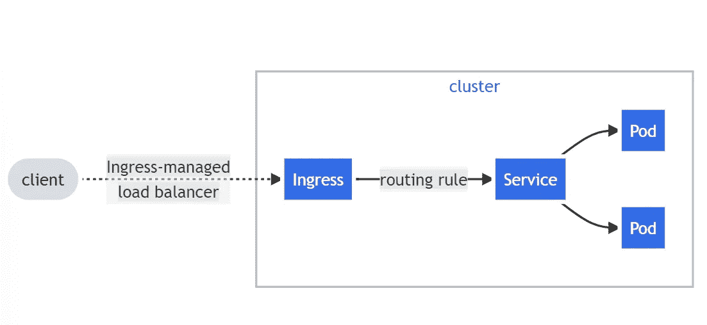
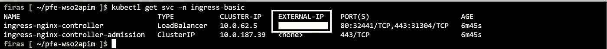

# 使用 nginx-ingress 控制器限制对部署在 Aks 上的服务的访问

> 原文：<https://medium.com/nerd-for-tech/restricting-access-to-services-deployed-on-aks-using-nginx-ingress-conroller-89291df69036?source=collection_archive---------1----------------------->

在使用部署在 azure kubernetes services (AKS)上的服务时，我们可能需要在我们的集群之外公开这些服务。

为此，我们需要为需要公开的服务创建一个入口资源。

## 什么是 ingress？

入口将来自群集外部的 HTTP 和 HTTPS 路由暴露给群集中的服务。流量路由由入口资源上定义的规则控制。

以下是由 ingress 管理的流量概述:



进入

# 先决条件

为了创建入口资源，我们必须在集群中安装一个入口控制器。

我们将使用 helm 安装 nginx-ingress 控制器(除 nginx 外，还有许多其他 ingress 控制器)，如下所示:

```
NAMESPACE=ingress-basic
helm repo add ingress-nginx [https://kubernetes.github.io/ingress-nginx](https://kubernetes.github.io/ingress-nginx)
helm repo update
helm install ingress-nginx ingress-nginx/ingress-nginx \
  --create-namespace \
  --namespace $NAMESPACE \
  --set controller.service.externalTrafficPolicy=Local \
  --set controller.service.annotations."service\.beta\.kubernetes\.io/azure-load-balancer-health-probe-request-path"=/healthz
```

## 创建入口资源

现在我们的集群有了入口控制器，我们可以开始为我们的服务创建入口资源。

首先，我们需要获取入口控制器提供的外部 ip



外部 Ip

一旦我们有了外部 Ip，我们就可以创建一个入口。在本例中，我们为部署在集群中的 keycloak 服务创建一个入口。

```
apiVersion: networking.k8s.io/v1
kind: Ingress
metadata:
  name: keycloak-ingress
  annotations:
    kubernetes.io/ingress.class: "nginx"
    nginx.ingress.kubernetes.io/ssl-passthrough: "true"
spec:
  rules:
  - host: keycloak.YOUR-EXTERNAL-IP.nip.io
    http:
      paths:
      - path: /
        pathType: Prefix
        backend:
          service:
            name: keycloak
            port:
              number: 8080
```

现在我们只需要应用这个 yaml 文件。

```
kubectl apply -f "PATH to your ingress yaml file"
```

我们可以通过访问主机地址来检查我们的入口资源是否工作，我们将被重定向到 keycloak 欢迎页面。

## IP 白名单

现在我们到了最有趣的部分，我们的入口资源工作正常，但是拥有该主机地址的每个人都可以访问它。

为了防止任何人访问我们公开的服务，我们将向入口资源添加一些“白名单静态 ip ”,以便只允许来自该 Ip 的流量，否则我们将返回禁止的错误消息。

为此，我们需要回到入口定义并添加该属性:

```
nginx.ingress.kubernetes.io/whitelist-source-range: "41.231.58.146"
```

我们可以添加由“，”分隔的多个 IP，或者像这样的子网“41.231.X.X/32”

因此，最终的入口资源定义如下:

```
apiVersion: networking.k8s.io/v1
kind: Ingress
metadata:
  name: keycloak-ingress
  annotations:
    kubernetes.io/ingress.class: "nginx"
    nginx.ingress.kubernetes.io/ssl-passthrough: "true"
    nginx.ingress.kubernetes.io/whitelist-source-range: "41.231.58.146"
spec:
  rules:
  - host: keycloak.EXTERNAL-IP.nip.io
    http:
      paths:
      - path: /
        pathType: Prefix
        backend:
          service:
            name: keycloak
            port:
              number: 8080
```

我们需要通过再次应用来应用此修改:

```
kubectl apply -f "PATH to your ingress yaml file"
```

不会。如果我们试图从不在白名单中的 Ip 访问我们的资源，我们会收到类似这样的消息:


测试白名单 Ip