# 限制玩家移动

> 原文：<https://medium.com/nerd-for-tech/restricting-player-movement-83f8540a792f?source=collection_archive---------12----------------------->

清理和限制球员边界之前的移动

让我们从使用我们的[变量](https://sidthakur3519.medium.com/variables-and-its-usage-7a7b32773880)开始，让我们创建两个变量来存储我们的用户输入。

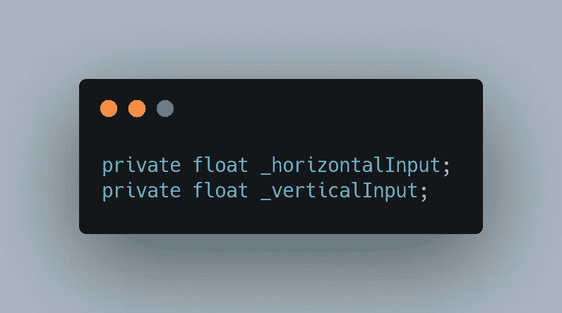

我们还从[简单统一运动文章](https://sidthakur3519.medium.com/simple-player-movement-in-unity-3f28b7ab2151)中注意到，我们正以恒定的速度移动我们的物体。让我们将这个**速度**设为私有变量，因为我们不希望任何其他类访问这个变量，但是我们希望能够在编辑器中自由地改变速度。这可以通过以下方式实现:

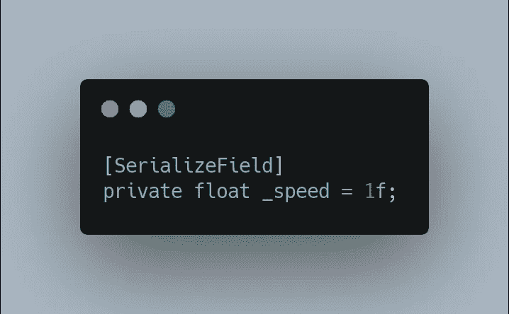

既然我们的变量已经声明了，让我们从输入变量开始初始化它们，

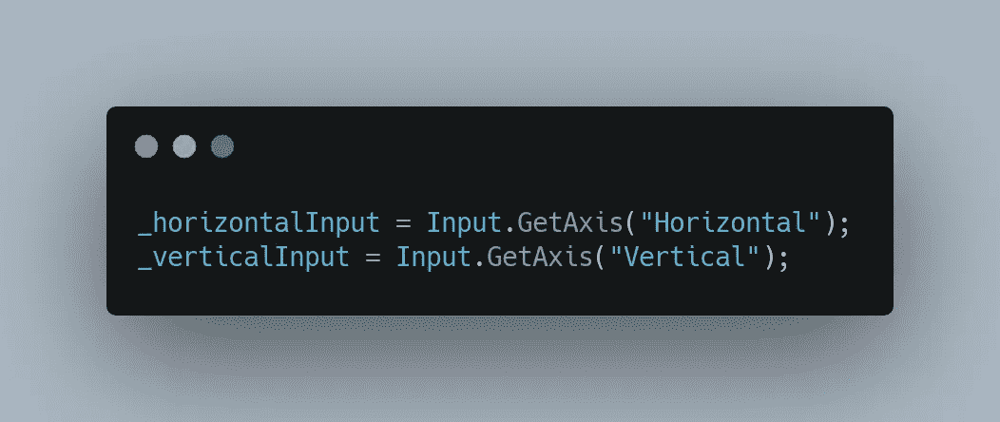

让我们将这些输入变量存储在一个向量中，这样我们就可以得到一个我们希望对象移动的方向，

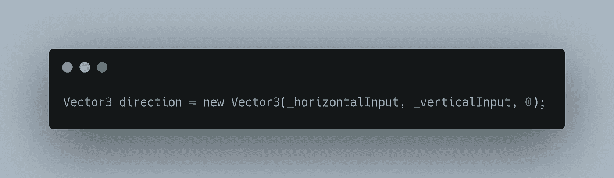

有了这个设置，我们可以让我们的角色移动，但在此之前，让我们创建一个名为" **Movement** "的方法(这是一个包含一系列语句的代码块)，它将存储任何与移动相关的内容。*注意:一定要调用* ***运动()*** *“在你的* ***更新()****。*

*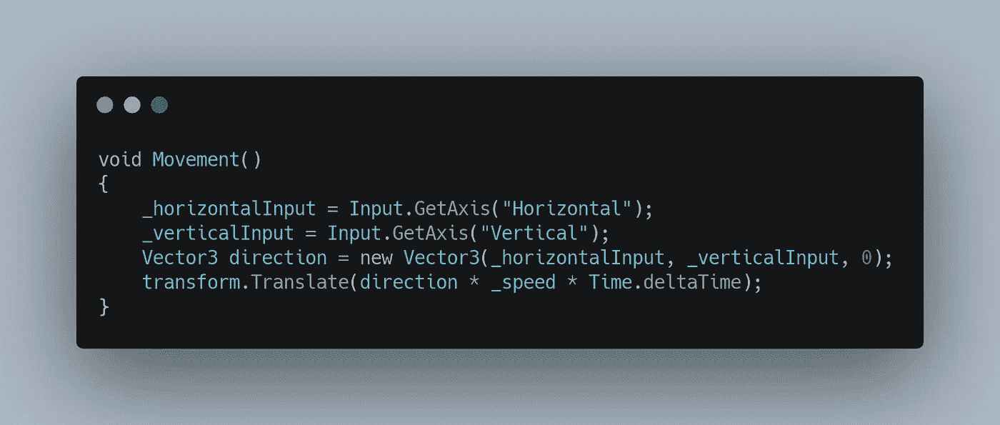*

*翻译是用来让你的角色移动*

*但是在这样做的时候，我们意识到一些有趣的事情，它们是:*

*→ *移动不爽快*，这是因为 **GetAxis()** 返回值的范围是-1 到 1。这会给人一种你的物体在加速或减速的印象，这在很多情况下是好的，但在这种情况下，我更喜欢即时响应，为此我们可以使用 **GetAxisRaw()** ，它会返回-1、0 或 1 的值。*

*→ *对角移动时速度增加*，当使用输入向量的组合时，我们最终以两个向量的平方根移动，结果使我们移动得更快。*

*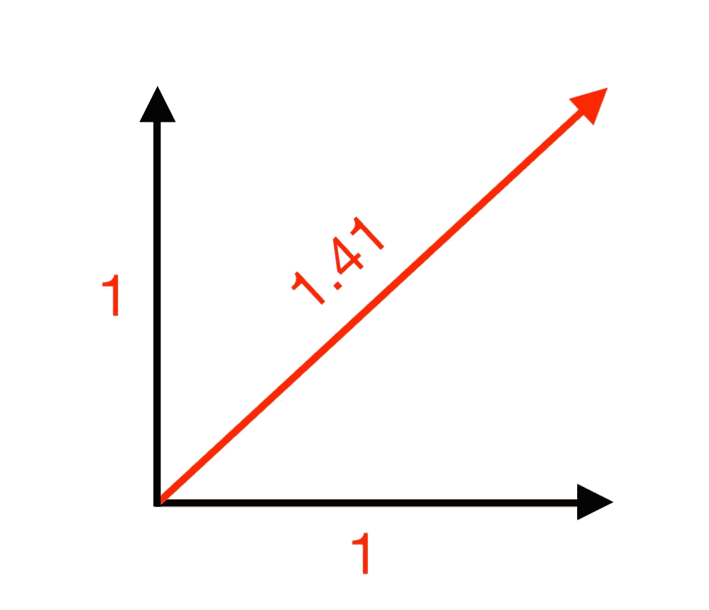*

*我们在这里看到，当沿对角线移动时，我们最终以 1.41 的幅度移动，这与我们的水平和垂直幅度 1 不同。*

*为了防止这种情况发生，我们可以使用，*

*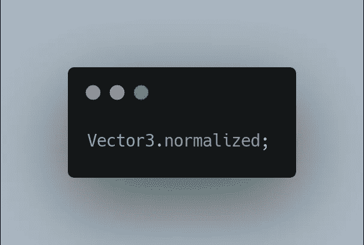*

*这会返回一个大小为 1 的向量，同时保持方向不变。所以更新后的“**机芯()”**看起来像下面的**、***

*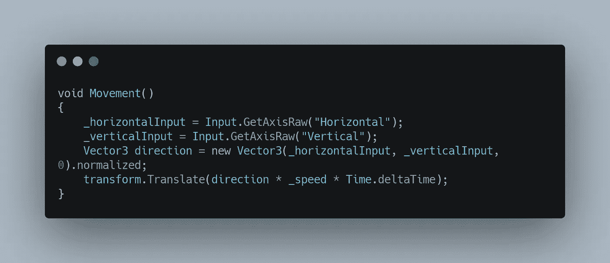*

****设定移动界限！****

*此时，我们观察到我们的玩家不断离开我们的屏幕，*

**

*我们可以通过限制它的移动来解决这个问题，这更像是说你可以在水平轴上移动 5 个单位，在垂直轴上移动 5 个单位。这可以通过使用，*

*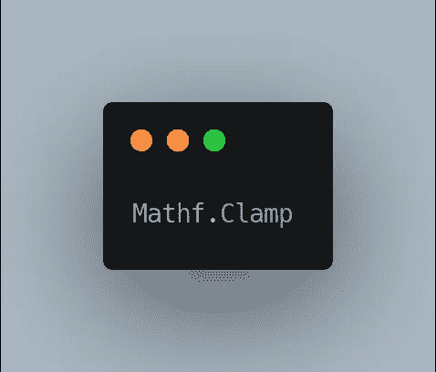*

*这需要 3 个参数，
→第一个是我们希望限制的值。
→第二个是它能达到的最小值
→第三个是它能达到的最大值*

*我们还知道，每一个游戏对象都有一个“**变换**组件，每一个“**变换**组件都有以下几种，*

*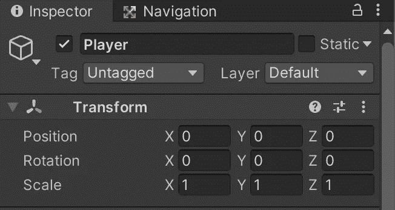*

*我们需要" **Position** "组件，操纵这个组件会改变我们在游戏中的位置，所以下面的操作会限制玩家的动作。*

*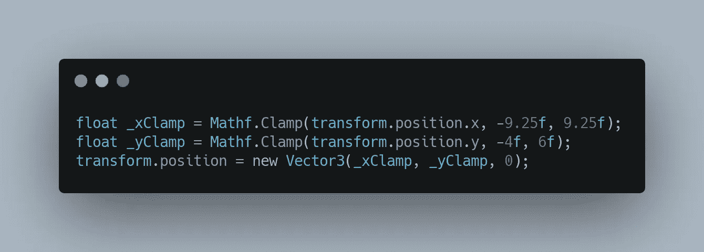*

*现在让我们看看最终产品。*

**

*希望你在阅读这篇文章的时候和我在实现它的时候一样开心。*