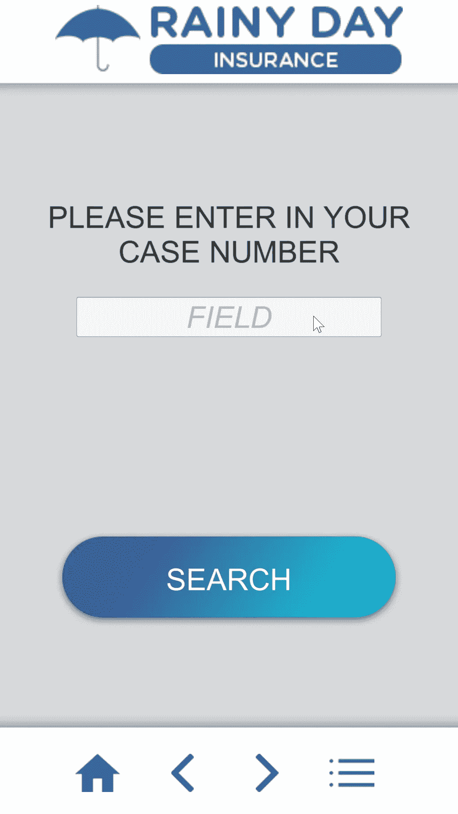
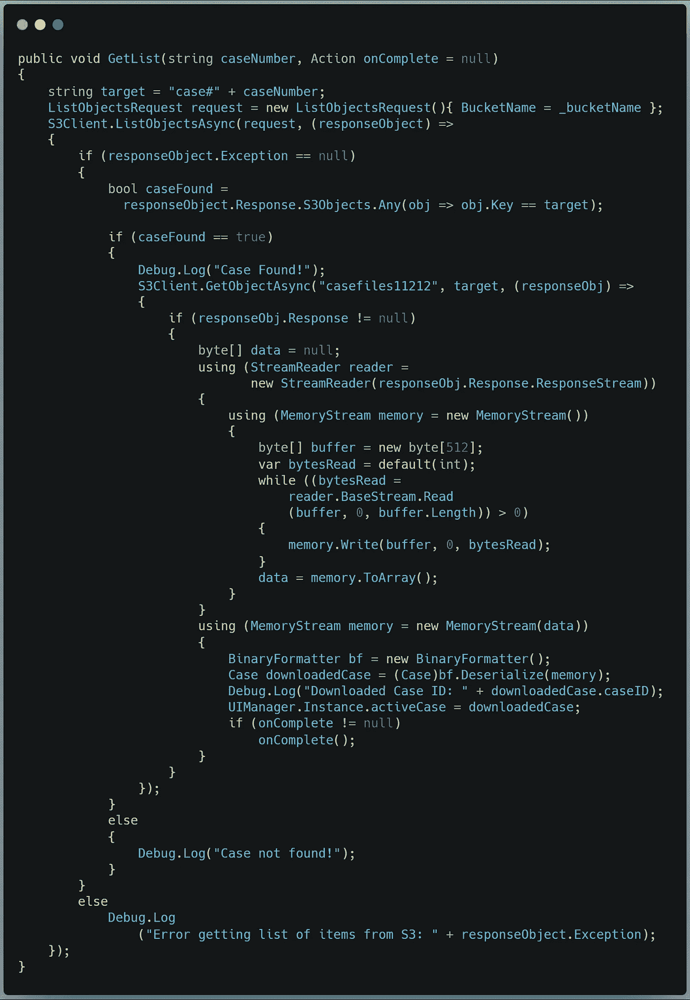

# 在 Unity 中检索和解码来自自动气象站 S3 的存储数据

> 原文：<https://medium.com/nerd-for-tech/retrieving-decoding-stored-data-from-aws-s3-in-unity-58891089134e?source=collection_archive---------5----------------------->

## 如何倾倒你的水桶

我知道我的数据就在这里的某个地方…

昨天我们讨论了如何将数据转换成二进制文件并上传到 S3 桶中。今天我们将做相反的事情:找到存储的数据，解码它，并让用户可以访问它。

我们开始工作吧。

## 抓住要点并列出清单

这里的任务是让用户在移动保险索赔报告应用程序中查找提交的索赔数据。

Amazon 有一大堆有用的 C#方法，Unity 可以访问这些方法来处理检索数据的工作。完整的细节可以在[这里找到](https://docs.aws.amazon.com/mobile/sdkforunity/developerguide/s3.html)；我们将大幅修改他们的例子，以适应我们的用例。

我们不想下载整个存储桶—只下载我们正在寻找的特定文件。我们需要做的第一件事是获得我们的 S3 桶中的项目列表。然后我们可以在列表中搜索我们需要的项目，并下载它。然后，我们必须将它从二进制文件转换成可以填充到 Case 类实例中的数据。

下面是 GetList 方法的伪代码，它接受一个 caseNumber 字符串和一个可选的 onComplete 操作方法:

> 声明 ListObjectsRequest 类的一个名为“request”
> 的新实例调用 S3Client ListObjectsAsync 方法，传入请求和一个名为“responseObject”的内联委托:
> …如果没有异常
> …声明一个 bool，该 bool 对 bucket 中的对象列表运行 LINQ 查询
> …如果 bool 为真(找到了案例)
> 
> ……[此处为数据解码]
> 
> ……否则，如果没有找到案例，则记录它
> ……否则，如果有异常，则记录它们

在这一点上，我们已经有了一个项目列表，我们已经瞄准了我们想要的。接下来，我们需要让数据对我们有用。

## 解码数据

从我们停止伪代码的地方继续，我们需要引入一些内存流来处理我们的数据:

> 调用 S3Client GetObjectAsync 方法，传入 bucket、目标文件和另一个名为“responseObject”的内联委托:
> …检查响应是否为 null —如果不是:
> ……创建一个字节数组来存储来自文件
> 的数据……使用 StreamReader 类的新实例， 传入响应流:
> …………使用 MemoryStream 类的新实例:
> …………创建一个字节数组(大小为 512)作为数据的缓冲区
> …………创建一个变量来跟踪读取的字节
> …………当读取的字节大于 0 时
> …………调用 MemoryStream Write 方法，传入缓冲区和字节跟踪器
> …………使用 MemoryStream 的另一个新实例将内存流传入数据字节数组
> ……… 传入数据字节数组:
> ………声明 BinaryFormatter 类的新实例
> ………声明 Case 类的新实例，并将其等同于对 BinaryFormatter 的反序列化方法的调用，传入内存流。
> ………将 UI 管理器的活动案例等同于下载的案例
> ………如果调用此方法的类有 onComplete 动作，则运行它

哇哦。这是很多嵌套操作。简单概括一下:我们向 AWS 请求一个条目列表，我们查询列表中我们要搜索的条目，我们为数据创建一个容器，打开一个流读取器，它打开一个内存流，在将输入的数据放入我们的容器之前下载并缓冲它。最后，我们用二进制格式化程序反序列化数据，并将结果加载到我们的活动案例中。

咻。

下面是 GetList 方法的 C#:

让我们看看效果如何:

太棒了。

这就是我今天的全部内容。明天我将通过实现命令模式来完善应用程序的导航功能。一定要去看看！