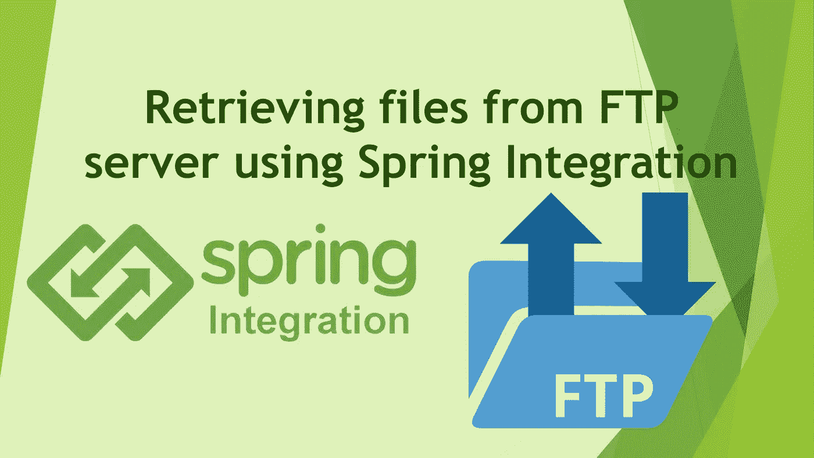
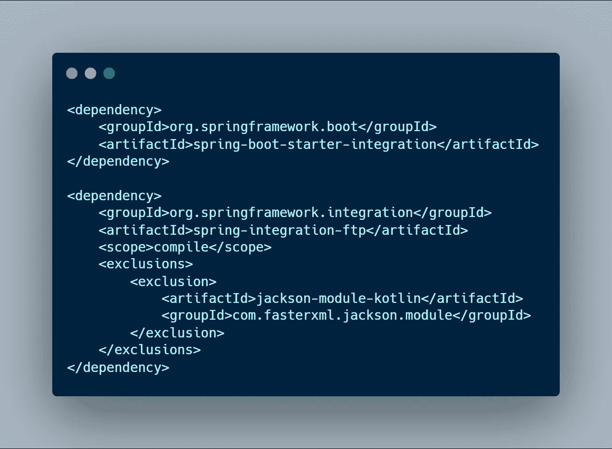
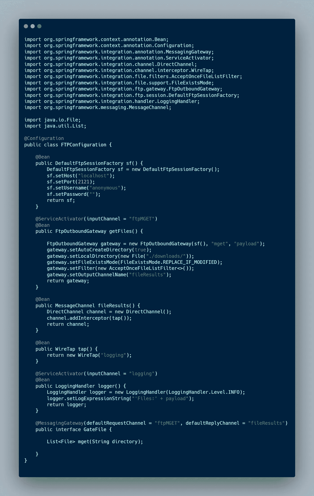
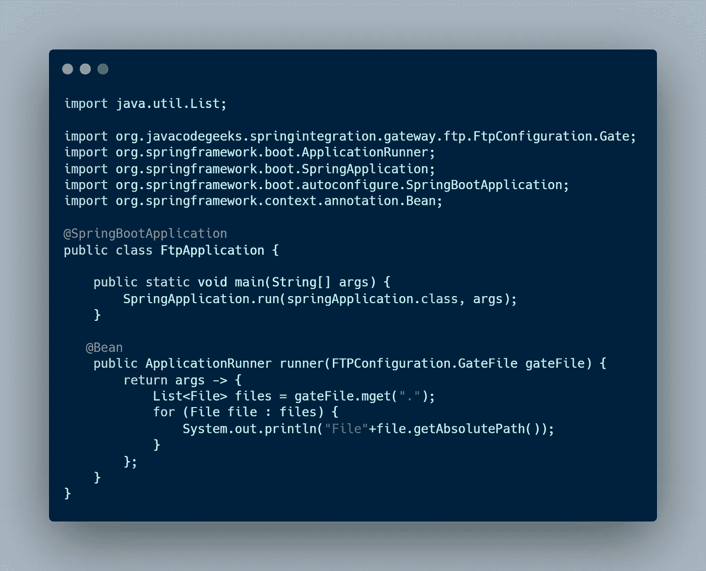
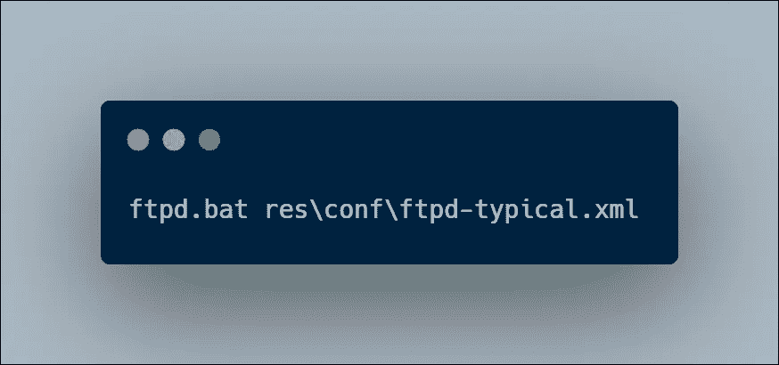

# 使用 Spring Integration 从 FTP 服务器检索文件

> 原文：<https://medium.com/nerd-for-tech/retrieving-files-from-ftp-server-using-spring-integration-5ccc4a972eaf?source=collection_archive---------1----------------------->

在本文中，我将向您展示如何使用 Spring Integration 将文件从 FTP 服务器检索到本地目录。

为此，我使用 Apache FTP 服务器。你可以从这个链接下载最新版本。**(******)****下载并解压文件。**

**正如我在标题中提到的，我们需要在 pom.xml 中包含以下 maven 依赖项。**

****

**maven 依赖性**

**现在让我们实现代码。**

**下面是 FTP 配置的代码。我创建了一个 FTPConfiguration.java 档案。**

****

**FTPConfiguration.java**

**现在让我们看看我们在这里做了什么。**

****sf()****

**该方法实例化一个 DefaultFtpSessionFactory 来访问 FTP 服务器，并将 localhost 设置为主机，2121 设置为端口，anonymous 设置为用户名，空字符串设置为密码。**

****getFile()****

**该方法定义并构造了一个 FTPOutboundGateway，绕过了 ***sf()*** 方法、 ***mget*** 命令(mget 是用于从 FTP 服务器检索多个文件的 spring FTP 适配器命令)和 ***有效负载*** 参数。这里 ServiceActivator 表示网关是一个 spring 管理的 bean。这个方法的输出是一组文件。我把它命名为***【file results】***。它将检索到的文件保存在下载文件夹中。**

**这里，FTPOutboundGateway 用于执行远程文件操作，而 Payload 是一组可以执行 get、ls、put 等功能的数据。**

****文件结果()****

**该方法创建一个 DirectChannel，并添加一个 wireTap bean 作为拦截器。**

**在这里，wireTap 方法在将原始消息发送到主通道的同时，将消息的副本创建到次要目标。**

****记录器()****

**此方法创建一个日志处理程序对象，并将消息发送到日志通道。这里，窃听通道连接到日志处理程序。**

****GateFile 接口****

**在这里，我向该接口声明了一个 MessagingGateway，FTP mget 作为请求通道，fileResults 作为回复通道。然后，结果被发送给 main 方法一个字符串对象列表**

**接下来，我们必须创建一个 runner 方法，将它作为 spring 应用程序运行。**

**下面是应该包含在 springApplication.java 中的代码**

****

**springApplication.java**

**这里，runner()方法将 GateFile 接口作为参数，并获取输出。**

**这就是编码部分的全部内容。现在让我们看看如何运行这个应用程序。**

****第一步** -启动 FTP 服务器。**

**转到 apache FTP 服务器文件夹中的 bin 文件夹。打开命令提示符并执行以下命令。**

****

**这个 apache FTP 服务器将文件存储在主文件夹中。***(C:\ Apache-FTP server-1 . 1 . 1 \ Apache-FTP server-1 . 1 . 1 \ RES \ home)*****

****第二步**——运行 spring-boot 应用。**

## **输出**

**它打印存储在下载文件夹中的每个文件的路径。**