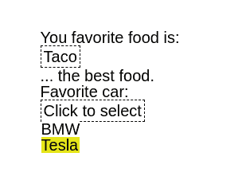

# 带有参数化类型的 Elm 中的可重用下拉列表—第二部分

> 原文：<https://medium.com/nerd-for-tech/reusable-dropdown-in-elm-with-parameterized-types-part-ii-77f58515a662?source=collection_archive---------17----------------------->

曾经需要在表单上有一个下拉列表吗？还是在配置页面上？也许是不同类型不同目的的多次下拉？elm-ui 很棒，但是它没有提供下拉的原语。在本指南中，您将构建一个可重用的下拉菜单，同时，您将了解参数化类型。

我们将在第一部分所做工作的基础上进行构建，但是如果你熟悉 Elm，你应该不难理解。第一部分的完整代码可以在这个 [Github](https://github.com/diogo-aos/elm-ui-dropdown/releases/tag/partI) 库中找到。

在第一部分中，我们构建了这个:


我们所做的方式，不能再用于其他类型。我们将构建一个简单的可重用组件，它具有一致的样式，可以通过调用视图中的函数和很少添加的逻辑来重用。

下面回顾一下我们在第一部分中构建的视图和更新逻辑:

```
type alias Model =
    { favoriteFood : Maybe Food
    , status : Status}type Status
    = Normal
    | SelectFoodview : Model -> Html.Html Msg
view model =
    let
        selectedFoodName = 
            case model.favoriteFood of
                Nothing -> "No food selected. Click here to select."
                Just food -> food.name
				dropdown =
            case model.status of
                Normal ->
                    E.el
                        [ Border.width 1
                        , Border.dashed
                        , E.padding 3
                        , Events.onClick ClickedSelectFood
                        ]
                        (E.text selectedFoodName)
                SelectFood ->
                    E.el
                        [ Border.width 1
                        , Border.dashed
                        , E.padding 3
                        , E.below (viewFoodList foodList)
                        ]
                        (E.text selectedFoodName)
    in
    E.layout
        []
        (
        E.column
            [ E.centerX
            , E.centerY
        ]
            [ E.text "You favorite food is:"
            , dropdown
            , E.text "... the best food."
            ]
        )type Msg
    = NoAction
    | ClickedSelectFood update : Msg -> Model -> Model
update msg model =
    case msg of
        NoAction ->
            model
        ClickedSelectFood ->
            { model | status = SelectFood }
```

对于单个下拉菜单来说，这很好，但是如果我们有 5 个下拉菜单，我们就需要 5 个不同的状态。那是许多样板文件。我们将创建一个新的下拉列表类型来保存下拉列表的状态和值。

让我们改变这一点。与 dropdown 关联的是一个选项列表和一个将选项转换为字符串(以显示)的函数。当一个选项被选中时，我们还需要一条消息来触发。

```
type Dropdown a
	= Normal (Maybe a)
	| Select
```

这是一个参数化类型。这个下拉列表可以接受任何类型(食物、国家、人、车，任何你需要的)。看到那边的那个了吗？这就是类型变量。

此`Normal`与我们之前的状态类型相冲突。继续删除整个类型。现在，我们将更改模型以引用此下拉列表类型。我们需要一个`Food`下拉菜单——这个`Food`将是`Dropdown`的类型。

当我们在做的时候，也改变最初的模型。

```
type alias Model =
    { favoriteFood : Maybe Food
    }initialModel : Model
initialModel =
    { favoriteFood = Normal Nothing
    }
```

我们也不再需要地位。`Dropdown`将保持其状态在该类型内。

接下来，让我们处理更新。由于我们不再有`Status`，我们也需要开始使用新的`Dropdown`类型。

```
update : Msg -> Model -> Model
update msg model =
    case msg of
        NoAction ->
            model

        ClickedSelectFood ->
            { model | favoriteFood = Select }

        ClickedDropdownFood food ->
            { model | favoriteFood = Normal (Just food) }
```

现在让我们来看看`view`函数。继续删除整个 let 表达式。当你在的时候，删除`viewFood`和`viewFoodList`。我们将用通用函数替换它们。现在，创建一个`dropdownView`函数。

```
dropdownView : Dropdown a -> List a -> (a -> String) -> Msg -> (a -> Msg) -> E.Element Msg
dropdownView dropdownState options toString openMenuMsg clickedOptionMsg =
    let
        selectedName =
            case dropdownState of
                Normal (Just someA) -> toString someA
                _ -> "Click to select"
        menu : E.Element Msg
        menu =
            if not (dropdownState == Select) then
                    E.el
                        [ Border.width 1
                        , Border.dashed
                        , E.padding 3
                        , Events.onClick openMenuMsg
                        ]
                        (E.text selectedName)
            else
                let
                    mouseOverColor : E.Color
                    mouseOverColor = E.rgb 0.9 0.9 0.1

                    backgroundColor : E.Color
                    backgroundColor = E.rgb 1 1 1

                    viewOption : a -> E.Element Msg
                    viewOption option =
                        E.el
                            [ E.width E.fill
                            , E.mouseOver [Background.color overColor]
                            , Background.color white
                            , Events.onClick (clickedOptionMsg option)
                            ]
                            (E.text <| toString option) viewOptionList : List a -> E.Element Msg
                    viewOptionList inputOptions =
                        E.column [] <|
                            List.map viewOption inputOptions

                in
                    E.el
                        [ Border.width 1
                        , Border.dashed
                        , E.padding 3
                        , E.below (viewOptionList options)
                        ]
                        (E.text selectedName)
    in
        menu
```

我们一步一步来。该函数有 5 个参数。是的，很多。他们是做什么的？

*   `dropdownState`:给出要绘制的下拉菜单的状态。
*   `options`:给出用户可以选择的可能选项列表。
*   `toString`:将选项类型转换为字符串的函数
*   `openMenuMsg`:用户点击下拉选择选项时触发的消息。
*   `clickedOptionMsg`:用户选择一个选项时触发的消息。

我们将进一步简化这一点，但那将是以后的事。现在，注意 let 表达式——所有的逻辑都在那里。这和我们之前在原始视图中看到的差不多。`viewFood`被`viewOption`取代，现在在`a`上被参数化。*同上`viewFoodList`和`viewOptionList`的*。所有的造型都一样。现在最大的不同是条件。我们现在检查下拉状态是否在`Select`上(意味着选择菜单是打开的)。

现在，我们将看到以下内容:

```
view : Model -> Html.Html Msg
view model =
    E.layout
        []
        (
        E.column
            [ E.centerX
            , E.centerY
        ]
            [ E.text "You favorite food is:"
            , dropdownView model.favoriteFood foodList .name ClickedSelectFood ClickedDropdownFood
            , E.text "... the best food."
            ]
        )
```

下拉状态是模型中的`favoriteFood`。`foodList`是在[TODO add link]第一部分中定义的食物列表。`.name`是用于将`Food`转换为`String`的函数。然后我们有两条由两个相关事件触发的消息。

仅此而已。我们现在又有了一个可用的下拉菜单。让我们进一步简化。让我们为每个下拉列表提供一条消息，并将选项列表保留在下拉列表状态中。

# 进一步简化

第一个修改是将选项列表添加到`Dropdown`的`Select`变体中。

```
type Dropdown a
    = Normal (Maybe a)
    | Select (List a)
```

然后，我们只需遵循编译器错误消息，并在`update`和`view`条件中进行一些更改。

```
update : Msg -> Model -> Model
update msg model =
    case msg of
        -- ... ClickedSelectFood ->
            { model | favoriteFood = Select foodList } -- ... dropdownView : Dropdown a -> (a -> String) -> Msg -> (a -> Msg) -> E.Element Msg
dropdownView dropdownState toString openMenuMsg clickedOptionMsg =
    let
        selectedName =
            case dropdownState of
                Normal (Just someA) -> toString someA
                _ -> "Click to select" menu : E.Element Msg
        menu =
            case dropdownState of
                Select options ->
                    let
                        mouseOverColor : E.Color
                        mouseOverColor = E.rgb 0.9 0.9 0.1

                        backgroundColor : E.Color
                        backgroundColor = E.rgb 1 1 1

                        viewOption : a -> E.Element Msg
                        viewOption option =
                            E.el
                                [ E.width E.fill
                                , E.mouseOver [Background.color overColor]
                                , Background.color white
                                , Events.onClick (clickedOptionMsg option)
                                ]
                                (E.text <| toString option)

                        viewOptionList : List a -> E.Element Msg
                        viewOptionList inputOptions =
                            E.column [] <|
                                List.map viewOption inputOptions

                    in
                        E.el
                            [ Border.width 1
                            , Border.dashed
                        , E.padding 3
                        , E.below (viewOptionList options)
                        ]
                        (E.text selectedName)                
                _ ->
                    E.el
                        [ Border.width 1
                        , Border.dashed
                        , E.padding 3
                        , Events.onClick openMenuMsg
                        ]
                        (E.text selectedName)
    in
        menu

view : Model -> Html.Html Msg
view model =
    E.layout
        []
        (
        E.column
            [ E.centerX
            , E.centerY
        ]
            [ E.text "You favorite food is:"
            , dropdownView  model.favoriteFood .name ClickedSelectFood ClickedDropdownFood
            , E.text "... the best food."
            ]
        )
```

if 表达式被替换为 case，因为现在我们需要从 dropdown `Select` variant 中获取选项列表。

现在，让我们为每个下拉菜单准备一条消息。我们将创建一个新的类型，指定可用的操作，即打开菜单并单击一个选项。之后，我们只需要为每个下拉菜单提供一条消息。从那里开始，它只是跟随编译器错误来重构程序的其余部分。

```
type DropdownAction a
    = OpenList
    | ClickedOption atype Msg
    = FoodDropdown (DropdownAction Food)
```

`DropdownAction`也被参数化了，现在我们的食物下拉菜单只有一条消息，其中包含一个由用户活动触发的`DropdownAction`。我们还去掉了从第一部分的第一个例子开始就一直拖着的`NoAction`消息

接下来，我们将改变`update.`中的逻辑

```
update : Msg -> Model -> Model
update msg model =
    case msg of
        FoodDropdown action ->
            case action of
                OpenList ->
                    { model | favoriteFood = Select foodList }
                ClickedOption food ->
                    { model | favoriteFood = Normal (Just food) }
```

本质上，我们之前的两条消息仍然存在，但现在它们只是可能的下拉操作的变体，典型的是`DropdownAction`。这实际上更有意义。如果我们想在下拉列表中添加更多的动作，我们不需要改变这个消息，只需要改变类型和结果逻辑。

最后一位是`view`。由于变化很小，我将只介绍重构的几行代码。首先，我们现在只接收一条消息(它实际上是一个接收一个`DropdownAction`并在一个`Msg`中转换它的函数，因为所有类型变量也兼作函数)。

```
dropdownView : Dropdown a -> (a -> String) -> (DropdownAction a -> Msg) -> E.Element Msg
dropdownView dropdownState toString toMsg =
```

之后，我们需要用相应的 DropdownAction 消息替换 onClick 事件。一、内`viewOption`。

```
, Events.onClick (toMsg (ClickedOption option))
```

然后，在呈现默认(关闭的)下拉菜单的元素内部。

```
, Events.onClick (toMsg OpenList)
```

现在你知道了。在大约 1500 个单词之后(计算代码，你会说这是欺骗，是的，我知道，但我仍然不得不写它)，我们完全回到了开始的地方。啊…生命的循环。


但是现在，我们只需很少的工作就可以添加另一个下拉列表。让我们添加一个最喜欢的汽车下拉列表。我们创建一个`Car`类型，将其添加到`Model`，在`initialModel`中初始化它，创建一个`CarDropdown`消息，基本上复制/粘贴来自`FoodDropdown`的逻辑，最后在`view`中添加两行。

```
type alias Model =
    { favoriteFood : Dropdown Food
    , favoriteCar : Dropdown Car
    }type alias Car = {id : Int, name: String}type Msg
    = FoodDropdown (DropdownAction Food)
    | CarDropdown (DropdownAction Car)update : Msg -> Model -> Model
update msg model =
    case msg of
        -- ... CarDropdown action ->
            case action of
                OpenList ->
                    { model | favoriteCar = Select [Car 0 "BMW", Car 1 "Tesla"] }
                ClickedOption car ->
                    { model | favoriteCar = Normal (Just car) }view : Model -> Html.Html Msg
view model =
    E.layout
        []
        (
        E.column
            [ E.centerX
            , E.centerY
        ]
            [ E.text "You favorite food is:"
            , dropdownView  model.favoriteFood .name FoodDropdown
            , E.text "... the best food."
            , E.text "Favorite car:"
            , dropdownView model.favoriteCar .name CarDropdown
            ]
        )
```



我们完事了。一个简单的，可重复使用的下拉菜单。如果您从未使用过参数化类型，请花点时间思考一下它们的潜力和简单性。我们实际上可以根据需要进一步简化，例如，有一个根据输入更新下拉菜单的功能。优点之一是每个下拉菜单的风格一致(或者，咳咳，没有下拉菜单)。你可以在这个 [Github](https://github.com/diogo-aos/elm-ui-dropdown/releases/tag/partII_done) 库中查看完整的代码。

在第三部分中，我们将使用我们刚刚获得的使用参数化类型的知识和实践来使事情变得稍微复杂一些。我们将构建一个组件，允许我们根据参数选择几个选项，或者一个都不选。这一切都是可配置的。这将基本上是一个类固醇下拉。